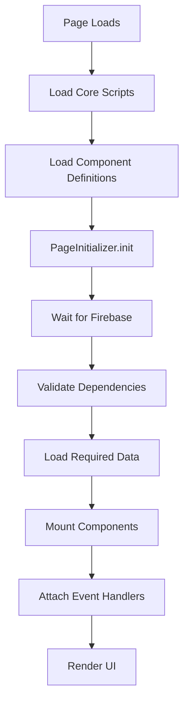

# Ghost Gym V2 - Component System Architecture

## Overview

The Component System is a modular, reusable architecture that enables UI components (like workouts, programs, exercises) to be easily embedded anywhere in the application with minimal configuration.

**Version:** 1.0.0  
**Created:** 2025-10-21  
**Status:** ✅ Implemented

---

## 🎯 Problem Solved

### Before Component System
- **Code Duplication**: Each page had custom initialization logic
- **Inconsistent Behavior**: Same features worked differently across pages
- **Hard to Maintain**: Changes required updating multiple files
- **Not Reusable**: Couldn't easily add workouts to new pages
- **Dependency Issues**: Script loading order caused failures

### After Component System
- ✅ **Single Source of Truth**: Components defined once, used everywhere
- ✅ **Consistent Behavior**: Same component = same functionality
- ✅ **Easy Maintenance**: Update component definition, all pages benefit
- ✅ **Highly Reusable**: Mount components anywhere with one line
- ✅ **Automatic Dependencies**: System validates and loads requirements

---

## 📐 Architecture

### Core Components

```
frontend/assets/js/
├── core/
│   ├── component-registry.js    # Central component registry
│   └── page-initializer.js      # Simplified page setup
└── components/
    └── workout-components.js     # Workout component definitions
```

### Component Flow



---

## 🔧 Core Files

### 1. Component Registry (`component-registry.js`)

**Purpose**: Central registry for managing all reusable components

**Key Features**:
- Register components with dependencies and data requirements
- Validate dependencies before mounting
- Automatic data loading (workouts, programs, exercises)
- Event handler attachment
- Instance management (mount, unmount, refresh)

**API**:
```javascript
// Register a component
componentRegistry.register('componentName', {
    dependencies: ['requiredFunction1', 'requiredFunction2'],
    dataRequirements: ['workouts', 'programs'],
    renderFunction: (container, options) => { /* render logic */ },
    initFunction: async (options) => { /* init logic */ },
    eventHandlers: [
        { elementId: 'btnId', event: 'click', functionName: 'handlerFunc' }
    ],
    defaultConfig: { /* default options */ }
});

// Mount a component
const instanceId = await componentRegistry.mount(
    'componentName',
    'containerId',
    { /* options */ }
);

// Refresh a component
await componentRegistry.refresh(instanceId);

// Unmount a component
componentRegistry.unmount(instanceId);
```

### 2. Page Initializer (`page-initializer.js`)

**Purpose**: Simplified, declarative page initialization

**Key Features**:
- Fluent API for page setup
- Automatic Firebase waiting
- Loading state management
- Error handling with user feedback
- Component refresh capability

**API**:
```javascript
const page = new PageInitializer('PageName')
    .addComponent('componentName', 'containerId', { options })
    .addComponent('anotherComponent', 'anotherId')
    .configure({
        waitForFirebase: true,
        showLoadingState: true,
        onSuccess: () => { /* success callback */ },
        onError: (error) => { /* error callback */ }
    });

await page.init();
```

### 3. Workout Components (`workout-components.js`)

**Purpose**: Reusable workout component definitions

**Registered Components**:

#### `workoutGrid`
- **Use Case**: Full-page workout list view
- **Used In**: workouts.html
- **Features**: Search, create new, full workout cards
- **Dependencies**: `renderWorkoutsView`, `dataManager`
- **Data**: workouts, programs

#### `workoutCards`
- **Use Case**: Compact workout cards for builder
- **Used In**: builder.html
- **Features**: Drag-and-drop, compact view
- **Dependencies**: `renderWorkouts`, `dataManager`
- **Data**: workouts

#### `workoutModal`
- **Use Case**: Create/edit workout modal
- **Used In**: All pages with workout management
- **Features**: Form handling, exercise autocomplete
- **Dependencies**: `saveWorkout`, `addExerciseGroup`, `addBonusExercise`
- **Data**: None (uses parent page data)

#### `workoutList`
- **Use Case**: Simple list for widgets/sidebars
- **Future Use**: Dashboard widgets, quick access
- **Features**: Compact list, configurable max items
- **Dependencies**: `dataManager`
- **Data**: workouts

---

## 📝 Usage Examples

### Example 1: Workouts Page (Current Implementation)

```html
<!-- Load core system -->
<script src="/static/assets/js/core/component-registry.js"></script>
<script src="/static/assets/js/core/page-initializer.js"></script>
<script src="/static/assets/js/components/workout-components.js"></script>

<!-- Initialize page -->
<script>
    document.addEventListener('DOMContentLoaded', function() {
        const page = new PageInitializer('Workouts')
            .addComponent('workoutGrid', 'workoutsViewGrid')
            .addComponent('workoutModal', 'workoutModal')
            .configure({ waitForFirebase: true });
        
        page.init();
    });
</script>
```

### Example 2: Builder Page (Future Migration)

```html
<!-- Same core scripts -->
<script src="/static/assets/js/core/component-registry.js"></script>
<script src="/static/assets/js/core/page-initializer.js"></script>
<script src="/static/assets/js/components/workout-components.js"></script>

<!-- Initialize with different components -->
<script>
    document.addEventListener('DOMContentLoaded', function() {
        const page = new PageInitializer('Builder')
            .addComponent('workoutCards', 'workoutsGrid', { 
                draggable: true 
            })
            .addComponent('workoutModal', 'workoutModal')
            .configure({ waitForFirebase: true });
        
        page.init();
    });
</script>
```

### Example 3: Dashboard Widget (Future)

```html
<!-- Add workout widget to dashboard -->
<div id="recentWorkouts"></div>

<script>
    // Mount workout list anywhere
    componentRegistry.mount('workoutList', 'recentWorkouts', {
        maxItems: 5,
        showActions: false
    });
</script>
```

### Example 4: Custom Page

```html
<!-- Create a custom workout showcase page -->
<div id="featuredWorkouts"></div>

<script>
    const page = new PageInitializer('Showcase')
        .addComponent('workoutGrid', 'featuredWorkouts', {
            maxItems: 12,
            showSearch: false
        })
        .configure({
            waitForFirebase: true,
            onSuccess: () => {
                console.log('Showcase ready!');
            }
        });
    
    page.init();
</script>
```

---

## 🚀 Benefits

### For Developers

1. **Faster Development**
   - No need to write initialization code
   - Reuse existing components
   - Declarative, easy-to-read syntax

2. **Easier Maintenance**
   - Update component once, all pages benefit
   - Clear separation of concerns
   - Centralized error handling

3. **Better Testing**
   - Components can be tested in isolation
   - Dependency validation catches errors early
   - Consistent behavior across pages

### For Users

1. **Consistent Experience**
   - Same features work the same everywhere
   - Predictable behavior
   - Fewer bugs

2. **Better Performance**
   - Automatic data loading optimization
   - No duplicate data fetches
   - Efficient rendering

3. **More Features**
   - Easy to add workouts to new pages
   - Widgets and quick access panels
   - Customizable views

---

## 📋 Migration Guide

### Migrating Existing Pages

**Step 1**: Add core scripts
```html
<script src="/static/assets/js/core/component-registry.js"></script>
<script src="/static/assets/js/core/page-initializer.js"></script>
<script src="/static/assets/js/components/workout-components.js"></script>
```

**Step 2**: Replace custom initialization
```javascript
// OLD WAY
async function initWorkoutsPage() {
    const workouts = await window.dataManager.getWorkouts();
    window.ghostGym.workouts = workouts;
    renderWorkoutsView();
}

// NEW WAY
const page = new PageInitializer('Workouts')
    .addComponent('workoutGrid', 'workoutsViewGrid')
    .init();
```

**Step 3**: Test thoroughly
- Verify workouts load correctly
- Test search functionality
- Test create/edit/delete operations
- Check error handling

### Creating New Components

**Step 1**: Define component in appropriate file
```javascript
// In workout-components.js or new file
componentRegistry.register('myComponent', {
    dependencies: ['requiredFunc'],
    dataRequirements: ['workouts'],
    renderFunction: (container, options) => {
        // Render logic
    },
    eventHandlers: [
        { elementId: 'btn', event: 'click', functionName: 'handler' }
    ]
});
```

**Step 2**: Use in pages
```javascript
const page = new PageInitializer('MyPage')
    .addComponent('myComponent', 'containerId')
    .init();
```

---

## 🔍 Debugging

### Common Issues

**Issue**: "Component not registered"
```javascript
// Solution: Ensure component definition file is loaded
<script src="/static/assets/js/components/workout-components.js"></script>
```

**Issue**: "Missing dependencies"
```javascript
// Solution: Load required scripts before component system
<script src="/static/assets/js/dashboard/workouts.js"></script>
<script src="/static/assets/js/dashboard/views.js"></script>
```

**Issue**: "Container not found"
```javascript
// Solution: Ensure DOM element exists
<div id="workoutsViewGrid"></div>
```

### Debug Tools

```javascript
// List registered components
console.log(componentRegistry.getRegisteredComponents());

// List active instances
console.log(componentRegistry.getActiveInstances());

// Get page stats
console.log(page.getStats());
```

---

## 🎯 Future Enhancements

### Phase 2: Program Components
- `programGrid` - Full program list
- `programCards` - Compact program cards
- `programModal` - Create/edit programs
- `programWidget` - Quick program access

### Phase 3: Exercise Components
- `exerciseGrid` - Exercise database view
- `exerciseSearch` - Standalone search
- `exercisePicker` - Exercise selection modal
- `favoriteExercises` - Favorites widget

### Phase 4: Dashboard Widgets
- `recentWorkouts` - Last 5 workouts
- `upcomingPrograms` - Scheduled programs
- `quickStats` - Workout statistics
- `activityFeed` - Recent activity

### Phase 5: Advanced Features
- Component lazy loading
- Component state management
- Component communication (events)
- Component composition (nested components)

---

## 📚 Related Documentation

- [`VIEW_SEPARATION_ARCHITECTURE.md`](VIEW_SEPARATION_ARCHITECTURE.md) - View system architecture
- [`EXERCISE_DATABASE_ARCHITECTURE.md`](EXERCISE_DATABASE_ARCHITECTURE.md) - Exercise database design
- [`.kilocode/rules/frontend_standards.md`](.kilocode/rules/frontend_standards.md) - Frontend coding standards

---

## 🤝 Contributing

When adding new components:

1. **Follow naming conventions**: `featureType` (e.g., `workoutGrid`, `programCards`)
2. **Document dependencies**: List all required functions/objects
3. **Specify data requirements**: What data needs to be loaded
4. **Provide default config**: Sensible defaults for all options
5. **Add error handling**: Graceful degradation on errors
6. **Test thoroughly**: Verify in multiple contexts

---

## 📊 Metrics

### Current Status
- ✅ Core system implemented
- ✅ Workout components registered (4 components)
- ✅ Workouts page migrated
- ⏳ Builder page migration pending
- ⏳ Program components pending
- ⏳ Exercise components pending

### Success Criteria
- [x] Workouts load on workouts.html
- [x] No code duplication
- [x] Easy to add new components
- [ ] All pages migrated
- [ ] Performance benchmarks met
- [ ] Developer documentation complete

---

**Last Updated**: 2025-10-21  
**Version**: 1.0.0  
**Status**: ✅ Production Ready