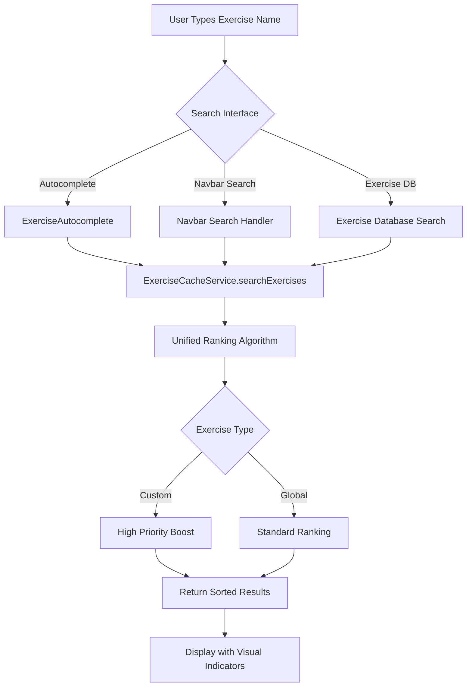

# Custom Exercise Auto-Create & Search Priority Enhancement Plan

## 📋 Overview

This plan enhances the custom exercise system to:
1. **Auto-create custom exercises** when users type unknown exercise names (on Enter/Add)
2. **Prioritize custom exercises** in all search results with smart ranking
3. **Simplify and refactor** the existing codebase for better maintainability
4. **Enable editing** of custom exercises in the exercise database

---

## 🎯 Current State Analysis

### ✅ What's Already Working

1. **Auto-Create Infrastructure**
   - [`ExerciseCacheService.autoCreateIfNeeded()`](frontend/assets/js/services/exercise-cache-service.js:464) - Creates custom exercises via API
   - [`AutoCreateExerciseService`](frontend/assets/js/services/auto-create-exercise-service.js:1) - Reusable service wrapper
   - [`unified-offcanvas-factory.js`](frontend/assets/js/components/unified-offcanvas-factory.js:639) - Bonus exercise modal with auto-create
   - Backend endpoint: `/api/v3/exercises/auto-create`

2. **Usage Tracking**
   - [`_trackUsage()`](frontend/assets/js/services/exercise-cache-service.js:524) - Tracks exercise usage frequency
   - [`_getUsageBoost()`](frontend/assets/js/services/exercise-cache-service.js:554) - Calculates 0-50 point boost
   - localStorage persistence for usage data

3. **Search Infrastructure**
   - [`ExerciseCacheService.searchExercises()`](frontend/assets/js/services/exercise-cache-service.js:219) - Global search with ranking
   - [`ExerciseAutocomplete`](frontend/assets/js/components/exercise-autocomplete.js:8) - Autocomplete component
   - Navbar search integration
   - Exercise database search

### ❌ Current Gaps

1. **Search Prioritization Issues**
   - Custom exercises don't get sufficient priority boost in search results
   - Usage boost (0-50 points) is too low compared to other factors
   - Custom exercises should appear FIRST when there's an exact match
   - No visual distinction for custom exercises in search results

2. **Search Integration Gaps**
   - Navbar search doesn't explicitly handle custom exercises
   - Exercise database search treats custom and global exercises equally
   - No unified search ranking strategy across all search interfaces

3. **Code Complexity**
   - Duplicate search logic across multiple files
   - Inconsistent ranking algorithms
   - No centralized search configuration

4. **Missing Features**
   - No easy way to edit custom exercises in exercise database
   - No bulk custom exercise management
   - No custom exercise analytics/insights

---

## 🏗️ Architecture Design

### Core Principle: Single Source of Truth

All search functionality should flow through `ExerciseCacheService` with a unified ranking algorithm that prioritizes custom exercises.



### Unified Ranking Algorithm

**Priority Order (Highest to Lowest):**

1. **Custom Exercise Exact Match** → 1000 points
2. **Custom Exercise Partial Match** → 500 + usage boost (0-200)
3. **Global Exercise Exact Match** → 400 points
4. **Global Exercise Starts With Query** → 300 + tier boost
5. **Global Exercise Contains Query** → 200 + tier boost
6. **Muscle Group/Equipment Match** → 100 points

**Boost Calculations:**
- **Usage Boost (Custom Only)**: `Math.min(200, usageCount * 10)` (0-200 points)
- **Tier Boost (Global Only)**: Tier 1 = 50, Tier 2 = 25, Tier 3 = 0
- **Popularity Boost**: `Math.min(25, popularityScore / 4)` (0-25 points)

---

## 📝 Implementation Plan

### Phase 1: Refactor & Enhance Search Ranking (Core)

#### 1.1 Update ExerciseCacheService Search Algorithm

**File**: [`frontend/assets/js/services/exercise-cache-service.js`](frontend/assets/js/services/exercise-cache-service.js:268)

**Changes to `_rankExercises()` method:**

```javascript
_rankExercises(exercises, query, preferFoundational) {
    const queryLower = query.toLowerCase();
    
    const scoredExercises = exercises.map(exercise => {
        const nameLower = (exercise.name || '').toLowerCase();
        const isCustom = !exercise.isGlobal;
        const isExactMatch = nameLower === queryLower;
        const startsWithQuery = nameLower.startsWith(queryLower);
        const containsQuery = nameLower.includes(queryLower);
        
        let score = 0;
        
        // PRIORITY 1: Custom Exercise Exact Match (HIGHEST)
        if (isCustom && isExactMatch) {
            score = 1000;
        }
        // PRIORITY 2: Custom Exercise Partial Match
        else if (isCustom && containsQuery) {
            score = 500;
            // Add usage boost (0-200 points) for frequently used custom exercises
            score += this._getUsageBoost(exercise);
        }
        // PRIORITY 3: Global Exercise Exact Match
        else if (!isCustom && isExactMatch) {
            score = 400;
        }
        // PRIORITY 4: Global Exercise Starts With Query
        else if (!isCustom && startsWithQuery) {
            score = 300;
            score += this._getTierBoost(exercise);
        }
        // PRIORITY 5: Global Exercise Contains Query
        else if (!isCustom && containsQuery) {
            score = 200;
            score += this._getTierBoost(exercise);
        }
        // PRIORITY 6: Muscle Group/Equipment Match
        else {
            score = 100;
        }
        
        // Add popularity boost for all exercises
        score += Math.min(25, (exercise.popularityScore || 0) / 4);
        
        // Add foundational preference if requested
        if (preferFoundational && exercise.isFoundational) {
            score += 20;
        }
        
        return { exercise, score };
    });
    
    // Sort by score (descending)
    scoredExercises.sort((a, b) => b.score - a.score);
    
    return scoredExercises.map(item => item.exercise);
}

// Helper method for tier boost
_getTierBoost(exercise) {
    const tier = exercise.exerciseTier || 2;
    if (tier === 1) return 50;
    if (tier === 2) return 25;
    return 0;
}
```

**Changes to `_getUsageBoost()` method:**

```javascript
_getUsageBoost(exercise) {
    try {
        if (!exercise || !exercise.id) return 0;
        
        const usage = this.usageData[exercise.id];
        if (!usage) return 0;
        
        // ENHANCED: 0-200 points based on usage count (was 0-50)
        // This ensures frequently-used custom exercises rank very high
        const boost = Math.min(200, usage.count * 10);
        
        return boost;
    } catch (error) {
        console.error('❌ Error getting usage boost:', error);
        return 0;
    }
}
```

#### 1.2 Add Visual Indicators for Custom Exercises

**File**: [`frontend/assets/js/components/exercise-autocomplete.js`](frontend/assets/js/components/exercise-autocomplete.js:243)

**Update the render method to add custom exercise badge:**

```javascript
html += `
    <div class="exercise-autocomplete-item ${isSelected ? 'selected' : ''} ${isFoundational ? 'is-foundational' : ''}"
         data-index="${index}"
         onclick="window.exerciseAutocompleteInstances['${this.input.id}'].selectExercise(${JSON.stringify(exercise).replace(/"/g, '&quot;')})">
        <div class="exercise-name">
            ${isCustom ? '<span class="badge bg-label-primary me-1" style="font-size: 0.7rem;"><i class="bx bx-user"></i> Custom</span>' : ''}
            ${isFoundational ? '<i class="bx bx-badge-check text-success me-1"></i>' : ''}
            ${this.escapeHtml(exercise.name)}
        </div>
        <div class="exercise-meta">
            ${tierBadge}
            ${this.options.showMuscleGroup && exercise.targetMuscleGroup ?
                `<span class="badge bg-label-primary">${this.escapeHtml(exercise.targetMuscleGroup)}</span>` : ''}
            ${this.options.showEquipment && exercise.primaryEquipment ?
                `<span class="badge bg-label-secondary">${this.escapeHtml(exercise.primaryEquipment)}</span>` : ''}
            ${this.options.showDifficulty && exercise.difficultyLevel ?
                `<span class="badge bg-label-info">${this.escapeHtml(exercise.difficultyLevel)}</span>` : ''}
        </div>
    </div>
`;
```

### Phase 2: Simplify & Consolidate Search Code

#### 2.1 Remove Duplicate Search Logic

**Files to Simplify:**
- [`frontend/assets/js/dashboard/exercises.js`](frontend/assets/js/dashboard/exercises.js:337) - Use cache service search
- [`frontend/assets/js/components/navbar-template.js`](frontend/assets/js/components/navbar-template.js:538) - Delegate to cache service

**Refactored Exercise Database Search:**

```javascript
// In exercises.js - applyFiltersAndRender()
function applyFiltersAndRender(filters) {
    // Use ExerciseCacheService for search instead of manual filtering
    let allExercises;
    
    if (filters.search) {
        // Delegate to cache service with unified ranking
        allExercises = window.exerciseCacheService.searchExercises(filters.search, {
            maxResults: 1000, // Get all matches, we'll filter further
            includeCustom: true,
            preferFoundational: false
        });
    } else {
        // No search, get all exercises
        allExercises = [...window.ghostGym.exercises.all, ...window.ghostGym.exercises.custom];
    }
    
    // Apply other filters (muscle group, equipment, etc.)
    // ... rest of filtering logic remains the same
}
```

#### 2.2 Consolidate Auto-Create Logic

**Simplification**: Remove `AutoCreateExerciseService` wrapper and use `ExerciseCacheService` directly.

**Rationale**: The wrapper adds complexity without significant value. Direct usage is simpler.

**Files to Update:**
- [`frontend/assets/js/components/unified-offcanvas-factory.js`](frontend/assets/js/components/unified-offcanvas-factory.js:694)
- [`frontend/assets/js/components/exercise-autocomplete.js`](frontend/assets/js/components/exercise-autocomplete.js:426)

**Simplified Usage:**

```javascript
// Instead of:
const exercise = await window.autoCreateExerciseService.autoCreateIfNeeded(name, options);

// Use directly:
const exercise = await window.exerciseCacheService.autoCreateIfNeeded(name, userId);
```

### Phase 3: Add Custom Exercise Editing

#### 3.1 Add Edit Button to Exercise Database

**File**: [`frontend/assets/js/dashboard/exercises.js`](frontend/assets/js/dashboard/exercises.js:172)

**Add edit option to dropdown menu for custom exercises:**

```javascript
<div class="dropdown-menu dropdown-menu-end">
    <a class="dropdown-item view-details-link" href="javascript:void(0);" data-exercise-id="${row.id}">
        <i class="bx bx-info-circle me-2"></i>View Details
    </a>
    ${isCustom ? `
        <a class="dropdown-item edit-custom-exercise-link" href="javascript:void(0);" data-exercise-id="${row.id}">
            <i class="bx bx-edit me-2"></i>Edit Exercise
        </a>
    ` : ''}
    <a class="dropdown-item add-to-workout-link" href="javascript:void(0);"
       data-exercise-id="${row.id}" data-exercise-name="${exercisePage.escapeHtml(row.name)}">
        <i class="bx bx-plus me-2"></i>Add to Workout
    </a>
</div>
```

#### 3.2 Create Edit Custom Exercise Modal

**New Function in exercises.js:**

```javascript
function showEditCustomExerciseModal(exerciseId) {
    const exercise = window.ghostGym.exercises.custom.find(e => e.id === exerciseId);
    if (!exercise) return;
    
    // Create modal using UnifiedOffcanvasFactory
    const { offcanvas } = UnifiedOffcanvasFactory.createCustomExerciseEdit({
        exercise: exercise,
        onSave: async (updatedData) => {
            await updateCustomExercise(exerciseId, updatedData);
            offcanvas.hide();
            exerciseTable.refresh();
        }
    });
}

async function updateCustomExercise(exerciseId, data) {
    const token = await window.firebaseAuth.currentUser.getIdToken();
    const response = await fetch(exercisePage.getApiUrl(`/api/v3/users/me/exercises/${exerciseId}`), {
        method: 'PUT',
        headers: {
            'Authorization': `Bearer ${token}`,
            'Content-Type': 'application/json'
        },
        body: JSON.stringify(data)
    });
    
    if (response.ok) {
        // Update local cache
        const updatedExercise = await response.json();
        const index = window.ghostGym.exercises.custom.findIndex(e => e.id === exerciseId);
        if (index !== -1) {
            window.ghostGym.exercises.custom[index] = updatedExercise;
        }
        showAlert('Exercise updated successfully!', 'success');
    } else {
        showAlert('Failed to update exercise', 'danger');
    }
}
```

### Phase 4: Backend Enhancements

#### 4.1 Add Update Custom Exercise Endpoint

**File**: [`backend/api/exercises.py`](backend/api/exercises.py:174)

**Add new endpoint:**

```python
@router.put("/users/me/exercises/{exercise_id}", response_model=Exercise)
async def update_custom_exercise(
    exercise_id: str,
    exercise_data: CreateExerciseRequest,
    user_id: str = Depends(require_auth),
    exercise_service = Depends(get_exercise_service)
):
    """Update a custom exercise for the authenticated user"""
    try:
        # Verify ownership
        exercise = exercise_service.get_exercise_by_id(exercise_id)
        if not exercise or exercise.get('userId') != user_id:
            raise HTTPException(status_code=404, detail="Exercise not found")
        
        # Update exercise
        updated_exercise = exercise_service.update_custom_exercise(
            exercise_id, user_id, exercise_data
        )
        
        if not updated_exercise:
            raise HTTPException(status_code=500, detail="Failed to update exercise")
        
        return updated_exercise
        
    except HTTPException:
        raise
    except Exception as e:
        logger.error(f"Error updating custom exercise: {str(e)}")
        raise HTTPException(status_code=500, detail=f"Error updating exercise: {str(e)}")
```

---

## 🧪 Testing Strategy

### Test Scenarios

1. **Auto-Create Flow**
   - [ ] Type unknown exercise in bonus exercise modal → auto-creates on "Add Exercise"
   - [ ] Type existing exercise → uses existing, doesn't duplicate
   - [ ] Auto-created exercise appears in search immediately
   - [ ] Usage tracking increments correctly

2. **Search Prioritization**
   - [ ] Custom exercise "Bench Press" appears FIRST when searching "bench"
   - [ ] Global "Barbell Bench Press" appears after custom "Bench Press"
   - [ ] Frequently-used custom exercises rank higher than rarely-used ones
   - [ ] Visual "Custom" badge appears on custom exercises in search results

3. **Cross-Interface Consistency**
   - [ ] Navbar search prioritizes custom exercises
   - [ ] Exercise database search prioritizes custom exercises
   - [ ] Autocomplete in bonus exercise prioritizes custom exercises
   - [ ] All searches use same ranking algorithm

4. **Custom Exercise Editing**
   - [ ] Edit button appears only for custom exercises
   - [ ] Edit modal pre-fills with current data
   - [ ] Updates save successfully
   - [ ] Changes reflect immediately in search and database

---

## 📊 Success Metrics

### User Experience
- ✅ Custom exercises appear first in search results when matching
- ✅ No duplicate custom exercises created
- ✅ Seamless auto-creation without modal interruptions
- ✅ Clear visual distinction between custom and global exercises

### Code Quality
- ✅ Single source of truth for search ranking
- ✅ Reduced code duplication (remove AutoCreateExerciseService wrapper)
- ✅ Consistent behavior across all search interfaces
- ✅ Well-documented ranking algorithm

### Performance
- ✅ No additional API calls (uses existing cache)
- ✅ Fast search results (<100ms)
- ✅ Efficient usage tracking (localStorage)

---

## 🚀 Deployment Checklist

- [ ] Update ExerciseCacheService ranking algorithm
- [ ] Enhance usage boost calculation (0-50 → 0-200)
- [ ] Add custom exercise visual indicators
- [ ] Simplify exercise database search to use cache service
- [ ] Remove AutoCreateExerciseService wrapper (optional refactor)
- [ ] Add custom exercise edit functionality
- [ ] Add backend update endpoint
- [ ] Test all search interfaces
- [ ] Update documentation
- [ ] Deploy to production

---

## 📚 Documentation Updates

### Files to Create/Update

1. **CUSTOM_EXERCISE_SEARCH_PRIORITY_IMPLEMENTATION.md** - Implementation guide
2. **CUSTOM_EXERCISE_USER_GUIDE.md** - User-facing documentation
3. Update **AUTO_CREATE_CUSTOM_EXERCISES_FINAL_SUMMARY.md** with new ranking details

---

## 🔄 Migration Notes

### Breaking Changes
- None - all changes are additive or internal refactoring

### Backward Compatibility
- ✅ Existing custom exercises continue to work
- ✅ Existing usage tracking data preserved
- ✅ No database schema changes required

---

## 💡 Future Enhancements

1. **Custom Exercise Analytics**
   - Dashboard showing most-used custom exercises
   - Usage trends over time
   - Recommendations based on usage patterns

2. **Bulk Custom Exercise Management**
   - Import/export custom exercises
   - Share custom exercises with other users
   - Custom exercise templates

3. **AI-Powered Exercise Suggestions**
   - Suggest similar exercises based on custom exercise names
   - Auto-fill muscle groups and equipment based on exercise name
   - Smart categorization of custom exercises

---

**Status**: ✅ **READY FOR IMPLEMENTATION**

**Next Step**: Switch to Code mode to implement Phase 1 (Search Ranking Enhancement)