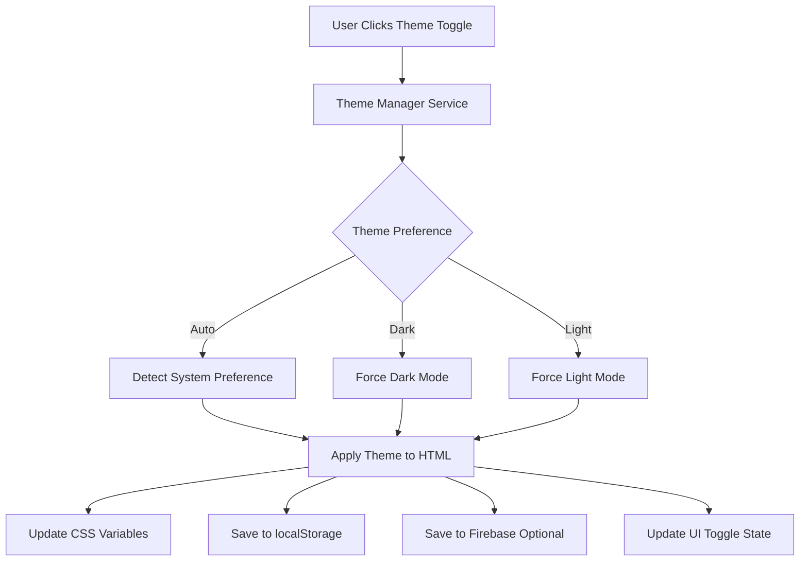

# 👻 Ghost Gym - Dark Mode Implementation Plan

## Executive Summary

This document outlines the complete implementation plan for adding a unified dark mode system to Ghost Gym V0.4.1 with a user-controlled toggle featuring 3 options: Auto (device settings), Dark Mode, and Light Mode.

---

## Current State Analysis

### ✅ What's Working

1. **Bootstrap 5.3.3 Core CSS** ([`frontend/assets/vendor/css/core.css`](frontend/assets/vendor/css/core.css))
   - Lines 7-132: Complete light theme CSS variables in `:root` and `[data-bs-theme=light]`
   - Lines 134-188: Complete dark theme CSS variables in `[data-bs-theme=dark]`
   - Full dark mode support for all Bootstrap components
   - Uses `color-scheme: dark` for proper system integration

2. **Partial Component Support**
   - [`frontend/assets/css/components/filter-bar.css`](frontend/assets/css/components/filter-bar.css): Uses `.dark-style` class
   - [`frontend/assets/css/components/data-table.css`](frontend/assets/css/components/data-table.css): Uses `.dark-style` class
   - [`frontend/assets/css/components/badges.css`](frontend/assets/css/components/badges.css): Uses `.dark-style` class

### ❌ What's Missing

1. **No Active Dark Mode**
   - No `data-bs-theme` attribute on any HTML `<html>` tags
   - Dark mode is never activated despite CSS support existing

2. **No Theme Management System**
   - No JavaScript to toggle themes
   - No UI control for users to switch themes
   - No theme state management

3. **Inconsistent CSS Implementation**
   - [`ghost-gym-custom.css`](frontend/assets/css/ghost-gym-custom.css): Uses `@media (prefers-color-scheme: dark)` (only 3 components: cards, list-group-items, exercise-groups)
   - Component CSS files: Use `.dark-style` class
   - Bootstrap core: Uses `[data-bs-theme=dark]` attribute
   - **Need unified approach**

4. **No Theme Persistence**
   - No localStorage implementation
   - No Firebase user settings integration

5. **Incomplete Coverage**
   - [`ghost-gym-custom.css`](frontend/assets/css/ghost-gym-custom.css) dark mode only covers 3 components
   - Missing dark mode for: buttons, modals, forms, navbars, workout cards, program items, etc.

---

## Implementation Architecture

### System Design



### File Structure

```
frontend/
├── assets/
│   ├── js/
│   │   ├── services/
│   │   │   └── theme-manager.js          # NEW: Core theme management
│   │   └── components/
│   │       └── menu-template.js          # MODIFY: Add theme toggle
│   └── css/
│       ├── ghost-gym-custom.css          # MODIFY: Convert to [data-bs-theme]
│       └── components/
│           ├── filter-bar.css            # MODIFY: Convert to [data-bs-theme]
│           ├── data-table.css            # MODIFY: Convert to [data-bs-theme]
│           └── badges.css                # MODIFY: Convert to [data-bs-theme]
└── *.html                                # MODIFY: Add theme script loader
```

---

## Implementation Plan

### Phase 1: Theme Management Service

**File:** [`frontend/assets/js/services/theme-manager.js`](frontend/assets/js/services/theme-manager.js) (NEW)

**Purpose:** Centralized theme state management and application

**Features:**
- Theme state management (3 modes: 'auto', 'dark', 'light')
- System preference detection using `window.matchMedia('(prefers-color-scheme: dark)')`
- Theme application to `<html data-bs-theme="dark|light">`
- Event listeners for system preference changes
- localStorage persistence (`ghost-gym-theme-preference`)
- Optional Firebase user settings sync
- Public API for theme toggling and state queries

**API:**
```javascript
window.themeManager = {
  // Get current theme preference ('auto', 'dark', 'light')
  getPreference(): string
  
  // Get current active theme ('dark' or 'light')
  getActiveTheme(): string
  
  // Set theme preference
  setPreference(preference: 'auto' | 'dark' | 'light'): void
  
  // Initialize theme system
  init(): void
  
  // Event: 'themeChanged' - fired when theme changes
}
```

**Implementation Details:**
```javascript
class ThemeManager {
  constructor() {
    this.preference = 'auto'; // 'auto', 'dark', 'light'
    this.systemPreference = 'light';
    this.mediaQuery = null;
  }
  
  init() {
    // 1. Load preference from localStorage
    // 2. Set up system preference detection
    // 3. Apply initial theme
    // 4. Listen for system changes
  }
  
  applyTheme() {
    // 1. Determine active theme based on preference
    // 2. Set data-bs-theme attribute on <html>
    // 3. Dispatch 'themeChanged' event
  }
  
  savePreference() {
    // 1. Save to localStorage
    // 2. Optionally sync to Firebase
  }
}
```

---

### Phase 2: CSS Standardization

**Goal:** Convert all dark mode CSS to use Bootstrap's `[data-bs-theme=dark]` selector

#### 2.1 Update [`ghost-gym-custom.css`](frontend/assets/css/ghost-gym-custom.css)

**Current (Lines 657-675):**
```css
@media (prefers-color-scheme: dark) {
  .card { /* ... */ }
  .list-group-item { /* ... */ }
  .exercise-group { /* ... */ }
}
```

**Convert to:**
```css
[data-bs-theme=dark] .card { /* ... */ }
[data-bs-theme=dark] .list-group-item { /* ... */ }
[data-bs-theme=dark] .exercise-group { /* ... */ }
```

**Add dark mode for missing components:**
- Workout cards
- Program items
- Exercise cards
- Modals
- Forms
- Buttons (custom styles)
- Navbars
- Footers
- Badges
- Tags
- All custom components

#### 2.2 Update Component CSS Files

**Files to modify:**
- [`frontend/assets/css/components/filter-bar.css`](frontend/assets/css/components/filter-bar.css)
- [`frontend/assets/css/components/data-table.css`](frontend/assets/css/components/data-table.css)
- [`frontend/assets/css/components/badges.css`](frontend/assets/css/components/badges.css)

**Change:** Replace `.dark-style` with `[data-bs-theme=dark]`

**Example:**
```css
/* OLD */
.dark-style .datatable-table thead th { /* ... */ }

/* NEW */
[data-bs-theme=dark] .datatable-table thead th { /* ... */ }
```

#### 2.3 Update Other CSS Files

**Files to check and update:**
- [`frontend/assets/css/workout-database.css`](frontend/assets/css/workout-database.css)
- [`frontend/assets/css/exercise-autocomplete.css`](frontend/assets/css/exercise-autocomplete.css)

**Convert `@media (prefers-color-scheme: dark)` to `[data-bs-theme=dark]`**

---

### Phase 3: Menu Integration

**File:** [`frontend/assets/js/components/menu-template.js`](frontend/assets/js/components/menu-template.js) (MODIFY)

**Current Settings Section (Lines 95-100):**
```javascript
<li class="menu-item">
  <a href="pages-account-settings-account.html" class="menu-link">
    <i class="menu-icon tf-icons bx bx-cog"></i>
    <div data-i18n="Settings">Settings</div>
  </a>
</li>
```

**Add Theme Submenu:**
```javascript
<li class="menu-item">
  <a href="javascript:void(0);" class="menu-link menu-toggle">
    <i class="menu-icon tf-icons bx bx-cog"></i>
    <div data-i18n="Settings">Settings</div>
  </a>
  <ul class="menu-sub">
    <li class="menu-item">
      <a href="pages-account-settings-account.html" class="menu-link">
        <div data-i18n="Account">Account</div>
      </a>
    </li>
    <li class="menu-item">
      <a href="javascript:void(0);" class="menu-link menu-toggle">
        <div data-i18n="Theme">Theme</div>
      </a>
      <ul class="menu-sub">
        <li class="menu-item">
          <a href="javascript:void(0);" class="menu-link theme-option" data-theme="auto">
            <i class="bx bx-desktop me-2"></i>
            <div data-i18n="Auto">Auto (Device)</div>
            <i class="bx bx-check ms-auto theme-check" style="display: none;"></i>
          </a>
        </li>
        <li class="menu-item">
          <a href="javascript:void(0);" class="menu-link theme-option" data-theme="dark">
            <i class="bx bx-moon me-2"></i>
            <div data-i18n="Dark">Dark Mode</div>
            <i class="bx bx-check ms-auto theme-check" style="display: none;"></i>
          </a>
        </li>
        <li class="menu-item">
          <a href="javascript:void(0);" class="menu-link theme-option" data-theme="light">
            <i class="bx bx-sun me-2"></i>
            <div data-i18n="Light">Light Mode</div>
            <i class="bx bx-check ms-auto theme-check" style="display: none;"></i>
          </a>
        </li>
      </ul>
    </li>
  </ul>
</li>
```

**Add Event Listeners:**
```javascript
// After menu injection, set up theme toggle listeners
document.querySelectorAll('.theme-option').forEach(option => {
  option.addEventListener('click', (e) => {
    e.preventDefault();
    const theme = option.dataset.theme;
    window.themeManager.setPreference(theme);
    updateThemeCheckmarks();
  });
});

function updateThemeCheckmarks() {
  const currentPreference = window.themeManager.getPreference();
  document.querySelectorAll('.theme-option').forEach(option => {
    const check = option.querySelector('.theme-check');
    if (option.dataset.theme === currentPreference) {
      check.style.display = 'inline';
    } else {
      check.style.display = 'none';
    }
  });
}
```

---

### Phase 4: HTML Integration

**All HTML files need theme manager script loaded early**

**Add to `<head>` section (after helpers.js, before other scripts):**
```html
<!-- Theme Manager (must load early) -->
<script src="/static/assets/js/services/theme-manager.js"></script>
```

**Files to modify:**
- [`frontend/index.html`](frontend/index.html)
- [`frontend/workouts.html`](frontend/workouts.html)
- [`frontend/programs.html`](frontend/programs.html)
- [`frontend/exercise-database.html`](frontend/exercise-database.html)
- [`frontend/workout-mode.html`](frontend/workout-mode.html)
- [`frontend/workout-database.html`](frontend/workout-database.html)
- All other HTML pages

**Example modification for [`index.html`](frontend/index.html:47-48):**
```html
<!-- Helpers -->
<script src="/static/assets/vendor/js/helpers.js"></script>
<script src="/static/assets/js/config.js"></script>

<!-- Theme Manager (NEW - must load early) -->
<script src="/static/assets/js/services/theme-manager.js"></script>
```

---

### Phase 5: Firebase Integration (Optional Enhancement)

**File:** [`frontend/assets/js/firebase/data-manager.js`](frontend/assets/js/firebase/data-manager.js) (MODIFY)

**Add theme preference methods:**
```javascript
// Save theme preference to Firebase
async saveThemePreference(preference) {
  if (!this.isAuthenticated) return;
  const userRef = doc(this.db, 'users', this.currentUser.uid);
  await updateDoc(userRef, {
    'settings.theme': preference,
    'settings.themeUpdatedAt': serverTimestamp()
  });
}

// Load theme preference from Firebase
async loadThemePreference() {
  if (!this.isAuthenticated) return null;
  const userRef = doc(this.db, 'users', this.currentUser.uid);
  const userDoc = await getDoc(userRef);
  return userDoc.data()?.settings?.theme || null;
}
```

**Update theme-manager.js to sync with Firebase:**
```javascript
async savePreference() {
  // Save to localStorage (always)
  localStorage.setItem('ghost-gym-theme-preference', this.preference);
  
  // Sync to Firebase (if authenticated)
  if (window.dataManager?.isAuthenticated) {
    try {
      await window.dataManager.saveThemePreference(this.preference);
    } catch (error) {
      console.warn('Failed to sync theme to Firebase:', error);
    }
  }
}

async loadPreference() {
  // Try Firebase first (if authenticated)
  if (window.dataManager?.isAuthenticated) {
    try {
      const firebaseTheme = await window.dataManager.loadThemePreference();
      if (firebaseTheme) return firebaseTheme;
    } catch (error) {
      console.warn('Failed to load theme from Firebase:', error);
    }
  }
  
  // Fall back to localStorage
  return localStorage.getItem('ghost-gym-theme-preference') || 'auto';
}
```

---

## Implementation Checklist

### Phase 1: Theme Manager Service ✓
- [ ] Create [`theme-manager.js`](frontend/assets/js/services/theme-manager.js)
- [ ] Implement ThemeManager class
- [ ] Add system preference detection
- [ ] Add localStorage persistence
- [ ] Add public API
- [ ] Test theme switching

### Phase 2: CSS Standardization ✓
- [ ] Update [`ghost-gym-custom.css`](frontend/assets/css/ghost-gym-custom.css)
  - [ ] Convert `@media (prefers-color-scheme: dark)` to `[data-bs-theme=dark]`
  - [ ] Add dark mode for all missing components
- [ ] Update [`filter-bar.css`](frontend/assets/css/components/filter-bar.css)
  - [ ] Replace `.dark-style` with `[data-bs-theme=dark]`
- [ ] Update [`data-table.css`](frontend/assets/css/components/data-table.css)
  - [ ] Replace `.dark-style` with `[data-bs-theme=dark]`
- [ ] Update [`badges.css`](frontend/assets/css/components/badges.css)
  - [ ] Replace `.dark-style` with `[data-bs-theme=dark]`
- [ ] Update [`workout-database.css`](frontend/assets/css/workout-database.css)
  - [ ] Convert `@media (prefers-color-scheme: dark)` to `[data-bs-theme=dark]`
- [ ] Update [`exercise-autocomplete.css`](frontend/assets/css/exercise-autocomplete.css)
  - [ ] Convert `@media (prefers-color-scheme: dark)` to `[data-bs-theme=dark]`

### Phase 3: Menu Integration ✓
- [ ] Update [`menu-template.js`](frontend/assets/js/components/menu-template.js)
  - [ ] Add theme submenu under Settings
  - [ ] Add 3 theme options (Auto, Dark, Light)
  - [ ] Add event listeners for theme switching
  - [ ] Add checkmark indicators for current theme

### Phase 4: HTML Integration ✓
- [ ] Add theme-manager.js script to all HTML files:
  - [ ] [`index.html`](frontend/index.html)
  - [ ] [`workouts.html`](frontend/workouts.html)
  - [ ] [`programs.html`](frontend/programs.html)
  - [ ] [`exercise-database.html`](frontend/exercise-database.html)
  - [ ] [`workout-mode.html`](frontend/workout-mode.html)
  - [ ] [`workout-database.html`](frontend/workout-database.html)
  - [ ] All other HTML pages

### Phase 5: Firebase Integration (Optional) ✓
- [ ] Update [`data-manager.js`](frontend/assets/js/firebase/data-manager.js)
  - [ ] Add `saveThemePreference()` method
  - [ ] Add `loadThemePreference()` method
- [ ] Update [`theme-manager.js`](frontend/assets/js/services/theme-manager.js)
  - [ ] Add Firebase sync to `savePreference()`
  - [ ] Add Firebase load to `loadPreference()`

### Phase 6: Testing ✓
- [ ] Test theme switching on all pages
- [ ] Test system preference detection (auto mode)
- [ ] Test localStorage persistence
- [ ] Test Firebase sync (if implemented)
- [ ] Test dark mode appearance on all components
- [ ] Test theme persistence across page navigation
- [ ] Test theme on mobile devices
- [ ] Test with different system preferences

### Phase 7: Documentation ✓
- [ ] Update README with dark mode feature
- [ ] Document theme manager API
- [ ] Add user guide for theme switching
- [ ] Document CSS dark mode patterns

---

## Technical Specifications

### Theme Preference Values

| Value | Description | Behavior |
|-------|-------------|----------|
| `'auto'` | Follow device settings | Detects system preference via `prefers-color-scheme` media query |
| `'dark'` | Force dark mode | Always applies dark theme regardless of system |
| `'light'` | Force light mode | Always applies light theme regardless of system |

### localStorage Key

```javascript
'ghost-gym-theme-preference' // Stores: 'auto', 'dark', or 'light'
```

### HTML Attribute

```html
<html data-bs-theme="dark"> <!-- or "light" -->
```

### CSS Selector Pattern

```css
/* Bootstrap standard */
[data-bs-theme=dark] .component { /* dark styles */ }

/* NOT recommended (inconsistent) */
.dark-style .component { /* ... */ }
@media (prefers-color-scheme: dark) { /* ... */ }
```

### Event System

```javascript
// Listen for theme changes
window.addEventListener('themeChanged', (event) => {
  console.log('Theme changed to:', event.detail.theme);
  console.log('Preference:', event.detail.preference);
});
```

---

## Migration Strategy

### Backward Compatibility

1. **Existing `.dark-style` classes** will be replaced with `[data-bs-theme=dark]`
2. **Existing `@media (prefers-color-scheme: dark)`** will be replaced with `[data-bs-theme=dark]`
3. **No breaking changes** - all existing functionality preserved

### Rollout Plan

1. **Phase 1-2:** Backend work (no user-visible changes)
2. **Phase 3-4:** Deploy theme toggle (users can start using it)
3. **Phase 5:** Optional Firebase sync (enhancement)
4. **Phase 6-7:** Testing and documentation

---

## Success Criteria

✅ **Functional Requirements:**
- [ ] Users can toggle between 3 theme options (Auto, Dark, Light)
- [ ] Theme persists across page navigation
- [ ] Theme persists across browser sessions (localStorage)
- [ ] Auto mode correctly detects system preference
- [ ] All pages and components display correctly in both themes

✅ **Technical Requirements:**
- [ ] Unified CSS approach using `[data-bs-theme]`
- [ ] No console errors related to theming
- [ ] Theme manager loads before page render (no flash)
- [ ] Performance impact < 50ms on page load

✅ **User Experience:**
- [ ] Theme toggle is easily discoverable in Settings menu
- [ ] Current theme is clearly indicated with checkmark
- [ ] Theme changes apply instantly without page reload
- [ ] Dark mode is visually consistent across all pages

---

## Future Enhancements

1. **Custom Theme Colors:** Allow users to customize accent colors
2. **Scheduled Themes:** Auto-switch based on time of day
3. **Per-Page Themes:** Different themes for different sections
4. **Theme Presets:** Multiple dark/light theme variations
5. **Accessibility:** High contrast mode, reduced motion support

---

## References

- [Bootstrap 5.3 Dark Mode Documentation](https://getbootstrap.com/docs/5.3/customize/color-modes/)
- [MDN: prefers-color-scheme](https://developer.mozilla.org/en-US/docs/Web/CSS/@media/prefers-color-scheme)
- [Web.dev: prefers-color-scheme](https://web.dev/prefers-color-scheme/)

---

**Document Version:** 1.0  
**Last Updated:** 2025-11-03  
**Author:** Ghost Gym Development Team