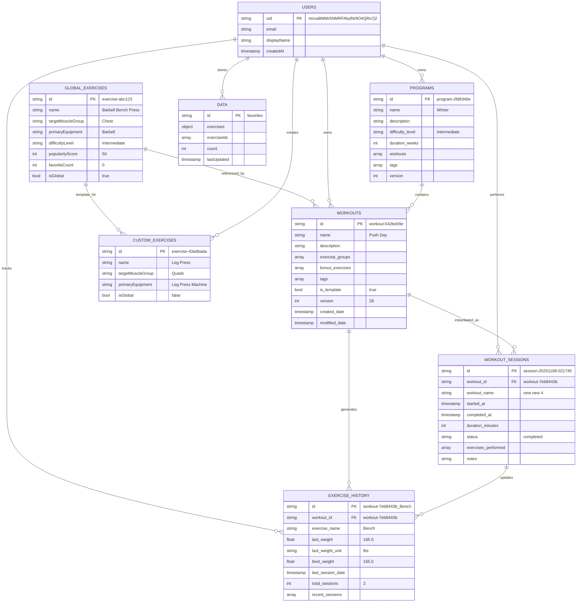
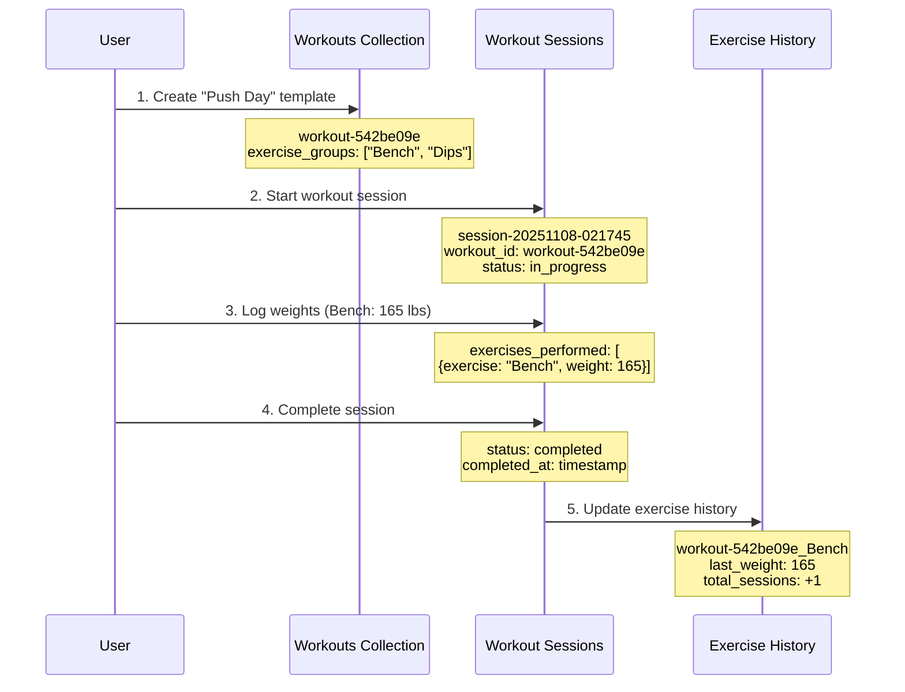
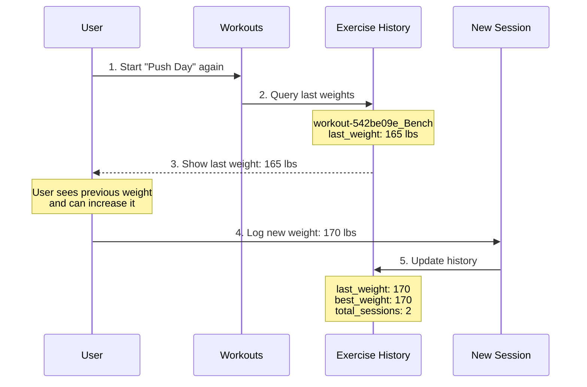
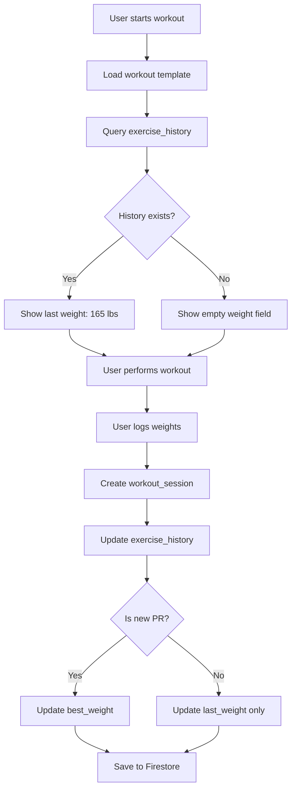

# Database Structure & Relationships

**Generated:** 2025-11-09  
**Purpose:** Visual guide to how your Firestore database collections connect and work together

---

## 📊 Complete Database Architecture



---

## 🔗 Collection Relationships Explained

### 1. **Global Exercises → Workouts**
**Relationship:** Referenced by name (string reference)

```javascript
// In workout template
exercise_groups: [
  {
    exercises: {
      a: "Bench",  // ← References exercise by name
      b: "Double Dumbbell Bench Press"
    },
    sets: "3",
    reps: "8-12"
  }
]
```

**How it works:**
- Workouts store exercise names as strings
- App looks up full exercise details from `global_exercises` collection
- Allows exercises to be updated globally without changing workouts

---

### 2. **Users → Workouts (Subcollection)**
**Path:** `users/{userId}/workouts/{workoutId}`

```javascript
// User owns multiple workout templates
users/mnxaBMMr5NMRFAkylNr9O4QRo7j2/
  └── workouts/
      ├── workout-542be09e (Push Day)
      ├── workout-da1d9a34 (Legs)
      └── workout-7eb8443b (new new 4)
```

**How it works:**
- Each user has their own workout templates
- Workouts are isolated per user (no sharing between users)
- Templates can be reused multiple times in workout sessions

---

### 3. **Programs → Workouts**
**Relationship:** Array of workout references

```javascript
// Program contains workout IDs
{
  "id": "program-2fd8346e",
  "name": "Winter",
  "workouts": [
    {
      "workout_id": "workout-e8c7e54b",  // ← References workout
      "order_index": 0,
      "custom_name": null
    },
    {
      "workout_id": "workout-45b3ded7",
      "order_index": 1
    }
  ]
}
```

**How it works:**
- Programs organize workouts in a sequence
- Same workout can be in multiple programs
- `order_index` determines workout order in program

---

### 4. **Workouts → Workout Sessions**
**Relationship:** Template instantiation

```javascript
// Workout template
{
  "id": "workout-7eb8443b",
  "name": "new new 4",
  "is_template": true,
  "exercise_groups": [...]
}

// Becomes workout session when performed
{
  "id": "session-20251108-021745",
  "workout_id": "workout-7eb8443b",  // ← Links back to template
  "workout_name": "new new 4",
  "started_at": "2025-11-08T02:17:44",
  "completed_at": "2025-11-08T02:18:02",
  "exercises_performed": [...]  // ← Actual weights logged
}
```

**How it works:**
- Workout template = blueprint
- Workout session = actual performance with weights
- Multiple sessions can reference same template
- Sessions store actual weights, sets, reps performed

---

### 5. **Workout Sessions → Exercise History**
**Relationship:** Updates history after each session

```javascript
// After completing a workout session
{
  "id": "session-20251108-021745",
  "exercises_performed": [
    {
      "exercise_name": "Bench",
      "weight": 165.0,  // ← Weight logged
      "weight_unit": "lbs",
      "sets_completed": 3
    }
  ]
}

// Updates exercise history
{
  "id": "workout-7eb8443b_Bench",  // ← Composite key
  "workout_id": "workout-7eb8443b",
  "exercise_name": "Bench",
  "last_weight": 165.0,  // ← Updated from session
  "best_weight": 165.0,
  "total_sessions": 2,
  "recent_sessions": [...]  // ← Session added to history
}
```

**How it works:**
- Each completed session updates exercise history
- History is per workout + exercise combination
- Enables "last weight used" feature
- Tracks personal records (best_weight)

---

### 6. **Users → Data (Favorites)**
**Path:** `users/{userId}/data/favorites`

```javascript
{
  "id": "favorites",
  "exerciseIds": [
    "exercise-1451354b",
    "exercise-0ed469cf"
  ],
  "exercises": {
    "exercise-1451354b": {
      "name": "Barbell Conventional Deadlift",
      "targetMuscleGroup": "Back",
      "favoritedAt": "2025-10-17T18:07:04"
    }
  },
  "count": 14
}
```

**How it works:**
- Stores user's favorite exercises
- Denormalized for quick access (stores exercise details)
- Used in exercise picker to show favorites first

---

## 🔄 Data Flow Examples

### Example 1: Creating and Performing a Workout



### Example 2: Progressive Overload (Next Workout)



---

## 🗂️ Collection Hierarchy

```
firestore/
├── global_exercises/                    # 2,583 exercises (shared)
│   └── {exerciseId}/
│       ├── name: "Barbell Bench Press"
│       ├── targetMuscleGroup: "Chest"
│       └── ... (41 fields)
│
└── users/                               # User accounts
    └── {userId}/
        ├── workouts/                    # 7 workout templates
        │   └── {workoutId}/
        │       ├── name: "Push Day"
        │       ├── exercise_groups: [...]
        │       └── version: 28
        │
        ├── programs/                    # 13 programs
        │   └── {programId}/
        │       ├── name: "Winter"
        │       ├── workouts: [{workout_id, order}]
        │       └── duration_weeks: 12
        │
        ├── custom_exercises/            # 2 custom exercises
        │   └── {exerciseId}/
        │       ├── name: "Leg Press"
        │       └── isGlobal: false
        │
        ├── workout_sessions/            # 14 completed sessions
        │   └── {sessionId}/
        │       ├── workout_id: "workout-..."
        │       ├── exercises_performed: [...]
        │       └── status: "completed"
        │
        ├── exercise_history/            # 6 exercise histories
        │   └── {workout_exercise_id}/
        │       ├── last_weight: 165.0
        │       ├── best_weight: 165.0
        │       └── recent_sessions: [...]
        │
        └── data/                        # User preferences
            └── favorites/
                ├── exerciseIds: [...]
                └── count: 14
```

---

## 🎯 Key Design Patterns

### 1. **Composite Keys for Exercise History**
```javascript
// Format: {workout_id}_{exercise_name}
"workout-7eb8443b_Bench"
```
**Why:** Weights are specific to workout + exercise combination
- Same exercise in different workouts = different history
- Enables accurate "last weight used" per workout

### 2. **Denormalization for Performance**
```javascript
// Workout session stores workout name (denormalized)
{
  "workout_id": "workout-7eb8443b",
  "workout_name": "new new 4"  // ← Copied from template
}
```
**Why:** Avoid extra lookup when displaying session history

### 3. **Array References in Programs**
```javascript
{
  "workouts": [
    {"workout_id": "workout-e8c7e54b", "order_index": 0},
    {"workout_id": "workout-45b3ded7", "order_index": 1}
  ]
}
```
**Why:** Flexible ordering, same workout can appear multiple times

### 4. **String References for Exercises**
```javascript
{
  "exercises": {
    "a": "Bench",  // ← String reference
    "b": "Double Dumbbell Bench Press"
  }
}
```
**Why:** Exercises can be updated globally without breaking workouts

---

## 📈 Weight Logging Data Flow



---

## 🔍 Query Patterns

### Get Last Weight for Exercise
```javascript
// Query exercise history
const historyId = `${workoutId}_${exerciseName}`;
const history = await db
  .collection('users')
  .doc(userId)
  .collection('exercise_history')
  .doc(historyId)
  .get();

// Returns: { last_weight: 165.0, last_weight_unit: "lbs" }
```

### Get All Sessions for a Workout
```javascript
const sessions = await db
  .collection('users')
  .doc(userId)
  .collection('workout_sessions')
  .where('workout_id', '==', workoutId)
  .orderBy('completed_at', 'desc')
  .limit(10)
  .get();
```

### Get Workouts in a Program
```javascript
// 1. Get program
const program = await db
  .collection('users')
  .doc(userId)
  .collection('programs')
  .doc(programId)
  .get();

// 2. Fetch each workout
const workoutIds = program.data().workouts.map(w => w.workout_id);
const workouts = await Promise.all(
  workoutIds.map(id => 
    db.collection('users')
      .doc(userId)
      .collection('workouts')
      .doc(id)
      .get()
  )
);
```

---

## 💡 Summary

Your database uses a **hierarchical subcollection structure** with:

1. **Global shared data** (exercises) at root level
2. **User-specific data** in subcollections under each user
3. **Template-instance pattern** (workouts → sessions)
4. **Composite keys** for exercise history (workout + exercise)
5. **Denormalization** for performance (storing names with IDs)
6. **Array references** for flexible relationships (programs → workouts)

This structure enables:
- ✅ Progressive overload tracking
- ✅ Per-workout exercise history
- ✅ Flexible program creation
- ✅ Fast queries with minimal joins
- ✅ User data isolation