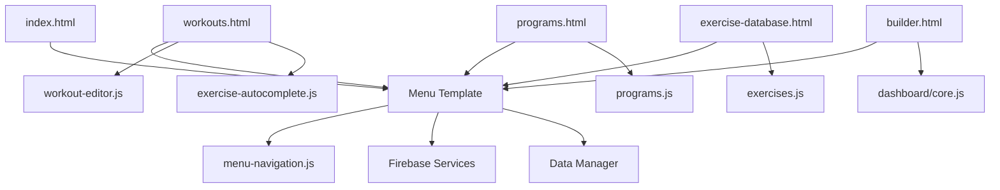

# Frontend Folder Cleanup Analysis
**Ghost Gym V0.4.1 - Codebase Audit**

## Executive Summary

Your frontend folder contains **significant duplication** from the Sneat Bootstrap template, with approximately **60+ unused demo/template HTML files** and **duplicate JavaScript implementations**. The actual application uses only 5 core HTML pages but carries the weight of the entire template library.

---

## 📊 Current Structure Overview

### Active Application Files (5 files)
```
✅ KEEP - Core Application Pages:
├── index.html              (Home/Dashboard)
├── builder.html            (Program Builder - Legacy)
├── workouts.html           (Workout Library)
├── programs.html           (Program Management)
└── exercise-database.html  (Exercise Browser)
```

### Template/Demo Files (~60 files) ⚠️
```
❌ REMOVE - Unused Template Files:
├── ui-*.html (18 files)           - UI component demos
├── auth-*.html (3 files)          - Auth page templates (unused - using modals)
├── pages-*.html (6 files)         - Account/error page templates
├── layouts-*.html (5 files)       - Layout demos
├── forms-*.html (3 files)         - Form demos
├── extended-ui-*.html (2 files)   - Extended UI demos
├── cards-basic.html               - Card demos
├── tables-basic.html              - Table demos
├── icons-boxicons.html            - Icon reference
└── test-accordion.html            - Test file
```

---

## 🔍 Critical Duplication Issues

### 1. **JavaScript Menu Duplication** 🚨

**Problem:** Two complete menu implementations exist:

```javascript
// Location 1: frontend/js/menu.js (596 lines)
// - Full Menu class implementation
// - From Sneat template
// - Used by template pages

// Location 2: frontend/assets/js/menu-navigation.js (219 lines)  
// - Custom MenuNavigation class
// - Ghost Gym specific
// - SPA-style navigation
// - Used by actual application
```

**Impact:**
- Confusion about which to use
- Maintenance burden
- Potential conflicts
- ~800 lines of redundant code

**Recommendation:** 
- ✅ **KEEP:** [`frontend/assets/js/menu-navigation.js`](frontend/assets/js/menu-navigation.js:1)
- ❌ **REMOVE:** [`frontend/js/menu.js`](frontend/js/menu.js:1)

---

### 2. **Helper Functions Duplication** 🚨

**Problem:** Two helper implementations:

```javascript
// Location 1: frontend/js/helpers.js (860 lines)
// - Sneat template helpers
// - Layout management
// - Menu utilities

// Location 2: frontend/assets/js/dashboard/ui-helpers.js
// - Ghost Gym specific helpers
// - Alert system
// - UI utilities
```

**Impact:**
- 860+ lines of mostly unused code
- Unclear which helpers to use
- Template-specific code mixed with app code

**Recommendation:**
- ✅ **KEEP:** [`frontend/assets/js/dashboard/ui-helpers.js`](frontend/assets/js/dashboard/ui-helpers.js:1)
- ⚠️ **REVIEW:** [`frontend/js/helpers.js`](frontend/js/helpers.js:1) - May be needed by vendor menu.js

---

### 3. **Bootstrap Wrapper Duplication**

```javascript
// Location 1: frontend/js/bootstrap.js (7 lines)
// - ES6 module wrapper
// - From template

// Location 2: Loaded via vendor in HTML
// - /static/assets/vendor/js/bootstrap.js
```

**Recommendation:** Remove [`frontend/js/bootstrap.js`](frontend/js/bootstrap.js:1) - redundant

---

## 📁 Proposed Folder Structure

### Current Structure (Messy)
```
frontend/
├── *.html (60+ files mixed together)
├── js/ (template files)
├── assets/
│   ├── js/ (app files)
│   └── css/
├── libs/ (template libs)
└── scss/
```

### Proposed Structure (Clean)
```
frontend/
├── app/                          # Active application
│   ├── index.html
│   ├── workouts.html
│   ├── programs.html
│   ├── exercise-database.html
│   └── builder.html (legacy)
│
├── assets/                       # Application assets
│   ├── js/
│   │   ├── components/          # UI components
│   │   ├── core/                # Core systems
│   │   ├── dashboard/           # Dashboard modules
│   │   ├── firebase/            # Firebase integration
│   │   ├── services/            # Services
│   │   ├── config.js
│   │   ├── main.js
│   │   └── menu-navigation.js
│   │
│   ├── css/
│   │   ├── demo.css
│   │   ├── exercise-autocomplete.css
│   │   ├── exercise-database.css
│   │   ├── ghost-gym-custom.css
│   │   └── workout-builder.css
│   │
│   └── img/
│
├── vendor/                       # Third-party libraries
│   ├── css/
│   ├── js/
│   ├── libs/
│   └── fonts/
│
├── scss/                         # SCSS source files
│
└── _archive/                     # Archived template files
    ├── template-demos/          # UI component demos
    ├── template-pages/          # Template page examples
    └── README.md                # Archive documentation
```

---

## 🗑️ Files to Remove/Archive

### Category 1: UI Component Demos (18 files)
```
❌ ui-accordion.html
❌ ui-alerts.html
❌ ui-badges.html
❌ ui-buttons.html
❌ ui-carousel.html
❌ ui-collapse.html
❌ ui-dropdowns.html
❌ ui-footer.html
❌ ui-list-groups.html
❌ ui-modals.html
❌ ui-navbar.html
❌ ui-offcanvas.html
❌ ui-pagination-breadcrumbs.html
❌ ui-progress.html
❌ ui-spinners.html
❌ ui-tabs-pills.html
❌ ui-toasts.html
❌ ui-tooltips-popovers.html
❌ ui-typography.html
```

### Category 2: Unused Auth Pages (3 files)
```
❌ auth-forgot-password-basic.html
❌ auth-login-basic.html
❌ auth-register-basic.html
```
**Reason:** App uses modal-based authentication via [`auth-modals-template.js`](frontend/assets/js/components/auth-modals-template.js:1)

### Category 3: Template Pages (11 files)
```
❌ pages-account-settings-account.html
❌ pages-account-settings-connections.html
❌ pages-account-settings-notifications.html
❌ pages-misc-error.html
❌ pages-misc-under-maintenance.html
❌ layouts-blank.html
❌ layouts-container.html
❌ layouts-fluid.html
❌ layouts-without-menu.html
❌ layouts-without-navbar.html
❌ cards-basic.html
```

### Category 4: Form/Table Demos (6 files)
```
❌ forms-basic-inputs.html
❌ forms-input-groups.html
❌ form-layouts-horizontal.html
❌ form-layouts-vertical.html
❌ tables-basic.html
❌ extended-ui-perfect-scrollbar.html
❌ extended-ui-text-divider.html
```

### Category 5: Test/Reference Files (2 files)
```
❌ test-accordion.html
❌ icons-boxicons.html
```

### Category 6: Duplicate JavaScript (3 files)
```
⚠️ frontend/js/menu.js (596 lines)
⚠️ frontend/js/helpers.js (860 lines)  
❌ frontend/js/bootstrap.js (7 lines)
```

---

## 📈 Impact Analysis

### Before Cleanup
- **Total HTML files:** 65+
- **Active pages:** 5 (7.7%)
- **Unused pages:** 60+ (92.3%)
- **JavaScript duplication:** ~1,500 lines
- **Maintenance complexity:** HIGH

### After Cleanup
- **Total HTML files:** 5
- **Active pages:** 5 (100%)
- **Unused pages:** 0
- **JavaScript duplication:** 0
- **Maintenance complexity:** LOW

### Benefits
✅ **90% reduction** in HTML files
✅ **Clearer project structure**
✅ **Faster onboarding** for new developers
✅ **Reduced confusion** about which files to edit
✅ **Smaller repository size**
✅ **Easier maintenance**

---

## 🎯 Cleanup Strategy

### Phase 1: Archive Template Files (Low Risk)
1. Create `_archive/template-demos/` folder
2. Move all `ui-*.html` files
3. Move all unused `pages-*.html`, `layouts-*.html`, `forms-*.html`
4. Move `test-accordion.html`, `icons-boxicons.html`
5. Add README explaining archive

### Phase 2: Reorganize Active Files (Medium Risk)
1. Create `app/` folder
2. Move 5 active HTML files to `app/`
3. Update asset paths in HTML files
4. Test all pages

### Phase 3: Clean JavaScript Duplication (Medium Risk)
1. Verify [`menu-navigation.js`](frontend/assets/js/menu-navigation.js:1) is used everywhere
2. Remove [`frontend/js/menu.js`](frontend/js/menu.js:1)
3. Remove [`frontend/js/bootstrap.js`](frontend/js/bootstrap.js:1)
4. Review [`frontend/js/helpers.js`](frontend/js/helpers.js:1) dependencies
5. Test thoroughly

### Phase 4: Clean Vendor Files (Low Risk)
1. Move `libs/` to `vendor/libs/`
2. Consolidate vendor structure
3. Update paths

---

## 🔧 Implementation Plan

### Step 1: Create Archive Structure
```bash
mkdir -p frontend/_archive/template-demos
mkdir -p frontend/_archive/template-pages
mkdir -p frontend/_archive/template-forms
```

### Step 2: Move Files (Reversible)
```bash
# Move UI demos
mv frontend/ui-*.html frontend/_archive/template-demos/

# Move template pages
mv frontend/pages-*.html frontend/_archive/template-pages/
mv frontend/layouts-*.html frontend/_archive/template-pages/
mv frontend/auth-*.html frontend/_archive/template-pages/

# Move form demos
mv frontend/forms-*.html frontend/_archive/template-forms/
mv frontend/form-*.html frontend/_archive/template-forms/
mv frontend/tables-*.html frontend/_archive/template-forms/
mv frontend/cards-*.html frontend/_archive/template-forms/
mv frontend/extended-ui-*.html frontend/_archive/template-forms/

# Move test files
mv frontend/test-*.html frontend/_archive/
mv frontend/icons-*.html frontend/_archive/
```

### Step 3: Create App Folder
```bash
mkdir -p frontend/app
mv frontend/index.html frontend/app/
mv frontend/workouts.html frontend/app/
mv frontend/programs.html frontend/app/
mv frontend/exercise-database.html frontend/app/
mv frontend/builder.html frontend/app/
```

### Step 4: Update Paths
Update all HTML files to use correct asset paths:
```html
<!-- Before -->
<link rel="stylesheet" href="/static/assets/css/demo.css" />

<!-- After (if needed) -->
<link rel="stylesheet" href="/static/assets/css/demo.css" />
```

---

## ⚠️ Risks & Mitigation

### Risk 1: Breaking Vendor Dependencies
**Mitigation:** 
- Keep vendor files intact initially
- Test thoroughly before removing
- Use git to track changes

### Risk 2: Path Issues After Reorganization
**Mitigation:**
- Update all asset paths systematically
- Test each page after moving
- Use relative paths where possible

### Risk 3: Removing Needed Template Code
**Mitigation:**
- Archive instead of delete
- Keep git history
- Document what was moved where

---

## 📝 Recommendations

### Immediate Actions (High Priority)
1. ✅ **Archive template demo files** - Zero risk, huge clarity gain
2. ✅ **Remove duplicate JavaScript** - Reduces confusion
3. ✅ **Document active vs archived** - Helps team understand structure

### Short-term Actions (Medium Priority)
4. ⚠️ **Reorganize into app/ folder** - Better structure
5. ⚠️ **Consolidate vendor files** - Cleaner organization

### Long-term Actions (Low Priority)
6. 🔄 **Consider removing builder.html** - If fully replaced by workouts.html
7. 🔄 **Evaluate SCSS usage** - May not need full SCSS structure

---

## 🎨 Architecture Insights

### Current Active Architecture



### Key Components
- **Menu System:** [`menu-navigation.js`](frontend/assets/js/menu-navigation.js:1) - SPA navigation
- **Auth System:** Modal-based via [`auth-modals-template.js`](frontend/assets/js/components/auth-modals-template.js:1)
- **Data Layer:** [`data-manager.js`](frontend/assets/js/firebase/data-manager.js:1) - Firebase/LocalStorage
- **Exercise System:** [`exercise-autocomplete.js`](frontend/assets/js/components/exercise-autocomplete.js:1) + [`exercise-cache-service.js`](frontend/assets/js/services/exercise-cache-service.js:1)

---

## 📚 Additional Findings

### Positive Observations
✅ Good separation of concerns in `assets/js/`
✅ Component-based architecture emerging
✅ Clear Firebase integration layer
✅ Consistent naming conventions in active code

### Areas for Improvement
⚠️ Too many entry points (5 HTML files vs SPA)
⚠️ Mixed template and app code
⚠️ No clear distinction between vendor and app code
⚠️ SCSS files may be unused (check if compiled)

---

## 🎯 Success Criteria

After cleanup, you should have:
- ✅ Only 5 HTML files in active use
- ✅ Clear separation: app/ vs vendor/ vs _archive/
- ✅ No duplicate JavaScript implementations
- ✅ All template demos archived with documentation
- ✅ Faster project navigation
- ✅ Clearer onboarding for new developers

---

## 📞 Next Steps

1. **Review this analysis** with your team
2. **Approve the cleanup strategy**
3. **Create a backup branch** before starting
4. **Execute Phase 1** (archive template files)
5. **Test thoroughly** after each phase
6. **Document changes** in CHANGELOG

---

**Generated:** 2025-10-27
**Analyst:** Roo (Architect Mode)
**Project:** Ghost Gym V0.4.1