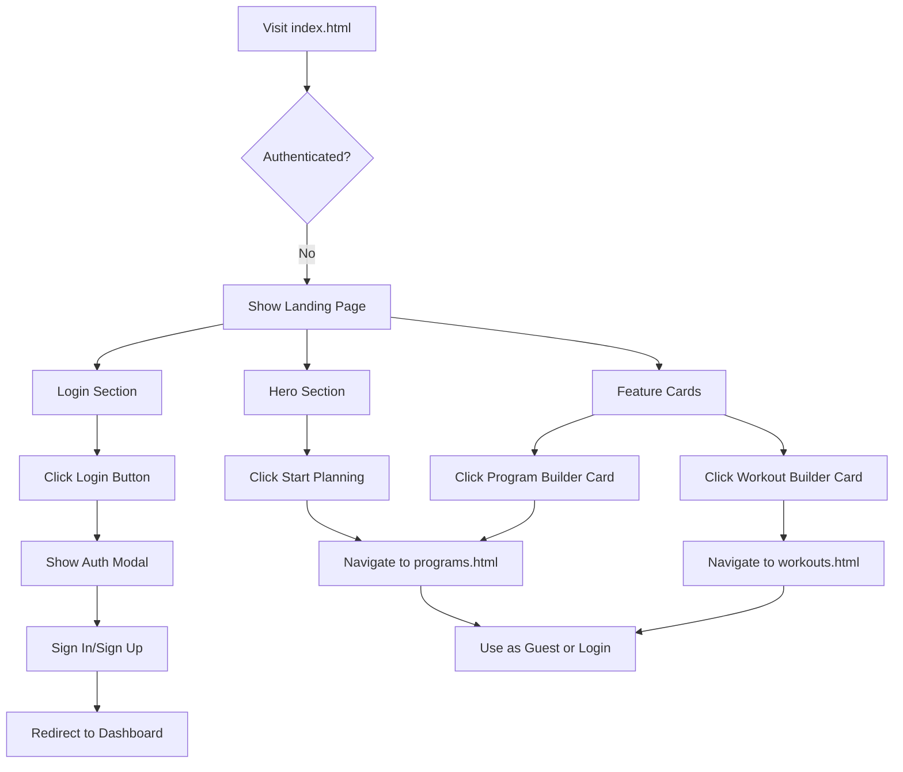
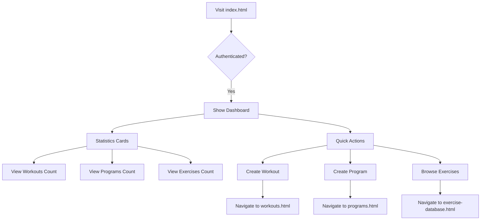

# Landing Page Architecture Plan

## Overview
Transform the Ghost Gym home page ([`index.html`](frontend/index.html)) into a modern landing page for unauthenticated users, while maintaining the existing dashboard for authenticated users.

## Current State Analysis

### Existing Structure
- **File**: [`frontend/index.html`](frontend/index.html:1)
- **Current Behavior**:
  - Shows authenticated dashboard with statistics cards (workouts, programs, exercises)
  - Shows unauthenticated welcome page with basic features
  - Uses Firebase authentication with modal-based login
  - Supports guest mode (anonymous authentication)

### Authentication Flow
- **Auth Service**: [`frontend/assets/js/firebase/auth-service.js`](frontend/assets/js/firebase/auth-service.js)
- **Auth UI**: [`frontend/assets/js/firebase/auth-ui.js`](frontend/assets/js/firebase/auth-ui.js:1)
- **Auth Modals**: [`frontend/assets/js/components/auth-modals-template.js`](frontend/assets/js/components/auth-modals-template.js:1)
- **Modal Trigger**: `showAuthModal('signin')` or `showAuthModal('signup')`

## New Landing Page Design

### Layout Structure

```
┌─────────────────────────────────────────┐
│  [☰ Menu]              [Ghost Gym Logo] │  ← Header
├─────────────────────────────────────────┤
│                                         │
│         👻 Ghost Gym                    │  ← Hero Section
│    Your Workout Planning Partner        │
│                                         │
│      [Start Planning →]                 │
│                                         │
├─────────────────────────────────────────┤
│                                         │
│  ┌──────────────┐  ┌──────────────┐   │  ← Feature Cards
│  │   📋 Build   │  │  💪 Create   │   │
│  │   Programs   │  │  Workouts    │   │
│  │              │  │              │   │
│  │  [Explore →] │  │  [Explore →] │   │
│  └──────────────┘  └──────────────┘   │
│                                         │
├─────────────────────────────────────────┤
│                                         │
│     Already have an account?            │  ← Login Section
│         [Login Here]                    │
│                                         │
└─────────────────────────────────────────┘
```

### Component Breakdown

#### 1. Hero Section
- **Ghost Gym branding** with icon
- **Tagline**: "Your Workout Planning Partner" or similar
- **Primary CTA**: "Start Planning" button
  - Action: Navigate to [`programs.html`](frontend/programs.html) (Program Builder)
  - Works for both guest and authenticated users

#### 2. Feature Cards (2 Large Cards)

**Card 1: Program Builder**
- **Icon**: 📋 Folder/Program icon
- **Title**: "Build Programs"
- **Description**: "Design complete training programs with multiple workouts"
- **CTA**: "Explore Program Builder →"
- **Action**: Navigate to [`programs.html`](frontend/programs.html)

**Card 2: Workout Builder**
- **Icon**: 💪 Dumbbell icon
- **Title**: "Create Workouts"
- **Description**: "Build custom workout templates with exercise groups"
- **CTA**: "Explore Workout Builder →"
- **Action**: Navigate to [`workouts.html`](frontend/workouts.html)

#### 3. Login Section
- **Text**: "Already have an account?"
- **Button**: "Login Here"
- **Action**: Trigger `showAuthModal('signin')`
- **Style**: Prominent but not overwhelming

#### 4. Optional: Quick Features List
- Small icons showing key features:
  - 📊 Track Progress
  - 🔄 Sync Across Devices
  - 📱 Mobile Friendly
  - 🎯 Exercise Database

## Implementation Plan

### Phase 1: HTML Structure Updates

**File**: [`frontend/index.html`](frontend/index.html:234)

1. **Update Unauthenticated Section** (lines 234-322)
   - Replace current welcome content
   - Add hero section with branding
   - Add two large feature cards
   - Add login section at bottom

2. **Keep Authenticated Dashboard** (lines 81-232)
   - No changes needed
   - Existing dashboard works well for logged-in users

### Phase 2: Styling

**Create New CSS File**: `frontend/assets/css/landing-page.css`

```css
/* Hero Section */
.landing-hero {
  text-align: center;
  padding: 4rem 2rem;
  background: linear-gradient(135deg, #667eea 0%, #764ba2 100%);
  color: white;
  border-radius: 1rem;
  margin-bottom: 2rem;
}

/* Feature Cards */
.feature-cards {
  display: grid;
  grid-template-columns: repeat(auto-fit, minmax(300px, 1fr));
  gap: 2rem;
  margin-bottom: 3rem;
}

.feature-card {
  background: var(--bs-card-bg);
  border: 2px solid var(--bs-border-color);
  border-radius: 1rem;
  padding: 2rem;
  text-align: center;
  transition: all 0.3s ease;
  cursor: pointer;
  text-decoration: none;
  color: inherit;
  display: block;
}

.feature-card:hover {
  transform: translateY(-5px);
  box-shadow: 0 10px 30px rgba(0,0,0,0.1);
  border-color: var(--bs-primary);
}

.feature-card-icon {
  font-size: 4rem;
  margin-bottom: 1rem;
}

/* Login Section */
.landing-login {
  text-align: center;
  padding: 2rem;
  background: var(--bs-light);
  border-radius: 1rem;
}
```

### Phase 3: JavaScript Updates

**File**: [`frontend/index.html`](frontend/index.html:387) (inline script)

1. **Update `checkAuthAndRender` function**:
   - Keep existing logic
   - Ensure unauthenticated view shows new landing page

2. **Add Navigation Handlers**:
   ```javascript
   // Feature card click handlers
   function navigateToPrograms() {
     window.location.href = 'programs.html';
   }
   
   function navigateToWorkouts() {
     window.location.href = 'workouts.html';
   }
   ```

### Phase 4: Mobile Responsiveness

**Breakpoints**:
- **Desktop** (>768px): Two-column feature cards
- **Tablet** (768px): Two-column feature cards (smaller)
- **Mobile** (<768px): Single-column stacked layout

**Mobile Optimizations**:
- Reduce hero section padding
- Stack feature cards vertically
- Larger touch targets for buttons
- Simplified navigation

## User Flow Diagrams

### Unauthenticated User Flow



### Authenticated User Flow



## Key Features

### 1. Guest Mode Support
- Users can click feature cards without logging in
- Anonymous authentication allows local storage usage
- Prompt to create account appears after creating content

### 2. Seamless Authentication
- Login button triggers existing auth modal
- No page reload required
- Smooth transition to dashboard after login

### 3. Progressive Enhancement
- Works without JavaScript (basic navigation)
- Enhanced with JavaScript for better UX
- Responsive design for all devices

### 4. Consistent Branding
- Uses existing Ghost Gym theme
- Maintains color scheme and typography
- Integrates with existing menu system

## Files to Modify

### Primary Files
1. **[`frontend/index.html`](frontend/index.html)** - Main landing page structure
2. **`frontend/assets/css/landing-page.css`** (NEW) - Landing page styles

### Supporting Files (No Changes Needed)
- [`frontend/assets/js/firebase/auth-ui.js`](frontend/assets/js/firebase/auth-ui.js) - Auth modal handling
- [`frontend/assets/js/components/auth-modals-template.js`](frontend/assets/js/components/auth-modals-template.js) - Auth modal template
- [`frontend/programs.html`](frontend/programs.html) - Program builder page
- [`frontend/workouts.html`](frontend/workouts.html) - Workout builder page

## Testing Checklist

### Functional Testing
- [ ] Landing page displays for unauthenticated users
- [ ] Dashboard displays for authenticated users
- [ ] Program Builder card navigates to programs.html
- [ ] Workout Builder card navigates to workouts.html
- [ ] Login button triggers auth modal
- [ ] Guest mode works (anonymous auth)
- [ ] Sign in/sign up flow works correctly
- [ ] Navigation persists after authentication

### Visual Testing
- [ ] Hero section displays correctly
- [ ] Feature cards are properly styled
- [ ] Hover effects work on cards
- [ ] Login section is prominent but not overwhelming
- [ ] Responsive design works on mobile
- [ ] Responsive design works on tablet
- [ ] Colors match existing theme

### Cross-Browser Testing
- [ ] Chrome/Edge (Chromium)
- [ ] Firefox
- [ ] Safari (if available)
- [ ] Mobile browsers

## Success Criteria

1. **User Experience**
   - Clear value proposition in hero section
   - Easy-to-understand feature cards
   - Obvious path to login
   - Smooth navigation to builders

2. **Technical**
   - No breaking changes to existing functionality
   - Maintains authentication flow
   - Works with guest mode
   - Responsive on all devices

3. **Design**
   - Matches sketch layout
   - Consistent with existing theme
   - Professional appearance
   - Clear visual hierarchy

## Future Enhancements

### Phase 2 (Optional)
- Add testimonials section
- Add feature comparison table
- Add video demo/tutorial
- Add social proof (user count, workout count)
- Add newsletter signup
- Add FAQ section

### Phase 3 (Optional)
- A/B testing different CTAs
- Analytics integration
- Conversion tracking
- User onboarding flow
- Interactive demo mode

## Notes

- The existing authenticated dashboard is well-designed and should remain unchanged
- The landing page should feel welcoming but not overwhelming
- Guest mode is a key feature - users should be able to explore without commitment
- The auth modal system is already robust and should be reused
- Mobile-first approach ensures accessibility for all users

## References

- Current Home Page: [`frontend/index.html`](frontend/index.html)
- Auth System: [`frontend/assets/js/firebase/auth-ui.js`](frontend/assets/js/firebase/auth-ui.js)
- Program Builder: [`frontend/programs.html`](frontend/programs.html)
- Workout Builder: [`frontend/workouts.html`](frontend/workouts.html)