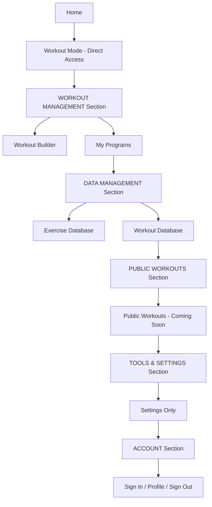

# Menu Reorganization Implementation Plan

## Overview
This document outlines the plan to reorganize the Ghost Gym sidebar menu structure to improve navigation and user experience.

## Current Menu Structure

```
- Home
- DATA MANAGEMENT
  - My Programs
  - Workout Builder
  - Workout Mode
  - Exercise Database
  - Workout Database
- TOOLS & SETTINGS
  - Backup & Export
  - Settings
- ACCOUNT
  - Sign In / User Profile
  - Sign Out
```

## New Menu Structure

```
- Home
- Workout Mode (moved up, no section header)
- WORKOUT MANAGEMENT (new section)
  - Workout Builder
  - My Programs
- DATA MANAGEMENT (reorganized section)
  - Exercise Database
  - Workout Database
- PUBLIC WORKOUTS (new section)
  - Public Workouts (with coming soon page)
- TOOLS & SETTINGS (simplified)
  - Settings (Backup & Export removed)
- ACCOUNT
  - Sign In / User Profile
  - Sign Out
```

## Visual Structure Diagram



## Changes Required

### 1. Create Public Workouts Coming Soon Page
**File:** `frontend/public-workouts.html`

**Purpose:** Placeholder page for the upcoming Public Workouts feature

**Content:**
- Hero section with "Coming Soon" message
- Brief description of the feature
- Expected benefits
- Call-to-action to sign up for updates
- Consistent styling with existing pages

**Key Features:**
- Uses standard Ghost Gym layout
- Includes menu navigation
- Authentication-aware
- Responsive design

### 2. Update Menu Template Component
**File:** `frontend/assets/js/components/menu-template.js`

**Changes:**
1. **Move Workout Mode** (lines 53-58)
   - Remove from DATA MANAGEMENT section
   - Place directly after Home menu item
   - No section header above it

2. **Create WORKOUT MANAGEMENT Section**
   - New section header after Workout Mode
   - Contains:
     - Workout Builder (moved from DATA MANAGEMENT)
     - My Programs (moved from DATA MANAGEMENT)

3. **Reorganize DATA MANAGEMENT Section**
   - Keep section header
   - Contains only:
     - Exercise Database
     - Workout Database

4. **Add PUBLIC WORKOUTS Section**
   - New section header
   - Contains:
     - Public Workouts menu item
     - Links to `public-workouts.html`
     - Icon: `bx bx-globe` or `bx bx-world`

5. **Update TOOLS & SETTINGS Section**
   - Remove Backup & Export menu item (lines 76-81)
   - Keep only Settings

6. **Update activePage Parameter**
   - Add support for `'public-workouts'` active state

### 3. Menu Item Details

#### Workout Mode (Promoted)
- **Position:** Directly under Home
- **Icon:** `bx bx-play-circle`
- **Link:** `workout-mode.html`
- **Active State:** `activePage === 'workout-mode'`

#### Workout Builder (Moved)
- **Section:** WORKOUT MANAGEMENT
- **Icon:** `bx bx-dumbbell`
- **Link:** `workouts.html`
- **Active State:** `activePage === 'workouts'`

#### My Programs (Moved)
- **Section:** WORKOUT MANAGEMENT
- **Icon:** `bx bx-folder`
- **Link:** `programs.html`
- **Active State:** `activePage === 'programs'`

#### Public Workouts (New)
- **Section:** PUBLIC WORKOUTS
- **Icon:** `bx bx-globe` or `bx bx-world`
- **Link:** `public-workouts.html`
- **Active State:** `activePage === 'public-workouts'`
- **Badge:** Optional "Coming Soon" badge

## Implementation Steps

### Step 1: Create Public Workouts Page
1. Create `frontend/public-workouts.html`
2. Use `index.html` as template
3. Add coming soon content
4. Include menu with `activePage='public-workouts'`
5. Test page loads correctly

### Step 2: Update Menu Template
1. Open `frontend/assets/js/components/menu-template.js`
2. Reorder menu items according to new structure
3. Add new section headers
4. Remove Backup & Export
5. Add Public Workouts menu item
6. Update function documentation

### Step 3: Test Across All Pages
Test menu appears correctly on:
- `index.html` (Home)
- `workout-mode.html` (Workout Mode)
- `workouts.html` (Workout Builder)
- `programs.html` (My Programs)
- `exercise-database.html` (Exercise Database)
- `workout-database.html` (Workout Database)
- `public-workouts.html` (Public Workouts - new)

### Step 4: Verify Active States
Ensure correct menu item is highlighted on each page:
- Home → Home active
- Workout Mode → Workout Mode active
- Workout Builder → Workout Builder active
- My Programs → My Programs active
- Exercise Database → Exercise Database active
- Workout Database → Workout Database active
- Public Workouts → Public Workouts active

### Step 5: Test Responsive Behavior
- Desktop view (full sidebar)
- Mobile view (hamburger menu)
- Menu toggle functionality
- Scroll behavior with many items

## Code Changes Summary

### Files to Create
1. `frontend/public-workouts.html` - New coming soon page

### Files to Modify
1. `frontend/assets/js/components/menu-template.js` - Menu structure reorganization

### Files to Test
All HTML pages that use the menu template:
- `index.html`
- `workout-mode.html`
- `workouts.html`
- `programs.html`
- `exercise-database.html`
- `workout-database.html`
- `public-workouts.html` (new)

## Expected Benefits

### User Experience
- **Faster Access to Workout Mode:** Promoted to top-level for quick access
- **Logical Grouping:** Related features grouped together
- **Clearer Navigation:** Distinct sections for different purposes
- **Future-Ready:** Public Workouts section prepared for upcoming feature

### Navigation Flow
1. **Quick Actions:** Home → Workout Mode (most common flow)
2. **Creation:** Workout Management section for building content
3. **Reference:** Data Management for browsing databases
4. **Discovery:** Public Workouts for community content
5. **Configuration:** Tools & Settings for app preferences

## Rollback Plan

If issues arise:
1. Revert `menu-template.js` to previous version
2. Remove `public-workouts.html`
3. Clear browser cache
4. Test all pages load correctly

## Success Criteria

- ✅ All menu items appear in correct order
- ✅ All section headers display properly
- ✅ Active states work on all pages
- ✅ Public Workouts page loads and displays coming soon message
- ✅ Backup & Export removed from menu
- ✅ No console errors
- ✅ Mobile menu works correctly
- ✅ All links navigate to correct pages

## Notes

- The menu template is a single source of truth used across all pages
- Changes to `menu-template.js` automatically affect all pages
- No backend changes required
- No database changes required
- Purely frontend navigation reorganization

## Next Steps

After implementation:
1. Monitor user feedback on new structure
2. Track usage of Workout Mode (now more prominent)
3. Prepare Public Workouts feature for future release
4. Consider adding tooltips or help text for new users