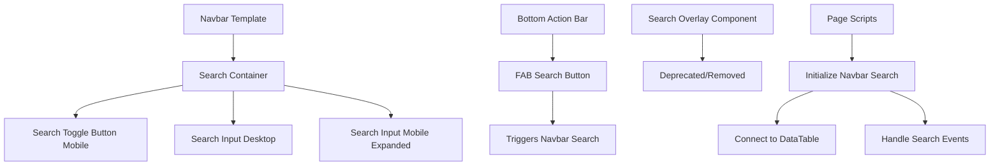

# Search Box Navbar Integration Plan

## Problem Statement

The current search overlay implementation uses a bottom slide-up popover that doesn't stick well to the top of the navbar when the mobile keyboard opens. This creates a poor user experience on mobile devices.

**Current Issues:**
- Search overlay positioned at bottom (z-index: 999)
- Slides up from bottom when activated
- Keyboard pushes viewport up, causing positioning issues
- Search box can be hidden or partially obscured by keyboard
- Inconsistent behavior across different mobile devices

## Chosen Solution: Option B - Navbar Integration

Integrate the search input directly into the navbar as an expandable/collapsible component. This provides:
- ✅ Fixed position at top of viewport
- ✅ Always visible above keyboard
- ✅ More traditional, familiar UX pattern
- ✅ Better mobile keyboard handling
- ✅ Consistent behavior across devices

## Technical Architecture

### 1. Navbar Structure Changes

#### Current Navbar Layout
```
┌─────────────────────────────────────────────────┐
│ [☰] Exercise Database    [🌙] [👤]              │
└─────────────────────────────────────────────────┘
```

#### New Navbar Layout (Desktop)
```
┌─────────────────────────────────────────────────┐
│ [☰] Exercise Database [🔍 Search...] [🌙] [👤] │
└─────────────────────────────────────────────────┘
```

#### New Navbar Layout (Mobile - Collapsed)
```
┌─────────────────────────────────────────────────┐
│ [☰] Exercise DB    [🔍] [🌙] [👤]               │
└─────────────────────────────────────────────────┘
```

#### New Navbar Layout (Mobile - Expanded)
```
┌─────────────────────────────────────────────────┐
│ [🔍 Search exercises...              ] [✕]      │
└─────────────────────────────────────────────────┘
```

### 2. Component Architecture



### 3. Responsive Behavior

#### Desktop (≥1200px)
- Search input always visible in navbar
- Width: 300-400px
- Positioned between page title and utility icons
- Standard input styling with search icon

#### Tablet (768px - 1199px)
- Search input visible but narrower (200-250px)
- May show icon-only on smaller tablets
- Expands on focus

#### Mobile (<768px)
- Search shows as icon button only
- Clicking icon expands search to full width
- Hides other navbar elements when expanded
- Close button (X) to collapse back
- Keyboard-friendly positioning

### 4. Mobile Keyboard Handling

**Key Features:**
1. **Fixed Positioning**: Navbar stays at top using `position: fixed; top: 0;`
2. **Viewport Units**: Use `vh` units carefully, prefer `px` for navbar height
3. **Input Focus Management**: 
   - Prevent viewport zoom: `font-size: 16px` minimum
   - Use `autocomplete="off"` to prevent autofill dropdown
4. **Scroll Lock**: Lock body scroll when search is active on mobile
5. **Safe Area Insets**: Account for notches/home indicators

## Implementation Plan

### Phase 1: Navbar Template Updates

**Files to Modify:**
- [`frontend/assets/js/components/navbar-template.js`](frontend/assets/js/components/navbar-template.js)

**Changes:**
1. Add search container to navbar HTML
2. Create responsive search input structure
3. Add mobile expand/collapse functionality
4. Update navbar layout to accommodate search

### Phase 2: CSS Styling

**Files to Modify:**
- [`frontend/assets/css/navbar-custom.css`](frontend/assets/css/navbar-custom.css)

**New Styles:**
1. Search container positioning
2. Responsive breakpoints for search visibility
3. Mobile expanded state styles
4. Keyboard-friendly input styling
5. Animation transitions for expand/collapse

### Phase 3: JavaScript Integration

**Files to Modify:**
- [`frontend/assets/js/components/navbar-template.js`](frontend/assets/js/components/navbar-template.js)
- [`frontend/assets/js/dashboard/exercises.js`](frontend/assets/js/dashboard/exercises.js)

**New Functionality:**
1. Search toggle handler for mobile
2. Search input event listeners
3. Integration with existing search logic
4. Debounced search implementation
5. Results count display

### Phase 4: Bottom Action Bar Integration

**Files to Modify:**
- [`frontend/assets/js/config/bottom-action-bar-config.js`](frontend/assets/js/config/bottom-action-bar-config.js)

**Changes:**
1. Update FAB search button action
2. Trigger navbar search expansion on mobile
3. Maintain consistent behavior across pages

### Phase 5: Cleanup

**Files to Remove/Deprecate:**
- [`frontend/assets/js/components/search-overlay.js`](frontend/assets/js/components/search-overlay.js) - Deprecate
- [`frontend/assets/css/components/search-overlay.css`](frontend/assets/css/components/search-overlay.css) - Deprecate

**Files to Update:**
- Remove search overlay imports from HTML pages
- Update component documentation

## Detailed Implementation Specifications

### 1. Navbar HTML Structure

```html
<nav class="layout-navbar navbar navbar-expand-xl align-items-center bg-navbar-theme" id="layout-navbar">
    <div class="container-xxl">
        <!-- Left Section: Hamburger + Page Title (hidden when search expanded on mobile) -->
        <div class="navbar-nav-left d-flex align-items-center flex-grow-1" id="navbarLeft">
            <a class="nav-item nav-link px-0 me-3 me-xl-4 layout-menu-toggle" href="javascript:void(0)">
                <i class="bx bx-menu bx-sm"></i>
            </a>
            <div class="d-flex align-items-center">
                <i class="bx ${pageIcon} me-2 text-primary"></i>
                <h5 class="mb-0 fw-semibold">${pageTitle}</h5>
            </div>
        </div>
        
        <!-- Center Section: Search (responsive) -->
        <div class="navbar-search-container" id="navbarSearchContainer">
            <!-- Desktop Search (always visible) -->
            <div class="navbar-search-desktop d-none d-md-flex">
                <div class="search-input-wrapper">
                    <i class="bx bx-search search-icon"></i>
                    <input
                        type="text"
                        id="navbarSearchInput"
                        class="form-control navbar-search-input"
                        placeholder="Search..."
                        autocomplete="off"
                        autocapitalize="off"
                        spellcheck="false"
                    />
                    <button class="btn-close search-clear d-none" id="navbarSearchClear"></button>
                </div>
                <div class="search-results-count" id="navbarSearchCount"></div>
            </div>
            
            <!-- Mobile Search Toggle (collapsed state) -->
            <button class="navbar-search-toggle d-md-none" id="navbarSearchToggle" title="Search">
                <i class="bx bx-search"></i>
            </button>
            
            <!-- Mobile Search (expanded state) -->
            <div class="navbar-search-mobile d-md-none" id="navbarSearchMobile">
                <div class="search-input-wrapper">
                    <i class="bx bx-search search-icon"></i>
                    <input
                        type="text"
                        id="navbarSearchInputMobile"
                        class="form-control navbar-search-input"
                        placeholder="Search..."
                        autocomplete="off"
                        autocapitalize="off"
                        spellcheck="false"
                    />
                </div>
                <button class="navbar-search-close" id="navbarSearchClose">
                    <i class="bx bx-x"></i>
                </button>
                <div class="search-results-count" id="navbarSearchCountMobile"></div>
            </div>
        </div>
        
        <!-- Right Section: Utility Icons (hidden when search expanded on mobile) -->
        <ul class="navbar-nav flex-row align-items-center ms-auto" id="navbarRight">
            <!-- Dark Mode Toggle -->
            <li class="nav-item me-2 me-xl-3">
                <a class="nav-link style-switcher-toggle hide-arrow" href="javascript:void(0);" id="navbarDarkModeToggle">
                    <i class="bx bx-sm" id="navbarThemeIcon"></i>
                </a>
            </li>
            
            <!-- User Profile -->
            <li class="nav-item navbar-dropdown dropdown-user dropdown">
                <!-- User dropdown content -->
            </li>
        </ul>
    </div>
</nav>
```

### 2. CSS Specifications

```css
/* ============================================
   NAVBAR SEARCH CONTAINER
   ============================================ */

.navbar-search-container {
    display: flex;
    align-items: center;
    margin: 0 1rem;
    flex: 0 1 auto;
}

/* ============================================
   DESKTOP SEARCH (Always Visible)
   ============================================ */

.navbar-search-desktop {
    display: flex;
    flex-direction: column;
    gap: 0.25rem;
    width: 350px;
    max-width: 350px;
}

.navbar-search-desktop .search-input-wrapper {
    display: flex;
    align-items: center;
    gap: 0.5rem;
    background: var(--bs-body-bg);
    border: 1px solid var(--bs-border-color);
    border-radius: var(--bs-border-radius);
    padding: 0.375rem 0.75rem;
    transition: all 0.2s ease;
}

.navbar-search-desktop .search-input-wrapper:focus-within {
    border-color: var(--bs-primary);
    box-shadow: 0 0 0 0.2rem rgba(var(--bs-primary-rgb), 0.25);
}

.navbar-search-input {
    flex: 1;
    border: none;
    background: transparent;
    font-size: 16px; /* Prevent zoom on iOS */
    padding: 0;
    outline: none;
    color: var(--bs-body-color);
}

.navbar-search-input::placeholder {
    color: var(--bs-secondary);
    opacity: 0.7;
}

.search-icon {
    font-size: 1.25rem;
    color: var(--bs-secondary);
    flex-shrink: 0;
}

.search-clear {
    opacity: 0.6;
    transition: opacity 0.2s ease;
    padding: 0.25rem;
}

.search-clear:hover {
    opacity: 1;
}

.search-results-count {
    font-size: 0.75rem;
    color: var(--bs-secondary);
    text-align: center;
    min-height: 1rem;
}

/* ============================================
   MOBILE SEARCH TOGGLE (Icon Button)
   ============================================ */

.navbar-search-toggle {
    display: flex;
    align-items: center;
    justify-content: center;
    width: 36px;
    height: 36px;
    border: none;
    background: transparent;
    border-radius: 0.375rem;
    color: var(--bs-body-color);
    cursor: pointer;
    transition: all 0.2s ease;
}

.navbar-search-toggle:hover {
    background: rgba(67, 89, 113, 0.04);
}

.navbar-search-toggle i {
    font-size: 1.5rem;
}

/* ============================================
   MOBILE SEARCH (Expanded State)
   ============================================ */

.navbar-search-mobile {
    position: fixed;
    top: 0;
    left: 0;
    right: 0;
    background: var(--bs-body-bg);
    border-bottom: 1px solid var(--bs-border-color);
    padding: 0.75rem 1rem;
    z-index: 1050;
    display: none;
    flex-direction: column;
    gap: 0.5rem;
    box-shadow: 0 2px 8px rgba(0, 0, 0, 0.1);
}

.navbar-search-mobile.active {
    display: flex;
}

.navbar-search-mobile .search-input-wrapper {
    display: flex;
    align-items: center;
    gap: 0.5rem;
    background: var(--bs-body-bg);
    border: 2px solid var(--bs-border-color);
    border-radius: var(--bs-border-radius-lg);
    padding: 0.5rem 0.75rem;
    flex: 1;
}

.navbar-search-mobile .search-input-wrapper:focus-within {
    border-color: var(--bs-primary);
}

.navbar-search-close {
    position: absolute;
    top: 50%;
    right: 1rem;
    transform: translateY(-50%);
    width: 32px;
    height: 32px;
    display: flex;
    align-items: center;
    justify-content: center;
    border: none;
    background: transparent;
    border-radius: 50%;
    color: var(--bs-body-color);
    cursor: pointer;
    transition: all 0.2s ease;
}

.navbar-search-close:hover {
    background: rgba(67, 89, 113, 0.08);
}

.navbar-search-close i {
    font-size: 1.5rem;
}

/* Hide navbar elements when mobile search is active */
body.mobile-search-active #navbarLeft,
body.mobile-search-active #navbarRight {
    display: none !important;
}

body.mobile-search-active .layout-navbar {
    height: auto;
    min-height: 56px;
}

/* ============================================
   RESPONSIVE BREAKPOINTS
   ============================================ */

/* Tablet */
@media (min-width: 768px) and (max-width: 1199px) {
    .navbar-search-desktop {
        width: 250px;
        max-width: 250px;
    }
}

/* Small tablet */
@media (min-width: 768px) and (max-width: 991px) {
    .navbar-search-desktop {
        width: 200px;
        max-width: 200px;
    }
}

/* Mobile adjustments */
@media (max-width: 767.98px) {
    .navbar-search-container {
        margin: 0 0.5rem;
    }
    
    .navbar-search-mobile {
        padding: 0.5rem 1rem;
    }
    
    .navbar-search-mobile .search-results-count {
        font-size: 0.7rem;
    }
}

/* ============================================
   DARK MODE
   ============================================ */

[data-theme="dark"] .navbar-search-mobile {
    box-shadow: 0 2px 8px rgba(0, 0, 0, 0.3);
}

[data-theme="dark"] .navbar-search-toggle:hover {
    background: rgba(255, 255, 255, 0.05);
}

[data-theme="dark"] .navbar-search-close:hover {
    background: rgba(255, 255, 255, 0.08);
}

/* ============================================
   ACCESSIBILITY
   ============================================ */

.navbar-search-toggle:focus-visible,
.navbar-search-close:focus-visible {
    outline: 2px solid var(--bs-primary);
    outline-offset: 2px;
}

/* Reduced motion */
@media (prefers-reduced-motion: reduce) {
    .navbar-search-desktop .search-input-wrapper,
    .navbar-search-toggle,
    .navbar-search-close,
    .search-clear {
        transition: none;
    }
}
```

### 3. JavaScript Implementation

```javascript
/**
 * Initialize Navbar Search
 * Handles both desktop and mobile search functionality
 */
function initializeNavbarSearch() {
    console.log('🔍 Initializing navbar search...');
    
    const searchToggle = document.getElementById('navbarSearchToggle');
    const searchMobile = document.getElementById('navbarSearchMobile');
    const searchClose = document.getElementById('navbarSearchClose');
    const searchInputDesktop = document.getElementById('navbarSearchInput');
    const searchInputMobile = document.getElementById('navbarSearchInputMobile');
    const searchClear = document.getElementById('navbarSearchClear');
    const searchCountDesktop = document.getElementById('navbarSearchCount');
    const searchCountMobile = document.getElementById('navbarSearchCountMobile');
    
    let searchTimeout = null;
    
    // Mobile: Toggle search expansion
    if (searchToggle && searchMobile) {
        searchToggle.addEventListener('click', () => {
            searchMobile.classList.add('active');
            document.body.classList.add('mobile-search-active');
            
            // Focus input after animation
            setTimeout(() => {
                searchInputMobile?.focus();
            }, 100);
            
            console.log('📱 Mobile search expanded');
        });
    }
    
    // Mobile: Close search
    if (searchClose && searchMobile) {
        searchClose.addEventListener('click', () => {
            searchMobile.classList.remove('active');
            document.body.classList.remove('mobile-search-active');
            
            // Clear search if empty
            if (searchInputMobile && !searchInputMobile.value.trim()) {
                performSearch('');
            }
            
            console.log('📱 Mobile search collapsed');
        });
    }
    
    // Desktop: Search input handler
    if (searchInputDesktop) {
        searchInputDesktop.addEventListener('input', (e) => {
            handleSearchInput(e.target.value, searchCountDesktop, searchClear);
        });
        
        // ESC to clear
        searchInputDesktop.addEventListener('keydown', (e) => {
            if (e.key === 'Escape') {
                searchInputDesktop.value = '';
                performSearch('');
                updateSearchCount('', searchCountDesktop);
                searchClear?.classList.add('d-none');
            }
        });
    }
    
    // Mobile: Search input handler
    if (searchInputMobile) {
        searchInputMobile.addEventListener('input', (e) => {
            handleSearchInput(e.target.value, searchCountMobile, null);
            
            // Sync with desktop input
            if (searchInputDesktop) {
                searchInputDesktop.value = e.target.value;
            }
        });
        
        // ESC to close
        searchInputMobile.addEventListener('keydown', (e) => {
            if (e.key === 'Escape') {
                searchClose?.click();
            }
        });
    }
    
    // Clear button handler
    if (searchClear) {
        searchClear.addEventListener('click', () => {
            if (searchInputDesktop) {
                searchInputDesktop.value = '';
                searchInputDesktop.focus();
            }
            if (searchInputMobile) {
                searchInputMobile.value = '';
            }
            performSearch('');
            updateSearchCount('', searchCountDesktop);
            searchClear.classList.add('d-none');
        });
    }
    
    /**
     * Handle search input with debouncing
     */
    function handleSearchInput(value, countElement, clearButton) {
        clearTimeout(searchTimeout);
        
        // Show/hide clear button
        if (clearButton) {
            if (value.trim()) {
                clearButton.classList.remove('d-none');
            } else {
                clearButton.classList.add('d-none');
            }
        }
        
        // Update count immediately
        updateSearchCount(value, countElement);
        
        // Debounce actual search
        searchTimeout = setTimeout(() => {
            performSearch(value.trim());
        }, 300);
    }
    
    /**
     * Perform search (integrates with existing search logic)
     */
    function performSearch(searchTerm) {
        console.log('🔍 Searching:', searchTerm);
        
        // Call existing search function if available
        if (window.applyFiltersAndRender) {
            const currentFilters = window.filterBar?.getFilters() || {};
            currentFilters.search = searchTerm;
            window.applyFiltersAndRender(currentFilters);
        }
    }
    
    /**
     * Update search results count
     */
    function updateSearchCount(searchTerm, countElement) {
        if (!countElement) return;
        
        if (!searchTerm) {
            countElement.textContent = '';
            return;
        }
        
        // Get count from data table or filter bar
        let count = 0;
        let total = 0;
        
        if (window.dataTable) {
            const filteredData = window.dataTable.getFilteredData();
            count = filteredData.length;
            total = window.dataTable.data?.length || 0;
        }
        
        countElement.textContent = `${count} of ${total} results`;
    }
    
    console.log('✅ Navbar search initialized');
}

// Make globally available
window.initializeNavbarSearch = initializeNavbarSearch;
```

### 4. Bottom Action Bar Integration

Update the FAB search button to trigger navbar search:

```javascript
// In bottom-action-bar-config.js
'exercise-database': {
    // ... other config
    fab: {
        icon: 'bx-search',
        title: 'Search exercises',
        variant: 'primary',
        action: function() {
            // On mobile, expand navbar search
            if (window.innerWidth < 768) {
                const searchToggle = document.getElementById('navbarSearchToggle');
                if (searchToggle) {
                    searchToggle.click();
                }
            } else {
                // On desktop, focus navbar search input
                const searchInput = document.getElementById('navbarSearchInput');
                if (searchInput) {
                    searchInput.focus();
                }
            }
        }
    },
    // ... other config
}
```

## Migration Strategy

### Step 1: Add New Navbar Search (Non-Breaking)
- Add search HTML to navbar template
- Add CSS for navbar search
- Keep existing search overlay functional
- Test navbar search in parallel

### Step 2: Update Page Integration
- Update exercise-database.html to use navbar search
- Update workout-database.html to use navbar search
- Connect navbar search to existing search logic
- Test thoroughly on mobile devices

### Step 3: Update Bottom Action Bar
- Modify FAB search button to trigger navbar search
- Test interaction between FAB and navbar search
- Ensure consistent behavior

### Step 4: Deprecate Search Overlay
- Remove search overlay component imports
- Mark search-overlay.js as deprecated
- Update documentation
- Keep files for reference but don't load them

### Step 5: Testing & Refinement
- Test on various mobile devices
- Test keyboard behavior (iOS Safari, Chrome, Firefox)
- Test with different screen sizes
- Verify accessibility (keyboard navigation, screen readers)
- Performance testing

## Testing Checklist

### Desktop Testing
- [ ] Search input visible and functional
- [ ] Search results update correctly
- [ ] Clear button works
- [ ] ESC key clears search
- [ ] Results count displays correctly
- [ ] Dark mode styling correct
- [ ] Keyboard navigation works

### Mobile Testing (iOS)
- [ ] Search toggle button visible
- [ ] Search expands to full width
- [ ] Keyboard doesn't obscure input
- [ ] No viewport zoom on focus
- [ ] Close button works
- [ ] Search persists during keyboard open/close
- [ ] Safe area insets respected

### Mobile Testing (Android)
- [ ] Search toggle button visible
- [ ] Search expands correctly
- [ ] Keyboard behavior correct
- [ ] Back button closes search
- [ ] Performance acceptable

### Integration Testing
- [ ] FAB button triggers navbar search
- [ ] Search syncs between desktop/mobile inputs
- [ ] Search integrates with existing filters
- [ ] Results update in data table
- [ ] Page navigation preserves search state

### Accessibility Testing
- [ ] Keyboard navigation works
- [ ] Screen reader announces search
- [ ] Focus management correct
- [ ] ARIA labels present
- [ ] Color contrast sufficient

## Benefits of This Approach

1. **Better Mobile UX**: Fixed position at top ensures search is always accessible
2. **Keyboard Friendly**: Input stays visible above keyboard
3. **Familiar Pattern**: Users expect search in navbar
4. **Consistent Behavior**: Works same way across all devices
5. **Maintainable**: Single search implementation instead of separate overlay
6. **Accessible**: Better keyboard and screen reader support
7. **Performance**: No additional overlay component to manage

## Potential Challenges & Solutions

### Challenge 1: Navbar Height on Mobile
**Solution**: Use fixed pixel height, not viewport units. Test with various keyboards.

### Challenge 2: Search State Management
**Solution**: Sync desktop and mobile inputs. Use single source of truth for search term.

### Challenge 3: Animation Performance
**Solution**: Use CSS transforms for animations. Avoid layout thrashing.

### Challenge 4: Existing Code Integration
**Solution**: Maintain backward compatibility. Gradually migrate pages.

## Next Steps

1. Review and approve this plan
2. Create detailed mockups/wireframes if needed
3. Begin Phase 1 implementation
4. Test on actual mobile devices
5. Iterate based on feedback

## Questions for Review

1. Should search be available on all pages or just exercise/workout database?
2. Do you want search history/suggestions feature?
3. Should we add voice search capability?
4. Any specific mobile devices we should prioritize for testing?
5. Do you want search to be persistent across page navigation?