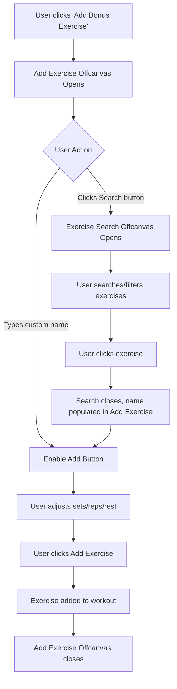

# Two-Offcanvas Exercise Search Implementation Plan

## Overview
Redesign the bonus exercise addition workflow to use two separate offcanvas components:
1. **Add Exercise Offcanvas** - Primary form for exercise details (name, sets, reps, rest)
2. **Exercise Search Offcanvas** - Dedicated search interface with filters and results

## Current Architecture Analysis

### Current Implementation (Single Offcanvas)
The current `createBonusExercise` method in [`unified-offcanvas-factory.js`](frontend/assets/js/components/unified-offcanvas-factory.js:615-1414) combines:
- Exercise name input with inline search
- Sets/Reps/Rest fields
- Filter accordion (collapsed by default)
- Exercise library list with pagination
- Add Exercise button

**Issues:**
- Search functionality is buried in the exercise name field
- Filters are hidden in an accordion
- Exercise list competes for space with the form
- Not intuitive that typing in name field filters the library

## New Architecture Design

### 1. Add Exercise Offcanvas (Primary)
**Purpose:** Simple form to add an exercise with all its parameters

**Layout:**
```
┌─────────────────────────────────────┐
│ Add Exercise                    [X] │
├─────────────────────────────────────┤
│                                     │
│ Exercise Name                       │
│ ┌─────────────────────┬──────────┐ │
│ │ [Exercise Name...  ]│ [Search] │ │
│ └─────────────────────┴──────────┘ │
│                                     │
│ Sets        Reps        Rest        │
│ [3]         [12]        [60s]       │
│                                     │
│ ┌─────────────────────────────────┐ │
│ │      [Add Exercise]             │ │
│ └─────────────────────────────────┘ │
└─────────────────────────────────────┘
```

**Features:**
- Exercise name is a regular text input (no search icon)
- Search button next to name field opens Exercise Search Offcanvas
- Sets, Reps, Rest fields remain editable
- Add Exercise button (disabled until name is filled)
- When exercise selected from search, name field is populated and linked

### 2. Exercise Search Offcanvas (Secondary)
**Purpose:** Full-featured exercise search and selection interface

**Layout:**
```
┌─────────────────────────────────────┐
│ Search Exercises                [X] │
├─────────────────────────────────────┤
│ ┌─────────────────────────────────┐ │
│ │ [🔍 Search exercises...]        │ │
│ └─────────────────────────────────┘ │
│                                     │
│ [Filters ▼]                         │
│ ┌─────────────────────────────────┐ │
│ │ Muscle Group: [All ▼]           │ │
│ │ Difficulty: [All ▼]             │ │
│ │ Equipment: [All ▼]              │ │
│ │ ☐ Favorites Only                │ │
│ └─────────────────────────────────┘ │
│                                     │
│ ─── Exercise Library ───            │
│                                     │
│ ┌─────────────────────────────────┐ │
│ │ Bench Press                     │ │
│ │ ⭐ Standard • Intermediate      │ │
│ │ Chest • Barbell          [Add] │ │
│ ├─────────────────────────────────┤ │
│ │ Squat                           │ │
│ │ ⭐ Standard • Intermediate      │ │
│ │ Legs • Barbell           [Add] │ │
│ └─────────────────────────────────┘ │
│                                     │
│ [< Prev] Page 1 of 10 [Next >]     │
└─────────────────────────────────────┘
```

**Features:**
- Prominent search box at top
- Expandable filters section (visible by default)
- Scrollable exercise list
- Pagination controls
- Clicking "Add" on any exercise:
  1. Closes search offcanvas
  2. Populates name in Add Exercise offcanvas
  3. Links exercise to database
  4. User can then adjust sets/reps/rest and add

## Implementation Steps

### Step 1: Create Exercise Search Offcanvas Method
**File:** [`frontend/assets/js/components/unified-offcanvas-factory.js`](frontend/assets/js/components/unified-offcanvas-factory.js)

Add new method `createExerciseSearchOffcanvas`:
```javascript
static createExerciseSearchOffcanvas(config, onSelectExercise) {
    // Similar to current bonus exercise search section
    // But focused ONLY on search and selection
    // No sets/reps/rest fields
    // Clicking exercise calls onSelectExercise(exerciseData)
}
```

**Key differences from current implementation:**
- No form fields (sets/reps/rest)
- No "Add Exercise" button in form section
- Exercise cards have "Select" button instead of "Add"
- Filters are visible by default (not accordion)
- Larger search box, more prominent

### Step 2: Modify Add Exercise Offcanvas
**File:** [`frontend/assets/js/components/unified-offcanvas-factory.js`](frontend/assets/js/components/unified-offcanvas-factory.js:615)

Modify `createBonusExercise` method:
```javascript
static createBonusExercise(data, onAddExercise) {
    // Remove: Exercise library section
    // Remove: Filter accordion
    // Remove: Search functionality from name input
    // Add: Search button next to name field
    // Keep: Sets/Reps/Rest fields
    // Keep: Add Exercise button
}
```

**New HTML structure:**
```html
<div class="add-exercise-section p-3 border-bottom bg-light">
    <!-- Exercise Name with Search Button -->
    <div class="mb-3">
        <label class="form-label fw-semibold mb-2">Exercise Name</label>
        <div class="input-group">
            <input type="text" class="form-control" id="exerciseNameInput"
                   placeholder="Enter exercise name"
                   autocomplete="off">
            <button class="btn btn-outline-secondary" type="button" id="searchExerciseBtn">
                <i class="bx bx-search"></i> Search
            </button>
        </div>
        <small class="text-muted">Enter custom name or search library</small>
    </div>
    
    <!-- Sets, Reps, Rest Row -->
    <div class="row g-2 mb-3">
        <div class="col-4">
            <label class="form-label small mb-1">Sets</label>
            <input type="text" class="form-control" id="setsInput" value="3">
        </div>
        <div class="col-4">
            <label class="form-label small mb-1">Reps</label>
            <input type="text" class="form-control" id="repsInput" value="12">
        </div>
        <div class="col-4">
            <label class="form-label small mb-1">Rest</label>
            <input type="text" class="form-control" id="restInput" value="60s">
        </div>
    </div>
    
    <!-- Add Exercise Button -->
    <button class="btn btn-primary w-100" id="addExerciseBtn" disabled>
        <i class="bx bx-plus-circle me-2"></i>Add Exercise
    </button>
</div>
```

### Step 3: Update Workout Mode Controller
**File:** [`frontend/assets/js/controllers/workout-mode-controller.js`](frontend/assets/js/controllers/workout-mode-controller.js:1124)

Modify `showBonusExerciseModal` method:
```javascript
async showBonusExerciseModal() {
    try {
        // Create Add Exercise offcanvas
        const addExerciseOffcanvas = window.UnifiedOffcanvasFactory.createBonusExercise(
            {},
            async (data) => {
                // Handle adding exercise (existing logic)
                this.sessionService.addBonusExercise({
                    name: data.name,
                    sets: data.sets || '3',
                    reps: data.reps || '12',
                    weight: data.weight || '',
                    weight_unit: data.unit || 'lbs',
                    rest: data.rest || '60s'
                });
                this.renderWorkout();
                
                const message = !this.sessionService.isSessionActive()
                    ? `${data.name} added! It will be included when you start the workout. 💪`
                    : `${data.name} added to your workout! 💪`;
                if (window.showAlert) window.showAlert(message, 'success');
            },
            // NEW: Callback for search button
            () => {
                // Open Exercise Search offcanvas
                this.showExerciseSearchOffcanvas(addExerciseOffcanvas);
            }
        );
    } catch (error) {
        console.error('❌ Error showing bonus exercise modal:', error);
    }
}

// NEW METHOD
showExerciseSearchOffcanvas(parentOffcanvas) {
    window.UnifiedOffcanvasFactory.createExerciseSearchOffcanvas(
        {},
        (selectedExercise) => {
            // Exercise selected from search
            // Populate name field in parent offcanvas
            const nameInput = document.getElementById('exerciseNameInput');
            if (nameInput) {
                nameInput.value = selectedExercise.name;
                nameInput.dispatchEvent(new Event('input')); // Trigger validation
            }
            
            // Store exercise ID for linking
            parentOffcanvas.selectedExerciseId = selectedExercise.id;
            
            // Close search offcanvas (parent stays open)
            // User can now adjust sets/reps/rest and click Add
        }
    );
}
```

### Step 4: Update Session Service
**File:** [`frontend/assets/js/services/workout-session-service.js`](frontend/assets/js/services/workout-session-service.js:500)

No changes needed - `addBonusExercise` already handles the data correctly.

### Step 5: CSS Updates
**File:** [`frontend/assets/css/components/bonus-exercise-search.css`](frontend/assets/css/components/bonus-exercise-search.css)

Split into two sections:
```css
/* ============================================
   ADD EXERCISE OFFCANVAS (Primary)
   ============================================ */
.add-exercise-section {
  background-color: var(--bs-gray-100);
  /* Simplified - no library section */
}

.add-exercise-section #searchExerciseBtn {
  white-space: nowrap;
  min-width: 90px;
}

/* ============================================
   EXERCISE SEARCH OFFCANVAS (Secondary)
   ============================================ */
.exercise-search-offcanvas .search-section {
  padding: 1.25rem;
  background-color: var(--bs-gray-100);
}

.exercise-search-offcanvas .filters-section {
  padding: 1rem;
  border-bottom: 1px solid var(--bs-border-color);
}

.exercise-search-offcanvas .exercise-list {
  flex: 1;
  overflow-y: auto;
  padding: 0.75rem;
}
```

## User Flow Diagram



## Benefits of Two-Offcanvas Approach

1. **Clearer UX**: Separation of concerns - adding vs searching
2. **More Space**: Search offcanvas can use full height for results
3. **Better Discoverability**: Search button makes it obvious how to find exercises
4. **Flexibility**: User can type custom name OR search library
5. **Consistent Pattern**: Matches common UI patterns (e.g., contact pickers)
6. **Maintains Context**: Add Exercise stays open while searching
7. **Progressive Disclosure**: Simple form first, advanced search when needed

## Testing Checklist

- [ ] Open Add Exercise offcanvas
- [ ] Type custom exercise name → Add button enables
- [ ] Click Add with custom name → Exercise added correctly
- [ ] Click Search button → Search offcanvas opens
- [ ] Search for exercise → Results filter correctly
- [ ] Apply filters → Results update
- [ ] Click exercise in search → Name populates in Add Exercise
- [ ] Adjust sets/reps/rest → Values update
- [ ] Click Add → Exercise added with correct data
- [ ] Exercise links to database correctly
- [ ] Works before workout starts (pre-workout list)
- [ ] Works during active workout (session list)
- [ ] Mobile responsive on both offcanvas
- [ ] Dark mode works correctly
- [ ] Keyboard navigation works
- [ ] Screen reader accessible

## Files to Modify

1. **[`frontend/assets/js/components/unified-offcanvas-factory.js`](frontend/assets/js/components/unified-offcanvas-factory.js)**
   - Add `createExerciseSearchOffcanvas` method (~400 lines)
   - Modify `createBonusExercise` method (simplify, remove search)

2. **[`frontend/assets/js/controllers/workout-mode-controller.js`](frontend/assets/js/controllers/workout-mode-controller.js)**
   - Modify `showBonusExerciseModal` method
   - Add `showExerciseSearchOffcanvas` method

3. **[`frontend/assets/css/components/bonus-exercise-search.css`](frontend/assets/css/components/bonus-exercise-search.css)**
   - Split into two sections
   - Add styles for search button
   - Update exercise search offcanvas styles

4. **Documentation**
   - Update this plan with implementation notes
   - Add usage examples

## Implementation Priority

1. **High Priority** (Core functionality)
   - Create Exercise Search Offcanvas method
   - Modify Add Exercise Offcanvas
   - Wire up controller methods
   - Basic CSS updates

2. **Medium Priority** (Polish)
   - Keyboard shortcuts (Esc to close, Enter to select)
   - Loading states
   - Empty states
   - Error handling

3. **Low Priority** (Nice to have)
   - Animation between offcanvas
   - Remember last search/filters
   - Recent exercises quick access
   - Exercise preview on hover

## Notes

- Maintain backward compatibility with existing bonus exercise data
- Ensure auto-create exercise service still works
- Keep exercise cache service integration
- Preserve favorites filtering
- Maintain pagination logic
- Keep all existing accessibility features