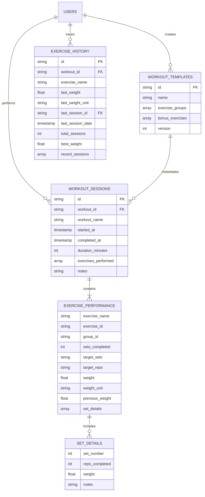
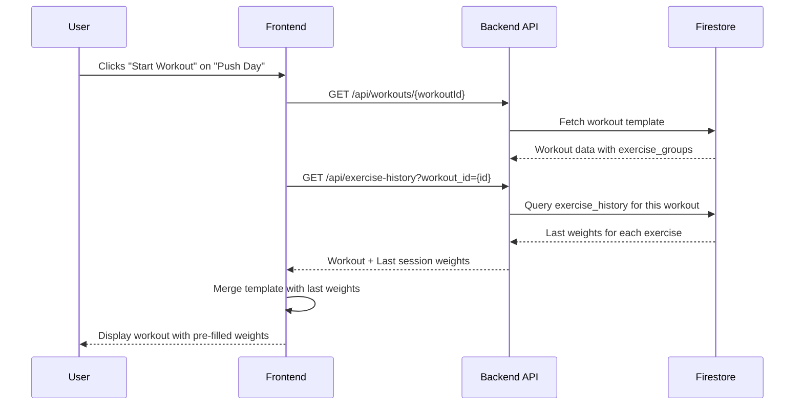
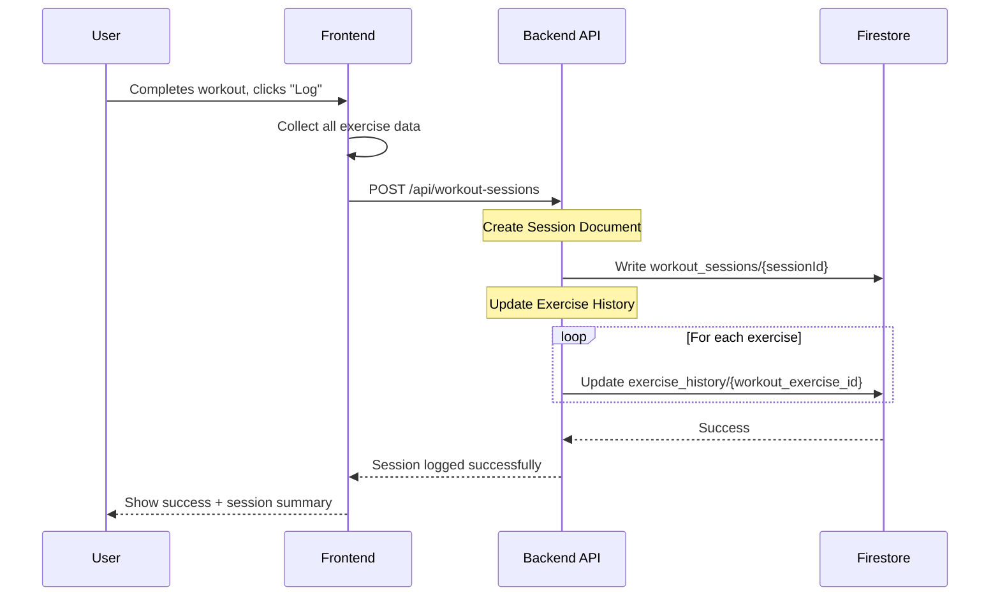
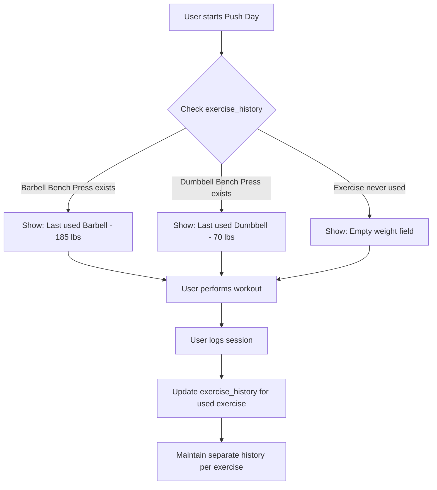
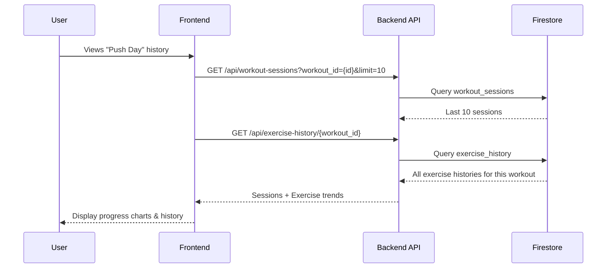

# Weight Logging Database Architecture
**Version:** 1.0  
**Date:** 2025-11-06  
**Status:** Design Phase

## Executive Summary

This document defines the Firestore database architecture for implementing weight logging functionality in the Ghost Gym fitness app. The design supports:

- **Progressive overload tracking**: Automatic weight suggestions based on previous sessions
- **Exercise-specific history**: Weights tied to specific exercises within specific workouts
- **Exercise substitution handling**: Maintains separate history when exercises are swapped
- **Simple logging workflow**: Minimal user interaction during workout, single "Log" button at completion

## Table of Contents

1. [Current State Analysis](#current-state-analysis)
2. [Core Requirements](#core-requirements)
3. [Database Schema Design](#database-schema-design)
4. [Data Flow & Workflows](#data-flow--workflows)
5. [API Endpoints](#api-endpoints)
6. [Migration Strategy](#migration-strategy)
7. [Implementation Phases](#implementation-phases)

---

## Current State Analysis

### Existing Collections

Based on live Firestore inspection (2025-11-06):

```
firestore/
├── global_exercises/          # 100+ exercises with metadata
│   └── {exerciseId}/
│       ├── name: string
│       ├── targetMuscleGroup: string
│       ├── primaryEquipment: string
│       └── ... (41 total fields)
│
└── users/
    └── {userId}/
        ├── workouts/          # 10 workout templates
        │   └── {workoutId}/
        │       ├── id: string
        │       ├── name: string
        │       ├── description: string
        │       ├── exercise_groups: array
        │       ├── bonus_exercises: array
        │       ├── is_template: boolean
        │       ├── version: number
        │       └── sync_status: string
        │
        ├── programs/          # 10 programs
        │   └── {programId}/
        │       ├── name: string
        │       ├── workouts: array
        │       └── ...
        │
        ├── custom_exercises/  # User-created exercises
        └── data/              # User preferences, favorites
```

### Current Workout Template Structure

```typescript
WorkoutTemplate {
  id: "workout-06fad623"
  name: "Legs"
  description: "This is the best leg workout on the planet"
  is_template: true
  version: 19
  exercise_groups: [
    {
      group_id: "group-abc123"
      exercises: {
        a: "Barbell Back Squat",
        b: "Front Squat",        // Alternate 1
        c: "Goblet Squat"         // Alternate 2
      }
      sets: "4"
      reps: "8-12"
      rest: "90s"
      notes: "Focus on depth"
    }
  ]
  bonus_exercises: [
    {
      exercise_id: "bonus-xyz"
      name: "Calf Raises"
      sets: "3"
      reps: "15"
      rest: "60s"
    }
  ]
}
```

### Key Findings

✅ **Strengths:**
- Clean workout template structure
- Exercise groups support alternates
- Version tracking exists
- No existing weight logging to conflict with

⚠️ **Gaps for Weight Logging:**
- No workout session tracking (instances of workouts performed)
- No exercise performance history
- No weight/rep/set logging mechanism
- No "last used" weight lookup

---

## Core Requirements

### User Workflow

1. **Start Workout**: User selects "Push Day" workout
2. **Auto-populate Weights**: System shows last session's weights for each exercise
3. **Perform Workout**: User does exercises with pre-filled weights
4. **Make Changes** (if needed): User updates weight when they progress
5. **Log Session**: User hits "Log" button to save the session
6. **View History**: User can see progress over time

### Critical Business Rules

#### Rule 1: Exercise-Workout Context Binding
**Weights are tied to the combination of `workout_id + exercise_name`**

Example:
- "Push Day" (workout-abc) → "Barbell Bench Press" → 185 lbs
- "Chest Day" (workout-xyz) → "Barbell Bench Press" → 205 lbs  
  *(Same exercise, different workout, independent weights)*

#### Rule 2: Exercise Substitution Tracking
**When an exercise changes in a workout template, maintain separate histories**

Scenario:
```
Session 1: Push Day → Barbell Bench Press → 185 lbs
[User edits workout template, changes to Dumbbell Bench Press]
Session 2: Push Day → Dumbbell Bench Press → 70 lbs (per hand)
[User reverts back to Barbell]
Session 3: Push Day → Barbell Bench Press → Should show 185 lbs (last barbell weight)
```

#### Rule 3: Minimal In-Session Interaction
- Users typically keep same weight throughout workout
- Only log changes when making progress
- Single "Log" button at end saves everything
- No per-set tracking required

#### Rule 4: Progressive Overload Support
- System suggests last session's weight + small increment
- Show previous session data for reference
- Track when user increases weight/reps

---

## Database Schema Design

### New Collections

#### 1. Workout Sessions Collection

**Path:** `users/{userId}/workout_sessions/{sessionId}`

Stores each completed workout instance.

```typescript
WorkoutSession {
  // Identity
  id: string                    // "session-20251106-143022-abc123"
  workout_id: string            // Reference to workout template
  workout_name: string          // Denormalized for quick display
  
  // Timing
  started_at: timestamp         // When user clicked "Start Workout"
  completed_at: timestamp       // When user clicked "Log"
  duration_minutes: number      // Auto-calculated
  
  // Session Data
  exercises_performed: array<ExercisePerformance>
  notes: string                 // Optional session notes
  
  // Metadata
  created_at: timestamp
  version: number               // Workout template version at time of session
  sync_status: string           // "synced" | "pending"
}
```

#### 2. Exercise Performance (Embedded in Session)

**Structure:** Embedded array within `WorkoutSession.exercises_performed`

```typescript
ExercisePerformance {
  // Exercise Identity
  exercise_name: string         // "Barbell Bench Press"
  exercise_id: string           // Reference to global_exercises (if applicable)
  group_id: string              // Links to exercise_group in template
  
  // Performance Data
  sets_completed: number        // Actual sets done
  target_sets: string           // From template: "4"
  target_reps: string           // From template: "8-12"
  
  // Weight Tracking
  weight: number                // Primary weight used
  weight_unit: string           // "lbs" | "kg"
  weight_notes: string          // "per hand" for dumbbells, etc.
  
  // Set-by-Set Detail (Optional)
  set_details: array<SetDetail> // Only if user tracks per-set
  
  // Changes from Previous
  previous_weight: number       // For comparison
  weight_change: number         // +5, -10, etc.
  
  // Metadata
  order_index: number           // Position in workout
  is_bonus: boolean             // From bonus_exercises vs exercise_groups
}
```

#### 3. Set Detail (Optional, Embedded)

**Structure:** Embedded array within `ExercisePerformance.set_details`

```typescript
SetDetail {
  set_number: number            // 1, 2, 3, 4
  reps_completed: number        // Actual reps
  weight: number                // Weight for this set (if varied)
  notes: string                 // "Failed on last rep", etc.
}
```

#### 4. Exercise History Index

**Path:** `users/{userId}/exercise_history/{historyId}`

Optimized lookup table for "last used weight" queries.

```typescript
ExerciseHistory {
  // Composite Key
  id: string                    // "{workout_id}_{exercise_name}"
  workout_id: string            // "workout-06fad623"
  exercise_name: string         // "Barbell Bench Press"
  
  // Last Session Data
  last_weight: number           // 185
  last_weight_unit: string      // "lbs"
  last_session_id: string       // Reference to workout_sessions
  last_session_date: timestamp  // 2025-11-01
  
  // Historical Tracking
  total_sessions: number        // How many times performed
  first_session_date: timestamp // When first logged
  best_weight: number           // Personal record
  best_weight_date: timestamp   // When PR was set
  
  // Trend Data
  recent_sessions: array<{      // Last 5 sessions
    session_id: string
    date: timestamp
    weight: number
    sets: number
  }>
  
  // Metadata
  updated_at: timestamp
}
```

### Schema Diagram



### Collection Paths Summary

```
users/{userId}/
├── workouts/{workoutId}                    # Existing: Templates
├── programs/{programId}                    # Existing: Programs
├── workout_sessions/{sessionId}            # NEW: Session logs
└── exercise_history/{workout_exercise_id}  # NEW: Quick lookup index
```

---

## Data Flow & Workflows

### Workflow 1: Starting a Workout



**API Response Example:**
```json
{
  "workout": {
    "id": "workout-06fad623",
    "name": "Push Day",
    "exercise_groups": [...]
  },
  "last_session": {
    "session_id": "session-20251101-140022",
    "date": "2025-11-01T14:00:22Z",
    "exercises": {
      "Barbell Bench Press": {
        "weight": 185,
        "unit": "lbs",
        "sets": 4,
        "reps": "8-10"
      },
      "Incline Dumbbell Press": {
        "weight": 70,
        "unit": "lbs",
        "sets": 3,
        "reps": "10-12"
      }
    }
  }
}
```

### Workflow 2: Logging a Completed Workout



**POST Request Body:**
```json
{
  "workout_id": "workout-06fad623",
  "workout_name": "Push Day",
  "started_at": "2025-11-06T14:00:00Z",
  "completed_at": "2025-11-06T15:15:00Z",
  "exercises_performed": [
    {
      "exercise_name": "Barbell Bench Press",
      "exercise_id": "exercise-abc123",
      "group_id": "group-1",
      "sets_completed": 4,
      "target_sets": "4",
      "target_reps": "8-10",
      "weight": 190,
      "weight_unit": "lbs",
      "previous_weight": 185,
      "weight_change": 5,
      "order_index": 0,
      "is_bonus": false
    }
  ],
  "notes": "Felt strong today!"
}
```

### Workflow 3: Exercise Substitution Handling

**Scenario:** User changes "Barbell Bench Press" to "Dumbbell Bench Press"



**Key Implementation Detail:**
```typescript
// Exercise History ID is composite key
const historyId = `${workout_id}_${exercise_name}`;

// Examples:
// "workout-06fad623_Barbell Bench Press"
// "workout-06fad623_Dumbbell Bench Press"

// These are separate documents, maintaining independent histories
```

### Workflow 4: Viewing Progress History



---

## API Endpoints

### Workout Sessions

#### Create Session
```http
POST /api/v3/workout-sessions
Authorization: Bearer {token}
Content-Type: application/json

{
  "workout_id": "workout-06fad623",
  "workout_name": "Push Day",
  "started_at": "2025-11-06T14:00:00Z",
  "completed_at": "2025-11-06T15:15:00Z",
  "exercises_performed": [...],
  "notes": "Great session!"
}

Response: 201 Created
{
  "session_id": "session-20251106-143022-abc123",
  "workout_id": "workout-06fad623",
  "completed_at": "2025-11-06T15:15:00Z",
  "exercises_count": 6,
  "duration_minutes": 75
}
```

#### Get Session History
```http
GET /api/v3/workout-sessions?workout_id={id}&limit=10&offset=0
Authorization: Bearer {token}

Response: 200 OK
{
  "sessions": [
    {
      "id": "session-20251106-143022",
      "workout_name": "Push Day",
      "completed_at": "2025-11-06T15:15:00Z",
      "duration_minutes": 75,
      "exercises_count": 6
    }
  ],
  "total_count": 45,
  "page": 1,
  "page_size": 10
}
```

#### Get Session Detail
```http
GET /api/v3/workout-sessions/{sessionId}
Authorization: Bearer {token}

Response: 200 OK
{
  "id": "session-20251106-143022",
  "workout_id": "workout-06fad623",
  "workout_name": "Push Day",
  "started_at": "2025-11-06T14:00:00Z",
  "completed_at": "2025-11-06T15:15:00Z",
  "duration_minutes": 75,
  "exercises_performed": [...]
}
```

### Exercise History

#### Get Last Weights for Workout
```http
GET /api/v3/exercise-history/workout/{workoutId}
Authorization: Bearer {token}

Response: 200 OK
{
  "workout_id": "workout-06fad623",
  "workout_name": "Push Day",
  "exercises": {
    "Barbell Bench Press": {
      "last_weight": 185,
      "last_weight_unit": "lbs",
      "last_session_date": "2025-11-01T14:00:00Z",
      "total_sessions": 12,
      "best_weight": 205
    },
    "Incline Dumbbell Press": {
      "last_weight": 70,
      "last_weight_unit": "lbs",
      "last_session_date": "2025-11-01T14:00:00Z",
      "total_sessions": 12,
      "best_weight": 75
    }
  }
}
```

#### Get Exercise Progress
```http
GET /api/v3/exercise-history/{workout_id}/{exercise_name}/progress
Authorization: Bearer {token}

Response: 200 OK
{
  "exercise_name": "Barbell Bench Press",
  "workout_name": "Push Day",
  "total_sessions": 12,
  "first_session_date": "2025-08-15T14:00:00Z",
  "best_weight": 205,
  "best_weight_date": "2025-10-28T14:00:00Z",
  "recent_sessions": [
    {
      "date": "2025-11-01",
      "weight": 185,
      "sets": 4,
      "reps": "8-10"
    },
    {
      "date": "2025-10-28",
      "weight": 205,
      "sets": 4,
      "reps": "6-8"
    }
  ]
}
```

---

## Migration Strategy

### Phase 1: Schema Addition (No Breaking Changes)

**Actions:**
1. Add new collections (`workout_sessions`, `exercise_history`)
2. Deploy backend API endpoints
3. Existing workout templates remain unchanged
4. No data migration required (clean slate)

**Validation:**
- ✅ Existing workouts continue to function
- ✅ New endpoints return empty arrays for users with no sessions
- ✅ Frontend can gracefully handle missing history data

### Phase 2: Frontend Integration

**Actions:**
1. Update workout mode UI to show last weights
2. Add "Log Workout" button and session creation
3. Implement progress history views
4. Add exercise substitution detection

**Rollout Strategy:**
- Feature flag: `ENABLE_WEIGHT_LOGGING`
- Beta test with subset of users
- Monitor Firestore read/write costs
- Gradual rollout to all users

### Phase 3: Optimization

**Actions:**
1. Add composite indexes for common queries
2. Implement caching for exercise history lookups
3. Add batch operations for session logging
4. Optimize Firestore rules

**Required Firestore Indexes:**
```javascript
// Index 1: Query sessions by workout and date
collection: "workout_sessions"
fields: [
  { field: "workout_id", order: "ASCENDING" },
  { field: "completed_at", order: "DESCENDING" }
]

// Index 2: Query exercise history by workout
collection: "exercise_history"
fields: [
  { field: "workout_id", order: "ASCENDING" },
  { field: "last_session_date", order: "DESCENDING" }
]
```

---

## Implementation Phases

### Phase 1: Core Infrastructure (Week 1-2)
- [ ] Create Pydantic models for new collections
- [ ] Implement Firestore service methods
- [ ] Create API endpoints for session CRUD
- [ ] Create API endpoints for exercise history
- [ ] Write unit tests for backend logic
- [ ] Deploy to staging environment

### Phase 2: Frontend Integration (Week 3-4)
- [ ] Update workout mode to fetch last weights
- [ ] Implement session logging UI
- [ ] Add "Log Workout" button and flow
- [ ] Create session history view
- [ ] Add progress charts for exercises
- [ ] Implement exercise substitution detection

### Phase 3: Polish & Optimization (Week 5-6)
- [ ] Add Firestore indexes
- [ ] Implement caching strategy
- [ ] Add error handling and retry logic
- [ ] Performance testing and optimization
- [ ] User acceptance testing
- [ ] Production deployment

### Phase 4: Advanced Features (Future)
- [ ] Set-by-set tracking (optional)
- [ ] Rest timer integration with logging
- [ ] Workout analytics dashboard
- [ ] Export workout history
- [ ] Social sharing of PRs
- [ ] AI-powered weight suggestions

---

## Security & Performance Considerations

### Firestore Security Rules

```javascript
rules_version = '2';
service cloud.firestore {
  match /databases/{database}/documents {
    
    // Workout Sessions - User can only access their own
    match /users/{userId}/workout_sessions/{sessionId} {
      allow read, write: if request.auth != null 
                         && request.auth.uid == userId;
    }
    
    // Exercise History - User can only access their own
    match /users/{userId}/exercise_history/{historyId} {
      allow read, write: if request.auth != null 
                         && request.auth.uid == userId;
    }
    
    // Workout Templates - User can only access their own
    match /users/{userId}/workouts/{workoutId} {
      allow read, write: if request.auth != null 
                         && request.auth.uid == userId;
    }
  }
}
```

### Performance Optimizations

1. **Denormalization**: Store `workout_name` in sessions to avoid joins
2. **Indexing**: Composite indexes on `workout_id + completed_at`
3. **Caching**: Cache exercise history in frontend for session duration
4. **Batch Writes**: Update exercise history in batch with session creation
5. **Pagination**: Limit session history queries to 10-20 results

### Cost Estimation

**Per Workout Session:**
- 1 write to `workout_sessions` (1 write)
- N writes to `exercise_history` (N = number of exercises, typically 6-8)
- Total: ~7-9 writes per session

**Per Workout Start:**
- 1 read from `workouts` (1 read)
- 1 query to `exercise_history` (1 read + N document reads)
- Total: ~7-9 reads per workout start

**Monthly Cost Estimate** (100 users, 12 workouts/month each):
- Writes: 1,200 sessions × 8 writes = 9,600 writes
- Reads: 1,200 sessions × 8 reads = 9,600 reads
- **Cost**: ~$0.50/month (well within free tier)

---

## Appendix

### A. Sample Data Structures

#### Complete Workout Session Document
```json
{
  "id": "session-20251106-143022-abc123",
  "workout_id": "workout-06fad623",
  "workout_name": "Push Day",
  "started_at": "2025-11-06T14:00:00Z",
  "completed_at": "2025-11-06T15:15:00Z",
  "duration_minutes": 75,
  "exercises_performed": [
    {
      "exercise_name": "Barbell Bench Press",
      "exercise_id": "exercise-abc123",
      "group_id": "group-1",
      "sets_completed": 4,
      "target_sets": "4",
      "target_reps": "8-10",
      "weight": 190,
      "weight_unit": "lbs",
      "weight_notes": "",
      "previous_weight": 185,
      "weight_change": 5,
      "set_details": [
        {
          "set_number": 1,
          "reps_completed": 10,
          "weight": 190,
          "notes": ""
        },
        {
          "set_number": 2,
          "reps_completed": 9,
          "weight": 190,
          "notes": ""
        },
        {
          "set_number": 3,
          "reps_completed": 8,
          "weight": 190,
          "notes": ""
        },
        {
          "set_number": 4,
          "reps_completed": 8,
          "weight": 190,
          "notes": "Tough last set"
        }
      ],
      "order_index": 0,
      "is_bonus": false
    },
    {
      "exercise_name": "Incline Dumbbell Press",
      "exercise_id": "exercise-def456",
      "group_id": "group-2",
      "sets_completed": 3,
      "target_sets": "3",
      "target_reps": "10-12",
      "weight": 70,
      "weight_unit": "lbs",
      "weight_notes": "per hand",
      "previous_weight": 70,
      "weight_change": 0,
      "set_details": [],
      "order_index": 1,
      "is_bonus": false
    }
  ],
  "notes": "Great session! Increased bench press weight.",
  "created_at": "2025-11-06T15:15:22Z",
  "version": 19,
  "sync_status": "synced"
}
```

#### Complete Exercise History Document
```json
{
  "id": "workout-06fad623_Barbell Bench Press",
  "workout_id": "workout-06fad623",
  "exercise_name": "Barbell Bench Press",
  "last_weight": 190,
  "last_weight_unit": "lbs",
  "last_session_id": "session-20251106-143022-abc123",
  "last_session_date": "2025-11-06T15:15:00Z",
  "total_sessions": 13,
  "first_session_date": "2025-08-15T14:00:00Z",
  "best_weight": 205,
  "best_weight_date": "2025-10-28T14:30:00Z",
  "recent_sessions": [
    {
      "session_id": "session-20251106-143022",
      "date": "2025-11-06T15:15:00Z",
      "weight": 190,
      "sets": 4
    },
    {
      "session_id": "session-20251101-140022",
      "date": "2025-11-01T14:00:00Z",
      "weight": 185,
      "sets": 4
    },
    {
      "session_id": "session-20251028-143022",
      "date": "2025-10-28T14:30:00Z",
      "weight": 205,
      "sets": 4
    },
    {
      "session_id": "session-20251025-140022",
      "date": "2025-10-25T14:00:00Z",
      "weight": 185,
      "sets": 4
    },
    {
      "session_id": "session-20251021-143022",
      "date": "2025-10-21T14:30:00Z",
      "weight": 185,
      "sets": 4
    }
  ],
  "updated_at": "2025-11-06T15:15:22Z"
}
```

### B. Frontend State Management

```typescript
// Workout Session State
interface WorkoutSessionState {
  workout: WorkoutTemplate;
  startedAt: Date;
  exercises: ExerciseState[];
  isLogging: boolean;
}

interface ExerciseState {
  exerciseName: string;
  exerciseId: string;
  groupId: string;
  targetSets: string;
  targetReps: string;
  currentWeight: number;
  previousWeight: number;
  weightUnit: string;
  setsCompleted: number;
  notes: string;
}

// Actions
const startWorkout = (workoutId: string) => {
  // Fetch workout template
  // Fetch last session weights
  // Initialize session state
};

const updateExerciseWeight = (exerciseName: string, weight: number) => {
  // Update exercise state
  // Mark as modified
};

const logWorkout = async () => {
  // Collect all exercise data
  // POST to /api/workout-sessions
  // Update exercise history
  // Show success message
};
```

### C. Database Queries Reference

```typescript
// Get last weights for a workout
const