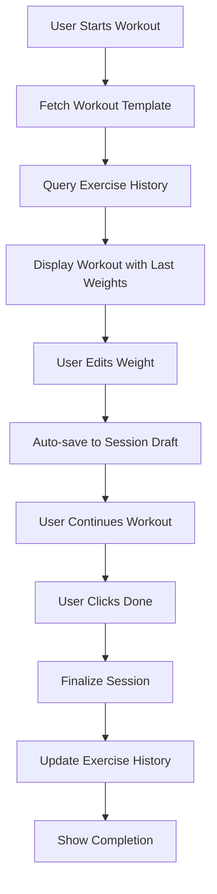

# Weight Logging Implementation Plan
**Version:** 1.0  
**Date:** 2025-11-06  
**Status:** Backend Implementation Phase

## Executive Summary

This document outlines the implementation plan for adding weight logging functionality to Ghost Gym, focusing on **backend-first development** with **Firebase-only storage** (premium feature). The implementation prioritizes simplicity and speed of use during workouts.

## Key Requirements (Refined)

1. **Backend Only First**: Build complete backend infrastructure before frontend
2. **Firebase Only**: Weight logging is a premium feature for authenticated users
3. **Minimal User Interaction**: 
   - Users only enter weight if they want to change it
   - No prompts on every set
   - Edit/Log button approach
4. **Auto-save Strategy**:
   - Save when user edits any exercise metric
   - Final save when user hits "Done/Complete Workout"
5. **Progressive Overload**: Auto-populate last used weights

## Architecture Overview

### Database Collections

```
users/{userId}/
├── workouts/{workoutId}              # Existing: Templates
├── workout_sessions/{sessionId}      # NEW: Completed workout logs
└── exercise_history/{historyId}      # NEW: Quick lookup for last weights
```

### Data Flow



## Implementation Phases

### Phase 1: Pydantic Models (backend/models.py)

Add three new model groups:

#### 1.1 SetDetail Model
```python
class SetDetail(BaseModel):
    """Optional per-set tracking"""
    set_number: int = Field(..., ge=1, description="Set number")
    reps_completed: Optional[int] = Field(None, ge=0)
    weight: Optional[float] = Field(None, ge=0)
    notes: Optional[str] = Field(None, max_length=200)
```

#### 1.2 ExercisePerformance Model
```python
class ExercisePerformance(BaseModel):
    """Exercise performance within a workout session"""
    
    # Exercise Identity
    exercise_name: str = Field(..., description="Name of exercise")
    exercise_id: Optional[str] = Field(None, description="Reference to global_exercises")
    group_id: str = Field(..., description="Links to exercise_group in template")
    
    # Performance Data
    sets_completed: int = Field(default=0, ge=0)
    target_sets: str = Field(default="3")
    target_reps: str = Field(default="8-12")
    
    # Weight Tracking
    weight: Optional[float] = Field(None, ge=0, description="Primary weight used")
    weight_unit: str = Field(default="lbs", description="lbs or kg")
    weight_notes: Optional[str] = Field(None, max_length=100)
    
    # Set-by-Set Detail (Optional)
    set_details: List[SetDetail] = Field(default_factory=list)
    
    # Changes from Previous
    previous_weight: Optional[float] = Field(None)
    weight_change: Optional[float] = Field(None)
    
    # Metadata
    order_index: int = Field(..., ge=0)
    is_bonus: bool = Field(default=False)
```

#### 1.3 WorkoutSession Model
```python
class WorkoutSession(BaseModel):
    """Completed workout session"""
    
    # Identity
    id: str = Field(
        default_factory=lambda: f"session-{datetime.now().strftime('%Y%m%d-%H%M%S')}-{uuid4().hex[:6]}",
        description="Unique session ID"
    )
    workout_id: str = Field(..., description="Reference to workout template")
    workout_name: str = Field(..., description="Denormalized workout name")
    
    # Timing
    started_at: datetime = Field(..., description="When workout started")
    completed_at: Optional[datetime] = Field(None, description="When workout completed")
    duration_minutes: Optional[int] = Field(None, ge=0)
    
    # Session Data
    exercises_performed: List[ExercisePerformance] = Field(default_factory=list)
    notes: Optional[str] = Field(None, max_length=500)
    
    # Status
    status: str = Field(default="in_progress", description="in_progress, completed, abandoned")
    
    # Metadata
    created_at: datetime = Field(default_factory=datetime.now)
    version: int = Field(default=1, description="Workout template version")
    sync_status: str = Field(default="synced")
```

#### 1.4 ExerciseHistory Model
```python
class ExerciseHistory(BaseModel):
    """Quick lookup for last used weights"""
    
    # Composite Key
    id: str = Field(..., description="Format: {workout_id}_{exercise_name}")
    workout_id: str = Field(...)
    exercise_name: str = Field(...)
    
    # Last Session Data
    last_weight: Optional[float] = Field(None)
    last_weight_unit: str = Field(default="lbs")
    last_session_id: Optional[str] = Field(None)
    last_session_date: Optional[datetime] = Field(None)
    
    # Historical Tracking
    total_sessions: int = Field(default=0, ge=0)
    first_session_date: Optional[datetime] = Field(None)
    best_weight: Optional[float] = Field(None)
    best_weight_date: Optional[datetime] = Field(None)
    
    # Recent Sessions (last 5)
    recent_sessions: List[Dict[str, Any]] = Field(default_factory=list, max_items=5)
    
    # Metadata
    updated_at: datetime = Field(default_factory=datetime.now)
```

#### 1.5 Request/Response Models
```python
class CreateSessionRequest(BaseModel):
    """Request to create/start a workout session"""
    workout_id: str = Field(...)
    workout_name: str = Field(...)
    started_at: Optional[datetime] = Field(default_factory=datetime.now)

class UpdateSessionRequest(BaseModel):
    """Request to update session (auto-save)"""
    exercises_performed: Optional[List[ExercisePerformance]] = Field(None)
    notes: Optional[str] = Field(None)
    status: Optional[str] = Field(None)

class CompleteSessionRequest(BaseModel):
    """Request to finalize session"""
    completed_at: Optional[datetime] = Field(default_factory=datetime.now)
    exercises_performed: List[ExercisePerformance] = Field(...)
    notes: Optional[str] = Field(None)

class SessionListResponse(BaseModel):
    """Response for session list"""
    sessions: List[WorkoutSession] = Field(...)
    total_count: int = Field(...)
    page: int = Field(default=1)
    page_size: int = Field(default=20)

class ExerciseHistoryResponse(BaseModel):
    """Response for exercise history lookup"""
    workout_id: str = Field(...)
    workout_name: str = Field(...)
    exercises: Dict[str, ExerciseHistory] = Field(...)
```

### Phase 2: Firestore Service Methods (backend/services/firestore_data_service.py)

Add to `FirestoreDataService` class:

#### 2.1 Session Management Methods

```python
async def create_workout_session(
    self, 
    user_id: str, 
    session_request: CreateSessionRequest
) -> Optional[WorkoutSession]:
    """Create a new workout session (draft state)"""
    
async def get_workout_session(
    self, 
    user_id: str, 
    session_id: str
) -> Optional[WorkoutSession]:
    """Get a specific workout session"""
    
async def update_workout_session(
    self, 
    user_id: str, 
    session_id: str, 
    update_request: UpdateSessionRequest
) -> Optional[WorkoutSession]:
    """Update session (auto-save during workout)"""
    
async def complete_workout_session(
    self, 
    user_id: str, 
    session_id: str, 
    complete_request: CompleteSessionRequest
) -> Optional[WorkoutSession]:
    """Finalize session and update exercise history"""
    
async def get_user_sessions(
    self, 
    user_id: str, 
    workout_id: Optional[str] = None,
    limit: int = 20,
    status: Optional[str] = None
) -> List[WorkoutSession]:
    """Get user's workout sessions with optional filtering"""
    
async def delete_workout_session(
    self, 
    user_id: str, 
    session_id: str
) -> bool:
    """Delete a workout session"""
```

#### 2.2 Exercise History Methods

```python
async def get_exercise_history_for_workout(
    self, 
    user_id: str, 
    workout_id: str
) -> Dict[str, ExerciseHistory]:
    """Get last weights for all exercises in a workout"""
    
async def get_exercise_history(
    self, 
    user_id: str, 
    workout_id: str, 
    exercise_name: str
) -> Optional[ExerciseHistory]:
    """Get history for specific exercise in workout"""
    
async def update_exercise_history(
    self, 
    user_id: str, 
    workout_id: str, 
    exercise_name: str, 
    session_data: Dict[str, Any]
) -> bool:
    """Update exercise history after session completion"""
    
async def _update_exercise_histories_batch(
    self, 
    user_id: str, 
    session: WorkoutSession
) -> bool:
    """Batch update all exercise histories from completed session"""
```

### Phase 3: API Endpoints (backend/api/workout_sessions.py)

Create new router file:

```python
"""
Workout Session Management API
Handles workout session CRUD and exercise history
"""

from fastapi import APIRouter, Depends, HTTPException, Query
from typing import List, Optional
import logging

router = APIRouter(prefix="/api/v3/workout-sessions", tags=["Workout Sessions"])

# Endpoints:

@router.post("/", response_model=WorkoutSession)
async def create_session(...)
    """Start a new workout session"""

@router.get("/{session_id}", response_model=WorkoutSession)
async def get_session(...)
    """Get session details"""

@router.put("/{session_id}", response_model=WorkoutSession)
async def update_session(...)
    """Auto-save session progress"""

@router.post("/{session_id}/complete", response_model=WorkoutSession)
async def complete_session(...)
    """Finalize workout session"""

@router.get("/", response_model=SessionListResponse)
async def list_sessions(...)
    """List user's workout sessions"""

@router.delete("/{session_id}")
async def delete_session(...)
    """Delete a session"""

# Exercise History Endpoints

@router.get("/history/workout/{workout_id}", response_model=ExerciseHistoryResponse)
async def get_workout_history(...)
    """Get last weights for all exercises in workout"""

@router.get("/history/{workout_id}/{exercise_name}", response_model=ExerciseHistory)
async def get_exercise_history(...)
    """Get history for specific exercise"""
```

### Phase 4: Firestore Security Rules

Add to `firestore.rules`:

```javascript
// Workout Sessions - User can only access their own
match /users/{userId}/workout_sessions/{sessionId} {
  allow read, write: if request.auth != null 
                     && request.auth.uid == userId;
}

// Exercise History - User can only access their own
match /users/{userId}/exercise_history/{historyId} {
  allow read, write: if request.auth != null 
                     && request.auth.uid == userId;
}
```

### Phase 5: Firestore Indexes

Required composite indexes:

```javascript
// Index 1: Query sessions by workout and date
collection: "workout_sessions"
fields: [
  { field: "workout_id", order: "ASCENDING" },
  { field: "completed_at", order: "DESCENDING" }
]

// Index 2: Query sessions by status
collection: "workout_sessions"
fields: [
  { field: "status", order: "ASCENDING" },
  { field: "started_at", order: "DESCENDING" }
]

// Index 3: Query exercise history by workout
collection: "exercise_history"
fields: [
  { field: "workout_id", order: "ASCENDING" },
  { field: "last_session_date", order: "DESCENDING" }
]
```

## Implementation Checklist

### Backend Development

- [ ] **Step 1**: Add Pydantic models to `backend/models.py`
  - [ ] SetDetail
  - [ ] ExercisePerformance
  - [ ] WorkoutSession
  - [ ] ExerciseHistory
  - [ ] Request/Response models

- [ ] **Step 2**: Extend `firestore_data_service.py`
  - [ ] Session CRUD methods
  - [ ] Exercise history methods
  - [ ] Batch update helper

- [ ] **Step 3**: Create `backend/api/workout_sessions.py`
  - [ ] Session endpoints
  - [ ] History endpoints
  - [ ] Error handling

- [ ] **Step 4**: Register router in `backend/main.py`
  - [ ] Import workout_sessions router
  - [ ] Include router in app

- [ ] **Step 5**: Update `backend/api/__init__.py`
  - [ ] Add workout_sessions to exports

- [ ] **Step 6**: Create Firestore security rules
  - [ ] Add rules for workout_sessions
  - [ ] Add rules for exercise_history

- [ ] **Step 7**: Define Firestore indexes
  - [ ] Create index definitions
  - [ ] Deploy indexes to Firebase

### Testing

- [ ] **Test 1**: Create session endpoint
- [ ] **Test 2**: Update session (auto-save)
- [ ] **Test 3**: Complete session
- [ ] **Test 4**: Get exercise history
- [ ] **Test 5**: List sessions with filters
- [ ] **Test 6**: Delete session

### Documentation

- [ ] API endpoint documentation
- [ ] Data model documentation
- [ ] Integration guide for frontend
- [ ] Migration notes

## API Usage Examples

### Starting a Workout

```http
POST /api/v3/workout-sessions
Authorization: Bearer {token}
Content-Type: application/json

{
  "workout_id": "workout-06fad623",
  "workout_name": "Push Day"
}

Response: 201 Created
{
  "id": "session-20251106-143022-abc123",
  "workout_id": "workout-06fad623",
  "workout_name": "Push Day",
  "started_at": "2025-11-06T14:30:22Z",
  "status": "in_progress",
  "exercises_performed": []
}
```

### Getting Last Weights

```http
GET /api/v3/workout-sessions/history/workout/workout-06fad623
Authorization: Bearer {token}

Response: 200 OK
{
  "workout_id": "workout-06fad623",
  "workout_name": "Push Day",
  "exercises": {
    "Barbell Bench Press": {
      "last_weight": 185,
      "last_weight_unit": "lbs",
      "last_session_date": "2025-11-01T14:00:00Z",
      "total_sessions": 12
    }
  }
}
```

### Auto-saving Progress

```http
PUT /api/v3/workout-sessions/session-20251106-143022-abc123
Authorization: Bearer {token}
Content-Type: application/json

{
  "exercises_performed": [
    {
      "exercise_name": "Barbell Bench Press",
      "group_id": "group-1",
      "weight": 190,
      "weight_unit": "lbs",
      "sets_completed": 2,
      "target_sets": "4",
      "target_reps": "8-10",
      "order_index": 0
    }
  ]
}
```

### Completing Workout

```http
POST /api/v3/workout-sessions/session-20251106-143022-abc123/complete
Authorization: Bearer {token}
Content-Type: application/json

{
  "exercises_performed": [
    {
      "exercise_name": "Barbell Bench Press",
      "group_id": "group-1",
      "weight": 190,
      "weight_unit": "lbs",
      "sets_completed": 4,
      "target_sets": "4",
      "target_reps": "8-10",
      "previous_weight": 185,
      "weight_change": 5,
      "order_index": 0
    }
  ],
  "notes": "Great session!"
}
```

## Next Steps

1. **Review this plan** - Confirm approach and models
2. **Implement Phase 1** - Add Pydantic models
3. **Implement Phase 2** - Add Firestore service methods
4. **Implement Phase 3** - Create API endpoints
5. **Test backend** - Verify all endpoints work
6. **Plan frontend** - Design UI integration approach

## Notes

- **Firebase Only**: This is a premium feature for authenticated users
- **No Local Storage**: Weight logging requires authentication
- **Simple UX**: Minimal prompts, auto-save on edits
- **Progressive Overload**: System suggests last weight + increment
- **Exercise Substitution**: Maintains separate history per exercise name

---

**Ready to proceed with implementation?** Let me know if you'd like to adjust anything before we start coding!