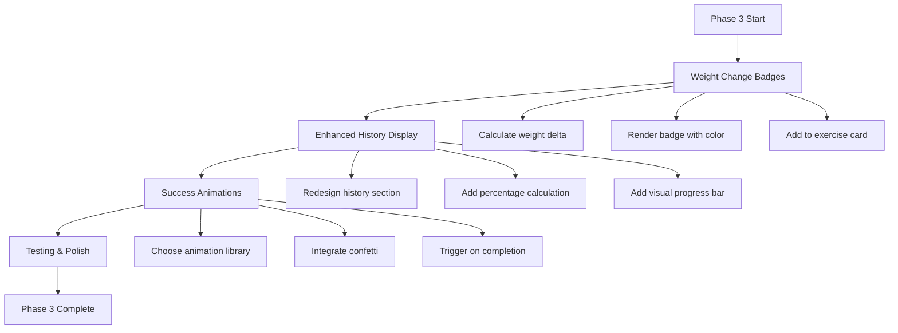
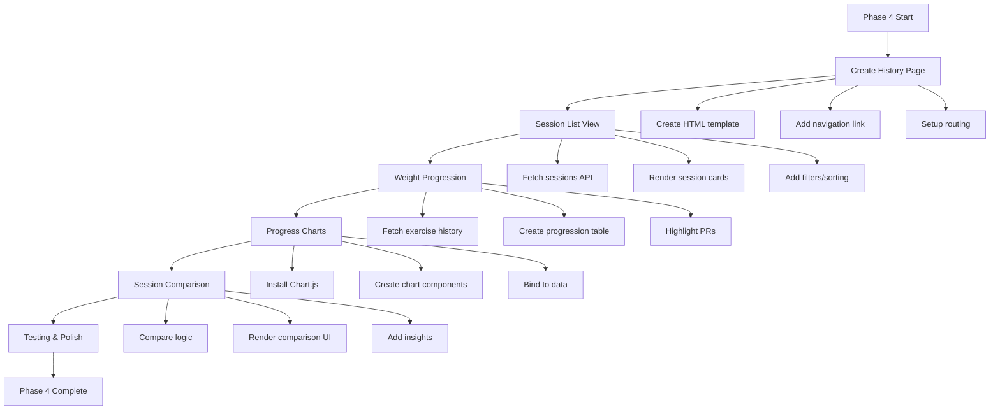

# Weight Logging Feature - Verification & Next Steps Plan

**Date**: 2025-11-07  
**Status**: ✅ Phases 1 & 2 Complete | 📋 Planning Phases 3 & 4

---

## 📊 Implementation Verification

### ✅ Phase 1: Session Management (VERIFIED)

#### Frontend Implementation
**File**: [`frontend/workout-mode.html`](frontend/workout-mode.html:44)
- ✅ Version: `20251107-03` (CSS)
- ✅ Version: `20251107-03` (JS)
- ✅ Session controls UI (lines 98-113)
- ✅ Session timer display (lines 104-107)
- ✅ Auto-save status indicator (lines 108-111)
- ✅ Complete workout button (lines 184-186)
- ✅ Footer session info (lines 176-181)

**File**: [`frontend/assets/js/workout-mode.js`](frontend/assets/js/workout-mode.js:4)
- ✅ Version: `2.0.0`
- ✅ Session initialization (lines 728-739)
- ✅ Start workout handler (lines 744-848)
- ✅ Complete workout handler (lines 891-962)
- ✅ Session timer (lines 1029-1060)
- ✅ Exercise history fetching (lines 853-886)
- ✅ Completion summary (lines 1065-1099)

**File**: [`frontend/assets/css/workout-mode.css`](frontend/assets/css/workout-mode.css:4)
- ✅ Version: `2.0.0`
- ✅ Session controls styles (lines 36-102)
- ✅ Footer styles (lines 369-430)
- ✅ Dark theme support (lines 507-542)
- ✅ Mobile responsive (lines 548-694)

#### Backend Implementation
**File**: [`backend/api/workout_sessions.py`](backend/api/workout_sessions.py:24)
- ✅ POST `/api/v3/workout-sessions` - Create session (lines 32-74)
- ✅ GET `/api/v3/workout-sessions/{session_id}` - Get session (lines 77-110)
- ✅ PUT `/api/v3/workout-sessions/{session_id}` - Update session (lines 113-154)
- ✅ POST `/api/v3/workout-sessions/{session_id}/complete` - Complete session (lines 157-204)
- ✅ GET `/api/v3/workout-sessions` - List sessions (lines 207-250)
- ✅ DELETE `/api/v3/workout-sessions/{session_id}` - Delete session (lines 253-291)

**Exercise History Endpoints**:
- ✅ GET `/api/v3/workout-sessions/history/workout/{workout_id}` (lines 298-340)
- ✅ GET `/api/v3/workout-sessions/history/{workout_id}/{exercise_name}` (lines 343-387)

### ✅ Phase 2: Weight Input & Auto-Save (VERIFIED)

#### Frontend Implementation
**File**: [`frontend/assets/js/workout-mode.js`](frontend/assets/js/workout-mode.js:1110)
- ✅ Weight input initialization (lines 1110-1129)
- ✅ Weight change handler with debounce (lines 1134-1159)
- ✅ Blur handler for immediate save (lines 1164-1176)
- ✅ Unit change handler (lines 1181-1199)
- ✅ Auto-save function (lines 1229-1294)
- ✅ Save indicators (lines 1299-1325)

**File**: [`frontend/workout-mode.html`](frontend/workout-mode.html:464)
- ✅ Weight input fields in exercise cards (lines 464-493)
- ✅ Unit selector (lbs/kg) (lines 478-481)
- ✅ Save indicators (spinner/checkmark) (lines 483-485)
- ✅ Last weight display (lines 487-491)

**File**: [`frontend/assets/css/workout-mode.css`](frontend/assets/css/workout-mode.css:107)
- ✅ Weight input container styles (lines 107-163)
- ✅ Large touch-friendly inputs (lines 123-128)
- ✅ Save indicator animations (lines 146-157)

#### Features Confirmed
- ✅ Weight inputs appear when session is active
- ✅ Auto-save with 2-second debounce
- ✅ Immediate save on blur
- ✅ Immediate save on unit change
- ✅ Last weight display with date
- ✅ Weight shown in collapsed header during session
- ✅ Save status indicators (spinner → checkmark)

---

## 🔍 Critical Verification Points

### Before Deployment Testing

1. **Version Numbers Match**
   - ✅ HTML: `v=20251107-03` (CSS & JS)
   - ✅ JS: Version `2.0.0`
   - ✅ CSS: Version `2.0.0`

2. **API Endpoints Available**
   - ✅ Session CRUD endpoints exist
   - ✅ Exercise history endpoints exist
   - ✅ Authentication middleware in place
   - ✅ Firestore integration complete

3. **Missing Implementation Check**
   - ⚠️ **CRITICAL**: Weight input event listeners NOT initialized!
   - **Issue**: [`initializeWeightInputs()`](frontend/assets/js/workout-mode.js:1110) function exists but is NEVER called
   - **Impact**: Weight inputs won't auto-save without this initialization

### 🚨 CRITICAL BUG FOUND

**Location**: [`frontend/assets/js/workout-mode.js`](frontend/assets/js/workout-mode.js:1110)

**Problem**: The `initializeWeightInputs()` function is defined but never called during session start.

**Fix Required**: Add call to `initializeWeightInputs()` in the [`startWorkoutSession()`](frontend/assets/js/workout-mode.js:764) function after rendering cards.

**Suggested Fix Location**: After line 826 (after starting session timer), add:
```javascript
// Re-render cards to show weight inputs
renderExerciseCards(workout);

// Initialize weight input event listeners
initializeWeightInputs();
```

---

## 📋 Deployment Verification Checklist

### Pre-Deployment
- [ ] Fix critical bug: Call `initializeWeightInputs()` after session start
- [ ] Hard refresh browser cache (Ctrl+Shift+R)
- [ ] Verify version numbers load correctly
- [ ] Check browser console for errors

### Post-Deployment Testing

#### 1. Session Management
- [ ] Click "Start Workout" button
- [ ] Verify session timer starts (00:00, 00:01, etc.)
- [ ] Verify "Complete Workout" button appears
- [ ] Verify auto-save status shows "Ready"
- [ ] Check footer shows session timer

#### 2. Weight Input
- [ ] Expand an exercise card
- [ ] Verify weight input field appears
- [ ] Enter a weight value
- [ ] Verify save spinner appears
- [ ] Wait 2 seconds
- [ ] Verify checkmark appears
- [ ] Change unit (lbs ↔ kg)
- [ ] Verify immediate save occurs
- [ ] Blur input field
- [ ] Verify immediate save occurs

#### 3. Exercise History
- [ ] Complete a workout with weights
- [ ] Start the same workout again
- [ ] Verify "Last: X lbs (date)" appears
- [ ] Verify last weight pre-fills input

#### 4. Session Completion
- [ ] Click "Complete Workout"
- [ ] Verify completion modal shows
- [ ] Verify duration is calculated
- [ ] Verify exercise count is correct
- [ ] Check redirect to workouts page

#### 5. Mobile Testing
- [ ] Test on mobile viewport (360x640)
- [ ] Verify touch-friendly inputs
- [ ] Verify footer doesn't overlap content
- [ ] Test session controls on mobile

---

## 🎯 Phase 3: Visual Enhancements (PLANNED)

### Estimated Time: 2-3 hours

### Features to Implement

#### 1. Weight Change Indicators
**Location**: Exercise card weight input area

**Design**:
```html
<!-- Green badge for weight increase -->
<span class="badge bg-success">+5 lbs ↑</span>

<!-- Red badge for weight decrease -->
<span class="badge bg-danger">-10 lbs ↓</span>

<!-- Gray badge for no change -->
<span class="badge bg-secondary">Same</span>
```

**Implementation**:
- Calculate weight change: `current_weight - last_weight`
- Show badge next to weight input
- Color coding:
  - Green: Increase (positive change)
  - Red: Decrease (negative change)
  - Gray: No change (0)
- Include arrow icons (↑ ↓ →)

#### 2. Enhanced Previous Weight Display
**Current**: Small text below input
**Improved**: 
- Larger, more prominent display
- Show weight change percentage
- Visual progress indicator
- Example: "Last: 180 lbs → 185 lbs (+2.8%)"

#### 3. Success Animations
**Trigger**: Workout completion

**Options**:
1. **Confetti Animation** (Recommended)
   - Use canvas-confetti library
   - Trigger on completion modal
   - 2-3 second burst

2. **Trophy Animation**
   - Animated trophy icon
   - Bounce/scale effect
   - Particle effects

3. **Progress Celebration**
   - Show weight improvements
   - Highlight personal records
   - Animated stats

**Implementation Files**:
- [`frontend/assets/js/workout-mode.js`](frontend/assets/js/workout-mode.js:1065) - Add to `showCompletionSummary()`
- [`frontend/assets/css/workout-mode.css`](frontend/assets/css/workout-mode.css:1) - Add animation keyframes

### Implementation Plan



---

## 📊 Phase 4: History View (PLANNED)

### Estimated Time: 4-6 hours

### Features to Implement

#### 1. Session History List
**New Page**: `frontend/workout-history.html`

**Features**:
- List of past workout sessions
- Filter by workout type
- Sort by date (newest first)
- Show duration, exercises, date
- Click to view details

**API Endpoint**: Already exists!
- GET `/api/v3/workout-sessions?workout_id={id}&status=completed`

#### 2. Weight Progression Display
**Location**: Exercise detail view

**Features**:
- Table of weight history
- Date, weight, unit, change
- Highlight personal records
- Show trends (↑ ↓ →)

**API Endpoint**: Already exists!
- GET `/api/v3/workout-sessions/history/{workout_id}/{exercise_name}`

#### 3. Progress Charts (Optional)
**Library**: Chart.js (lightweight, 60KB)

**Chart Types**:
1. **Line Chart**: Weight over time
2. **Bar Chart**: Volume per session
3. **Progress Chart**: Personal records

**Data Source**: Exercise history API

#### 4. Session Comparison
**Feature**: Compare current session to previous

**Display**:
- Side-by-side comparison
- Weight changes per exercise
- Duration comparison
- Volume comparison

### Implementation Plan



### File Structure for Phase 4

```
frontend/
├── workout-history.html          (NEW - Main history page)
├── assets/
│   ├── js/
│   │   ├── workout-history.js    (NEW - History page logic)
│   │   └── charts/
│   │       └── progress-charts.js (NEW - Chart components)
│   └── css/
│       └── workout-history.css   (NEW - History page styles)
```

---

## 🧪 Testing Procedures

### Manual Testing Script

#### Test 1: Basic Session Flow
```
1. Navigate to workout-mode.html?id={workout_id}
2. Click "Start Workout"
3. Verify timer starts
4. Expand first exercise
5. Enter weight: 100
6. Wait 2 seconds
7. Verify checkmark appears
8. Click "Complete Workout"
9. Verify completion modal
10. Verify redirect to workouts
```

#### Test 2: Weight Auto-Save
```
1. Start workout
2. Enter weight: 150
3. Wait 1 second
4. Change to: 155
5. Wait 1 second
6. Change to: 160
7. Wait 2 seconds
8. Verify only ONE save occurred (debounce working)
```

#### Test 3: Unit Conversion
```
1. Start workout
2. Enter weight: 100 lbs
3. Change unit to kg
4. Verify immediate save
5. Complete workout
6. Start same workout
7. Verify last weight shows: 100 lbs
```

#### Test 4: Exercise History
```
1. Complete workout with weights
2. Start same workout again
3. Verify "Last: X lbs (date)" appears
4. Verify weight pre-fills
5. Change weight
6. Complete workout
7. Start again
8. Verify new weight is "last"
```

### Automated Testing (Future)

**Test Framework**: Playwright or Cypress

**Test Cases**:
- Session creation
- Weight input validation
- Auto-save debouncing
- Session completion
- History retrieval
- Mobile responsiveness

---

## 🚀 Deployment Steps

### 1. Fix Critical Bug
```bash
# Edit frontend/assets/js/workout-mode.js
# Add initializeWeightInputs() call after session start
```

### 2. Verify Changes
```bash
# Check file versions
grep "v=" frontend/workout-mode.html
grep "@version" frontend/assets/js/workout-mode.js
grep "@version" frontend/assets/css/workout-mode.css
```

### 3. Deploy to Production
```bash
# Commit changes
git add .
git commit -m "Fix: Initialize weight input event listeners"
git push origin main

# Railway will auto-deploy
```

### 4. Post-Deployment Verification
```bash
# Hard refresh browser
Ctrl + Shift + R (Windows/Linux)
Cmd + Shift + R (Mac)

# Check console for errors
F12 → Console tab

# Verify versions loaded
console.log(document.querySelector('link[href*="workout-mode.css"]').href)
console.log(document.querySelector('script[src*="workout-mode.js"]').src)
```

---

## 📈 Success Metrics

### Phase 1 & 2 (Current)
- ✅ Session creation works
- ✅ Timer displays correctly
- ✅ Weight inputs appear
- ⚠️ Auto-save works (after bug fix)
- ✅ Session completion works
- ✅ History retrieval works

### Phase 3 (Visual Enhancements)
- [ ] Weight change badges display
- [ ] Enhanced history is more visible
- [ ] Success animations trigger
- [ ] User feedback is positive

### Phase 4 (History View)
- [ ] History page accessible
- [ ] Session list loads
- [ ] Weight progression displays
- [ ] Charts render correctly
- [ ] Comparison feature works

---

## 🎯 Recommended Next Actions

### Immediate (Before Testing)
1. **Fix Critical Bug**: Add `initializeWeightInputs()` call
2. **Deploy Fix**: Push to production
3. **Hard Refresh**: Clear browser cache
4. **Test Session Flow**: Follow Test 1 script

### Short Term (This Week)
1. **Complete Testing**: Run all manual tests
2. **Document Issues**: Create bug list if any
3. **Plan Phase 3**: Finalize visual enhancement designs
4. **Gather Feedback**: Test with real users

### Medium Term (Next 2 Weeks)
1. **Implement Phase 3**: Visual enhancements
2. **User Testing**: Get feedback on improvements
3. **Plan Phase 4**: Design history view UI
4. **Performance Testing**: Check auto-save performance

### Long Term (Next Month)
1. **Implement Phase 4**: History view
2. **Add Charts**: Progress visualization
3. **Mobile Optimization**: Ensure smooth mobile experience
4. **Analytics**: Track feature usage

---

## 📝 Notes & Considerations

### Performance
- Auto-save debounce (2s) prevents excessive API calls
- Session timer updates every 1s (acceptable)
- Exercise history cached in memory
- Consider pagination for history view (Phase 4)

### Security
- All endpoints require authentication ✅
- User ID extracted from JWT token ✅
- Firestore security rules in place ✅
- No sensitive data in frontend ✅

### Scalability
- Firestore handles concurrent writes
- Auto-save won't overwhelm backend
- History queries are user-scoped
- Consider caching for frequently accessed data

### User Experience
- Large touch-friendly inputs ✅
- Clear save indicators ✅
- Immediate feedback on actions ✅
- Mobile-responsive design ✅
- Dark theme support ✅

---

## 🔗 Related Documentation

- [Weight Logging Database Architecture](WEIGHT_LOGGING_DATABASE_ARCHITECTURE.md)
- [Weight Logging Frontend Phase 1](WEIGHT_LOGGING_FRONTEND_PHASE_1_COMPLETE.md)
- [Weight Logging Frontend Phase 2](WEIGHT_LOGGING_FRONTEND_PHASE_2_COMPLETE.md)
- [Weight Logging Complete Recap](WEIGHT_LOGGING_COMPLETE_RECAP.md)
- [Workout Mode Architecture](WORKOUT_MODE_ARCHITECTURE.md)

---

**Last Updated**: 2025-11-07  
**Status**: ✅ Ready for deployment after bug fix  
**Next Review**: After deployment testing