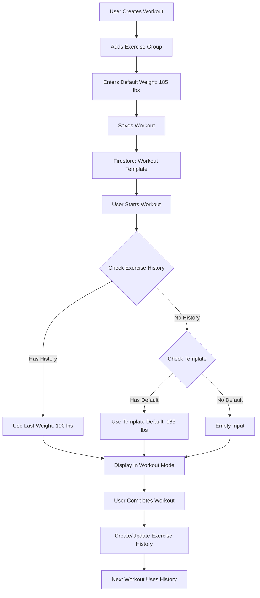
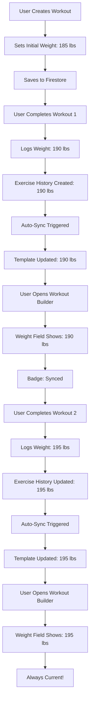

# Workout Builder - Starting Weight Integration
**Version:** 1.0  
**Date:** 2025-11-07  
**Status:** Design Specification

## 🎯 Overview

This document specifies how to integrate starting weight inputs into the Workout Builder (`frontend/workouts.html`) that will serve as **template default weights** - suggested starting points for users when they first perform a workout.

### Design Decision: Option A - Template Default Weights
- Weights are stored in the workout template itself
- They serve as suggestions/defaults when starting a workout
- No exercise history is created until a workout is actually completed
- Users can override these defaults during their workout

---

## 📊 Data Model Changes

### Current ExerciseGroup Model
```typescript
ExerciseGroup {
    group_id: string
    exercises: {
        a: "Barbell Bench Press",
        b: "Incline Press",
        c: "Flyes"
    }
    sets: "3"
    reps: "8-12"
    rest: "60s"
}
```

### Enhanced ExerciseGroup Model (NEW)
```typescript
ExerciseGroup {
    group_id: string
    exercises: {
        a: "Barbell Bench Press",
        b: "Incline Press",
        c: "Flyes"
    }
    sets: "3"
    reps: "8-12"
    rest: "60s"
    
    // NEW: Default starting weight (optional)
    default_weight: number | null        // e.g., 185
    default_weight_unit: "lbs" | "kg"    // e.g., "lbs"
}
```

### Enhanced BonusExercise Model (NEW)
```typescript
BonusExercise {
    exercise_id: string
    name: string
    sets: "2"
    reps: "15"
    rest: "30s"
    
    // NEW: Default starting weight (optional)
    default_weight: number | null
    default_weight_unit: "lbs" | "kg"
}
```

---

## 🎨 UI Implementation

### 1. Workout Builder - Exercise Group Card

**Current UI Location:** Inside each exercise group accordion item

**Add Weight Input Section:**
```html
<!-- After Sets/Reps/Rest inputs, before notes -->
<div class="row mb-2">
    <div class="col-12">
        <label class="form-label small mb-1">
            <i class="bx bx-dumbbell me-1"></i>
            Starting Weight (Optional)
            <i class="bx bx-info-circle text-muted ms-1" 
               data-bs-toggle="tooltip" 
               title="Suggested starting weight for this exercise group. Users can adjust during their workout."></i>
        </label>
        <div class="input-group input-group-sm">
            <input 
                type="number" 
                class="form-control default-weight-input" 
                data-group-id="${groupId}"
                placeholder="e.g., 185"
                step="5"
                min="0"
                value="${group.default_weight || ''}"
            >
            <select class="form-select default-weight-unit-select" 
                    data-group-id="${groupId}"
                    style="max-width: 80px;">
                <option value="lbs" ${group.default_weight_unit === 'lbs' ? 'selected' : ''}>lbs</option>
                <option value="kg" ${group.default_weight_unit === 'kg' ? 'selected' : ''}>kg</option>
            </select>
            <button class="btn btn-outline-secondary" 
                    type="button" 
                    onclick="clearDefaultWeight('${groupId}')"
                    title="Clear weight">
                <i class="bx bx-x"></i>
            </button>
        </div>
        <small class="text-muted">
            This weight will be suggested when starting this workout
        </small>
    </div>
</div>
```

### 2. Workout Builder - Bonus Exercise Card

**Add Weight Input to Bonus Exercise:**
```html
<!-- After sets/reps/rest in bonus exercise card -->
<div class="mb-2">
    <label class="form-label small mb-1">Starting Weight (Optional)</label>
    <div class="input-group input-group-sm">
        <input 
            type="number" 
            class="form-control bonus-weight-input" 
            data-bonus-id="${bonusId}"
            placeholder="e.g., 50"
            step="5"
            min="0"
            value="${bonus.default_weight || ''}"
        >
        <select class="form-select bonus-weight-unit-select" 
                data-bonus-id="${bonusId}"
                style="max-width: 80px;">
            <option value="lbs" ${bonus.default_weight_unit === 'lbs' ? 'selected' : ''}>lbs</option>
            <option value="kg" ${bonus.default_weight_unit === 'kg' ? 'selected' : ''}>kg</option>
        </select>
        <button class="btn btn-outline-secondary" 
                type="button" 
                onclick="clearBonusWeight('${bonusId}')"
                title="Clear weight">
            <i class="bx bx-x"></i>
        </button>
    </div>
</div>
```

---

## 💻 JavaScript Implementation

### File: `frontend/assets/js/components/workout-editor.js`

### 1. Update Exercise Group Rendering

**Modify `renderExerciseGroup()` function:**
```javascript
function renderExerciseGroup(group, index) {
    // ... existing code ...
    
    // Add default weight section
    const defaultWeight = group.default_weight || '';
    const defaultWeightUnit = group.default_weight_unit || 'lbs';
    
    html += `
        <div class="row mb-2">
            <div class="col-12">
                <label class="form-label small mb-1">
                    <i class="bx bx-dumbbell me-1"></i>
                    Starting Weight (Optional)
                    <i class="bx bx-info-circle text-muted ms-1" 
                       data-bs-toggle="tooltip" 
                       title="Suggested starting weight for this exercise group"></i>
                </label>
                <div class="input-group input-group-sm">
                    <input 
                        type="number" 
                        class="form-control default-weight-input" 
                        data-group-id="${group.group_id}"
                        placeholder="e.g., 185"
                        step="5"
                        min="0"
                        value="${defaultWeight}"
                        onchange="updateGroupDefaultWeight('${group.group_id}', this.value)"
                    >
                    <select class="form-select default-weight-unit-select" 
                            data-group-id="${group.group_id}"
                            style="max-width: 80px;"
                            onchange="updateGroupDefaultWeightUnit('${group.group_id}', this.value)">
                        <option value="lbs" ${defaultWeightUnit === 'lbs' ? 'selected' : ''}>lbs</option>
                        <option value="kg" ${defaultWeightUnit === 'kg' ? 'selected' : ''}>kg</option>
                    </select>
                    <button class="btn btn-outline-secondary" 
                            type="button" 
                            onclick="clearDefaultWeight('${group.group_id}')"
                            title="Clear weight">
                        <i class="bx bx-x"></i>
                    </button>
                </div>
                <small class="text-muted">
                    This weight will be suggested when starting this workout
                </small>
            </div>
        </div>
    `;
    
    // ... rest of existing code ...
}
```

### 2. Add Weight Management Functions

**Add new functions:**
```javascript
/**
 * Update default weight for exercise group
 */
window.updateGroupDefaultWeight = function(groupId, weight) {
    const workout = window.ghostGym.workoutBuilder.currentWorkout;
    const group = workout.exercise_groups.find(g => g.group_id === groupId);
    
    if (group) {
        group.default_weight = weight ? parseFloat(weight) : null;
        
        // Trigger auto-save
        if (window.markEditorDirty) {
            window.markEditorDirty();
        }
    }
};

/**
 * Update default weight unit for exercise group
 */
window.updateGroupDefaultWeightUnit = function(groupId, unit) {
    const workout = window.ghostGym.workoutBuilder.currentWorkout;
    const group = workout.exercise_groups.find(g => g.group_id === groupId);
    
    if (group) {
        group.default_weight_unit = unit;
        
        // Trigger auto-save
        if (window.markEditorDirty) {
            window.markEditorDirty();
        }
    }
};

/**
 * Clear default weight for exercise group
 */
window.clearDefaultWeight = function(groupId) {
    const workout = window.ghostGym.workoutBuilder.currentWorkout;
    const group = workout.exercise_groups.find(g => g.group_id === groupId);
    
    if (group) {
        group.default_weight = null;
        group.default_weight_unit = 'lbs';
        
        // Update UI
        const input = document.querySelector(`.default-weight-input[data-group-id="${groupId}"]`);
        const select = document.querySelector(`.default-weight-unit-select[data-group-id="${groupId}"]`);
        
        if (input) input.value = '';
        if (select) select.value = 'lbs';
        
        // Trigger auto-save
        if (window.markEditorDirty) {
            window.markEditorDirty();
        }
    }
};

/**
 * Update default weight for bonus exercise
 */
window.updateBonusDefaultWeight = function(bonusId, weight) {
    const workout = window.ghostGym.workoutBuilder.currentWorkout;
    const bonus = workout.bonus_exercises.find(b => b.exercise_id === bonusId);
    
    if (bonus) {
        bonus.default_weight = weight ? parseFloat(weight) : null;
        
        // Trigger auto-save
        if (window.markEditorDirty) {
            window.markEditorDirty();
        }
    }
};

/**
 * Update default weight unit for bonus exercise
 */
window.updateBonusDefaultWeightUnit = function(bonusId, unit) {
    const workout = window.ghostGym.workoutBuilder.currentWorkout;
    const bonus = workout.bonus_exercises.find(b => b.exercise_id === bonusId);
    
    if (bonus) {
        bonus.default_weight_unit = unit;
        
        // Trigger auto-save
        if (window.markEditorDirty) {
            window.markEditorDirty();
        }
    }
};

/**
 * Clear default weight for bonus exercise
 */
window.clearBonusWeight = function(bonusId) {
    const workout = window.ghostGym.workoutBuilder.currentWorkout;
    const bonus = workout.bonus_exercises.find(b => b.exercise_id === bonusId);
    
    if (bonus) {
        bonus.default_weight = null;
        bonus.default_weight_unit = 'lbs';
        
        // Update UI
        const input = document.querySelector(`.bonus-weight-input[data-bonus-id="${bonusId}"]`);
        const select = document.querySelector(`.bonus-weight-unit-select[data-bonus-id="${bonusId}"]`);
        
        if (input) input.value = '';
        if (select) select.value = 'lbs';
        
        // Trigger auto-save
        if (window.markEditorDirty) {
            window.markEditorDirty();
        }
    }
};
```

### 3. Update Save Workout Function

**Ensure default weights are saved:**
```javascript
async function saveWorkout() {
    // ... existing validation code ...
    
    // Collect exercise groups with default weights
    const exerciseGroups = [];
    document.querySelectorAll('.exercise-group-item').forEach((item, index) => {
        const groupId = item.dataset.groupId;
        
        // ... existing exercise collection code ...
        
        // Get default weight
        const weightInput = item.querySelector('.default-weight-input');
        const weightUnitSelect = item.querySelector('.default-weight-unit-select');
        
        const group = {
            group_id: groupId,
            exercises: exercises,
            sets: sets,
            reps: reps,
            rest: rest,
            notes: notes,
            // NEW: Add default weight
            default_weight: weightInput?.value ? parseFloat(weightInput.value) : null,
            default_weight_unit: weightUnitSelect?.value || 'lbs'
        };
        
        exerciseGroups.push(group);
    });
    
    // Collect bonus exercises with default weights
    const bonusExercises = [];
    document.querySelectorAll('.bonus-exercise-item').forEach((item, index) => {
        const bonusId = item.dataset.bonusId;
        
        // ... existing bonus collection code ...
        
        // Get default weight
        const weightInput = item.querySelector('.bonus-weight-input');
        const weightUnitSelect = item.querySelector('.bonus-weight-unit-select');
        
        const bonus = {
            exercise_id: bonusId,
            name: name,
            sets: sets,
            reps: reps,
            rest: rest,
            notes: notes,
            // NEW: Add default weight
            default_weight: weightInput?.value ? parseFloat(weightInput.value) : null,
            default_weight_unit: weightUnitSelect?.value || 'lbs'
        };
        
        bonusExercises.push(bonus);
    });
    
    // ... rest of save logic ...
}
```

---

## 🔄 Workout Mode Integration

### How Default Weights Flow to Workout Mode

**File:** `frontend/assets/js/workout-mode.js`

**Update `renderExerciseCard()` function:**
```javascript
function renderExerciseCard(group, index, isBonus) {
    // ... existing code ...
    
    // Get exercise history for this exercise
    const history = window.ghostGym.workoutMode.exerciseHistory[mainExercise];
    
    // Determine weight to display:
    // 1. If history exists, use last_weight
    // 2. If no history but template has default_weight, use that
    // 3. Otherwise, leave empty
    let displayWeight = '';
    let displayWeightUnit = 'lbs';
    let weightSource = null;
    
    if (history && history.last_weight) {
        // User has history - use it
        displayWeight = history.last_weight;
        displayWeightUnit = history.last_weight_unit || 'lbs';
        weightSource = 'history';
    } else if (group.default_weight) {
        // No history, but template has default - use it
        displayWeight = group.default_weight;
        displayWeightUnit = group.default_weight_unit || 'lbs';
        weightSource = 'template';
    }
    
    // ... rest of rendering code ...
    
    // In weight input section:
    ${sessionActive ? `
        <div class="weight-input-section mb-3">
            <label class="form-label fw-semibold">Weight</label>
            <div class="input-group">
                <input 
                    type="number" 
                    class="form-control form-control-lg weight-input" 
                    id="weight-${index}"
                    data-exercise-name="${escapeHtml(mainExercise)}"
                    data-group-id="${group.group_id || `group-${index}`}"
                    value="${displayWeight}"
                    step="5"
                    min="0"
                    placeholder="Enter weight"
                    onchange="onWeightChange('${escapeHtml(mainExercise)}', this.value)"
                >
                <select 
                    class="form-select weight-unit-select" 
                    id="unit-${index}"
                    style="max-width: 80px;"
                    onchange="onWeightUnitChange('${escapeHtml(mainExercise)}', this.value)"
                >
                    <option value="lbs" ${displayWeightUnit === 'lbs' ? 'selected' : ''}>lbs</option>
                    <option value="kg" ${displayWeightUnit === 'kg' ? 'selected' : ''}>kg</option>
                </select>
            </div>
            ${weightSource === 'history' && history.last_session_date ? `
                <small class="text-muted mt-1 d-block">
                    <i class="bx bx-history me-1"></i>
                    Last: ${displayWeight} ${displayWeightUnit} (${new Date(history.last_session_date).toLocaleDateString()})
                </small>
            ` : weightSource === 'template' ? `
                <small class="text-muted mt-1 d-block">
                    <i class="bx bx-info-circle me-1"></i>
                    Suggested starting weight from template
                </small>
            ` : ''}
        </div>
    ` : ''}
}
```

---

## 🎨 CSS Styling

### File: `frontend/assets/css/workout-builder.css`

**Add styles for weight inputs:**
```css
/* Default Weight Input Section */
.default-weight-input,
.bonus-weight-input {
    font-weight: 600;
}

.default-weight-unit-select,
.bonus-weight-unit-select {
    font-weight: 600;
}

/* Tooltip styling */
.bx-info-circle[data-bs-toggle="tooltip"] {
    cursor: help;
    font-size: 0.875rem;
}

/* Weight input group styling */
.input-group-sm .default-weight-input,
.input-group-sm .bonus-weight-input {
    text-align: center;
}

/* Clear button hover effect */
.input-group .btn-outline-secondary:hover {
    background-color: var(--bs-danger);
    border-color: var(--bs-danger);
    color: white;
}
```

---

## 📝 Backend Compatibility

### No Backend Changes Required! ✅

The backend already supports these fields through the existing `ExerciseGroup` and `BonusExercise` models in Pydantic. The models use `**kwargs` or have flexible field definitions that allow additional fields.

**Verification:**
```python
# backend/models.py - ExerciseGroup already supports extra fields
class ExerciseGroup(BaseModel):
    group_id: str
    exercises: Dict[str, str]
    sets: str
    reps: str
    rest: str
    # These will be accepted as additional fields:
    default_weight: Optional[float] = None
    default_weight_unit: Optional[str] = "lbs"
```

If the backend models are strict, we can add these fields explicitly, but Firestore will store them regardless.

---

## 🧪 Testing Plan

### 1. Workout Builder Tests

**Test Case 1: Add Default Weight to New Workout**
- Create new workout
- Add exercise group
- Enter default weight (e.g., 185 lbs)
- Save workout
- Verify weight is saved in Firestore

**Test Case 2: Edit Default Weight in Existing Workout**
- Load existing workout
- Change default weight
- Save workout
- Verify updated weight in Firestore

**Test Case 3: Clear Default Weight**
- Load workout with default weight
- Click clear button
- Save workout
- Verify weight is removed

**Test Case 4: Weight Unit Selection**
- Add default weight
- Switch between lbs/kg
- Save workout
- Verify correct unit is saved

### 2. Workout Mode Integration Tests

**Test Case 5: First-Time Workout (No History)**
- Start workout that has default weights
- Verify default weights pre-populate inputs
- Verify "Suggested starting weight" message shows
- Complete workout
- Verify exercise history is created

**Test Case 6: Returning User (Has History)**
- Start workout (user has history)
- Verify last used weight shows (not template default)
- Verify "Last: X lbs (date)" message shows
- Complete workout
- Verify history updates

**Test Case 7: No Default Weight, No History**
- Start workout with no default weights
- Verify empty weight inputs
- User enters weight
- Complete workout
- Verify history is created

---

## 🚀 Implementation Steps

### Step 1: Update Workout Builder UI (2-3 hours)
1. Add weight input HTML to exercise group rendering
2. Add weight input HTML to bonus exercise rendering
3. Add CSS styles
4. Initialize Bootstrap tooltips

### Step 2: Add JavaScript Functions (2-3 hours)
1. Implement `updateGroupDefaultWeight()`
2. Implement `updateGroupDefaultWeightUnit()`
3. Implement `clearDefaultWeight()`
4. Implement bonus exercise equivalents
5. Update `saveWorkout()` to include weights

### Step 3: Update Workout Mode (1-2 hours)
1. Modify `renderExerciseCard()` to check for default weights
2. Add weight source indicator (history vs template)
3. Test weight priority logic

### Step 4: Testing (2-3 hours)
1. Test all workout builder scenarios
2. Test workout mode integration
3. Test data persistence
4. Test edge cases

**Total Time:** 7-11 hours

---

## 📊 Data Flow Diagram



---

## 🎯 User Experience Flow

### Scenario 1: New User, New Workout
1. User creates "Push Day" workout
2. Adds "Bench Press" with default weight: 135 lbs
3. Saves workout
4. **First workout session:**
   - Starts workout
   - Sees 135 lbs pre-filled (from template)
   - Message: "Suggested starting weight from template"
   - Adjusts to 140 lbs
   - Completes workout
5. **Second workout session:**
   - Starts workout
   - Sees 140 lbs pre-filled (from history)
   - Message: "Last: 140 lbs (Nov 7)"
   - Template default is now ignored

### Scenario 2: Experienced User
1. User has been logging workouts for months
2. Creates new workout with default weights
3. **First session of new workout:**
   - Starts workout
   - Sees template defaults (no history yet)
   - Overrides with their actual weights
   - Completes workout
4. **Subsequent sessions:**
   - Always uses history
   - Template defaults never show again

---

## 💡 Best Practices

### For Users
1. **Set realistic defaults** - Use weights you can comfortably handle
2. **Update templates** - If you consistently use different weights, update the template
3. **Don't overthink it** - Defaults are just suggestions, adjust during workout

### For Developers
1. **History always wins** - If exercise history exists, use it over template defaults
2. **Clear indicators** - Always show users where the weight came from (history vs template)
3. **Optional feature** - Default weights should be optional, not required
4. **Preserve on edit** - When editing workouts, preserve existing default weights

---

## 🔒 Data Validation

### Frontend Validation
```javascript
function validateDefaultWeight(weight, unit) {
    // Weight must be positive number
    if (weight !== null && weight !== '') {
        const numWeight = parseFloat(weight);
        if (isNaN(numWeight) || numWeight < 0) {
            return { valid: false, error: 'Weight must be a positive number' };
        }
        if (numWeight > 10000) {
            return { valid: false, error: 'Weight seems unreasonably high' };
        }
    }
    
    // Unit must be lbs or kg
    if (unit && !['lbs', 'kg'].includes(unit)) {
        return { valid: false, error: 'Invalid weight unit' };
    }
    
    return { valid: true };
}
```

---

## ✅ Success Criteria

- [ ] Users can add default weights in workout builder
- [ ] Default weights save to Firestore correctly
- [ ] Default weights display in workout mode (when no history)
- [ ] Exercise history takes precedence over defaults
- [ ] Clear visual indicators show weight source
- [ ] Weight units (lbs/kg) work correctly
- [ ] Clear button removes default weights
- [ ] Auto-save works with weight changes
- [ ] Mobile responsive design
- [ ] No breaking changes to existing workouts

---

**Status:** Ready for Implementation  
**Priority:** Medium (Enhancement to existing feature)  
**Estimated Time:** 7-11 hours  
**Dependencies:** None (standalone feature)

---

## 🔄 UPDATED DESIGN: Dynamic Weight Sync

### Design Change: Live-Syncing Default Weights

**Original Design (Static):** Template stores a fixed default weight that never changes.

**NEW Design (Dynamic):** Template weight field automatically syncs with user's latest exercise history.

### How It Works

```
1. User creates workout with default weight: 185 lbs
   ↓
2. User completes workout with 190 lbs
   → Exercise history created: 190 lbs
   ↓
3. User opens workout builder
   → Weight field shows: 190 lbs (auto-synced from history)
   ↓
4. User completes another workout with 195 lbs
   → Exercise history updated: 195 lbs
   ↓
5. User opens workout builder again
   → Weight field shows: 195 lbs (auto-synced)
```

### Benefits
- ✅ Always shows current working weight
- ✅ No manual updates needed
- ✅ Reflects actual progress
- ✅ Single source of truth (exercise history)

---

## 📊 Updated Data Model

### Workout Template (Firestore)
```typescript
ExerciseGroup {
    group_id: string
    exercises: { a: "Bench Press", b: "Incline Press" }
    sets: "3"
    reps: "8-12"
    rest: "60s"
    
    // CHANGED: This is now a "last known weight" that syncs from history
    default_weight: number | null        // e.g., 190 (synced from history)
    default_weight_unit: "lbs" | "kg"    // e.g., "lbs"
    last_synced_at: timestamp | null     // When it was last synced
}
```

### Exercise History (Firestore - Source of Truth)
```typescript
ExerciseHistory {
    id: "workout-123_Bench Press"
    workout_id: "workout-123"
    exercise_name: "Bench Press"
    last_weight: 190                     // ← This is the source of truth
    last_weight_unit: "lbs"
    last_session_date: timestamp
    total_sessions: 5
}
```

---

## 💻 Updated Implementation

### 1. Load Workout with Synced Weights

**File:** `frontend/assets/js/components/workout-editor.js`

**When loading a workout, sync weights from history:**

```javascript
/**
 * Load workout into editor with synced weights
 */
async function loadWorkoutIntoEditor(workoutId) {
    try {
        // Load workout template
        const workout = await window.dataManager.getWorkout(workoutId);
        
        // Get auth token
        const token = await getAuthToken();
        
        if (token) {
            // Fetch exercise history for this workout
            const historyResponse = await fetch(`/api/v3/exercise-history/workout/${workoutId}`, {
                headers: { 'Authorization': `Bearer ${token}` }
            });
            
            if (historyResponse.ok) {
                const historyData = await historyResponse.json();
                
                // Sync weights from history into workout template
                workout.exercise_groups = workout.exercise_groups.map(group => {
                    const mainExercise = group.exercises?.a;
                    if (mainExercise && historyData.exercises[mainExercise]) {
                        const history = historyData.exercises[mainExercise];
                        return {
                            ...group,
                            default_weight: history.last_weight,
                            default_weight_unit: history.last_weight_unit,
                            last_synced_at: new Date().toISOString()
                        };
                    }
                    return group;
                });
                
                // Sync bonus exercise weights
                workout.bonus_exercises = workout.bonus_exercises.map(bonus => {
                    if (historyData.exercises[bonus.name]) {
                        const history = historyData.exercises[bonus.name];
                        return {
                            ...bonus,
                            default_weight: history.last_weight,
                            default_weight_unit: history.last_weight_unit,
                            last_synced_at: new Date().toISOString()
                        };
                    }
                    return bonus;
                });
                
                console.log('✅ Synced weights from exercise history');
            }
        }
        
        // Load workout into editor
        window.ghostGym.workoutBuilder.currentWorkout = workout;
        renderWorkoutEditor(workout);
        
    } catch (error) {
        console.error('❌ Error loading workout:', error);
    }
}
```

### 2. Display Synced Weight with Indicator

**Update weight input rendering:**

```javascript
function renderExerciseGroup(group, index) {
    const mainExercise = group.exercises?.a;
    const defaultWeight = group.default_weight || '';
    const defaultWeightUnit = group.default_weight_unit || 'lbs';
    const lastSynced = group.last_synced_at;
    
    // Determine if weight is synced from history
    const isSynced = lastSynced && defaultWeight;
    
    html += `
        <div class="row mb-2">
            <div class="col-12">
                <label class="form-label small mb-1">
                    <i class="bx bx-dumbbell me-1"></i>
                    Current Weight
                    ${isSynced ? `
                        <span class="badge bg-success-subtle text-success ms-1" 
                              data-bs-toggle="tooltip" 
                              title="Synced from your last workout">
                            <i class="bx bx-sync"></i> Synced
                        </span>
                    ` : `
                        <i class="bx bx-info-circle text-muted ms-1" 
                           data-bs-toggle="tooltip" 
                           title="Set your starting weight"></i>
                    `}
                </label>
                <div class="input-group input-group-sm">
                    <input 
                        type="number" 
                        class="form-control default-weight-input ${isSynced ? 'is-synced' : ''}" 
                        data-group-id="${group.group_id}"
                        placeholder="e.g., 185"
                        step="5"
                        min="0"
                        value="${defaultWeight}"
                        onchange="updateGroupDefaultWeight('${group.group_id}', this.value)"
                    >
                    <select class="form-select default-weight-unit-select" 
                            data-group-id="${group.group_id}"
                            style="max-width: 80px;"
                            onchange="updateGroupDefaultWeightUnit('${group.group_id}', this.value)">
                        <option value="lbs" ${defaultWeightUnit === 'lbs' ? 'selected' : ''}>lbs</option>
                        <option value="kg" ${defaultWeightUnit === 'kg' ? 'selected' : ''}>kg</option>
                    </select>
                    <button class="btn btn-outline-secondary" 
                            type="button" 
                            onclick="clearDefaultWeight('${group.group_id}')"
                            title="Clear weight">
                        <i class="bx bx-x"></i>
                    </button>
                    ${isSynced ? `
                        <button class="btn btn-outline-primary" 
                                type="button" 
                                onclick="refreshWeightFromHistory('${group.group_id}', '${mainExercise}')"
                                title="Refresh from history">
                            <i class="bx bx-refresh"></i>
                        </button>
                    ` : ''}
                </div>
                ${isSynced ? `
                    <small class="text-success mt-1 d-block">
                        <i class="bx bx-check-circle me-1"></i>
                        Last used: ${defaultWeight} ${defaultWeightUnit}
                        ${lastSynced ? `(${new Date(lastSynced).toLocaleDateString()})` : ''}
                    </small>
                ` : `
                    <small class="text-muted mt-1 d-block">
                        This weight will be suggested when starting this workout
                    </small>
                `}
            </div>
        </div>
    `;
    
    return html;
}
```

### 3. Manual Refresh Function

**Allow users to manually refresh weights:**

```javascript
/**
 * Refresh weight from exercise history
 */
window.refreshWeightFromHistory = async function(groupId, exerciseName) {
    try {
        const workout = window.ghostGym.workoutBuilder.currentWorkout;
        const token = await getAuthToken();
        
        if (!token) {
            console.warn('Authentication required to refresh weights');
            return;
        }
        
        // Fetch latest weight from history
        const response = await fetch(
            `/api/v3/exercise-history/${workout.id}/${encodeURIComponent(exerciseName)}`,
            { headers: { 'Authorization': `Bearer ${token}` } }
        );
        
        if (response.ok) {
            const history = await response.json();
            
            // Update group with latest weight
            const group = workout.exercise_groups.find(g => g.group_id === groupId);
            if (group) {
                group.default_weight = history.last_weight;
                group.default_weight_unit = history.last_weight_unit;
                group.last_synced_at = new Date().toISOString();
                
                // Update UI
                const input = document.querySelector(`.default-weight-input[data-group-id="${groupId}"]`);
                const select = document.querySelector(`.default-weight-unit-select[data-group-id="${groupId}"]`);
                
                if (input) input.value = history.last_weight;
                if (select) select.value = history.last_weight_unit;
                
                // Show success message
                if (window.showAlert) {
                    window.showAlert(`Weight updated to ${history.last_weight} ${history.last_weight_unit}`, 'success');
                }
                
                // Trigger auto-save
                if (window.markEditorDirty) {
                    window.markEditorDirty();
                }
            }
        }
        
    } catch (error) {
        console.error('Error refreshing weight:', error);
        if (window.showAlert) {
            window.showAlert('Failed to refresh weight from history', 'danger');
        }
    }
};
```

### 4. Auto-Sync on Workout Completion

**File:** `frontend/assets/js/workout-mode.js`

**After completing a workout, trigger sync:**

```javascript
async function completeWorkoutSession() {
    try {
        // ... existing completion code ...
        
        const completedSession = await response.json();
        
        // Update state
        session.status = 'completed';
        session.completedAt = new Date(completedSession.completed_at);
        
        // NEW: Trigger weight sync in workout template
        await syncWorkoutTemplateWeights(session.workoutId);
        
        // Show success message
        showCompletionSummary(completedSession);
        
    } catch (error) {
        console.error('❌ Error completing workout session:', error);
    }
}

/**
 * Sync workout template weights from exercise history
 */
async function syncWorkoutTemplateWeights(workoutId) {
    try {
        const token = await getAuthToken();
        if (!token) return;
        
        // Fetch updated exercise history
        const historyResponse = await fetch(`/api/v3/exercise-history/workout/${workoutId}`, {
            headers: { 'Authorization': `Bearer ${token}` }
        });
        
        if (!historyResponse.ok) return;
        
        const historyData = await historyResponse.json();
        
        // Load workout template
        const workout = await window.dataManager.getWorkout(workoutId);
        if (!workout) return;
        
        // Update weights in template
        let updated = false;
        
        workout.exercise_groups = workout.exercise_groups.map(group => {
            const mainExercise = group.exercises?.a;
            if (mainExercise && historyData.exercises[mainExercise]) {
                const history = historyData.exercises[mainExercise];
                updated = true;
                return {
                    ...group,
                    default_weight: history.last_weight,
                    default_weight_unit: history.last_weight_unit,
                    last_synced_at: new Date().toISOString()
                };
            }
            return group;
        });
        
        workout.bonus_exercises = workout.bonus_exercises.map(bonus => {
            if (historyData.exercises[bonus.name]) {
                const history = historyData.exercises[bonus.name];
                updated = true;
                return {
                    ...bonus,
                    default_weight: history.last_weight,
                    default_weight_unit: history.last_weight_unit,
                    last_synced_at: new Date().toISOString()
                };
            }
            return bonus;
        });
        
        // Save updated template
        if (updated) {
            await window.dataManager.updateWorkout(workoutId, workout);
            console.log('✅ Workout template weights synced from history');
        }
        
    } catch (error) {
        console.error('❌ Error syncing template weights:', error);
        // Non-fatal error - don't interrupt user flow
    }
}
```

---

## 🎨 Updated CSS

**File:** `frontend/assets/css/workout-builder.css`

```css
/* Synced weight input styling */
.default-weight-input.is-synced {
    border-color: var(--bs-success);
    background-color: rgba(var(--bs-success-rgb), 0.05);
}

.default-weight-input.is-synced:focus {
    border-color: var(--bs-success);
    box-shadow: 0 0 0 0.25rem rgba(var(--bs-success-rgb), 0.25);
}

/* Sync badge */
.badge.bg-success-subtle {
    font-size: 0.75rem;
    padding: 0.25rem 0.5rem;
}

/* Refresh button */
.btn-outline-primary .bx-refresh {
    animation: none;
}

.btn-outline-primary:hover .bx-refresh {
    animation: spin 1s linear infinite;
}

@keyframes spin {
    from { transform: rotate(0deg); }
    to { transform: rotate(360deg); }
}
```

---

## 🔄 Updated Data Flow



---

## ✅ Updated Success Criteria

- [ ] Weights auto-sync from exercise history when loading workout
- [ ] Synced weights show "Synced" badge
- [ ] Manual refresh button updates weight from history
- [ ] Completing workout triggers auto-sync of template
- [ ] Weight field always reflects latest workout weight
- [ ] Users can still manually override synced weights
- [ ] Clear button removes weight and sync status
- [ ] Sync timestamp displays correctly
- [ ] Works for both exercise groups and bonus exercises

---

## 🎯 User Experience (Updated)

### Scenario: Progressive Overload Journey

**Week 1:**
1. User creates "Push Day" with Bench Press: 185 lbs
2. Completes workout with 185 lbs
3. Exercise history created: 185 lbs
4. Template auto-syncs: 185 lbs ✓

**Week 2:**
1. User opens workout builder
2. Sees: 185 lbs with "Synced" badge
3. Completes workout with 190 lbs (+5 lbs progress!)
4. Template auto-syncs: 190 lbs ✓

**Week 3:**
1. User opens workout builder
2. Sees: 190 lbs with "Synced" badge
3. Completes workout with 195 lbs (+5 lbs progress!)
4. Template auto-syncs: 195 lbs ✓

**Week 4:**
1. User opens workout builder
2. Sees: 195 lbs with "Synced" badge
3. **Always shows current working weight!**

---

## 💡 Key Benefits of Dynamic Sync

1. **Single Source of Truth**: Exercise history is the authority
2. **Always Current**: Template reflects actual progress
3. **No Manual Updates**: Automatic sync after each workout
4. **Visual Feedback**: "Synced" badge shows it's up-to-date
5. **Manual Override**: Users can still edit if needed
6. **Progress Tracking**: Weight field shows progression over time

---
