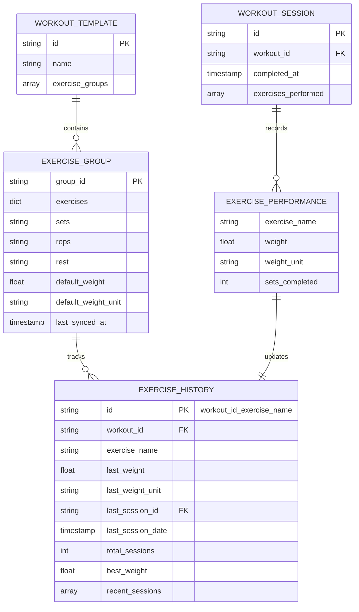

# Weight Tracking Implementation Plan
**Version:** 1.0  
**Date:** 2025-11-09  
**Status:** Ready for Implementation

## 🎯 Executive Summary

Implement a comprehensive weight tracking system where:
1. Users enter target weights per exercise group in the workout builder
2. Weights automatically update when workouts are completed
3. Users can view weight history across all workouts for each exercise
4. System maintains exercise-specific history with changelog

---

## 📋 Requirements Analysis

### Current State
✅ **Already Implemented:**
- Weight input field exists in workout builder ([`workouts.js:566-595`](frontend/assets/js/dashboard/workouts.js:566))
- Backend models support weight tracking ([`models.py:157-187`](backend/models.py:157))
- Database schema defined for ExerciseHistory ([`models.py:850-878`](backend/models.py:850))
- Weight field saves to workout template (weight + weight_unit)

❌ **Missing:**
- Weight doesn't update after workout completion
- No exercise history tracking across workouts
- No UI to view weight history/changelog
- No cross-workout exercise reference system

### User Requirements
1. **Workout Builder**: Enter weight per exercise group → saves with workout
2. **Workout Completion**: Weight updates automatically after logging workout
3. **Weight Sync**: Opening workout builder shows latest weight from last session
4. **History View**: Icon to view all weights for an exercise across different workouts
5. **Cross-Workout Reference**: See exercise history regardless of which workout it's in

---

## 🗄️ Database Architecture

### Schema Design



### Firestore Collections

```
users/{userId}/
├── workouts/{workoutId}
│   └── exercise_groups[].default_weight (auto-syncs from history)
│
├── exercise_history/{workout_exercise_id}
│   ├── id: "{workoutId}_{exerciseName}"
│   ├── last_weight: 185
│   ├── last_weight_unit: "lbs"
│   ├── last_session_date: timestamp
│   ├── total_sessions: 12
│   ├── best_weight: 205
│   └── recent_sessions: [...]
│
└── workout_sessions/{sessionId}
    ├── workout_id: "workout-123"
    ├── completed_at: timestamp
    └── exercises_performed: [...]
```

### Key Design Decisions

**1. Composite Key for Exercise History**
```typescript
historyId = `${workoutId}_${exerciseName}`
// Example: "workout-06fad623_Barbell Bench Press"
```
- Maintains separate history per workout-exercise combination
- Handles exercise substitutions correctly
- Enables cross-workout exercise queries

**2. Auto-Sync Mechanism**
- When workout session completes → update [`exercise_history`](backend/models.py:850)
- When workout builder opens → sync weights from [`exercise_history`](backend/models.py:850) to template
- Template's [`default_weight`](backend/models.py:157) always reflects latest session

**3. Cross-Workout Exercise Lookup**
```typescript
// Query all histories for an exercise across all workouts
exerciseHistories = await firestore
  .collection(`users/${userId}/exercise_history`)
  .where('exercise_name', '==', 'Barbell Bench Press')
  .get()
```

---

## 🔌 Backend API Endpoints

### 1. Exercise History Endpoints

#### Get Exercise History for Workout
```http
GET /api/v3/exercise-history/workout/{workoutId}
Authorization: Bearer {token}

Response: 200 OK
{
  "workout_id": "workout-06fad623",
  "workout_name": "Push Day",
  "exercises": {
    "Barbell Bench Press": {
      "last_weight": 185,
      "last_weight_unit": "lbs",
      "last_session_date": "2025-11-08T14:00:00Z",
      "total_sessions": 12,
      "best_weight": 205
    }
  }
}
```

#### Get Exercise History Across All Workouts
```http
GET /api/v3/exercise-history/exercise/{exerciseName}
Authorization: Bearer {token}

Response: 200 OK
{
  "exercise_name": "Barbell Bench Press",
  "workouts": [
    {
      "workout_id": "workout-123",
      "workout_name": "Push Day A",
      "last_weight": 185,
      "last_weight_unit": "lbs",
      "last_session_date": "2025-11-08T14:00:00Z",
      "total_sessions": 12
    },
    {
      "workout_id": "workout-456",
      "workout_name": "Chest Focus",
      "last_weight": 205,
      "last_weight_unit": "lbs",
      "last_session_date": "2025-11-07T10:00:00Z",
      "total_sessions": 5
    }
  ],
  "total_workouts": 2,
  "overall_best_weight": 205,
  "overall_sessions": 17
}
```

#### Get Exercise Progress Timeline
```http
GET /api/v3/exercise-history/{workoutId}/{exerciseName}/timeline
Authorization: Bearer {token}

Response: 200 OK
{
  "exercise_name": "Barbell Bench Press",
  "workout_name": "Push Day",
  "timeline": [
    {
      "session_id": "session-20251108-140000",
      "date": "2025-11-08T14:00:00Z",
      "weight": 185,
      "weight_unit": "lbs",
      "sets": 4,
      "reps": "8-10",
      "notes": "Felt strong"
    },
    {
      "session_id": "session-20251105-140000",
      "date": "2025-11-05T14:00:00Z",
      "weight": 180,
      "weight_unit": "lbs",
      "sets": 4,
      "reps": "8-10",
      "notes": ""
    }
  ],
  "total_sessions": 12,
  "weight_progression": "+25 lbs over 12 sessions"
}
```

### 2. Workout Session Endpoints

#### Complete Workout Session (Updates Exercise History)
```http
POST /api/v3/workout-sessions/complete
Authorization: Bearer {token}

Request Body:
{
  "workout_id": "workout-06fad623",
  "workout_name": "Push Day",
  "started_at": "2025-11-08T14:00:00Z",
  "completed_at": "2025-11-08T15:15:00Z",
  "exercises_performed": [
    {
      "exercise_name": "Barbell Bench Press",
      "group_id": "group-1",
      "weight": 190,
      "weight_unit": "lbs",
      "sets_completed": 4,
      "target_sets": "4",
      "target_reps": "8-10"
    }
  ]
}

Response: 201 Created
{
  "session_id": "session-20251108-140000",
  "workout_id": "workout-06fad623",
  "completed_at": "2025-11-08T15:15:00Z",
  "exercises_updated": 6,
  "message": "Workout logged and exercise history updated"
}
```

### 3. Backend Implementation Files

**New File:** `backend/api/exercise_history.py`
```python
from fastapi import APIRouter, Depends, HTTPException
from typing import Optional
from ..services.firestore_data_service import firestore_data_service
from ..middleware.auth import get_current_user_optional, extract_user_id

router = APIRouter(prefix="/api/v3/exercise-history", tags=["Exercise History"])

@router.get("/workout/{workout_id}")
async def get_workout_exercise_history(
    workout_id: str,
    current_user: Optional[dict] = Depends(get_current_user_optional)
):
    """Get exercise history for all exercises in a workout"""
    user_id = extract_user_id(current_user)
    if not user_id:
        raise HTTPException(status_code=401, detail="Authentication required")
    
    history = await firestore_data_service.get_workout_exercise_history(user_id, workout_id)
    return history

@router.get("/exercise/{exercise_name}")
async def get_exercise_history_across_workouts(
    exercise_name: str,
    current_user: Optional[dict] = Depends(get_current_user_optional)
):
    """Get exercise history across all workouts"""
    user_id = extract_user_id(current_user)
    if not user_id:
        raise HTTPException(status_code=401, detail="Authentication required")
    
    history = await firestore_data_service.get_exercise_history_all_workouts(user_id, exercise_name)
    return history

@router.get("/{workout_id}/{exercise_name}/timeline")
async def get_exercise_timeline(
    workout_id: str,
    exercise_name: str,
    limit: int = 20,
    current_user: Optional[dict] = Depends(get_current_user_optional)
):
    """Get detailed timeline for an exercise in a specific workout"""
    user_id = extract_user_id(current_user)
    if not user_id:
        raise HTTPException(status_code=401, detail="Authentication required")
    
    timeline = await firestore_data_service.get_exercise_timeline(
        user_id, workout_id, exercise_name, limit
    )
    return timeline
```

**Update:** `backend/services/firestore_data_service.py`
```python
async def update_exercise_history_after_session(
    self, 
    user_id: str, 
    workout_id: str,
    exercises_performed: List[ExercisePerformance]
):
    """Update exercise history after workout completion"""
    for exercise in exercises_performed:
        history_id = f"{workout_id}_{exercise.exercise_name}"
        history_ref = self.db.collection('users').document(user_id)\
            .collection('exercise_history').document(history_id)
        
        # Get existing history or create new
        history_doc = history_ref.get()
        
        if history_doc.exists:
            history = history_doc.to_dict()
            # Update existing history
            history['last_weight'] = exercise.weight
            history['last_weight_unit'] = exercise.weight_unit
            history['last_session_date'] = datetime.now()
            history['total_sessions'] += 1
            
            # Update best weight if applicable
            if exercise.weight > history.get('best_weight', 0):
                history['best_weight'] = exercise.weight
                history['best_weight_date'] = datetime.now()
            
            # Update recent sessions (keep last 5)
            recent = history.get('recent_sessions', [])
            recent.insert(0, {
                'date': datetime.now(),
                'weight': exercise.weight,
                'sets': exercise.sets_completed
            })
            history['recent_sessions'] = recent[:5]
            
            history_ref.update(history)
        else:
            # Create new history
            history_ref.set({
                'id': history_id,
                'workout_id': workout_id,
                'exercise_name': exercise.exercise_name,
                'last_weight': exercise.weight,
                'last_weight_unit': exercise.weight_unit,
                'last_session_date': datetime.now(),
                'total_sessions': 1,
                'first_session_date': datetime.now(),
                'best_weight': exercise.weight,
                'best_weight_date': datetime.now(),
                'recent_sessions': [{
                    'date': datetime.now(),
                    'weight': exercise.weight,
                    'sets': exercise.sets_completed
                }],
                'updated_at': datetime.now()
            })
```

---

## 🎨 Frontend Implementation

### 1. Workout Builder Changes

**File:** [`frontend/assets/js/dashboard/workouts.js`](frontend/assets/js/dashboard/workouts.js)

#### Update Weight Field UI (Lines 566-595)
```javascript
// CURRENT: "Target Weight (Optional - Reference Only)"
// CHANGE TO: "Current Weight" with sync indicator

<div class="row g-2 mb-2">
    <div class="col-12">
        <label class="form-label small mb-1">
            <i class="bx bx-dumbbell me-1"></i>
            Current Weight
            <span class="badge bg-success-subtle text-success ms-1 weight-sync-badge" 
                  style="display: none;"
                  data-bs-toggle="tooltip" 
                  title="Synced from your last workout">
                <i class="bx bx-sync"></i> Synced
            </span>
            <button type="button" 
                    class="btn btn-sm btn-link p-0 ms-1 weight-history-btn" 
                    onclick="showWeightHistory('${groupId}', '${mainExercise}')"
                    title="View weight history">
                <i class="bx bx-history"></i>
            </button>
        </label>
    </div>
</div>
<div class="row g-2 mb-2">
    <div class="col-3">
        <input type="text" 
               class="form-control form-control-sm weight-input text-center" 
               placeholder="0" 
               maxlength="6"
               data-group-id="${groupId}">
    </div>
    <div class="col-3">
        <button type="button" 
                class="btn btn-sm btn-outline-secondary w-100 weight-unit-btn active" 
                data-unit="lbs">lbs</button>
    </div>
    <div class="col-3">
        <button type="button" 
                class="btn btn-sm btn-outline-secondary w-100 weight-unit-btn" 
                data-unit="kg">kg</button>
    </div>
    <div class="col-3">
        <button type="button" 
                class="btn btn-sm btn-outline-secondary w-100 weight-unit-btn" 
                data-unit="other">other</button>
    </div>
</div>
<div class="row g-2 mb-3">
    <div class="col-12">
        <small class="text-muted weight-last-used" style="display: none;">
            <i class="bx bx-time-five me-1"></i>
            Last used: <span class="weight-last-value"></span> on <span class="weight-last-date"></span>
        </small>
    </div>
</div>
```

#### Add Weight Sync Function
```javascript
/**
 * Sync weights from exercise history when loading workout
 */
async function syncWeightsFromHistory(workoutId) {
    try {
        const token = await getAuthToken();
        if (!token) return;
        
        const response = await fetch(`/api/v3/exercise-history/workout/${workoutId}`, {
            headers: { 'Authorization': `Bearer ${token}` }
        });
        
        if (!response.ok) return;
        
        const historyData = await response.json();
        
        // Update each exercise group with synced weight
        const groups = document.querySelectorAll('.exercise-group');
        groups.forEach(group => {
            const mainExerciseInput = group.querySelector('.exercise-input');
            const exerciseName = mainExerciseInput?.value?.trim();
            
            if (exerciseName && historyData.exercises[exerciseName]) {
                const history = historyData.exercises[exerciseName];
                const weightInput = group.querySelector('.weight-input');
                const syncBadge = group.querySelector('.weight-sync-badge');
                const lastUsed = group.querySelector('.weight-last-used');
                const lastValue = group.querySelector('.weight-last-value');
                const lastDate = group.querySelector('.weight-last-date');
                
                // Update weight input
                if (weightInput) {
                    weightInput.value = history.last_weight;
                }
                
                // Set weight unit button
                const unitButtons = group.querySelectorAll('.weight-unit-btn');
                unitButtons.forEach(btn => {
                    btn.classList.remove('active');
                    if (btn.getAttribute('data-unit') === history.last_weight_unit) {
                        btn.classList.add('active');
                    }
                });
                
                // Show sync badge
                if (syncBadge) {
                    syncBadge.style.display = 'inline-block';
                }
                
                // Show last used info
                if (lastUsed && lastValue && lastDate) {
                    lastValue.textContent = `${history.last_weight} ${history.last_weight_unit}`;
                    lastDate.textContent = new Date(history.last_session_date).toLocaleDateString();
                    lastUsed.style.display = 'block';
                }
            }
        });
        
        console.log('✅ Weights synced from exercise history');
    } catch (error) {
        console.error('❌ Error syncing weights:', error);
    }
}
```

#### Update [`loadWorkoutIntoEditor()`](frontend/assets/js/components/workout-editor.js:11) Function
```javascript
async function loadWorkoutIntoEditor(workoutId) {
    // ... existing code ...
    
    // NEW: Sync weights from exercise history
    await syncWeightsFromHistory(workoutId);
    
    // ... rest of existing code ...
}
```

### 2. Weight History Modal

**New Component:** `frontend/assets/js/components/weight-history-modal.js`

```javascript
/**
 * Show weight history modal for an exercise
 */
async function showWeightHistory(groupId, exerciseName) {
    const workoutId = window.ghostGym.workoutBuilder.selectedWorkoutId;
    if (!workoutId || !exerciseName) return;
    
    try {
        const token = await getAuthToken();
        if (!token) {
            showAlert('Please sign in to view weight history', 'warning');
            return;
        }
        
        // Fetch timeline data
        const response = await fetch(
            `/api/v3/exercise-history/${workoutId}/${encodeURIComponent(exerciseName)}/timeline`,
            { headers: { 'Authorization': `Bearer ${token}` } }
        );
        
        if (!response.ok) throw new Error('Failed to fetch history');
        
        const data = await response.json();
        
        // Create modal HTML
        const modalHtml = `
            <div class="modal fade" id="weightHistoryModal" tabindex="-1">
                <div class="modal-dialog modal-lg">
                    <div class="modal-content">
                        <div class="modal-header">
                            <h5 class="modal-title">
                                <i class="bx bx-history me-2"></i>
                                Weight History: ${exerciseName}
                            </h5>
                            <button type="button" class="btn-close" data-bs-dismiss="modal"></button>
                        </div>
                        <div class="modal-body">
                            <!-- Summary Stats -->
                            <div class="row mb-4">
                                <div class="col-md-4">
                                    <div class="card bg-primary-subtle">
                                        <div class="card-body text-center py-3">
                                            <h6 class="mb-1">Current Weight</h6>
                                            <h4 class="mb-0">${data.timeline[0]?.weight || 0} ${data.timeline[0]?.weight_unit || 'lbs'}</h4>
                                        </div>
                                    </div>
                                </div>
                                <div class="col-md-4">
                                    <div class="card bg-success-subtle">
                                        <div class="card-body text-center py-3">
                                            <h6 class="mb-1">Total Sessions</h6>
                                            <h4 class="mb-0">${data.total_sessions}</h4>
                                        </div>
                                    </div>
                                </div>
                                <div class="col-md-4">
                                    <div class="card bg-warning-subtle">
                                        <div class="card-body text-center py-3">
                                            <h6 class="mb-1">Progression</h6>
                                            <h4 class="mb-0">${data.weight_progression}</h4>
                                        </div>
                                    </div>
                                </div>
                            </div>
                            
                            <!-- Timeline -->
                            <h6 class="mb-3">Session History</h6>
                            <div class="timeline">
                                ${data.timeline.map((session, index) => `
                                    <div class="timeline-item ${index === 0 ? 'timeline-item-latest' : ''}">
                                        <div class="timeline-marker"></div>
                                        <div class="timeline-content">
                                            <div class="d-flex justify-content-between align-items-start mb-2">
                                                <div>
                                                    <strong>${session.weight} ${session.weight_unit}</strong>
                                                    <span class="text-muted ms-2">${session.sets} sets × ${session.reps} reps</span>
                                                </div>
                                                <small class="text-muted">${new Date(session.date).toLocaleDateString()}</small>
                                            </div>
                                            ${session.notes ? `<p class="mb-0 small text-muted">${session.notes}</p>` : ''}
                                        </div>
                                    </div>
                                `).join('')}
                            </div>
                            
                            <!-- View All Workouts Button -->
                            <div class="mt-4 text-center">
                                <button type="button" 
                                        class="btn btn-outline-primary"
                                        onclick="showExerciseAcrossWorkouts('${exerciseName}')">
                                    <i class="bx bx-search me-1"></i>
                                    View in All Workouts
                                </button>
                            </div>
                        </div>
                        <div class="modal-footer">
                            <button type="button" class="btn btn-secondary" data-bs-dismiss="modal">Close</button>
                        </div>
                    </div>
                </div>
            </div>
        `;
        
        // Remove existing modal
        const existingModal = document.getElementById('weightHistoryModal');
        if (existingModal) existingModal.remove();
        
        // Add modal to body
        document.body.insertAdjacentHTML('beforeend', modalHtml);
        
        // Show modal
        const modal = new bootstrap.Modal(document.getElementById('weightHistoryModal'));
        modal.show();
        
        // Clean up on hide
        document.getElementById('weightHistoryModal').addEventListener('hidden.bs.modal', function() {
            this.remove();
        });
        
    } catch (error) {
        console.error('❌ Error showing weight history:', error);
        showAlert('Failed to load weight history', 'danger');
    }
}

/**
 * Show exercise history across all workouts
 */
async function showExerciseAcrossWorkouts(exerciseName) {
    try {
        const token = await getAuthToken();
        if (!token) return;
        
        const response = await fetch(
            `/api/v3/exercise-history/exercise/${encodeURIComponent(exerciseName)}`,
            { headers: { 'Authorization': `Bearer ${token}` } }
        );
        
        if (!response.ok) throw new Error('Failed to fetch cross-workout history');
        
        const data = await response.json();
        
        // Create modal HTML showing exercise across all workouts
        const modalHtml = `
            <div class="modal fade" id="exerciseAllWorkoutsModal" tabindex="-1">
                <div class="modal-dialog modal-lg">
                    <div class="modal-content">
                        <div class="modal-header">
                            <h5 class="modal-title">
                                <i class="bx bx-dumbbell me-2"></i>
                                ${exerciseName} - All Workouts
                            </h5>
                            <button type="button" class="btn-close" data-bs-dismiss="modal"></button>
                        </div>
                        <div class="modal-body">
                            <!-- Overall Stats -->
                            <div class="alert alert-info mb-4">
                                <div class="row text-center">
                                    <div class="col-md-4">
                                        <strong>Total Workouts</strong><br>
                                        ${data.total_workouts}
                                    </div>
                                    <div class="col-md-4">
                                        <strong>Total Sessions</strong><br>
                                        ${data.overall_sessions}
                                    </div>
                                    <div class="col-md-4">
                                        <strong>Best Weight</strong><br>
                                        ${data.overall_best_weight} lbs
                                    </div>
                                </div>
                            </div>
                            
                            <!-- Workout List -->
                            <h6 class="mb-3">Workouts Using This Exercise</h6>
                            <div class="list-group">
                                ${data.workouts.map(workout => `
                                    <div class="list-group-item">
                                        <div class="d-flex justify-content-between align-items-center">
                                            <div>
                                                <h6 class="mb-1">${workout.workout_name}</h6>
                                                <small class="text-muted">
                                                    Last: ${workout.last_weight} ${workout.last_weight_unit} • 
                                                    ${workout.total_sessions} sessions • 
                                                    ${new Date(workout.last_session_date).toLocaleDateString()}
                                                </small>
                                            </div>
                                            <button type="button" 
                                                    class="btn btn-sm btn-outline-primary"
                                                    onclick="loadWorkoutIntoEditor('${workout.workout_id}'); bootstrap.Modal.getInstance(document.getElementById('exerciseAllWorkoutsModal')).hide();">
                                                <i class="bx bx-edit me-1"></i>
                                                Open
                                            </button>
                                        </div>
                                    </div>
                                `).join('')}
                            </div>
                        </div>
                        <div class="modal-footer">
                            <button type="button" class="btn btn-secondary" data-bs-dismiss="modal">Close</button>
                        </div>
                    </div>
                </div>
            </div>
        `;
        
        // Remove existing modal
        const existingModal = document.getElementById('exerciseAllWorkoutsModal');
        if (existingModal) existingModal.remove();
        
        // Add modal to body
        document.body.insertAdjacentHTML('beforeend', modalHtml);
        
        // Show modal
        const modal = new bootstrap.Modal(document.getElementById('exerciseAllWorkoutsModal'));
        modal.show();
        
        // Clean up on hide
        document.getElementById('exerciseAllWorkoutsModal').addEventListener('hidden.bs.modal', function() {
            this.remove();
        });
        
    } catch (error) {
        console.error('❌ Error showing cross-workout history:', error);
        showAlert('Failed to load exercise history', 'danger');
    }
}

// Make functions globally available
window.showWeightHistory = showWeightHistory;
window.showExerciseAcrossWorkouts = showExerciseAcrossWorkouts;
```

### 3. CSS Styles

**File:** `frontend/assets/css/workout-builder.css`

```css
/* Weight History Styles */
.weight-sync-badge {
    font-size: 0.7rem;
    padding: 0.2rem 0.4rem;
}

.weight-history-btn {
    font-size: 0.9rem;
    color: var(--bs-primary);
    text-decoration: none;
}

.weight-history-btn:hover {
    color: var(--bs-primary-dark);
}

.weight-last-used {
    font-size: 0.75rem;
}

/* Timeline Styles */
.timeline {
    position: relative;
    padding-left: 2rem;
}

.timeline-item {
    position: relative;
    padding-bottom: 1.5rem;
}

.timeline-item:last-child {
    padding-bottom: 0;
}

.timeline-marker {
    position: absolute;
    left: -2rem;
    width: 12px;
    height: 12px;
    border-radius: 50%;
    background-color: var(--bs-primary);
    border: 2px solid var(--bs-white);
    box-shadow: 0 0 0 2px var(--bs-primary);
}

.timeline-item-latest .timeline-marker {
    width: 16px;
    height: 16px;
    left: calc(-2rem - 2px);
    background-color: var(--bs-success);
    box-shadow: 0 0 0 2px var(--bs-success);
}

.timeline-item::before {
    content: '';
    position: absolute;
    left: calc(-2rem + 5px);
    top: 12px;
    bottom: -1.5rem;
    width: 2px;
    background-color: var(--bs-border-color);
}

.timeline-item:last-child::before {
    display: none;
}

.timeline-content {
    background-color: var(--bs-light);
    padding: 1rem;
    border-radius: 0.5rem;
    border-left: 3px solid var(--bs-primary);
}

.timeline-item-latest .timeline-content {
    border-left-color: var(--bs-success);
    background-color: rgba(var(--bs-success-rgb), 0.1);
}
```

---

## 🔄 Integration with Workout Mode

### Update Workout Completion Flow

**File:** `frontend/assets/js/controllers/workout-mode-controller.js`

```javascript
/**
 * Complete workout