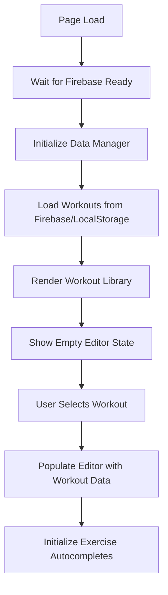

# Workout Builder Page - Architecture & Implementation Plan

## Overview
Transform the workouts page into a horizontal split-screen workout builder with:
- **Top Section**: Horizontal scrollable workout library (compact cards)
- **Bottom Section**: Full workout editor that populates when a workout is selected
- **New Workout Button**: Creates a blank workout in the editor

## Current Issues Identified

### 1. Data Loading Problem
- **Issue**: [`renderWorkoutsView()`](frontend/assets/js/dashboard/views.js:121) is called but workouts aren't loading from Firebase
- **Root Cause**: Component initialization happens before data is loaded
- **Solution**: Ensure data manager loads workouts before rendering

### 2. Modal-Only Editing
- **Issue**: Current implementation only supports modal-based editing
- **Solution**: Create inline editor component that replaces modal workflow

## Architecture Design

### Page Layout Structure

```
┌─────────────────────────────────────────────────────────────┐
│ Header: "Workout Builder" + [New Workout] Button           │
├─────────────────────────────────────────────────────────────┤
│ WORKOUT LIBRARY (Horizontal Scroll - 200px height)         │
│ ┌────┐ ┌────┐ ┌────┐ ┌────┐ ┌────┐                       │
│ │ W1 │ │ W2 │ │ W3 │ │ W4 │ │ W5 │ → → →                │
│ └────┘ └────┘ └────┘ └────┘ └────┘                       │
├─────────────────────────────────────────────────────────────┤
│ WORKOUT EDITOR (Expandable - fills remaining height)       │
│                                                             │
│ [Workout Name Input]                    [Save] [Delete]    │
│ [Description]                                               │
│ [Tags]                                                      │
│                                                             │
│ ┌─ Exercise Group 1 ─────────────────────────────────┐    │
│ │ Exercise A: [Autocomplete Input]                    │    │
│ │ Exercise B: [Autocomplete Input]                    │    │
│ │ Sets: [3]  Reps: [8-12]  Rest: [60s]               │    │
│ └─────────────────────────────────────────────────────┘    │
│                                                             │
│ [+ Add Exercise Group]  [+ Add Bonus Exercise]             │
│                                                             │
└─────────────────────────────────────────────────────────────┘
```

### Component Hierarchy

```
WorkoutsPage
├── WorkoutLibrarySection (Top)
│   ├── WorkoutCard (compact, horizontal scroll)
│   ├── WorkoutCard
│   └── NewWorkoutCard (+ button)
│
└── WorkoutEditorSection (Bottom)
    ├── WorkoutMetadataForm
    │   ├── NameInput
    │   ├── DescriptionTextarea
    │   └── TagsInput
    │
    ├── ExerciseGroupsList
    │   ├── ExerciseGroup (draggable, sortable)
    │   │   ├── ExerciseInput (with autocomplete)
    │   │   ├── SetsRepsRestInputs
    │   │   └── RemoveButton
    │   └── AddGroupButton
    │
    ├── BonusExercisesList
    │   ├── BonusExercise
    │   └── AddBonusButton
    │
    └── EditorActions
        ├── SaveButton
        ├── DeleteButton
        └── CancelButton
```

## Data Flow Architecture

### State Management

```javascript
window.ghostGym.workoutBuilder = {
    // Current state
    selectedWorkoutId: null,
    isEditing: false,
    isDirty: false,
    
    // Editor state
    currentWorkout: {
        id: null,
        name: '',
        description: '',
        tags: [],
        exercise_groups: [],
        bonus_exercises: []
    },
    
    // UI state
    scrollPosition: 0,
    validationErrors: {}
};
```

### Data Loading Sequence



### User Interaction Flows

#### Flow 1: Select Existing Workout
1. User clicks workout card in library
2. Card highlights as "selected"
3. Editor populates with workout data
4. Exercise autocompletes initialize
5. User can edit inline
6. Save button updates workout in Firebase/localStorage
7. Library card updates to reflect changes

#### Flow 2: Create New Workout
1. User clicks "New Workout" button
2. Editor clears and shows blank form
3. One empty exercise group added by default
4. User fills in details
5. Save creates new workout
6. New card appears in library
7. New workout becomes selected

#### Flow 3: Delete Workout
1. User clicks delete in editor
2. Confirmation dialog appears
3. On confirm, workout deleted from Firebase/localStorage
4. Card removed from library
5. Editor returns to empty state

## Implementation Plan

### Phase 1: Fix Data Loading (Priority 1)
**Files to modify:**
- [`frontend/workouts.html`](frontend/workouts.html:1) - Update initialization script
- [`frontend/assets/js/dashboard/views.js`](frontend/assets/js/dashboard/views.js:121) - Fix renderWorkoutsView
- [`frontend/assets/js/components/workout-components.js`](frontend/assets/js/components/workout-components.js:23) - Update workoutGrid component

**Changes:**
1. Ensure [`dataManager.getWorkouts()`](frontend/assets/js/firebase/data-manager.js:441) is called before rendering
2. Add proper error handling for failed loads
3. Show loading spinner while fetching data
4. Handle empty state gracefully

### Phase 2: Create Horizontal Library Layout
**Files to modify:**
- [`frontend/workouts.html`](frontend/workouts.html:183) - Restructure page layout
- [`frontend/assets/css/ghost-gym-custom.css`](frontend/assets/css/ghost-gym-custom.css:1) - Add new styles

**New HTML Structure:**
```html
<!-- Workout Library Section (Top) -->
<div class="workout-library-section">
    <div class="workout-library-header">
        <h5>My Workouts</h5>
        <button id="newWorkoutBtn" class="btn btn-primary btn-sm">
            <i class="bx bx-plus"></i> New Workout
        </button>
    </div>
    <div class="workout-library-scroll" id="workoutLibraryScroll">
        <!-- Horizontal scrolling workout cards -->
    </div>
</div>

<!-- Workout Editor Section (Bottom) -->
<div class="workout-editor-section" id="workoutEditorSection">
    <div class="workout-editor-empty-state" id="editorEmptyState">
        <i class="bx bx-dumbbell display-1 text-muted"></i>
        <h5>Select a workout to edit</h5>
        <p class="text-muted">Or create a new workout to get started</p>
    </div>
    
    <div class="workout-editor-form" id="workoutEditorForm" style="display: none;">
        <!-- Editor content here -->
    </div>
</div>
```

**New CSS Classes:**
```css
.workout-library-section {
    background: var(--bs-card-bg);
    border-radius: var(--bs-border-radius);
    padding: 1rem;
    margin-bottom: 1.5rem;
    max-height: 250px;
}

.workout-library-scroll {
    display: flex;
    gap: 1rem;
    overflow-x: auto;
    overflow-y: hidden;
    padding: 1rem 0;
    scroll-behavior: smooth;
}

.workout-card-compact {
    min-width: 280px;
    max-width: 280px;
    cursor: pointer;
    transition: all 0.2s;
}

.workout-card-compact.selected {
    border: 2px solid var(--bs-primary);
    box-shadow: 0 0 0 3px rgba(var(--bs-primary-rgb), 0.1);
}

.workout-editor-section {
    background: var(--bs-card-bg);
    border-radius: var(--bs-border-radius);
    padding: 2rem;
    min-height: 500px;
}
```

### Phase 3: Build Inline Editor Component
**New file:** `frontend/assets/js/components/workout-editor.js`

**Key Functions:**
```javascript
// Initialize editor
function initWorkoutEditor() {
    setupEditorEventListeners();
    setupAutosave();
}

// Load workout into editor
function loadWorkoutIntoEditor(workoutId) {
    const workout = window.ghostGym.workouts.find(w => w.id === workoutId);
    if (!workout) return;
    
    // Populate form fields
    populateEditorFields(workout);
    
    // Show editor, hide empty state
    showEditor();
    
    // Mark as selected in library
    highlightSelectedWorkout(workoutId);
}

// Create new workout in editor
function createNewWorkoutInEditor() {
    clearEditor();
    addDefaultExerciseGroup();
    showEditor();
    window.ghostGym.workoutBuilder.isEditing = true;
    window.ghostGym.workoutBuilder.selectedWorkoutId = null;
}

// Save workout from editor
async function saveWorkoutFromEditor() {
    const workoutData = collectEditorData();
    
    if (!validateWorkoutData(workoutData)) {
        return;
    }
    
    try {
        if (window.ghostGym.workoutBuilder.selectedWorkoutId) {
            // Update existing
            await updateWorkout(workoutData);
        } else {
            // Create new
            const newWorkout = await window.dataManager.createWorkout(workoutData);
            window.ghostGym.workouts.unshift(newWorkout);
            window.ghostGym.workoutBuilder.selectedWorkoutId = newWorkout.id;
        }
        
        // Refresh library
        renderWorkoutLibrary();
        
        // Mark as clean
        window.ghostGym.workoutBuilder.isDirty = false;
        
        showAlert('Workout saved successfully!', 'success');
    } catch (error) {
        showAlert('Failed to save workout: ' + error.message, 'danger');
    }
}
```

### Phase 4: Implement Exercise Group Management
**Enhance existing:** [`frontend/assets/js/dashboard/workouts.js`](frontend/assets/js/dashboard/workouts.js:250)

**Improvements:**
1. Add drag-and-drop reordering using Sortable.js
2. Add visual feedback for drag operations
3. Implement inline exercise addition
4. Add exercise removal with confirmation
5. Auto-save on changes (with debounce)

**New Features:**
```javascript
// Initialize Sortable for exercise groups
function initExerciseGroupSorting() {
    const container = document.getElementById('exerciseGroups');
    
    new Sortable(container, {
        animation: 150,
        handle: '.drag-handle',
        ghostClass: 'sortable-ghost',
        onEnd: function(evt) {
            // Update order in state
            reorderExerciseGroups(evt.oldIndex, evt.newIndex);
            markEditorDirty();
        }
    });
}

// Add exercise to group with autocomplete
function addExerciseToGroupInline(groupElement) {
    const exerciseCount = groupElement.querySelectorAll('.exercise-input').length;
    
    if (exerciseCount >= 6) {
        showAlert('Maximum 6 exercises per group', 'warning');
        return;
    }
    
    const letter = String.fromCharCode(97 + exerciseCount);
    const exerciseHtml = createExerciseInputHtml(letter);
    
    groupElement.querySelector('.exercise-inputs-container')
        .insertAdjacentHTML('beforeend', exerciseHtml);
    
    // Initialize autocomplete on new input
    initializeExerciseAutocompletes();
    markEditorDirty();
}
```

### Phase 5: Add Autosave & Dirty State Tracking
**New functionality:**

```javascript
// Track changes
let autosaveTimeout = null;

function markEditorDirty() {
    window.ghostGym.workoutBuilder.isDirty = true;
    updateSaveButtonState();
    scheduleAutosave();
}

function scheduleAutosave() {
    clearTimeout(autosaveTimeout);
    autosaveTimeout = setTimeout(() => {
        if (window.ghostGym.workoutBuilder.isDirty) {
            autoSaveWorkout();
        }
    }, 3000); // 3 second debounce
}

async function autoSaveWorkout() {
    if (!window.ghostGym.workoutBuilder.selectedWorkoutId) {
        return; // Don't autosave new unsaved workouts
    }
    
    try {
        await saveWorkoutFromEditor();
        showToast('Workout auto-saved', 'success');
    } catch (error) {
        console.error('Autosave failed:', error);
    }
}

// Warn on navigation if dirty
window.addEventListener('beforeunload', (e) => {
    if (window.ghostGym.workoutBuilder.isDirty) {
        e.preventDefault();
        e.returnValue = 'You have unsaved changes. Are you sure you want to leave?';
    }
});
```

## File Structure

### New Files to Create
```
frontend/assets/js/components/
└── workout-editor.js          # Main editor component logic

frontend/assets/css/
└── workout-builder.css        # Specific styles for builder layout
```

### Files to Modify
```
frontend/
├── workouts.html              # Complete layout restructure
└── assets/
    ├── css/
    │   └── ghost-gym-custom.css   # Add builder styles
    └── js/
        ├── dashboard/
        │   ├── views.js           # Fix data loading
        │   └── workouts.js        # Enhance with editor functions
        └── components/
            └── workout-components.js  # Update component definitions
```

## API Integration

### Required Endpoints (Already Exist)
- `GET /api/v3/firebase/workouts` - Load user workouts
- `POST /api/v3/firebase/workouts` - Create workout
- `PUT /api/v3/firebase/workouts/{id}` - Update workout
- `DELETE /api/v3/firebase/workouts/{id}` - Delete workout

### Data Manager Methods to Use
- [`dataManager.getWorkouts()`](frontend/assets/js/firebase/data-manager.js:441)
- [`dataManager.createWorkout(workoutData)`](frontend/assets/js/firebase/data-manager.js:538)
- Update and delete methods (to be added if not present)

## Testing Checklist

### Functionality Tests
- [ ] Workouts load correctly from Firebase/localStorage
- [ ] Clicking workout card populates editor
- [ ] New workout button creates blank editor
- [ ] Exercise groups can be added/removed
- [ ] Exercise autocomplete works in editor
- [ ] Drag-and-drop reordering works
- [ ] Save button creates/updates workout
- [ ] Delete button removes workout
- [ ] Autosave triggers after changes
- [ ] Dirty state warning on navigation

### UI/UX Tests
- [ ] Horizontal scroll works smoothly
- [ ] Selected workout highlights correctly
- [ ] Editor shows/hides appropriately
- [ ] Loading states display properly
- [ ] Empty states are clear
- [ ] Responsive on mobile (stacks vertically)
- [ ] Dark theme compatibility

### Data Integrity Tests
- [ ] Changes persist after save
- [ ] No data loss on autosave
- [ ] Validation prevents invalid data
- [ ] Firebase sync works correctly
- [ ] LocalStorage fallback works

## Migration Strategy

### Backward Compatibility
1. Keep existing modal code temporarily
2. Add feature flag to toggle between modal and inline editor
3. Test inline editor thoroughly
4. Remove modal code once stable

### User Communication
- Add tooltip: "New inline editing experience!"
- Provide quick tutorial on first use
- Keep "Edit" button in cards for familiarity

## Performance Considerations

### Optimization Strategies
1. **Lazy Load Exercise Autocomplete**: Only initialize when editor is shown
2. **Debounce Autosave**: Prevent excessive API calls
3. **Virtual Scrolling**: If workout library grows large
4. **Memoize Workout Cards**: Prevent unnecessary re-renders
5. **Request Deduplication**: Use existing data manager cache

### Memory Management
- Clear editor state when switching workouts
- Dispose autocomplete instances when not needed
- Limit workout library to recent 50 workouts (with "Load More")

## Accessibility

### ARIA Labels
- Add `role="region"` to library and editor sections
- Label workout cards with `aria-label="Workout: {name}"`
- Mark selected workout with `aria-selected="true"`
- Add `aria-live="polite"` to save status messages

### Keyboard Navigation
- Tab through workout cards
- Enter to select workout
- Escape to clear selection
- Ctrl+S to save (prevent browser save)

## Future Enhancements

### Phase 2 Features (Post-MVP)
1. **Workout Templates**: Save as template, duplicate
2. **Exercise Library Integration**: Browse exercises while editing
3. **Workout Preview**: Visual preview of workout structure
4. **Workout History**: Track changes over time
5. **Collaborative Editing**: Share workouts with others
6. **Mobile App**: Native mobile workout builder

### Advanced Features
- AI-powered exercise suggestions
- Video demonstrations inline
- Progress tracking integration
- Workout scheduling calendar
- Export to PDF/print

## Success Metrics

### Key Performance Indicators
- **Load Time**: < 2 seconds to display workout library
- **Save Time**: < 1 second to save workout
- **User Engagement**: Increased time on workouts page
- **Error Rate**: < 1% failed saves
- **User Satisfaction**: Positive feedback on inline editing

## Conclusion

This architecture transforms the workouts page from a simple card view into a powerful inline workout builder while maintaining the existing data structure and Firebase integration. The horizontal split-screen design provides quick access to all workouts while offering a full-featured editing experience without modal interruptions.

The implementation is broken into manageable phases, starting with fixing the critical data loading issue, then progressively enhancing the UI and functionality. Each phase can be tested independently, reducing risk and allowing for iterative improvements based on user feedback.