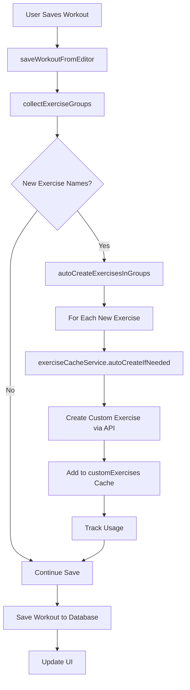
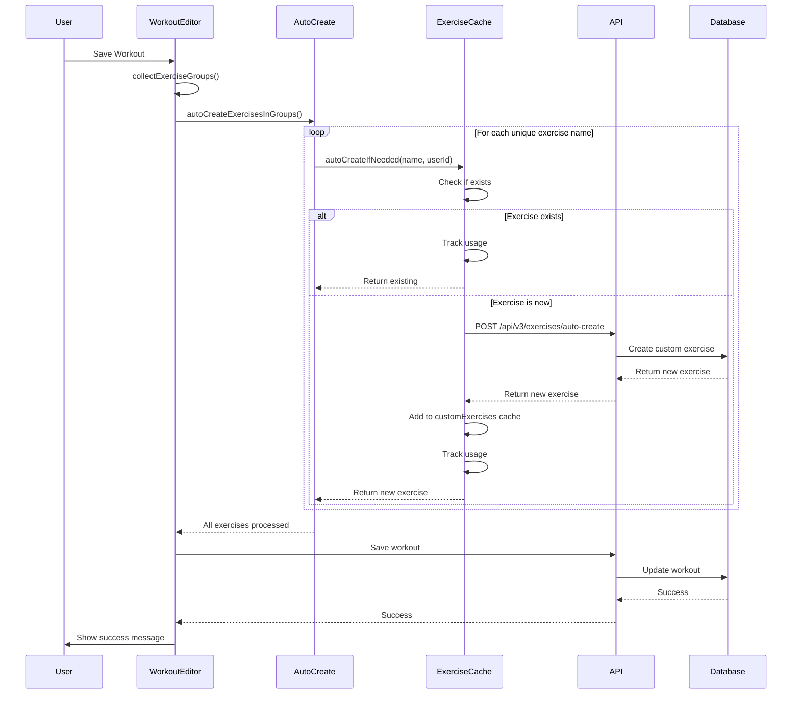

# Workout Builder Auto-Create Custom Exercises Architecture

## Overview

This document outlines the architecture for implementing automatic custom exercise creation in the workout builder when users save workouts with new exercise names that don't exist in the database.

## Current State Analysis

### Existing Auto-Create Implementation

**Location**: [`ExerciseCacheService.autoCreateIfNeeded()`](frontend/assets/js/services/exercise-cache-service.js:483-538)

**Current Usage**:
- ✅ **Bonus Exercise Modal**: Already integrated via `unified-offcanvas-factory.js`
- ❌ **Workout Builder**: NOT integrated - exercises are saved as plain text without auto-creation

**How It Works**:
1. Checks if exercise name already exists (global or custom)
2. If exists: Returns existing exercise and tracks usage
3. If new: Creates custom exercise via API endpoint `/api/v3/exercises/auto-create`
4. Adds to `customExercises` cache
5. Tracks usage for search ranking
6. Notifies listeners about new custom exercise

### Workout Builder Save Flow

**Entry Point**: [`saveWorkoutFromEditor()`](frontend/assets/js/components/workout-editor.js:292-439)

**Current Flow**:
```javascript
saveWorkoutFromEditor(silent = false)
  ↓
  Collects workout data:
    - name, description, tags
    - exercise_groups: collectExerciseGroups()  ← Exercise names collected here
    - bonus_exercises: collectBonusExercises()
  ↓
  Validates data
  ↓
  Saves to database via dataManager.updateWorkout() or createWorkout()
  ↓
  Updates local state
  ↓
  Refreshes UI
```

**Key Function**: [`collectExerciseGroups()`](frontend/assets/js/dashboard/workouts.js:325-401)

**Current Behavior**:
- Reads exercise names from `window.exerciseGroupsData[groupId].exercises`
- Returns array of exercise groups with exercise names as **plain strings**
- No validation or auto-creation occurs

## Problem Statement

When users save a workout in the builder with a new exercise name:
1. ❌ Exercise is saved as plain text string
2. ❌ No custom exercise is created in the database
3. ❌ Exercise won't appear in search results
4. ❌ User can't edit exercise properties later
5. ❌ Exercise won't be tracked for usage statistics

**User's Request**: 
> "when we save an exercise group in the builder with a new exercise that should be loaded into the user custom exercise"

## Proposed Solution

### Architecture Overview



### Implementation Strategy

#### Phase 1: Add Auto-Create Hook to Save Flow

**Location**: [`frontend/assets/js/components/workout-editor.js`](frontend/assets/js/components/workout-editor.js:292)

**Modification Point**: Before saving workout data

```javascript
async function saveWorkoutFromEditor(silent = false) {
    // ... existing validation code ...
    
    // NEW: Auto-create custom exercises for unknown exercise names
    await autoCreateExercisesInGroups(workoutData.exercise_groups);
    
    // Continue with existing save logic...
    if (workoutId) {
        savedWorkout = await window.dataManager.updateWorkout(workoutId, workoutData);
    }
    // ... rest of save logic ...
}
```

#### Phase 2: Implement Auto-Create Helper Function

**New Function**: `autoCreateExercisesInGroups(exerciseGroups)`

**Location**: [`frontend/assets/js/components/workout-editor.js`](frontend/assets/js/components/workout-editor.js) (add after `saveWorkoutFromEditor`)

```javascript
/**
 * Auto-create custom exercises for any unknown exercise names in groups
 * @param {Array} exerciseGroups - Array of exercise group objects
 * @returns {Promise<void>}
 */
async function autoCreateExercisesInGroups(exerciseGroups) {
    if (!exerciseGroups || exerciseGroups.length === 0) return;
    if (!window.exerciseCacheService) {
        console.warn('⚠️ ExerciseCacheService not available');
        return;
    }
    if (!window.dataManager || !window.dataManager.isUserAuthenticated()) {
        console.warn('⚠️ User not authenticated, skipping auto-create');
        return;
    }
    
    try {
        const userId = window.dataManager.getCurrentUserId();
        const allExerciseNames = new Set();
        
        // Collect all unique exercise names from all groups
        exerciseGroups.forEach(group => {
            if (group.exercises) {
                Object.values(group.exercises).forEach(name => {
                    if (name && name.trim()) {
                        allExerciseNames.add(name.trim());
                    }
                });
            }
        });
        
        console.log(`🔍 Found ${allExerciseNames.size} unique exercise names to check`);
        
        // Auto-create each exercise if needed
        const createPromises = Array.from(allExerciseNames).map(exerciseName =>
            window.exerciseCacheService.autoCreateIfNeeded(exerciseName, userId)
        );
        
        const results = await Promise.allSettled(createPromises);
        
        // Count successes
        const created = results.filter(r => r.status === 'fulfilled' && r.value).length;
        const existing = results.filter(r => r.status === 'fulfilled' && !r.value).length;
        const failed = results.filter(r => r.status === 'rejected').length;
        
        if (created > 0) {
            console.log(`✅ Auto-created ${created} custom exercise(s)`);
        }
        if (existing > 0) {
            console.log(`ℹ️ ${existing} exercise(s) already exist`);
        }
        if (failed > 0) {
            console.warn(`⚠️ Failed to create ${failed} exercise(s)`);
        }
        
    } catch (error) {
        console.error('❌ Error in autoCreateExercisesInGroups:', error);
        // Don't throw - allow workout save to continue even if auto-create fails
    }
}
```

#### Phase 3: Update Bonus Exercises (Already Working)

**Status**: ✅ Already implemented in bonus exercise modal

**Location**: `unified-offcanvas-factory.js` (already calls `autoCreateIfNeeded`)

No changes needed - bonus exercises already auto-create correctly.

### Data Flow Diagram



## Benefits

### 1. Seamless User Experience
- ✅ Users can type any exercise name and it "just works"
- ✅ No need to manually create exercises first
- ✅ Exercises immediately searchable after save

### 2. Data Consistency
- ✅ All exercises stored as proper database entities
- ✅ Custom exercises have IDs for future editing
- ✅ Usage tracking works correctly

### 3. Search Integration
- ✅ Custom exercises appear in search results immediately
- ✅ Custom exercises rank higher than global exercises (Priority 1 & 2)
- ✅ Usage tracking boosts frequently-used exercises (0-200 points)

### 4. Future-Proof
- ✅ Enables future exercise editing features
- ✅ Supports exercise analytics and recommendations
- ✅ Allows exercise property management (muscle groups, equipment, etc.)

## Edge Cases & Error Handling

### 1. Network Failures
**Scenario**: API call fails during auto-create

**Handling**:
- Use `Promise.allSettled()` to continue even if some fail
- Log warnings but don't block workout save
- Workout saves with plain text names as fallback

### 2. Duplicate Names
**Scenario**: User types "Bench Press" but "Barbell Bench Press" exists

**Handling**:
- `autoCreateIfNeeded()` checks for exact name match (case-insensitive)
- If exact match exists, returns existing exercise
- If no match, creates new custom exercise with user's exact name
- User's custom "Bench Press" will rank higher than global "Barbell Bench Press"

### 3. Unauthenticated Users
**Scenario**: User not logged in

**Handling**:
- Check `dataManager.isUserAuthenticated()` before auto-create
- Skip auto-create silently
- Workout saves normally with plain text names

### 4. Empty Exercise Names
**Scenario**: User leaves exercise field blank

**Handling**:
- Filter out empty/whitespace-only names
- Only process valid exercise names
- No API calls for empty fields

### 5. Special Characters
**Scenario**: User types "Bench Press (Heavy)" or "Squat - 3x5"

**Handling**:
- Accept any valid string as exercise name
- Backend should sanitize if needed
- Store exactly as user typed

## Testing Strategy

### Unit Tests
1. ✅ Test `autoCreateExercisesInGroups()` with various inputs
2. ✅ Test empty exercise groups
3. ✅ Test duplicate exercise names
4. ✅ Test mixed existing/new exercises

### Integration Tests
1. ✅ Save workout with new exercise names
2. ✅ Verify custom exercises created in database
3. ✅ Verify exercises appear in search
4. ✅ Verify usage tracking works
5. ✅ Test network failure scenarios

### User Acceptance Tests
1. ✅ User types "Bench Press" → saves → searches → finds it
2. ✅ User types multiple new exercises → all created
3. ✅ User types existing exercise → no duplicate created
4. ✅ Custom exercise ranks higher than similar global exercise

## Performance Considerations

### 1. Batch Processing
- ✅ Collect all unique exercise names first
- ✅ Use `Promise.allSettled()` for parallel API calls
- ✅ Avoid sequential processing

### 2. Caching
- ✅ `autoCreateIfNeeded()` checks cache before API call
- ✅ Newly created exercises added to cache immediately
- ✅ No redundant API calls for same exercise

### 3. Non-Blocking
- ✅ Auto-create runs before save but doesn't block on failures
- ✅ Workout save continues even if auto-create fails
- ✅ User experience not degraded by network issues

## Migration Path

### Phase 1: Implement Auto-Create (This PR)
- Add `autoCreateExercisesInGroups()` function
- Integrate into `saveWorkoutFromEditor()`
- Test thoroughly

### Phase 2: Backfill Existing Workouts (Future)
- Script to scan existing workouts
- Auto-create custom exercises for unknown names
- Update workout references to use exercise IDs

### Phase 3: Exercise Editing UI (Future)
- Add edit button to custom exercises
- Allow users to set muscle groups, equipment, etc.
- Update exercise properties via PUT endpoint

## API Requirements

### Existing Endpoint (Already Implemented)
```
POST /api/v3/exercises/auto-create
Authorization: Bearer <token>
Content-Type: application/json

{
  "exercise_name": "Bench Press",
  "user_id": "user123"
}

Response:
{
  "id": "custom_ex_123",
  "name": "Bench Press",
  "isGlobal": false,
  "userId": "user123",
  "createdAt": "2025-01-15T10:30:00Z",
  ...
}
```

### Future Endpoint (Phase 3)
```
PUT /api/v3/exercises/{exercise_id}
Authorization: Bearer <token>
Content-Type: application/json

{
  "name": "Bench Press",
  "targetMuscleGroup": "Chest",
  "primaryEquipment": "Barbell",
  "difficulty": "Intermediate"
}
```

## Security Considerations

### 1. Authentication
- ✅ Check `isUserAuthenticated()` before auto-create
- ✅ Use auth token for API calls
- ✅ Backend validates user owns custom exercises

### 2. Rate Limiting
- ✅ Batch processing reduces API calls
- ✅ Cache checks prevent duplicate requests
- ✅ Backend should implement rate limiting

### 3. Input Validation
- ✅ Frontend trims whitespace
- ✅ Backend should sanitize exercise names
- ✅ Prevent SQL injection, XSS, etc.

## Success Metrics

### Immediate (Phase 1)
- ✅ Custom exercises auto-created on workout save
- ✅ Custom exercises appear in search results
- ✅ Custom exercises rank higher than global exercises
- ✅ No errors or performance degradation

### Short-term (1-2 weeks)
- 📊 % of workouts using custom exercises
- 📊 Average custom exercises per user
- 📊 Search usage of custom vs global exercises
- 📊 User satisfaction with search results

### Long-term (1-3 months)
- 📊 Reduction in "exercise not found" support tickets
- 📊 Increase in workout creation completion rate
- 📊 User retention and engagement metrics

## Implementation Checklist

### Code Changes
- [ ] Add `autoCreateExercisesInGroups()` to `workout-editor.js`
- [ ] Integrate into `saveWorkoutFromEditor()` flow
- [ ] Add error handling and logging
- [ ] Make function globally available

### Testing
- [ ] Test with new exercise names
- [ ] Test with existing exercise names
- [ ] Test with mixed new/existing
- [ ] Test with empty exercise names
- [ ] Test network failure scenarios
- [ ] Test unauthenticated users

### Documentation
- [x] Architecture document (this file)
- [ ] Update WORKOUT_BUILDER_QUICKSTART.md
- [ ] Update WORKOUT_BUILDER_IMPLEMENTATION_SUMMARY.md
- [ ] Add inline code comments

### Deployment
- [ ] Code review
- [ ] QA testing
- [ ] Staging deployment
- [ ] Production deployment
- [ ] Monitor for errors

## Related Documents

- [AUTO_CREATE_CUSTOM_EXERCISES_ARCHITECTURE.md](AUTO_CREATE_CUSTOM_EXERCISES_ARCHITECTURE.md) - Original auto-create design
- [CUSTOM_EXERCISE_SEARCH_FIX_IMPLEMENTATION_SUMMARY.md](CUSTOM_EXERCISE_SEARCH_FIX_IMPLEMENTATION_SUMMARY.md) - Search ranking implementation
- [WORKOUT_BUILDER_ARCHITECTURE.md](WORKOUT_BUILDER_ARCHITECTURE.md) - Workout builder overview
- [ExerciseCacheService](frontend/assets/js/services/exercise-cache-service.js) - Cache service implementation

## Conclusion

This architecture provides a seamless, user-friendly solution for auto-creating custom exercises in the workout builder. By integrating with the existing `ExerciseCacheService.autoCreateIfNeeded()` method, we leverage proven functionality while extending it to a new use case.

The implementation is:
- ✅ **Simple**: Single function addition to existing save flow
- ✅ **Robust**: Handles edge cases and errors gracefully
- ✅ **Performant**: Batch processing with parallel API calls
- ✅ **User-Friendly**: Transparent to users, "just works"
- ✅ **Future-Proof**: Enables exercise editing and analytics

**Next Steps**: Switch to Code mode to implement the solution.