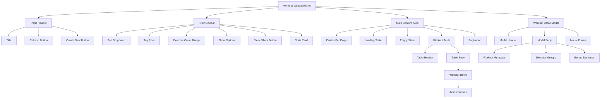
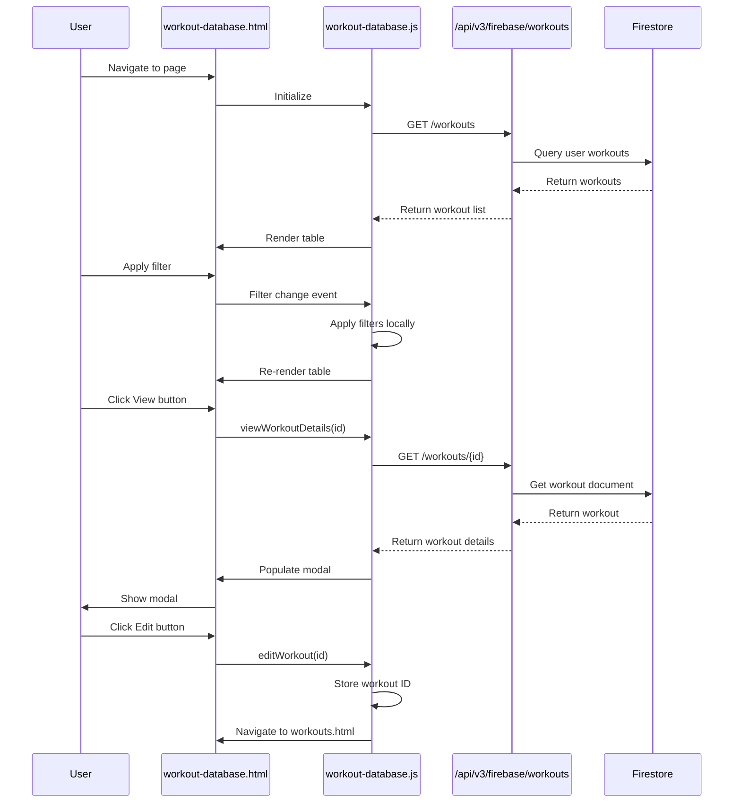
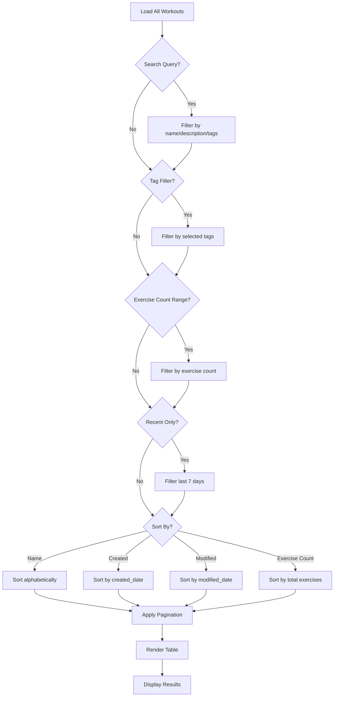

# Workout Database Architecture Documentation
## Ghost Gym V2 - Workout Library Page Design

**Created:** October 28, 2025  
**Version:** 1.0.0  
**Status:** Architecture & Planning Phase

---

## 📋 Table of Contents

1. [Overview](#overview)
2. [Current State Analysis](#current-state-analysis)
3. [Page Architecture](#page-architecture)
4. [Data Structure](#data-structure)
5. [Component Specifications](#component-specifications)
6. [API Integration](#api-integration)
7. [Implementation Plan](#implementation-plan)
8. [Mermaid Diagrams](#mermaid-diagrams)

---

## 🎯 Overview

### Purpose
Create a dedicated Workout Database page similar to the Exercise Database, providing users with a filterable, sortable list of their workout templates with three primary actions: Edit, Do (coming soon), and View.

### Key Requirements
- **Filterable List**: Search by name, tags, description
- **Sortable**: By name, date created, date modified, number of exercises
- **Three Actions per Workout**:
  - **Edit**: Navigate to workout editor with selected workout
  - **Do**: (Coming soon) Link to workout execution page
  - **View**: Open large popover/modal showing full workout details
- **Responsive Design**: Mobile-first approach
- **Firebase Integration**: Pull from user's workout collection

### Design Philosophy
Follow the established patterns from [`exercise-database.html`](frontend/exercise-database.html) for consistency while adapting for workout-specific needs.

---

## 🔍 Current State Analysis

### Existing Workout Data Structure (from Firestore)

Based on [`firestore_structure.json`](backend/scripts/firestore_structure.json) and [`models.py`](backend/models.py):

```typescript
interface WorkoutTemplate {
  id: string;                          // e.g., "workout-abc123"
  name: string;                        // e.g., "Push Day A"
  description?: string;                // Optional description
  exercise_groups: ExerciseGroup[];    // Array of exercise groups
  bonus_exercises: BonusExercise[];    // Array of bonus exercises
  tags: string[];                      // e.g., ["push", "chest", "beginner"]
  created_date: string | Timestamp;    // ISO string or Firestore timestamp
  modified_date: string | Timestamp;   // ISO string or Firestore timestamp
  is_template: boolean;                // Always true for templates
}

interface ExerciseGroup {
  group_id: string;
  exercises: { [key: string]: string }; // e.g., { "a": "Bench Press", "b": "Incline Press" }
  sets: string;                         // e.g., "3"
  reps: string;                         // e.g., "8-12"
  rest: string;                         // e.g., "60s"
}

interface BonusExercise {
  exercise_id: string;
  name: string;
  sets: string;
  reps: string;
  rest: string;
}
```

### Existing API Endpoints

From [`backend/api/workouts.py`](backend/api/workouts.py):

**Firebase-enabled endpoints** (preferred):
- `GET /api/v3/firebase/workouts/` - Get all user workouts with pagination
- `GET /api/v3/firebase/workouts/{workout_id}` - Get specific workout
- `PUT /api/v3/firebase/workouts/{workout_id}` - Update workout
- `DELETE /api/v3/firebase/workouts/{workout_id}` - Delete workout

**Query Parameters**:
- `page`: Page number (default: 1)
- `page_size`: Items per page (default: 50)
- `search`: Search query
- `tags`: Filter by tags (array)

### Existing Patterns from Exercise Database

From [`exercise-database.html`](frontend/exercise-database.html) and [`exercises.js`](frontend/assets/js/dashboard/exercises.js):

**Layout Structure**:
- Sidebar filters (left, 3 columns on desktop)
- Main content area (right, 9 columns on desktop)
- Table-based display with pagination
- Stats card showing counts

**Key Features**:
- Search functionality
- Multiple filter dropdowns
- Sort options
- Pagination controls
- Loading/empty states
- Action buttons per row

---

## 🏗️ Page Architecture

### File Structure

```
frontend/
├── workout-database.html              # NEW: Main workout database page
├── assets/
│   ├── css/
│   │   └── workout-database.css       # NEW: Workout DB specific styles
│   └── js/
│       └── dashboard/
│           └── workout-database.js    # NEW: Workout DB logic
```

### HTML Layout Structure

```html
<div class="container-xxl">
  <!-- Page Header -->
  <div class="page-header">
    <h4>Workout Library</h4>
    <div class="actions">
      <button id="refreshWorkoutsBtn">Refresh</button>
      <button id="createWorkoutBtn">Create New</button>
    </div>
  </div>

  <div class="row">
    <!-- Filters Sidebar (col-lg-3) -->
    <div class="col-lg-3">
      <div class="card">
        <!-- Sort By -->
        <!-- Filter by Tags -->
        <!-- Filter by Exercise Count -->
        <!-- Show Options (checkboxes) -->
        <!-- Clear Filters Button -->
      </div>
      
      <!-- Stats Card -->
      <div class="card">
        <!-- Total Workouts -->
        <!-- Showing Count -->
        <!-- Last Modified -->
      </div>
    </div>

    <!-- Workout List (col-lg-9) -->
    <div class="col-lg-9">
      <div class="card">
        <!-- Top Bar with Entries Per Page -->
        
        <!-- Loading/Empty States -->
        
        <!-- Workout Table -->
        <table class="table">
          <thead>
            <tr>
              <th>Workout Name</th>
              <th>Exercise Groups</th>
              <th>Total Exercises</th>
              <th>Tags</th>
              <th>Last Modified</th>
              <th>Actions</th>
            </tr>
          </thead>
          <tbody>
            <!-- Workout rows -->
          </tbody>
        </table>
        
        <!-- Pagination Footer -->
      </div>
    </div>
  </div>
</div>

<!-- Workout Detail Modal -->
<div class="modal" id="workoutDetailModal">
  <!-- Large modal showing full workout details -->
</div>
```

---

## 📊 Data Structure

### Global State

```javascript
window.ghostGym = window.ghostGym || {};
window.ghostGym.workoutDatabase = {
  all: [],              // All workouts from API
  filtered: [],         // After applying filters
  displayed: [],        // Current page items
  currentPage: 1,
  pageSize: 50,
  filters: {
    search: '',
    tags: [],
    minExercises: null,
    maxExercises: null,
    sortBy: 'modified_date', // 'name', 'created_date', 'modified_date', 'exercise_count'
    sortOrder: 'desc'        // 'asc', 'desc'
  },
  stats: {
    total: 0,
    showing: 0,
    lastModified: null
  }
};
```

### Computed Properties

```javascript
// Total exercise count per workout
function getTotalExerciseCount(workout) {
  return workout.exercise_groups.reduce((sum, group) => {
    return sum + Object.keys(group.exercises || {}).length;
  }, 0) + (workout.bonus_exercises?.length || 0);
}

// Get all unique tags across workouts
function getAllTags() {
  const tagSet = new Set();
  window.ghostGym.workoutDatabase.all.forEach(workout => {
    (workout.tags || []).forEach(tag => tagSet.add(tag));
  });
  return Array.from(tagSet).sort();
}
```

---

## 🧩 Component Specifications

### 1. Filter Sidebar

**Sort By Dropdown**:
```html
<select id="sortBySelect">
  <option value="modified_date">Recently Modified</option>
  <option value="created_date">Recently Created</option>
  <option value="name">Alphabetical (A-Z)</option>
  <option value="exercise_count">Most Exercises</option>
</select>
```

**Tag Filter** (Multi-select or dropdown):
```html
<select id="tagFilter" multiple>
  <!-- Dynamically populated from getAllTags() -->
</select>
```

**Exercise Count Range**:
```html
<div class="exercise-count-filter">
  <label>Exercise Count</label>
  <div class="d-flex gap-2">
    <input type="number" id="minExercises" placeholder="Min" min="0">
    <input type="number" id="maxExercises" placeholder="Max" min="0">
  </div>
</div>
```

**Show Options** (Checkboxes):
```html
<div class="form-check">
  <input type="checkbox" id="showRecentOnly">
  <label>Modified in Last 7 Days</label>
</div>
```

### 2. Workout Table Row

```html
<tr class="workout-row" data-workout-id="${workout.id}">
  <td class="workout-name">
    <div class="d-flex align-items-center">
      <i class="bx bx-dumbbell me-2"></i>
      <div>
        <strong>${workout.name}</strong>
        ${workout.description ? `<br><small class="text-muted">${workout.description}</small>` : ''}
      </div>
    </div>
  </td>
  <td class="text-center">
    <span class="badge bg-label-primary">${workout.exercise_groups.length}</span>
  </td>
  <td class="text-center">
    <span class="badge bg-label-info">${getTotalExerciseCount(workout)}</span>
  </td>
  <td>
    ${workout.tags.map(tag => `<span class="badge bg-label-secondary">${tag}</span>`).join(' ')}
  </td>
  <td>
    <small>${formatDate(workout.modified_date)}</small>
  </td>
  <td>
    <div class="btn-group btn-group-sm">
      <button class="btn btn-outline-primary" onclick="editWorkout('${workout.id}')" title="Edit">
        <i class="bx bx-edit"></i>
      </button>
      <button class="btn btn-outline-secondary" onclick="doWorkout('${workout.id}')" title="Do Workout" disabled>
        <i class="bx bx-play"></i>
      </button>
      <button class="btn btn-outline-info" onclick="viewWorkoutDetails('${workout.id}')" title="View Details">
        <i class="bx bx-show"></i>
      </button>
    </div>
  </td>
</tr>
```

### 3. Workout Detail Modal

**Large Modal Structure**:
```html
<div class="modal fade" id="workoutDetailModal" tabindex="-1">
  <div class="modal-dialog modal-xl">
    <div class="modal-content">
      <div class="modal-header">
        <h5 class="modal-title">
          <i class="bx bx-dumbbell me-2"></i>
          <span id="workoutDetailName"></span>
        </h5>
        <button type="button" class="btn-close" data-bs-dismiss="modal"></button>
      </div>
      
      <div class="modal-body">
        <!-- Workout Metadata -->
        <div class="workout-detail-meta mb-4">
          <p id="workoutDetailDescription"></p>
          <div class="d-flex gap-3">
            <span><i class="bx bx-calendar"></i> Created: <span id="workoutDetailCreated"></span></span>
            <span><i class="bx bx-time"></i> Modified: <span id="workoutDetailModified"></span></span>
          </div>
          <div id="workoutDetailTags" class="mt-2"></div>
        </div>
        
        <!-- Exercise Groups -->
        <h6 class="mb-3">Exercise Groups</h6>
        <div id="workoutDetailGroups" class="mb-4">
          <!-- Rendered exercise groups -->
        </div>
        
        <!-- Bonus Exercises -->
        <div id="workoutDetailBonusSection" style="display: none;">
          <h6 class="mb-3">Bonus Exercises</h6>
          <div id="workoutDetailBonus"></div>
        </div>
      </div>
      
      <div class="modal-footer">
        <button type="button" class="btn btn-secondary" data-bs-dismiss="modal">Close</button>
        <button type="button" class="btn btn-outline-primary" onclick="editWorkoutFromModal()">
          <i class="bx bx-edit me-1"></i>Edit Workout
        </button>
        <button type="button" class="btn btn-primary" onclick="doWorkoutFromModal()" disabled>
          <i class="bx bx-play me-1"></i>Do Workout (Coming Soon)
        </button>
      </div>
    </div>
  </div>
</div>
```

**Exercise Group Display in Modal**:
```html
<div class="exercise-group-detail card mb-3">
  <div class="card-body">
    <h6 class="card-title">Group ${index + 1}</h6>
    <div class="exercise-list">
      ${Object.entries(group.exercises).map(([key, name]) => `
        <div class="exercise-item">
          <span class="exercise-letter">${key.toUpperCase()}</span>
          <span class="exercise-name">${name}</span>
        </div>
      `).join('')}
    </div>
    <div class="exercise-params mt-3">
      <span class="badge bg-label-primary">Sets: ${group.sets}</span>
      <span class="badge bg-label-info">Reps: ${group.reps}</span>
      <span class="badge bg-label-secondary">Rest: ${group.rest}</span>
    </div>
  </div>
</div>
```

---

## 🔌 API Integration

### Data Loading Flow

```javascript
async function loadWorkouts() {
  try {
    showLoading();
    
    // Use Firebase-enabled endpoint
    const response = await fetch('/api/v3/firebase/workouts/', {
      headers: {
        'Authorization': `Bearer ${getAuthToken()}`
      }
    });
    
    const data = await response.json();
    
    window.ghostGym.workoutDatabase.all = data.workouts;
    window.ghostGym.workoutDatabase.stats.total = data.total_count;
    
    applyFilters();
    renderWorkoutTable();
    updateStats();
    
  } catch (error) {
    console.error('Failed to load workouts:', error);
    showError('Failed to load workouts');
  }
}
```

### Search Implementation

```javascript
async function searchWorkouts(query) {
  try {
    const response = await fetch(
      `/api/v3/firebase/workouts/?search=${encodeURIComponent(query)}`,
      {
        headers: {
          'Authorization': `Bearer ${getAuthToken()}`
        }
      }
    );
    
    const data = await response.json();
    return data.workouts;
    
  } catch (error) {
    console.error('Search failed:', error);
    return [];
  }
}
```

### Action Handlers

```javascript
// Edit Workout - Navigate to workout editor
function editWorkout(workoutId) {
  // Store workout ID in sessionStorage
  sessionStorage.setItem('editWorkoutId', workoutId);
  // Navigate to workouts.html (editor page)
  window.location.href = 'workouts.html';
}

// Do Workout - Coming soon
function doWorkout(workoutId) {
  showAlert('Workout execution feature coming soon!', 'info');
  // Future: Navigate to workout-do.html?id=${workoutId}
}

// View Details - Open modal
async function viewWorkoutDetails(workoutId) {
  try {
    const response = await fetch(`/api/v3/firebase/workouts/${workoutId}`, {
      headers: {
        'Authorization': `Bearer ${getAuthToken()}`
      }
    });
    
    const workout = await response.json();
    populateWorkoutDetailModal(workout);
    
    const modal = new bootstrap.Modal(document.getElementById('workoutDetailModal'));
    modal.show();
    
  } catch (error) {
    console.error('Failed to load workout details:', error);
    showAlert('Failed to load workout details', 'danger');
  }
}
```

---

## 📝 Implementation Plan

### Phase 1: Core Structure (Day 1)
- [ ] Create [`workout-database.html`](frontend/workout-database.html)
- [ ] Set up basic layout with sidebar and main content
- [ ] Add filter controls (non-functional)
- [ ] Create table structure
- [ ] Add loading/empty states

### Phase 2: JavaScript Logic (Day 1-2)
- [ ] Create [`workout-database.js`](frontend/assets/js/dashboard/workout-database.js)
- [ ] Implement data loading from API
- [ ] Add filtering logic
- [ ] Add sorting logic
- [ ] Implement pagination
- [ ] Add search functionality

### Phase 3: Actions & Modal (Day 2)
- [ ] Implement Edit action (navigation)
- [ ] Create workout detail modal
- [ ] Populate modal with workout data
- [ ] Add Do action placeholder
- [ ] Test all action buttons

### Phase 4: Styling (Day 2-3)
- [ ] Create [`workout-database.css`](frontend/assets/css/workout-database.css)
- [ ] Style filter sidebar
- [ ] Style workout table
- [ ] Style workout detail modal
- [ ] Add responsive breakpoints
- [ ] Polish animations and transitions

### Phase 5: Integration & Testing (Day 3)
- [ ] Add menu link to workout database
- [ ] Test with real Firebase data
- [ ] Test all filters and sorting
- [ ] Test pagination
- [ ] Test modal functionality
- [ ] Mobile responsiveness testing

### Phase 6: Polish & Documentation (Day 3)
- [ ] Add tooltips and help text
- [ ] Optimize performance
- [ ] Add error handling
- [ ] Update user documentation
- [ ] Code review and cleanup

---

## 🎨 Mermaid Diagrams

### Page Component Hierarchy



### Data Flow



### Filter & Sort Logic



---

## 🔧 Technical Considerations

### Performance Optimization
- **Client-side filtering**: Filter and sort locally after initial load
- **Pagination**: Limit displayed rows to improve render performance
- **Lazy loading**: Load workout details only when modal is opened
- **Caching**: Cache workout list for session duration

### Responsive Design
- **Mobile**: Stack filters above table, single column layout
- **Tablet**: 2-column layout with collapsible filters
- **Desktop**: 3-column sidebar + 9-column main content

### Accessibility
- **ARIA labels**: All interactive elements
- **Keyboard navigation**: Tab through filters and actions
- **Screen reader support**: Descriptive labels and announcements
- **Focus management**: Proper focus handling in modal

### Error Handling
- **Network errors**: Show retry button
- **Empty states**: Helpful messages with CTAs
- **Loading states**: Skeleton screens or spinners
- **Validation**: Client-side validation before API calls

---

## 🔗 Site-Wide Integration Checklist

### Files That Need Updates

#### 1. Menu System
**File**: [`frontend/assets/js/components/menu-template.js`](frontend/assets/js/components/menu-template.js)

Add new menu item after Exercise Database (around line 58):
```javascript
<li class="menu-item ${activePage === 'workout-database' ? 'active' : ''}">
    <a href="workout-database.html" class="menu-link">
        <i class="menu-icon tf-icons bx bx-library"></i>
        <div class="text-truncate">Workout Library</div>
    </a>
</li>
```

**File**: [`frontend/assets/js/services/menu-injection-service.js`](frontend/assets/js/services/menu-injection-service.js)

Update `getActivePageFromURL()` method (around line 161):
```javascript
if (filename.includes('workout-database')) return 'workout-database';
```

#### 2. Backend Routes (if needed)
**File**: [`backend/main.py`](backend/main.py)

Add HTML route for the new page:
```python
@app.get("/workout-database.html", response_class=HTMLResponse)
async def workout_database_page():
    return FileResponse("frontend/workout-database.html")
```

#### 3. Navigation Links
Check these files for any hardcoded workout links that might need updating:
- [`frontend/index.html`](frontend/index.html) - Dashboard home page
- [`frontend/programs.html`](frontend/programs.html) - Programs page
- [`frontend/workouts.html`](frontend/workouts.html) - Workout builder page

#### 4. Related Pages That May Link to Workout Database

**Workout Builder** ([`frontend/workouts.html`](frontend/workouts.html)):
- Consider adding a "View All Workouts" button that links to workout-database.html
- Add breadcrumb or navigation hint

**Programs Page** ([`frontend/programs.html`](frontend/programs.html)):
- May want to add link to workout library when adding workouts to programs

**Dashboard** ([`frontend/index.html`](frontend/index.html)):
- Consider adding a "Workout Library" card/link in the main dashboard

#### 5. CSS Dependencies
Ensure these CSS files are loaded in workout-database.html:
- `/static/assets/vendor/css/core.css` - Core styles
- `/static/assets/css/demo.css` - Demo styles
- `/static/assets/css/ghost-gym-custom.css` - Custom Ghost Gym styles
- `/static/assets/css/workout-database.css` - NEW: Page-specific styles

#### 6. JavaScript Dependencies
Ensure these JS files are loaded in workout-database.html (in order):
1. Core libraries (jQuery, Popper, Bootstrap)
2. Menu templates (`menu-template.js`, `auth-modals-template.js`)
3. Menu injection service (`menu-injection-service.js`)
4. Main JS (`main.js`)
5. Firebase services (`firebase-init.js`, `auth-service.js`, `data-manager.js`)
6. UI helpers (`ui-helpers.js`)
7. NEW: Workout database logic (`workout-database.js`)

---

## 📚 Related Documentation

- [Exercise Database Architecture](EXERCISE_DATABASE_ARCHITECTURE.md)
- [Workout Builder Architecture](WORKOUT_BUILDER_ARCHITECTURE.md)
- [Firebase Setup Guide](FIREBASE_SETUP_GUIDE.md)
- [API Documentation](backend/api/workouts.py)

---

## ✅ Success Criteria

### Functionality
- [ ] Page loads and displays all user workouts
- [ ] All filters work correctly
- [ ] Sorting functions properly
- [ ] Pagination works smoothly
- [ ] Edit button navigates to workout editor
- [ ] View button opens modal with full details
- [ ] Do button shows "coming soon" message
- [ ] Mobile responsive design works
- [ ] Performance is acceptable (< 2s load time)
- [ ] No console errors

### Integration
- [ ] Menu item added and highlights correctly
- [ ] Menu navigation works from all pages
- [ ] Page accessible via direct URL
- [ ] Backend route serves page correctly (if applicable)
- [ ] All CSS dependencies load properly
- [ ] All JS dependencies load in correct order
- [ ] Firebase authentication works
- [ ] Data loads from correct API endpoints

### Cross-Page Compatibility
- [ ] Can navigate to workout editor from database
- [ ] Can return to database from editor
- [ ] Session state preserved across navigation
- [ ] No conflicts with existing pages
- [ ] Consistent styling with other pages

---

## 🚀 Implementation Checklist

### Phase 0: Pre-Implementation (Complete First)
- [ ] Update menu template to include workout database link
- [ ] Update menu injection service to recognize new page
- [ ] Add backend route (if needed)
- [ ] Test menu navigation works

### Phase 1: Core Structure
- [ ] Create `workout-database.html` with proper head section
- [ ] Add all CSS dependencies
- [ ] Add all JS dependencies in correct order
- [ ] Set up basic layout structure
- [ ] Test page loads without errors

### Phase 2: JavaScript Logic
- [ ] Create `workout-database.js`
- [ ] Implement data loading
- [ ] Implement filtering
- [ ] Implement sorting
- [ ] Implement pagination
- [ ] Test all functionality

### Phase 3: Actions & Modal
- [ ] Implement Edit action
- [ ] Create workout detail modal
- [ ] Implement View action
- [ ] Add Do action placeholder
- [ ] Test all actions

### Phase 4: Styling
- [ ] Create `workout-database.css`
- [ ] Style all components
- [ ] Add responsive breakpoints
- [ ] Test on mobile/tablet/desktop
- [ ] Polish animations

### Phase 5: Integration Testing
- [ ] Test navigation from all pages
- [ ] Test navigation to all pages
- [ ] Test with authenticated user
- [ ] Test with anonymous user
- [ ] Test data persistence
- [ ] Cross-browser testing

### Phase 6: Documentation & Cleanup
- [ ] Update user documentation
- [ ] Add code comments
- [ ] Remove debug logging
- [ ] Final QA pass

---

**Document Status**: Ready for Implementation
**Next Step**: Switch to Code mode for implementation

**IMPORTANT**: Before creating any new files, first update the menu system files to ensure the new page is accessible from the navigation menu.
