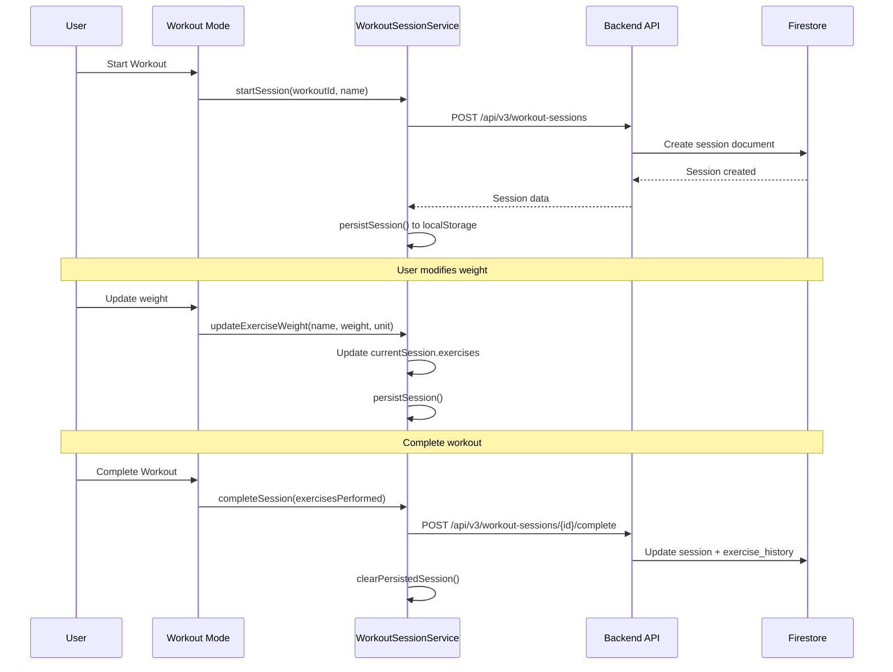

# Workout Data Persistence Enhancement - Architecture & Implementation Plan

**Version:** 1.0.0  
**Date:** 2025-11-27  
**Status:** Planning Phase

---

## 📋 Executive Summary

This document outlines a comprehensive plan to enhance the Ghost Gym V2 workout data storage system to ensure complete session data persistence, including tracking of default values, user modifications, skipped exercises, and visual progression indicators.

### Current State Analysis (Based on Actual Code)

**What's Working:**
- ✅ Weight tracking for exercises that users modify
- ✅ Session persistence via localStorage for page refresh recovery
- ✅ Exercise history tracking with last weight and PR
- ✅ Bonus exercise management (pre-workout and during session)
- ✅ Auto-save functionality during active sessions
- ✅ Template weight updates after session completion

**What's Missing:**
- ❌ Default values from templates are NOT saved when users don't edit them
- ❌ No tracking of skipped exercises
- ❌ No visual distinction between modified vs default values in history
- ❌ History page doesn't show reps/sets data (only weights)
- ❌ No color coding or visual indicators for progression
- ❌ No notes field for individual exercises during workout

---

## 🎯 Project Goals

### Primary Objectives
1. **Complete Data Capture**: Save ALL exercise data from templates, even when users don't modify values
2. **Skip Tracking**: Allow users to skip exercises and record this in the database
3. **Visual Progression**: Implement color coding and indicators to show what changed between sessions
4. **Enhanced History**: Display complete workout data including sets, reps, and notes in history view

### Success Criteria
- [ ] 100% of template data is saved to workout sessions (not just user-modified values)
- [ ] Users can skip exercises with a single button click
- [ ] History view clearly shows progression with color-coded indicators
- [ ] Users can see exactly what changed from their last workout
- [ ] System works seamlessly with existing localStorage persistence

---

## 🔍 Current System Analysis

### Data Flow (As Implemented)



### Current Data Models (From backend/models.py)

```python
class ExercisePerformance(BaseModel):
    exercise_name: str
    exercise_id: Optional[str]
    group_id: str
    
    # Performance Data
    sets_completed: int = 0
    target_sets: str = "3"
    target_reps: str = "8-12"
    
    # Weight Tracking
    weight: Optional[float] = None  # ⚠️ Only saved if user modifies
    weight_unit: str = "lbs"
    weight_notes: Optional[str] = None
    
    # Set-by-Set Detail (Optional)
    set_details: List[SetDetail] = []
    
    # Changes from Previous
    previous_weight: Optional[float] = None
    weight_change: Optional[float] = None
    
    # Metadata
    order_index: int
    is_bonus: bool = False
```

### Key Issue: Data Collection Logic

In [`workout-mode-controller.js:collectExerciseData()`](frontend/assets/js/controllers/workout-mode-controller.js:452):

```javascript
collectExerciseData() {
    const exercisesPerformed = [];
    
    this.currentWorkout.exercise_groups.forEach((group, groupIndex) => {
        const mainExercise = group.exercises?.a;
        const weightData = this.sessionService.getExerciseWeight(mainExercise);
        // ⚠️ PROBLEM: weightData is null if user never clicked weight button
        
        exercisesPerformed.push({
            exercise_name: mainExercise,
            weight: weightData?.weight || 0,  // ❌ Defaults to 0, not template value
            weight_unit: weightData?.weight_unit || 'lbs',
            // ... other fields
        });
    });
}
```

**Root Cause**: The system only tracks exercises in `currentSession.exercises` when users explicitly modify them via the weight modal. Template default values are never captured.

---

## 🏗️ Enhanced Architecture Design

### Phase 1: Complete Data Capture

#### 1.1 Auto-Initialize Session Exercises

**Location**: [`workout-session-service.js:startSession()`](frontend/assets/js/services/workout-session-service.js:25)

**Change**: Pre-populate `currentSession.exercises` with ALL exercises from template on session start:

```javascript
async startSession(workoutId, workoutName) {
    // ... existing session creation code ...
    
    // NEW: Pre-populate with template data
    this.currentSession.exercises = {};
    
    // Get workout template
    const workout = await window.dataManager.getWorkouts()
        .then(workouts => workouts.find(w => w.id === workoutId));
    
    if (workout) {
        // Initialize regular exercises
        workout.exercise_groups?.forEach((group, index) => {
            const exerciseName = group.exercises?.a;
            if (exerciseName) {
                this.currentSession.exercises[exerciseName] = {
                    weight: group.default_weight || null,
                    weight_unit: group.default_weight_unit || 'lbs',
                    target_sets: group.sets || '3',
                    target_reps: group.reps || '8-12',
                    rest: group.rest || '60s',
                    previous_weight: null,
                    weight_change: 0,
                    order_index: index,
                    is_bonus: false,
                    is_modified: false,  // NEW: Track if user changed it
                    is_skipped: false,   // NEW: Track if user skipped it
                    notes: ''            // NEW: Per-exercise notes
                };
            }
        });
        
        // Initialize bonus exercises
        workout.bonus_exercises?.forEach((bonus, index) => {
            this.currentSession.exercises[bonus.name] = {
                weight: bonus.default_weight || null,
                weight_unit: bonus.default_weight_unit || 'lbs',
                target_sets: bonus.sets || '3',
                target_reps: bonus.reps || '12',
                rest: bonus.rest || '30s',
                previous_weight: null,
                weight_change: 0,
                order_index: workout.exercise_groups.length + index,
                is_bonus: true,
                is_modified: false,
                is_skipped: false,
                notes: ''
            };
        });
    }
    
    // Persist immediately with all template data
    this.persistSession();
}
```

#### 1.2 Track Modifications

**Location**: [`workout-session-service.js:updateExerciseWeight()`](frontend/assets/js/services/workout-session-service.js:247)

```javascript
updateExerciseWeight(exerciseName, weight, unit) {
    if (!this.currentSession?.exercises) return;
    
    const existingData = this.currentSession.exercises[exerciseName] || {};
    
    this.currentSession.exercises[exerciseName] = {
        ...existingData,
        weight: weight,
        weight_unit: unit,
        is_modified: true,  // NEW: Mark as user-modified
        modified_at: new Date().toISOString()  // NEW: Track when
    };
    
    this.persistSession();
}
```

---

### Phase 2: Skip Functionality

#### 2.1 Database Schema Enhancement

**Location**: [`backend/models.py:ExercisePerformance`](backend/models.py:799)

```python
class ExercisePerformance(BaseModel):
    # ... existing fields ...
    
    # NEW: Skip tracking
    is_skipped: bool = Field(default=False, description="Whether exercise was skipped")
    skip_reason: Optional[str] = Field(None, max_length=200, description="Reason for skipping")
    
    # NEW: Modification tracking
    is_modified: bool = Field(default=False, description="Whether user modified from template")
    modified_at: Optional[datetime] = Field(None, description="When user last modified")
    
    # NEW: Per-exercise notes
    exercise_notes: Optional[str] = Field(None, max_length=500, description="Notes for this exercise")
```

#### 2.2 UI Implementation

**Location**: [`exercise-card-renderer.js`](frontend/assets/js/components/exercise-card-renderer.js)

Add skip button to exercise card:

```javascript
renderCard(group, index, isBonus, totalCards) {
    // ... existing card HTML ...
    
    // NEW: Skip button in card header
    const skipButton = `
        <button class="btn btn-sm btn-outline-warning skip-exercise-btn"
                onclick="window.workoutModeController.handleSkipExercise('${exerciseName}', ${index})"
                title="Skip this exercise">
            <i class="bx bx-skip-next"></i>
        </button>
    `;
    
    // Add to card header actions
}
```

#### 2.3 Controller Method

**Location**: [`workout-mode-controller.js`](frontend/assets/js/controllers/workout-mode-controller.js)

```javascript
/**
 * Handle skipping an exercise
 */
handleSkipExercise(exerciseName, index) {
    const modalManager = this.getModalManager();
    
    modalManager.confirm(
        'Skip Exercise',
        `Skip <strong>${this.escapeHtml(exerciseName)}</strong>? You can add a reason (optional).`,
        async () => {
            // Show reason input offcanvas
            window.UnifiedOffcanvasFactory.createSkipExercise(
                { exerciseName },
                async (reason) => {
                    // Mark as skipped in session
                    this.sessionService.skipExercise(exerciseName, reason);
                    
                    // Update UI
                    const card = document.querySelector(
                        `.exercise-card[data-exercise-index="${index}"]`
                    );
                    if (card) {
                        card.classList.add('skipped');
                        card.querySelector('.exercise-card-header')
                            .style.opacity = '0.5';
                    }
                    
                    // Auto-advance to next exercise
                    this.goToNextExercise(index);
                    
                    if (window.showAlert) {
                        window.showAlert(`${exerciseName} skipped`, 'info');
                    }
                }
            );
        }
    );
}
```

#### 2.4 Service Method

**Location**: [`workout-session-service.js`](frontend/assets/js/services/workout-session-service.js)

```javascript
/**
 * Mark exercise as skipped
 */
skipExercise(exerciseName, reason = '') {
    if (!this.currentSession?.exercises) return;
    
    const existingData = this.currentSession.exercises[exerciseName] || {};
    
    this.currentSession.exercises[exerciseName] = {
        ...existingData,
        is_skipped: true,
        skip_reason: reason,
        skipped_at: new Date().toISOString()
    };
    
    console.log('⏭️ Exercise skipped:', exerciseName);
    this.notifyListeners('exerciseSkipped', { exerciseName, reason });
    this.persistSession();
}

/**
 * Unskip exercise (if user changes mind)
 */
unskipExercise(exerciseName) {
    if (!this.currentSession?.exercises?.[exerciseName]) return;
    
    this.currentSession.exercises[exerciseName].is_skipped = false;
    this.currentSession.exercises[exerciseName].skip_reason = null;
    
    console.log('↩️ Exercise unskipped:', exerciseName);
    this.notifyListeners('exerciseUnskipped', { exerciseName });
    this.persistSession();
}
```

---

### Phase 3: Visual Progression Indicators

#### 3.1 Color Coding System

**CSS Variables** (add to [`workout-mode.css`](frontend/assets/css/workout-mode.css)):

```css
:root {
    /* Progression indicators */
    --color-weight-increased: #28a745;  /* Green - weight went up */
    --color-weight-decreased: #dc3545;  /* Red - weight went down */
    --color-weight-same: #6c757d;       /* Gray - same as last time */
    --color-weight-new: #007bff;        /* Blue - first time doing exercise */
    --color-weight-modified: #ffc107;   /* Yellow - user changed from template */
    --color-exercise-skipped: #fd7e14;  /* Orange - exercise was skipped */
}

/* Weight badge color coding */
.weight-badge.increased {
    background-color: var(--color-weight-increased) !important;
}

.weight-badge.decreased {
    background-color: var(--color-weight-decreased) !important;
}

.weight-badge.same {
    background-color: var(--color-weight-same) !important;
}

.weight-badge.new {
    background-color: var(--color-weight-new) !important;
}

.weight-badge.modified {
    border: 2px solid var(--color-weight-modified);
}

/* Skipped exercise styling */
.exercise-card.skipped {
    opacity: 0.6;
    border-left: 4px solid var(--color-exercise-skipped);
}

.exercise-card.skipped .exercise-card-header {
    background-color: rgba(253, 126, 20, 0.1);
}
```

#### 3.2 Enhanced Weight Badge Rendering

**Location**: [`exercise-card-renderer.js`](frontend/assets/js/components/exercise-card-renderer.js)

```javascript
renderWeightBadge(exerciseName, group, isSessionActive) {
    const weightData = this.sessionService.getExerciseWeight(exerciseName);
    const history = this.sessionService.getExerciseHistory(exerciseName);
    
    let badgeClass = 'weight-badge';
    let badgeIcon = 'bx-dumbbell';
    let tooltipText = 'Click to log weight';
    
    if (weightData?.weight) {
        const currentWeight = weightData.weight;
        const lastWeight = history?.last_weight;
        
        // Determine progression
        if (!lastWeight) {
            badgeClass += ' new';
            badgeIcon = 'bx-star';
            tooltipText = 'First time - no history';
        } else if (currentWeight > lastWeight) {
            badgeClass += ' increased';
            badgeIcon = 'bx-trending-up';
            tooltipText = `+${(currentWeight - lastWeight).toFixed(1)} lbs from last time`;
        } else if (currentWeight < lastWeight) {
            badgeClass += ' decreased';
            badgeIcon = 'bx-trending-down';
            tooltipText = `${(currentWeight - lastWeight).toFixed(1)} lbs from last time`;
        } else {
            badgeClass += ' same';
            badgeIcon = 'bx-minus';
            tooltipText = 'Same as last time';
        }
        
        // Add modified indicator
        if (weightData.is_modified) {
            badgeClass += ' modified';
            tooltipText += ' (modified)';
        }
    }
    
    return `
        <span class="${badgeClass}" 
              data-bs-toggle="tooltip" 
              title="${tooltipText}">
            <i class="bx ${badgeIcon}"></i>
            ${weightData?.weight || '—'}
        </span>
    `;
}
```

#### 3.3 History Page Enhancements

**Location**: [`workout-history.js:renderSessionDetails()`](frontend/assets/js/dashboard/workout-history.js:336)

```javascript
renderSessionDetails(session) {
    const exercises = session.exercises_performed || [];
    
    return `
        <div class="session-details">
            ${session.notes ? `
                <div class="alert alert-info mb-3">
                    <i class="bx bx-note me-2"></i>${escapeHtml(session.notes)}
                </div>
            ` : ''}
            
            <h6 class="mb-3">Exercises Performed</h6>
            <div class="table-responsive">
                <table class="table table-sm">
                    <thead>
                        <tr>
                            <th>Exercise</th>
                            <th>Weight</th>
                            <th>Sets × Reps</th>
                            <th>Change</th>
                            <th>Status</th>
                        </tr>
                    </thead>
                    <tbody>
                        ${exercises.map(ex => {
                            // Determine status badge
                            let statusBadge = '';
                            let statusClass = '';
                            
                            if (ex.is_skipped) {
                                statusBadge = '<span class="badge bg-warning">Skipped</span>';
                                statusClass = 'text-muted';
                            } else if (ex.is_modified) {
                                statusBadge = '<span class="badge bg-info">Modified</span>';
                            } else {
                                statusBadge = '<span class="badge bg-secondary">Default</span>';
                            }
                            
                            // Determine weight change indicator
                            let changeIndicator = '—';
                            if (ex.weight_change > 0) {
                                changeIndicator = `<span class="text-success">+${ex.weight_change.toFixed(1)}</span>`;
                            } else if (ex.weight_change < 0) {
                                changeIndicator = `<span class="text-danger">${ex.weight_change.toFixed(1)}</span>`;
                            } else if (ex.previous_weight) {
                                changeIndicator = '<span class="text-muted">0</span>';
                            }
                            
                            return `
                                <tr class="${statusClass}">
                                    <td>
                                        ${escapeHtml(ex.exercise_name)}
                                        ${ex.exercise_notes ? `
                                            <i class="bx bx-note text-info ms-1" 
                                               data-bs-toggle="tooltip" 
                                               title="${escapeHtml(ex.exercise_notes)}"></i>
                                        ` : ''}
                                    </td>
                                    <td>
                                        ${ex.is_skipped ? '—' : `${ex.weight || '—'} ${ex.weight_unit || ''}`}
                                    </td>
                                    <td>
                                        ${ex.is_skipped ? '—' : `${ex.target_sets} × ${ex.target_reps}`}
                                    </td>
                                    <td>${changeIndicator}</td>
                                    <td>${statusBadge}</td>
                                </tr>
                            `;
                        }).join('')}
                    </tbody>
                </table>
            </div>
            
            ${this.renderSkippedExercisesSummary(exercises)}
        </div>
    `;
}

renderSkippedExercisesSummary(exercises) {
    const skipped = exercises.filter(ex => ex.is_skipped);
    if (skipped.length === 0) return '';
    
    return `
        <div class="alert alert-warning mt-3">
            <strong>Skipped Exercises (${skipped.length}):</strong>
            <ul class="mb-0 mt-2">
                ${skipped.map(ex => `
                    <li>
                        ${escapeHtml(ex.exercise_name)}
                        ${ex.skip_reason ? ` - ${escapeHtml(ex.skip_reason)}` : ''}
                    </li>
                `).join('')}
            </ul>
        </div>
    `;
}
```

---

## 📊 Implementation Phases

### Phase 1: Foundation (Week 1)
**Goal**: Capture complete template data

- [ ] Update [`WorkoutSessionService.startSession()`](frontend/assets/js/services/workout-session-service.js:25) to pre-populate all exercises
- [ ] Add `is_modified` tracking to [`updateExerciseWeight()`](frontend/assets/js/services/workout-session-service.js:247)
- [ ] Update [`ExercisePerformance`](backend/models.py:799) model with new fields
- [ ] Test data capture with existing workouts
- [ ] Verify localStorage persistence includes all data

**Deliverables**:
- ✅ All template data saved to sessions
- ✅ Modified vs default tracking works
- ✅ Backward compatible with existing sessions

### Phase 2: Skip Functionality (Week 2)
**Goal**: Allow users to skip exercises

- [ ] Add skip button to exercise cards
- [ ] Implement [`handleSkipExercise()`](frontend/assets/js/controllers/workout-mode-controller.js) in controller
- [ ] Add [`skipExercise()`](frontend/assets/js/services/workout-session-service.js) to service
- [ ] Create skip reason offcanvas modal
- [ ] Update UI to show skipped state
- [ ] Test skip/unskip flow

**Deliverables**:
- ✅ Users can skip exercises with one click
- ✅ Skip reasons are captured
- ✅ Skipped exercises visible in history

### Phase 3: Visual Indicators (Week 3)
**Goal**: Show progression clearly

- [ ] Implement color-coded weight badges
- [ ] Add progression icons (↑↓→)
- [ ] Update history table with status column
- [ ] Add skipped exercises summary
- [ ] Implement tooltips for all indicators
- [ ] Test color accessibility (WCAG AA)

**Deliverables**:
- ✅ Clear visual distinction between states
- ✅ Users can see progression at a glance
- ✅ History page shows complete picture

### Phase 4: Polish & Testing (Week 4)
**Goal**: Production-ready feature

- [ ] Comprehensive testing across browsers
- [ ] Mobile responsive design verification
- [ ] Performance testing with large sessions
- [ ] User acceptance testing
- [ ] Documentation updates
- [ ] Migration guide for existing data

**Deliverables**:
- ✅ Feature complete and tested
- ✅ Documentation updated
- ✅ Ready for production deployment

---

## 🔧 Technical Specifications

### API Endpoints (No Changes Required)

The existing endpoints already support the enhanced data:
- `POST /api/v3/workout-sessions` - Create session
- `PUT /api/v3/workout-sessions/{id}` - Update session
- `POST /api/v3/workout-sessions/{id}/complete` - Complete session
- `GET /api/v3/workout-sessions/history/workout/{id}` - Get history

### Database Schema Changes

**Firestore Collection**: `users/{userId}/workout_sessions/{sessionId}`

```javascript
{
  exercises_performed: [
    {
      exercise_name: "Bench Press",
      weight: 165.0,
      weight_unit: "lbs",
      target_sets: "3",
      target_reps: "8-12",
      is_modified: true,           // NEW
      modified_at: "2025-11-27...", // NEW
      is_skipped: false,            // NEW
      skip_reason: null,            // NEW
      exercise_notes: "",           // NEW
      // ... existing fields
    }
  ]
}
```

### localStorage Schema

**Key**: `ghost_gym_active_workout_session`

```javascript
{
  sessionId: "session-20251127-...",
  workoutId: "workout-abc123",
  workoutName: "Push Day",
  startedAt: "2025-11-27T...",
  status: "in_progress",
  exercises: {
    "Bench Press": {
      weight: 165.0,
      weight_unit: "lbs",
      target_sets: "3",
      target_reps: "8-12",
      is_modified: true,
      is_skipped: false,
      skip_reason: null,
      notes: ""
    }
    // ... all exercises from template
  },
  lastUpdated: "2025-11-27T...",
  version: "1.0"
}
```

---

## 🧪 Testing Strategy

### Unit Tests
- [ ] Session initialization with template data
- [ ] Weight modification tracking
- [ ] Skip/unskip functionality
- [ ] Data persistence to localStorage
- [ ] Color coding logic

### Integration Tests
- [ ] Complete workout flow with skips
- [ ] Page refresh recovery
- [ ] History display with all data
- [ ] API data submission

### User Acceptance Tests
- [ ] Can complete workout without modifying anything
- [ ] Can skip exercises easily
- [ ] Can see progression clearly in history
- [ ] Works on mobile devices
- [ ] Accessible to screen readers

---

## 📝 Migration Strategy

### Backward Compatibility

**Existing Sessions**: Will continue to work but won't have new fields:
- `is_modified` will default to `false`
- `is_skipped` will default to `false`
- Missing exercises will show as "not tracked"

**New Sessions**: Will have complete data from day one

### Data Backfill (Optional)

For users who want historical data enhanced:
1. Query existing sessions
2. Compare with workout templates
3. Mark exercises as "default" if weight matches template
4. Add `is_modified: false` to all existing exercises

---

## 🎯 Success Metrics

### Quantitative
- 100% of template data captured in new sessions
- <100ms overhead for session initialization
- 0 data loss during page refresh
- <5% increase in localStorage usage

### Qualitative
- Users can see complete workout history
- Clear visual feedback on progression
- Easy to skip exercises when needed
- History view is informative and actionable

---

## 📚 Documentation Updates Required

1. **User Guide**: How to skip exercises
2. **User Guide**: Understanding progression indicators
3. **Developer Docs**: New data model fields
4. **API Docs**: Updated request/response examples
5. **Architecture Docs**: Enhanced data flow diagrams

---

## 🚀 Deployment Plan

### Pre-Deployment
- [ ] Code review completed
- [ ] All tests passing
- [ ] Documentation updated
- [ ] Staging environment tested

### Deployment
- [ ] Deploy backend changes first
- [ ] Deploy frontend changes
- [ ] Monitor error rates
- [ ] Verify data persistence

### Post-Deployment
- [ ] User feedback collection
- [ ] Performance monitoring
- [ ] Bug fixes as needed
- [ ] Feature iteration based on usage

---

## 💡 Future Enhancements

### Phase 5 (Future)
- Per-set tracking (actual reps completed per set)
- Exercise substitution tracking
- Workout difficulty rating
- Social sharing of progress
- AI-powered workout suggestions based on history

---

## ✅ Checklist for Implementation

### Before Starting
- [x] Review current codebase thoroughly
- [x] Understand existing data flow
- [x] Document current limitations
- [ ] Get stakeholder approval on plan

### During Implementation
- [ ] Follow test-driven development
- [ ] Maintain backward compatibility
- [ ] Document code changes
- [ ] Update architecture diagrams

### Before Release
- [ ] Complete testing checklist
- [ ] Update user documentation
- [ ] Prepare rollback plan
- [ ] Monitor deployment

---

**Next Steps**: Review this plan with the team and get approval to proceed with Phase 1 implementation.