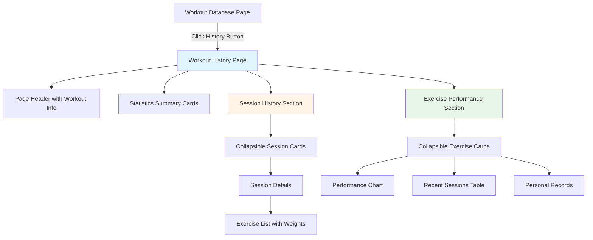
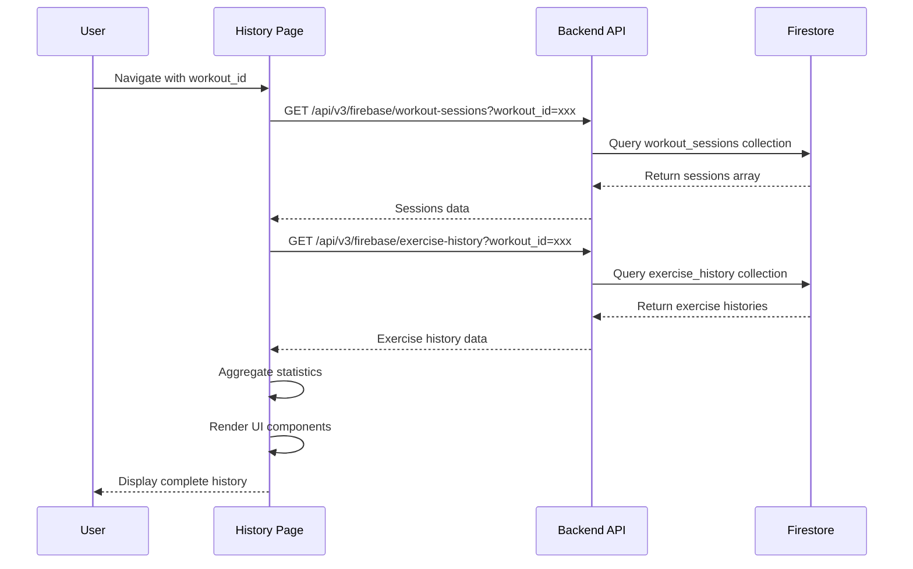

# Workout History Feature Architecture

**Version:** 1.0.0  
**Date:** 2025-11-25  
**Status:** Planning Phase

---

## 📋 Overview

This document outlines the architecture for implementing a comprehensive workout history feature that displays both workout session history and exercise performance metrics in an expandable changelog format, inspired by the Sneat Fleet template design pattern.

---

## 🎯 Feature Requirements

### Core Functionality
1. **History Button** - Add "History" button to each workout card in workout-database.html
2. **Dedicated History Page** - Navigate to workout-history.html with workout ID parameter
3. **Combined View** - Display both workout sessions AND exercise performance history
4. **Expandable Sections** - Collapsible changelog format following Sneat Fleet pattern
5. **Performance Metrics** - Show aggregated stats (total workouts, avg duration, PRs)
6. **Visual Consistency** - Match existing dashboard design patterns

### User Flow
```
Workout Database → Click "History" Button → Navigate to History Page → View Sessions & Performance
```

---

## 🗂️ Database Collections Used

### 1. `workout_sessions` Collection
**Path:** `users/{userId}/workout_sessions/{sessionId}`

**Structure:**
```javascript
{
  id: "session-20251108-021745",
  workout_id: "workout-7eb8443b",
  workout_name: "Push Day",
  started_at: Timestamp,
  completed_at: Timestamp,
  duration_minutes: 18,
  status: "completed",
  exercises_performed: [
    {
      exercise_name: "Bench Press",
      weight: 165.0,
      weight_unit: "lbs",
      sets_completed: 3,
      reps_completed: [10, 8, 8],
      notes: "Felt strong today"
    }
  ],
  notes: "Great workout!"
}
```

### 2. `exercise_history` Collection
**Path:** `users/{userId}/exercise_history/{workoutId_exerciseName}`

**Structure:**
```javascript
{
  id: "workout-7eb8443b_Bench Press",
  workout_id: "workout-7eb8443b",
  exercise_name: "Bench Press",
  last_weight: 165.0,
  last_weight_unit: "lbs",
  best_weight: 170.0,
  best_weight_unit: "lbs",
  last_session_date: Timestamp,
  total_sessions: 15,
  recent_sessions: [
    {
      date: Timestamp,
      weight: 165.0,
      sets: 3,
      reps: [10, 8, 8]
    }
  ]
}
```

---

## 🏗️ Architecture Design

### File Structure
```
frontend/
├── workout-history.html                    # NEW - History page
├── assets/
│   ├── css/
│   │   └── workout-history.css            # NEW - History styles
│   └── js/
│       └── dashboard/
│           └── workout-history.js         # NEW - History logic

backend/
└── api/
    └── data.py                            # MODIFY - Add history endpoints
```

### Component Hierarchy



---

## 🎨 UI Design Pattern (Sneat Fleet Inspired)

### Collapsible Section Structure
```html
<!-- Session History Item -->
<div class="history-item">
  <div class="history-header" data-bs-toggle="collapse" data-bs-target="#session-123">
    <div class="history-icon">
      <i class="bx bx-dumbbell"></i>
    </div>
    <div class="history-info">
      <h6>Session #15</h6>
      <small class="text-muted">Nov 8, 2025 • 18 minutes</small>
    </div>
    <div class="history-status">
      <span class="badge bg-success">Completed</span>
    </div>
    <div class="history-toggle">
      <i class="bx bx-chevron-down"></i>
    </div>
  </div>
  
  <div id="session-123" class="collapse history-details">
    <div class="history-body">
      <!-- Detailed session information -->
    </div>
  </div>
</div>
```

### Progress Bar for Tracking
```html
<div class="progress-tracker">
  <div class="progress-label">Session Progress</div>
  <div class="progress" style="height: 8px;">
    <div class="progress-bar bg-success" style="width: 100%"></div>
  </div>
  <div class="progress-stats">
    <span>15 sessions completed</span>
  </div>
</div>
```

---

## 📊 Data Flow

### Page Load Sequence


### API Endpoints (New)

#### 1. Get Workout Sessions
```
GET /api/v3/firebase/workout-sessions
Query Parameters:
  - workout_id: string (required)
  - limit: number (optional, default: 50)
  - order_by: string (optional, default: "completed_at")
  - order_direction: string (optional, default: "desc")

Response:
{
  "sessions": [...],
  "total_count": 15,
  "workout_info": {
    "id": "workout-xxx",
    "name": "Push Day"
  }
}
```

#### 2. Get Exercise History
```
GET /api/v3/firebase/exercise-history
Query Parameters:
  - workout_id: string (required)

Response:
{
  "exercise_histories": [...],
  "workout_id": "workout-xxx"
}
```

---

## 📈 Statistics & Metrics

### Summary Cards (Top of Page)
1. **Total Workouts** - Count of completed sessions
2. **Average Duration** - Mean workout time
3. **Last Completed** - Most recent session date
4. **Total Volume** - Sum of all weights lifted (optional)

### Per-Exercise Metrics
1. **Personal Record (PR)** - Highest weight achieved
2. **Last Weight Used** - Most recent weight
3. **Total Sessions** - Times exercise was performed
4. **Weight Progression** - Trend over time
5. **Average Reps** - Mean reps per set

---

## 🎯 Implementation Phases

### Phase 1: Backend API (Priority: High)
- [ ] Create workout sessions endpoint
- [ ] Create exercise history endpoint
- [ ] Add data aggregation logic
- [ ] Test with existing data

### Phase 2: Frontend Structure (Priority: High)
- [ ] Create workout-history.html
- [ ] Set up page layout and navigation
- [ ] Add loading states
- [ ] Implement error handling

### Phase 3: Session History UI (Priority: High)
- [ ] Implement collapsible session cards
- [ ] Display session details
- [ ] Show exercises performed with weights
- [ ] Add session notes display

### Phase 4: Exercise Performance UI (Priority: Medium)
- [ ] Implement collapsible exercise cards
- [ ] Display performance metrics
- [ ] Show recent sessions table
- [ ] Highlight personal records

### Phase 5: Statistics & Polish (Priority: Medium)
- [ ] Add summary statistics cards
- [ ] Implement data aggregation
- [ ] Add visual indicators (badges, progress bars)
- [ ] Responsive design optimization

### Phase 6: Integration (Priority: High)
- [ ] Add "History" button to workout cards
- [ ] Implement navigation flow
- [ ] Add back navigation to dashboard
- [ ] Test complete user journey

---

## 🎨 Visual Design Specifications

### Color Scheme
- **Success/Completed:** `bg-success` (green)
- **In Progress:** `bg-warning` (yellow)
- **Personal Record:** `bg-danger` (red highlight)
- **Neutral:** `bg-label-secondary` (gray)

### Typography
- **Page Title:** `h4` - Workout name
- **Section Headers:** `h6` - "Session History", "Exercise Performance"
- **Card Titles:** `h6` - Session/Exercise names
- **Metadata:** `small.text-muted` - Dates, durations

### Spacing
- **Card Gap:** `mb-3` (1rem)
- **Section Gap:** `mb-4` (1.5rem)
- **Content Padding:** `p-3` (1rem)

---

## 🔄 State Management

### Page State
```javascript
window.ghostGym.workoutHistory = {
  workoutId: null,
  workoutInfo: null,
  sessions: [],
  exerciseHistories: [],
  expandedSessions: new Set(),
  expandedExercises: new Set(),
  statistics: {
    totalWorkouts: 0,
    avgDuration: 0,
    lastCompleted: null,
    totalVolume: 0
  }
};
```

---

## 🧪 Testing Checklist

### Functional Tests
- [ ] History button navigates correctly
- [ ] Page loads with valid workout ID
- [ ] Sessions display in correct order
- [ ] Exercise histories load properly
- [ ] Collapsible sections work
- [ ] Statistics calculate correctly
- [ ] Back navigation works

### Edge Cases
- [ ] No sessions exist yet
- [ ] No exercise history available
- [ ] Invalid workout ID
- [ ] Network errors
- [ ] Large dataset (50+ sessions)

### Responsive Tests
- [ ] Mobile layout (< 768px)
- [ ] Tablet layout (768px - 991px)
- [ ] Desktop layout (> 991px)

---

## 📝 Code Examples

### History Button in Workout Card
```javascript
// In workout-database.js createWorkoutCard()
<div class="btn-group btn-group-sm w-100 mt-auto" role="group">
  <button class="btn btn-primary" onclick="doWorkout('${workout.id}')">
    <i class="bx bx-play me-1"></i>Start
  </button>
  <button class="btn btn-outline-secondary" onclick="viewWorkoutDetails('${workout.id}')">
    <i class="bx bx-show me-1"></i>View
  </button>
  <button class="btn btn-outline-info" onclick="viewWorkoutHistory('${workout.id}')">
    <i class="bx bx-history me-1"></i>History
  </button>
  <button class="btn btn-outline-secondary" onclick="editWorkout('${workout.id}')">
    <i class="bx bx-edit me-1"></i>Edit
  </button>
</div>
```

### Navigation Function
```javascript
function viewWorkoutHistory(workoutId) {
  console.log('📊 Viewing workout history:', workoutId);
  window.location.href = `workout-history.html?id=${workoutId}`;
}
```

### Collapsible Session Card
```javascript
function createSessionCard(session, index) {
  const collapseId = `session-${session.id}`;
  const isExpanded = window.ghostGym.workoutHistory.expandedSessions.has(session.id);
  
  return `
    <div class="card mb-3 history-card">
      <div class="card-header history-header" 
           data-bs-toggle="collapse" 
           data-bs-target="#${collapseId}"
           style="cursor: pointer;">
        <div class="d-flex align-items-center justify-content-between">
          <div class="d-flex align-items-center gap-3">
            <div class="history-icon">
              <i class="bx bx-dumbbell text-primary"></i>
            </div>
            <div>
              <h6 class="mb-0">Session #${index + 1}</h6>
              <small class="text-muted">
                ${formatDate(session.completed_at)} • ${session.duration_minutes} min
              </small>
            </div>
          </div>
          <div class="d-flex align-items-center gap-2">
            <span class="badge bg-success">Completed</span>
            <i class="bx bx-chevron-down"></i>
          </div>
        </div>
      </div>
      
      <div id="${collapseId}" class="collapse ${isExpanded ? 'show' : ''}">
        <div class="card-body">
          ${renderSessionDetails(session)}
        </div>
      </div>
    </div>
  `;
}
```

---

## 🚀 Next Steps

1. **Review & Approve** - Get stakeholder approval on architecture
2. **Backend Implementation** - Start with API endpoints
3. **Frontend Development** - Build page structure and components
4. **Integration** - Connect history button and navigation
5. **Testing** - Comprehensive testing across devices
6. **Documentation** - Update user guides and technical docs

---

## 📚 References

- **Sneat Fleet Template:** https://demos.themeselection.com/sneat-bootstrap-html-admin-template/html/horizontal-menu-template/app-logistics-fleet.html
- **Database Schema:** `DATABASE_STRUCTURE_AND_RELATIONSHIPS.md`
- **Workout Database:** `frontend/workout-database.html`
- **Workout Mode:** `frontend/workout-mode.html`

---

## ✅ Success Criteria

- [ ] History button visible on all workout cards
- [ ] History page loads within 2 seconds
- [ ] All sessions display correctly
- [ ] Exercise performance metrics accurate
- [ ] Collapsible sections work smoothly
- [ ] Mobile responsive design
- [ ] No console errors
- [ ] Matches existing design patterns
- [ ] User can navigate back to dashboard easily
