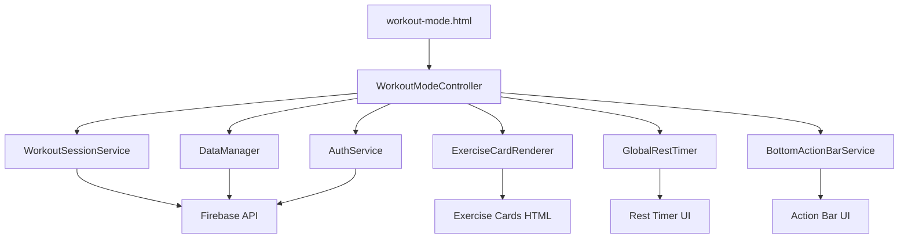

# Workout Mode Demo V2 → Production Migration Plan

## Overview
This document outlines the plan to replace all dummy data in `frontend/workout-mode.html` with real data from the production workout mode implementation (`frontend/workout-mode-old.html`).

## Current State Analysis

### New UI (workout-mode.html)
**Strengths:**
- ✅ Clean, modern UI with bottom action bar
- ✅ Compact exercise cards with expand/collapse
- ✅ Floating timer + rest timer + end button combo
- ✅ Bonus exercise offcanvas with search/filter
- ✅ Responsive design

**Limitations:**
- ❌ All data is hardcoded dummy data
- ❌ No backend integration
- ❌ No authentication
- ❌ No session management
- ❌ No weight logging
- ❌ No exercise history

### Old Implementation (workout-mode-old.html)
**Strengths:**
- ✅ Full backend integration via WorkoutModeController
- ✅ Authentication with Firebase
- ✅ Session management with WorkoutSessionService
- ✅ Weight logging with history
- ✅ Exercise card rendering via ExerciseCardRenderer
- ✅ Global rest timer component
- ✅ Session persistence (resume after refresh)
- ✅ Bonus exercise management
- ✅ Auto-save functionality

## Architecture Overview



## Data Flow Mapping

### 1. Workout Data
**Current (Dummy):**
```javascript
const demoWorkout = {
    name: "Push Day Workout",
    exercises: [
        { name: "Bench Press", sets: "4", reps: "8-10", ... }
    ]
}
```

**Target (Real):**
```javascript
// Loaded via WorkoutModeController
this.currentWorkout = await dataManager.getWorkouts()
    .find(w => w.id === workoutId);

// Structure:
{
    id: "workout-123",
    name: "Push Day Workout",
    exercise_groups: [
        {
            exercises: { a: "Bench Press", b: "Alt1", c: "Alt2" },
            sets: "4",
            reps: "8-10",
            rest: "180s",
            default_weight: "185",
            default_weight_unit: "lbs",
            notes: "Focus on controlled descent"
        }
    ],
    bonus_exercises: []
}
```

### 2. Exercise History
**Current:** None

**Target:**
```javascript
// Fetched via WorkoutSessionService
const history = await sessionService.fetchExerciseHistory(workoutId);

// Structure:
{
    "Bench Press": {
        last_weight: 180,
        last_weight_unit: "lbs",
        last_session_date: "2024-12-01T10:00:00Z",
        total_sessions: 15,
        pr_weight: 200
    }
}
```

### 3. Session State
**Current:** Simple boolean flag

**Target:**
```javascript
// Managed by WorkoutSessionService
{
    id: "session-456",
    workoutId: "workout-123",
    workoutName: "Push Day Workout",
    startedAt: Date,
    status: "in_progress",
    exercises: {
        "Bench Press": {
            weight: 185,
            weight_unit: "lbs",
            previous_weight: 180,
            weight_change: 5,
            is_modified: true,
            is_skipped: false
        }
    }
}
```

### 4. Bonus Exercises
**Current (Dummy):**
```javascript
const bonusExercisesDatabase = [
    { id: 1, name: 'Cable Flyes', category: 'chest', ... }
]
```

**Target (Real):**
```javascript
// From ExerciseCacheService + previous session history
const previousBonus = await sessionService
    .getLastSessionBonusExercises(workoutId);

// Uses exercise autocomplete for search
// Stores in session: sessionService.addBonusExercise(data)
```

## Migration Steps

### Phase 1: Script Integration (Critical)
**Goal:** Load all required JavaScript services

**Changes to `workout-mode.html`:**
```html
<!-- Add before closing </body> -->

<!-- Core Services -->
<script src="/static/assets/js/firebase/firebase-init.js"></script>
<script src="/static/assets/js/firebase/auth-service.js"></script>
<script src="/static/assets/js/firebase/data-manager.js"></script>

<!-- Workout Mode Services -->
<script src="/static/assets/js/services/workout-session-service.js"></script>
<script src="/static/assets/js/services/exercise-cache-service.js"></script>
<script src="/static/assets/js/services/auto-create-exercise-service.js"></script>

<!-- Components -->
<script src="/static/assets/js/components/exercise-card-renderer.js"></script>
<script src="/static/assets/js/components/global-rest-timer.js"></script>
<script src="/static/assets/js/components/unified-offcanvas-factory.js"></script>

<!-- Controllers -->
<script src="/static/assets/js/workout-mode-refactored.js"></script>
<script src="/static/assets/js/controllers/workout-mode-controller.js"></script>

<!-- Bottom Action Bar -->
<script src="/static/assets/js/config/bottom-action-bar-config.js"></script>
<script src="/static/assets/js/services/bottom-action-bar-service.js"></script>
```

### Phase 2: HTML Structure Updates
**Goal:** Add required DOM elements for services

**Add to HTML:**
```html
<!-- Loading State -->
<div id="workoutLoadingState" class="text-center py-5">
    <div class="spinner-border text-primary"></div>
    <p class="mt-3 text-muted" id="loadingMessage">Loading workout...</p>
</div>

<!-- Error State -->
<div id="workoutErrorState" class="text-center py-5" style="display: none;">
    <i class="bx bx-error-circle display-1 text-danger"></i>
    <h5 class="mt-3">Error Loading Workout</h5>
    <p class="text-muted" id="workoutErrorMessage"></p>
</div>

<!-- Workout Info Header -->
<div id="workoutInfoHeader" style="display: none;">
    <h6 class="mb-2">
        Workout Name: <span id="workoutName"></span>
    </h6>
    <p class="text-muted small mb-3">
        Last completed: <span id="lastCompletedDate">Never</span>
    </p>
</div>
```

### Phase 3: Remove Dummy Data
**Goal:** Delete all hardcoded data

**Remove from JavaScript:**
- `demoWorkout` object
- `bonusExercisesDatabase` array
- `workoutState` object (replaced by services)
- All dummy render functions

### Phase 4: Controller Integration
**Goal:** Initialize WorkoutModeController

**Replace initialization code:**
```javascript
// OLD (Demo):
document.addEventListener('DOMContentLoaded', function() {
    renderExerciseCards();
    setupEventListeners();
});

// NEW (Production):
// Controller auto-initializes via its own DOMContentLoaded
// Just ensure config is available
window.ghostGym = window.ghostGym || {};
```

### Phase 5: Exercise Card Rendering
**Goal:** Use ExerciseCardRenderer instead of manual HTML

**Replace:**
```javascript
// OLD:
function createExerciseCard(exercise, index) {
    return `<div class="exercise-card">...</div>`;
}

// NEW:
// Controller handles this automatically via:
this.cardRenderer.renderCard(group, index, isBonus, totalCards)
```

### Phase 6: Session Management
**Goal:** Use WorkoutSessionService for all session operations

**Replace:**
```javascript
// OLD:
function startWorkout() {
    workoutState.isActive = true;
    workoutState.startTime = Date.now();
}

// NEW:
// Controller handles via:
await this.sessionService.startSession(workoutId, workoutName, workoutData);
```

### Phase 7: Weight Management
**Goal:** Integrate weight logging with history

**Add weight button handlers:**
```javascript
// Controller already has:
handleWeightButtonClick(button) {
    // Opens unified offcanvas for weight editing
    window.UnifiedOffcanvasFactory.createWeightEdit(...)
}
```

### Phase 8: Bonus Exercise Integration
**Goal:** Connect to real exercise database

**Replace:**
```javascript
// OLD:
const bonusExercisesDatabase = [...];

// NEW:
// Use UnifiedOffcanvasFactory.createBonusExercise()
// Connects to ExerciseCacheService for real exercises
// Stores via sessionService.addBonusExercise()
```

### Phase 9: Timer Integration
**Goal:** Connect GlobalRestTimer to bottom action bar

**Update:**
```javascript
// Controller already handles:
initializeGlobalRestTimer() {
    this.globalRestTimer = window.globalRestTimer;
    this.syncGlobalTimerWithExpandedCard();
}
```

### Phase 10: Authentication
**Goal:** Add login checks and prompts

**Add:**
```javascript
// Controller already has:
async handleStartWorkout() {
    if (!this.authService.isUserAuthenticated()) {
        this.showLoginPrompt();
        return;
    }
    await this.startNewSession();
}
```

## File Changes Summary

### Files to Modify
1. ✏️ `frontend/workout-mode.html`
   - Add script imports
   - Add required DOM elements
   - Remove dummy data
   - Update initialization

### Files to Keep (No Changes)
- ✅ `frontend/assets/js/controllers/workout-mode-controller.js`
- ✅ `frontend/assets/js/services/workout-session-service.js`
- ✅ `frontend/assets/js/components/exercise-card-renderer.js`
- ✅ `frontend/assets/js/components/global-rest-timer.js`
- ✅ All other service files

### Files to Archive
- 📦 `frontend/workout-mode-old.html` → Keep as reference

## Testing Checklist

### Basic Functionality
- [ ] Page loads without errors
- [ ] Workout loads from URL parameter
- [ ] Exercise cards render correctly
- [ ] Cards expand/collapse properly

### Session Management
- [ ] Start workout creates session
- [ ] Timer starts and counts correctly
- [ ] Session persists on refresh
- [ ] Resume prompt appears correctly
- [ ] Complete workout saves session

### Weight Logging
- [ ] Weight button opens offcanvas
- [ ] History displays correctly
- [ ] Weight updates save to session
- [ ] Weight badges show progression

### Bonus Exercises
- [ ] Add bonus button works
- [ ] Exercise search functions
- [ ] Previous exercises load
- [ ] Bonus exercises render in cards

### Authentication
- [ ] Login prompt appears when needed
- [ ] Authenticated users can start workout
- [ ] Anonymous users see appropriate UI

### Error Handling
- [ ] Invalid workout ID shows error
- [ ] Network errors handled gracefully
- [ ] Loading states display correctly

## Risk Assessment

### High Risk
- ⚠️ **Breaking existing functionality**: Ensure all services are loaded in correct order
- ⚠️ **Authentication issues**: Test both logged-in and anonymous states
- ⚠️ **Data loss**: Verify session persistence works correctly

### Medium Risk
- ⚠️ **UI inconsistencies**: Some styling may need adjustment
- ⚠️ **Performance**: Loading many scripts may slow initial load

### Low Risk
- ✅ **Backward compatibility**: Old implementation remains unchanged
- ✅ **Rollback**: Can easily revert to demo version

## Success Criteria

### Must Have
1. ✅ All dummy data replaced with real data
2. ✅ Full backend integration working
3. ✅ Authentication functional
4. ✅ Session management operational
5. ✅ Weight logging with history
6. ✅ Bonus exercises from real database

### Nice to Have
1. 🎯 Improved error messages
2. 🎯 Better loading states
3. 🎯 Enhanced mobile experience

## Timeline Estimate

- **Phase 1-3** (Script Integration + HTML + Remove Dummy): 30 minutes
- **Phase 4-6** (Controller + Cards + Session): 45 minutes
- **Phase 7-9** (Weight + Bonus + Timer): 45 minutes
- **Phase 10** (Authentication): 15 minutes
- **Testing**: 60 minutes

**Total Estimated Time**: 3-4 hours

## Next Steps

1. Review this plan with the team
2. Create backup of current demo version
3. Begin Phase 1 implementation
4. Test after each phase
5. Deploy to staging for full testing
6. Production deployment

## Notes

- The new UI is superior and should be kept
- All backend logic from old implementation is solid
- This is primarily a "wiring" task, not a rewrite
- Most complexity is in proper script loading order
- Session persistence is critical - test thoroughly

---

**Document Version**: 1.0  
**Created**: 2025-12-08  
**Status**: Ready for Implementation
