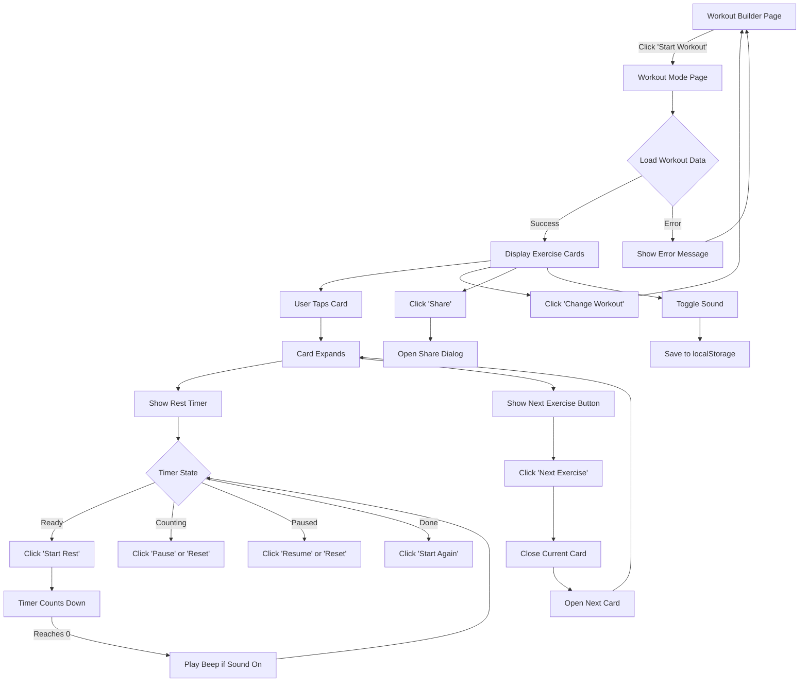
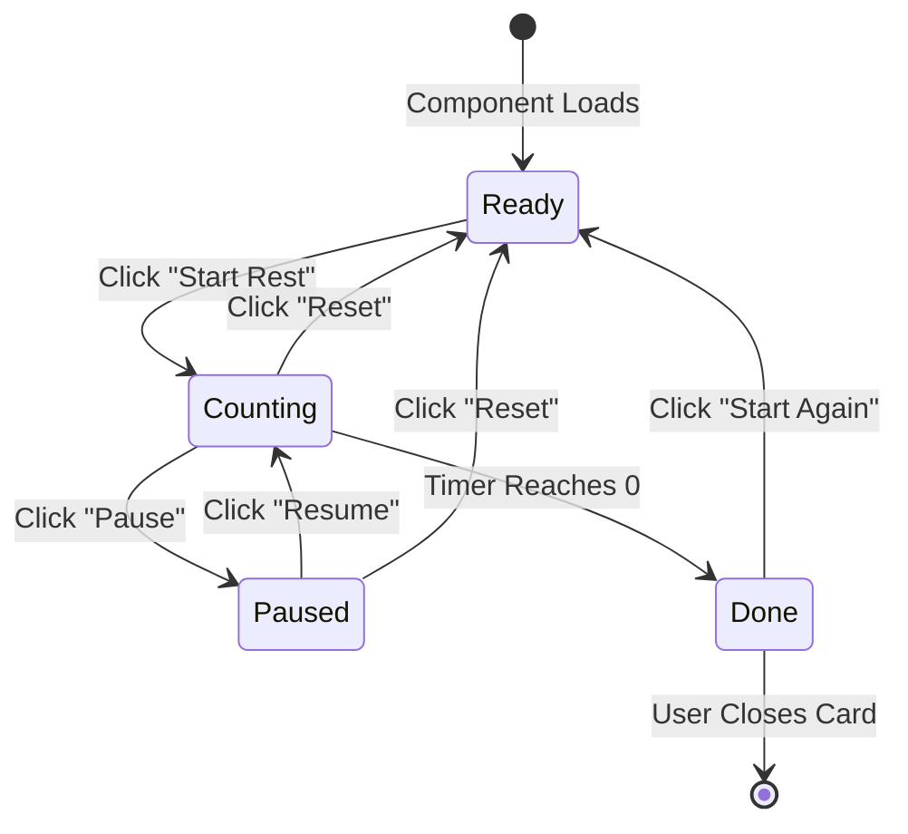
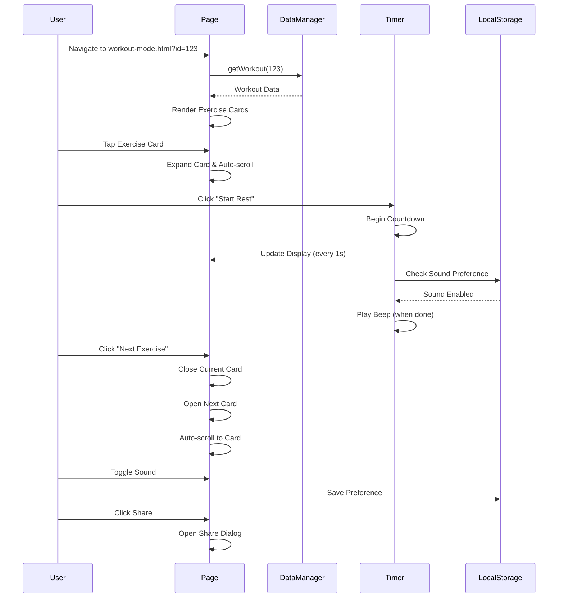

# Workout Mode - User Flow & Component Diagram

## User Flow Diagram



## Page Layout Structure

```
┌─────────────────────────────────────────┐
│  ☰                                      │  ← Menu Button (top left)
│           Back & Biceps                 │  ← Workout Title (centered)
│         Change workout                  │  ← Link to workouts list
├─────────────────────────────────────────┤
│                                         │
│  ┌───────────────────────────────────┐ │
│  │ Barbell Bench Press • 3×8-12 •    │ │  ← Collapsed Card
│  │ Rest: 60s                         │ │
│  │ Alt1: Dumbbell Bench Press        │ │
│  │ Alt2: Machine Chest Press         │ │
│  └───────────────────────────────────┘ │
│                                         │
│  ┌───────────────────────────────────┐ │
│  │ Barbell Row • 3×8-12 • Rest: 60s  │ │  ← Collapsed Card
│  │ Alt1: Dumbbell Row                │ │
│  └───────────────────────────────────┘ │
│                                         │
│  ┌───────────────────────────────────┐ │
│  │ Pull-ups • 3×AMRAP • Rest: 90s    │ │  ← Expanded Card
│  │                                   │ │
│  │  Sets: 3 × AMRAP                  │ │
│  │                                   │ │
│  │  Notes: Use assistance if needed  │ │
│  │  Target: Back | Equipment: Bar    │ │
│  │                                   │ │
│  │  ┌─────────────────────────────┐ │ │
│  │  │      Rest: 90s              │ │ │  ← Rest Timer (Ready)
│  │  │   [Start Rest]              │ │ │
│  │  └─────────────────────────────┘ │ │
│  │                                   │ │
│  │  [Next Exercise →]                │ │
│  └───────────────────────────────────┘ │
│                                         │
│  ┌───────────────────────────────────┐ │
│  │ 🎁 BONUS: Face Pulls • 2×15 •     │ │  ← Bonus Exercise
│  │ Rest: 30s                         │ │
│  └───────────────────────────────────┘ │
│                                         │
├─────────────────────────────────────────┤
│  [📤 Share]          [🔊 Sound: On]    │  ← Sticky Bottom Bar
└─────────────────────────────────────────┘
```

## Rest Timer State Transitions



## Component Hierarchy

```
WorkoutModePage
├── WorkoutHeader
│   ├── MenuButton
│   ├── WorkoutTitle
│   └── ChangeWorkoutLink
│
├── ExerciseCardsList
│   ├── ExerciseCard (Regular) × N
│   │   ├── CardHeader (collapsed view)
│   │   │   ├── ExerciseName
│   │   │   ├── SetsRepsRest
│   │   │   └── AlternateExercises
│   │   │
│   │   └── CardBody (expanded view)
│   │       ├── ExerciseDetails
│   │       ├── SetsRepsDisplay
│   │       ├── Notes (optional)
│   │       ├── TargetEquipment (optional)
│   │       ├── RestTimer
│   │       │   ├── TimerDisplay
│   │       │   └── TimerControls
│   │       └── NextExerciseButton
│   │
│   └── ExerciseCard (Bonus) × N
│       └── [Same structure with bonus badge]
│
└── StickyBottomBar
    ├── ShareButton
    └── SoundToggle
```

## Data Flow



## Key Interactions

### 1. Card Expansion
```javascript
// When user taps a card
card.addEventListener('click', (e) => {
  if (!e.target.closest('.exercise-card-body')) {
    // Collapse all other cards
    collapseAllCards();
    // Expand this card
    expandCard(card);
    // Auto-scroll into view
    card.scrollIntoView({ behavior: 'smooth', block: 'center' });
  }
});
```

### 2. Timer Countdown
```javascript
// Timer update loop
setInterval(() => {
  if (state === 'counting') {
    remainingSeconds--;
    updateDisplay();
    
    if (remainingSeconds === 0) {
      state = 'done';
      if (soundEnabled) playBeep();
      updateDisplay();
    }
  }
}, 1000);
```

### 3. Next Exercise Navigation
```javascript
// Next exercise button
nextButton.addEventListener('click', () => {
  const currentIndex = getCurrentCardIndex();
  const nextIndex = currentIndex + 1;
  
  // Close current card
  collapseCard(currentIndex);
  
  // Open next card (if exists)
  if (nextIndex < totalCards) {
    expandCard(nextIndex);
    scrollToCard(nextIndex);
  } else {
    showWorkoutComplete();
  }
});
```

## Mobile Responsive Behavior

### Portrait Mode (< 768px)
- Full-width cards
- Stacked layout
- Large touch targets (44×44px minimum)
- Bottom bar fixed at bottom
- Menu button easily accessible

### Landscape Mode
- Slightly wider cards with max-width
- Same functionality
- Optimized spacing

## Accessibility Considerations

1. **Keyboard Navigation**
   - Tab through cards
   - Enter to expand/collapse
   - Space to start/pause timer

2. **Screen Readers**
   - Proper ARIA labels
   - Timer state announcements
   - Card expansion state

3. **Color Contrast**
   - WCAG AA compliant
   - Timer states distinguishable without color

4. **Focus Management**
   - Clear focus indicators
   - Focus moves to expanded card
   - Focus returns on collapse

## Performance Optimizations

1. **Lazy Rendering**
   - Only render visible cards initially
   - Load more as user scrolls

2. **Timer Efficiency**
   - Single interval per timer
   - Pause when card collapsed
   - Clear intervals on unmount

3. **Smooth Animations**
   - CSS transitions for card expansion
   - RequestAnimationFrame for smooth scrolling
   - Hardware-accelerated transforms

4. **Memory Management**
   - Clean up event listeners
   - Clear timer intervals
   - Remove unused DOM elements

---

This diagram provides a complete visual reference for implementing the Workout Mode feature!