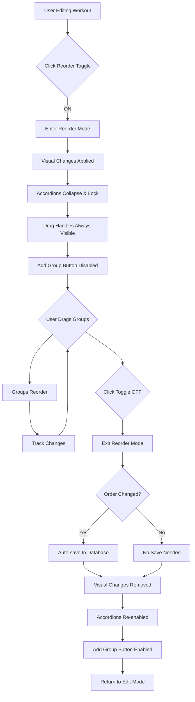

# Workout Builder - Reorder Mode Architecture

## Overview

This document outlines the architecture for implementing a dedicated "Reorder Mode" in the workout builder that allows users to reorder exercise groups without the distraction of editing capabilities. The drag-and-drop functionality will be opt-in rather than always available.

## Implementation Date
October 23, 2025

## Requirements Summary

### Core Requirements
1. **Toggle Switch**: Add a toggle switch next to "Exercise Groups" title to enable/disable reorder mode
2. **Visual Distinction**: Exercise groups should have distinct visual styling in reorder mode
3. **Disabled Editing**: Accordion expand/collapse and all editing features disabled during reorder
4. **Drag Handles**: Move icons (☰) always visible in reorder mode
5. **Auto-save**: Order automatically saved to database when exiting reorder mode
6. **Scope**: Only applies to exercise groups (not bonus exercises)

## Current Implementation Analysis

### Existing Drag-and-Drop System
**Location**: [`frontend/assets/js/dashboard/workouts.js:439-489`](frontend/assets/js/dashboard/workouts.js:439)

**Current Behavior**:
- Sortable.js initialized on `#exerciseGroups` container
- Drag handle (`.drag-handle`) visible on hover
- Accordions collapse during drag for cleaner UX
- Groups auto-renumber after reordering
- Editor marked as dirty after reorder

**Key Configuration**:
```javascript
new Sortable(container, {
    animation: 150,
    handle: '.drag-handle',
    ghostClass: 'sortable-ghost',
    dragClass: 'sortable-drag',
    chosenClass: 'sortable-chosen',
    forceFallback: true,
    fallbackTolerance: 3
});
```

### Current Issues to Address
1. ❌ Drag-and-drop always enabled (can be confusing during editing)
2. ❌ Drag handle only visible on hover (not obvious for reordering)
3. ❌ Accordions can be expanded during drag operations
4. ❌ No visual indication that reordering is available
5. ❌ Users might accidentally trigger drag while trying to edit

## Architecture Design

### State Management

Add new state to [`window.ghostGym.workoutBuilder`](frontend/workouts.html:470):

```javascript
window.ghostGym.workoutBuilder = {
    // Existing state...
    selectedWorkoutId: null,
    isEditing: false,
    isDirty: false,
    currentWorkout: { /* ... */ },
    
    // NEW: Reorder mode state
    reorderMode: {
        isActive: false,
        originalOrder: null, // Store original order for potential cancel
        hasChanges: false
    }
};
```

### UI Component Structure

```
Exercise Groups Section
├── Header Row
│   ├── Title: "Exercise Groups"
│   ├── Reorder Toggle Switch (NEW)
│   │   ├── Label: "Reorder Mode"
│   │   ├── Icon: bx-move (when active)
│   │   └── State: on/off
│   └── Add Group Button (disabled in reorder mode)
│
└── Exercise Groups Container (#exerciseGroups)
    ├── Exercise Group 1 (accordion)
    │   ├── Header (clickable in edit mode, locked in reorder mode)
    │   │   ├── Chevron (hidden in reorder mode)
    │   │   ├── Exercise Preview
    │   │   ├── Move Icon (always visible in reorder mode)
    │   │   └── Remove Button (hidden in reorder mode)
    │   └── Body (collapsed and locked in reorder mode)
    ├── Exercise Group 2
    └── Exercise Group N
```

### Visual States

#### Edit Mode (Default)
```
┌─────────────────────────────────────────────────────┐
│ Exercise Groups                    [+ Add Group]    │
├─────────────────────────────────────────────────────┤
│ ▼ Bench Press                              [🗑️] ☰  │ ← Hover shows icons
│   Alt1: Dumbbell Press                              │
│   ┌─────────────────────────────────────────────┐  │
│   │ [Exercise inputs, sets, reps, rest...]      │  │
│   └─────────────────────────────────────────────┘  │
│                                                      │
│ ▶ Squats                                       ☰    │ ← Collapsed
└─────────────────────────────────────────────────────┘
```

#### Reorder Mode (Active)
```
┌─────────────────────────────────────────────────────┐
│ Exercise Groups    [🔄 Reorder Mode: ON]            │ ← Toggle active
├─────────────────────────────────────────────────────┤
│ ☰ Bench Press                                       │ ← Move icon always visible
│   Alt1: Dumbbell Press                              │ ← Locked, no chevron
│   ┌─────────────────────────────────────────────┐  │
│   │ [Content hidden/collapsed]                  │  │ ← Forced collapse
│   └─────────────────────────────────────────────┘  │
│                                                      │
│ ☰ Squats                                            │ ← All groups same state
│   Alt1: Front Squat                                 │
└─────────────────────────────────────────────────────┘
     ↑ Distinct background color (e.g., light blue tint)
```

## Implementation Plan

### Phase 1: HTML Structure Changes

**File**: [`frontend/workouts.html:238-248`](frontend/workouts.html:238)

**Current HTML**:
```html
<div class="d-flex justify-content-between align-items-center mb-3">
    <h6 class="mb-0">
        <i class="bx bx-list-ul me-1"></i>
        Exercise Groups
    </h6>
    <button type="button" class="btn btn-outline-primary btn-sm" id="addExerciseGroupBtn">
        <i class="bx bx-plus me-1"></i>
        Add Group
    </button>
</div>
```

**New HTML**:
```html
<div class="d-flex justify-content-between align-items-center mb-3">
    <div class="d-flex align-items-center gap-3">
        <h6 class="mb-0">
            <i class="bx bx-list-ul me-1"></i>
            Exercise Groups
        </h6>
        <!-- NEW: Reorder Mode Toggle -->
        <div class="form-check form-switch mb-0">
            <input class="form-check-input" type="checkbox" role="switch" 
                   id="reorderModeToggle" style="cursor: pointer;">
            <label class="form-check-label" for="reorderModeToggle" style="cursor: pointer;">
                <i class="bx bx-move me-1"></i>
                <span class="reorder-mode-label">Reorder</span>
            </label>
        </div>
    </div>
    <button type="button" class="btn btn-outline-primary btn-sm" id="addExerciseGroupBtn">
        <i class="bx bx-plus me-1"></i>
        Add Group
    </button>
</div>
```

### Phase 2: CSS Styling

**File**: [`frontend/assets/css/workout-builder.css`](frontend/assets/css/workout-builder.css:170)

**New CSS Classes**:

```css
/* ============================================
   REORDER MODE TOGGLE
   ============================================ */

.reorder-mode-toggle-container {
    display: flex;
    align-items: center;
    gap: 0.5rem;
}

.form-check-input:checked ~ .form-check-label {
    color: var(--bs-primary);
    font-weight: 600;
}

.form-check-input:checked ~ .form-check-label .bx-move {
    animation: shake 0.5s ease;
}

@keyframes shake {
    0%, 100% { transform: translateX(0); }
    25% { transform: translateX(-3px); }
    75% { transform: translateX(3px); }
}

/* ============================================
   REORDER MODE ACTIVE STATE
   ============================================ */

/* Container in reorder mode */
.accordion-workout-groups.reorder-mode-active {
    background: rgba(var(--bs-info-rgb), 0.05);
    border: 2px dashed var(--bs-info);
    border-radius: var(--bs-border-radius);
    padding: 1rem;
}

/* Exercise groups in reorder mode */
.accordion-workout-groups.reorder-mode-active .accordion-item {
    background: rgba(var(--bs-info-rgb), 0.08);
    border: 2px solid var(--bs-info);
    cursor: move;
    transition: all 0.2s ease;
}

.accordion-workout-groups.reorder-mode-active .accordion-item:hover {
    background: rgba(var(--bs-info-rgb), 0.12);
    box-shadow: 0 4px 12px rgba(var(--bs-info-rgb), 0.2);
    transform: translateY(-2px);
}

/* Accordion button in reorder mode - locked state */
.accordion-workout-groups.reorder-mode-active .accordion-button {
    cursor: move;
    pointer-events: none; /* Disable clicking */
    background: rgba(var(--bs-info-rgb), 0.1);
}

/* Re-enable pointer events for drag handle only */
.accordion-workout-groups.reorder-mode-active .drag-handle {
    pointer-events: auto;
}

/* Hide chevron arrow in reorder mode */
.accordion-workout-groups.reorder-mode-active .accordion-button::after {
    display: none;
}

/* Always show drag handle in reorder mode */
.accordion-workout-groups.reorder-mode-active .drag-handle {
    opacity: 1 !important;
    color: var(--bs-info);
    font-size: 1.5rem;
    cursor: move;
}

/* Hide remove button in reorder mode */
.accordion-workout-groups.reorder-mode-active .btn-remove-group {
    display: none;
}

/* Force collapse all accordions in reorder mode */
.accordion-workout-groups.reorder-mode-active .accordion-collapse {
    display: none !important;
}

/* Reorder mode indicator badge */
.reorder-mode-indicator {
    display: inline-flex;
    align-items: center;
    gap: 0.5rem;
    padding: 0.375rem 0.75rem;
    background: var(--bs-info);
    color: white;
    border-radius: var(--bs-border-radius);
    font-size: 0.875rem;
    font-weight: 600;
    animation: pulse-info 2s infinite;
}

@keyframes pulse-info {
    0%, 100% {
        box-shadow: 0 0 0 0 rgba(var(--bs-info-rgb), 0.7);
    }
    50% {
        box-shadow: 0 0 0 8px rgba(var(--bs-info-rgb), 0);
    }
}

/* Sortable drag states in reorder mode */
.accordion-workout-groups.reorder-mode-active .sortable-ghost {
    opacity: 0.3;
    background: rgba(var(--bs-info-rgb), 0.2);
}

.accordion-workout-groups.reorder-mode-active .sortable-drag {
    box-shadow: 0 8px 24px rgba(var(--bs-info-rgb), 0.4);
    transform: rotate(3deg) scale(1.02);
    border-color: var(--bs-info);
}

/* Mobile optimizations for reorder mode */
@media (max-width: 768px) {
    .reorder-mode-label {
        font-size: 0.875rem;
    }
    
    .accordion-workout-groups.reorder-mode-active .drag-handle {
        font-size: 1.8rem;
        padding: 0.75rem;
    }
    
    .accordion-workout-groups.reorder-mode-active .accordion-item {
        margin-bottom: 1rem;
    }
}
```

### Phase 3: JavaScript Implementation

**File**: [`frontend/assets/js/dashboard/workouts.js`](frontend/assets/js/dashboard/workouts.js:1)

**New Functions**:

```javascript
/**
 * Initialize reorder mode toggle
 */
function initializeReorderMode() {
    const toggle = document.getElementById('reorderModeToggle');
    if (!toggle) return;
    
    toggle.addEventListener('change', function() {
        if (this.checked) {
            enterReorderMode();
        } else {
            exitReorderMode();
        }
    });
    
    console.log('✅ Reorder mode initialized');
}

/**
 * Enter reorder mode
 */
function enterReorderMode() {
    console.log('🔄 Entering reorder mode...');
    
    const container = document.getElementById('exerciseGroups');
    const addGroupBtn = document.getElementById('addExerciseGroupBtn');
    
    if (!container) return;
    
    // Update state
    window.ghostGym.workoutBuilder.reorderMode.isActive = true;
    window.ghostGym.workoutBuilder.reorderMode.originalOrder = collectExerciseGroupsOrder();
    window.ghostGym.workoutBuilder.reorderMode.hasChanges = false;
    
    // Add reorder mode class to container
    container.classList.add('reorder-mode-active');
    
    // Disable add group button
    if (addGroupBtn) {
        addGroupBtn.disabled = true;
        addGroupBtn.classList.add('disabled');
    }
    
    // Collapse all accordions
    collapseAllAccordions();
    
    // Disable accordion toggle functionality
    disableAccordionToggles();
    
    // Enable Sortable if not already enabled
    if (!container.sortableInstance) {
        initializeExerciseGroupSorting();
    }
    
    // Update Sortable to track changes
    updateSortableForReorderMode(true);
    
    // Show visual feedback
    showToast('Reorder mode active - Drag groups to reorder', 'info');
    
    console.log('✅ Reorder mode active');
}

/**
 * Exit reorder mode
 */
async function exitReorderMode() {
    console.log('🔄 Exiting reorder mode...');
    
    const container = document.getElementById('exerciseGroups');
    const addGroupBtn = document.getElementById('addExerciseGroupBtn');
    
    if (!container) return;
    
    // Check if order changed
    const hasChanges = window.ghostGym.workoutBuilder.reorderMode.hasChanges;
    
    // Remove reorder mode class
    container.classList.remove('reorder-mode-active');
    
    // Re-enable add group button
    if (addGroupBtn) {
        addGroupBtn.disabled = false;
        addGroupBtn.classList.remove('disabled');
    }
    
    // Re-enable accordion toggles
    enableAccordionToggles();
    
    // Update Sortable configuration
    updateSortableForReorderMode(false);
    
    // Save order if changed
    if (hasChanges) {
        await saveExerciseGroupOrder();
    }
    
    // Update state
    window.ghostGym.workoutBuilder.reorderMode.isActive = false;
    window.ghostGym.workoutBuilder.reorderMode.originalOrder = null;
    window.ghostGym.workoutBuilder.reorderMode.hasChanges = false;
    
    console.log('✅ Reorder mode exited');
}

/**
 * Collapse all accordions
 */
function collapseAllAccordions() {
    const accordions = document.querySelectorAll('#exerciseGroups .accordion-collapse.show');
    
    accordions.forEach(accordion => {
        const bsCollapse = bootstrap.Collapse.getInstance(accordion);
        if (bsCollapse) {
            bsCollapse.hide();
        } else {
            // Create instance and hide
            new bootstrap.Collapse(accordion, { toggle: false }).hide();
        }
    });
}

/**
 * Disable accordion toggle functionality
 */
function disableAccordionToggles() {
    const buttons = document.querySelectorAll('#exerciseGroups .accordion-button');
    
    buttons.forEach(button => {
        button.setAttribute('data-original-toggle', button.getAttribute('data-bs-toggle') || '');
        button.removeAttribute('data-bs-toggle');
        button.style.cursor = 'move';
    });
}

/**
 * Enable accordion toggle functionality
 */
function enableAccordionToggles() {
    const buttons = document.querySelectorAll('#exerciseGroups .accordion-button');
    
    buttons.forEach(button => {
        const originalToggle = button.getAttribute('data-original-toggle');
        if (originalToggle) {
            button.setAttribute('data-bs-toggle', originalToggle);
            button.removeAttribute('data-original-toggle');
        }
        button.style.cursor = '';
    });
}

/**
 * Update Sortable configuration for reorder mode
 */
function updateSortableForReorderMode(isReorderMode) {
    const container = document.getElementById('exerciseGroups');
    if (!container || !container.sortableInstance) return;
    
    const sortable = container.sortableInstance;
    
    if (isReorderMode) {
        // Make entire item draggable in reorder mode
        sortable.option('handle', '.accordion-item');
        sortable.option('animation', 200);
        
        // Add change tracking
        sortable.option('onEnd', function(evt) {
            window.ghostGym.workoutBuilder.reorderMode.hasChanges = true;
            renumberExerciseGroups();
            console.log('📝 Order changed:', {
                oldIndex: evt.oldIndex,
                newIndex: evt.newIndex
            });
        });
    } else {
        // Restore original configuration
        sortable.option('handle', '.drag-handle');
        sortable.option('animation', 150);
        
        // Restore original onEnd handler
        sortable.option('onEnd', function(evt) {
            renumberExerciseGroups();
            if (window.markEditorDirty) {
                window.markEditorDirty();
            }
        });
    }
}

/**
 * Collect current exercise group order
 */
function collectExerciseGroupsOrder() {
    const groups = document.querySelectorAll('#exerciseGroups .exercise-group');
    return Array.from(groups).map(group => group.getAttribute('data-group-id'));
}

/**
 * Save exercise group order to database
 */
async function saveExerciseGroupOrder() {
    const workoutId = window.ghostGym.workoutBuilder.selectedWorkoutId;
    if (!workoutId) {
        console.warn('⚠️ No workout selected, cannot save order');
        return;
    }
    
    try {
        // Show saving indicator
        showToast('Saving new order...', 'info');
        
        // Collect current workout data with new order
        const workoutData = {
            id: workoutId,
            exercise_groups: collectExerciseGroups(),
            // Include other necessary fields
            name: document.getElementById('workoutName')?.value,
            description: document.getElementById('workoutDescription')?.value,
            tags: document.getElementById('workoutTags')?.value?.split(',').map(t => t.trim()).filter(t => t) || []
        };
        
        // Update workout in database
        await window.dataManager.updateWorkout(workoutId, workoutData);
        
        // Update local state
        const workoutIndex = window.ghostGym.workouts.findIndex(w => w.id === workoutId);
        if (workoutIndex !== -1) {
            window.ghostGym.workouts[workoutIndex] = {
                ...window.ghostGym.workouts[workoutIndex],
                ...workoutData
            };
        }
        
        // Show success
        showToast('Exercise group order saved!', 'success');
        
        console.log('✅ Exercise group order saved to database');
        
    } catch (error) {
        console.error('❌ Failed to save exercise group order:', error);
        showToast('Failed to save order: ' + error.message, 'danger');
    }
}

/**
 * Show toast notification
 */
function showToast(message, type = 'info') {
    // Use existing toast system or create simple alert
    if (window.showAlert) {
        window.showAlert(message, type);
    } else {
        console.log(`[${type.toUpperCase()}] ${message}`);
    }
}

// Make functions globally available
window.initializeReorderMode = initializeReorderMode;
window.enterReorderMode = enterReorderMode;
window.exitReorderMode = exitReorderMode;
window.collapseAllAccordions = collapseAllAccordions;
window.disableAccordionToggles = disableAccordionToggles;
window.enableAccordionToggles = enableAccordionToggles;
window.updateSortableForReorderMode = updateSortableForReorderMode;
window.collectExerciseGroupsOrder = collectExerciseGroupsOrder;
window.saveExerciseGroupOrder = saveExerciseGroupOrder;
```

**Integration Point**:

Update [`frontend/assets/js/components/workout-editor.js`](frontend/assets/js/components/workout-editor.js:86) to initialize reorder mode:

```javascript
// After loading workout into editor
function loadWorkoutIntoEditor(workoutId) {
    // ... existing code ...
    
    // Initialize reorder mode toggle
    setTimeout(() => {
        initializeReorderMode();
    }, 200);
}

// After creating new workout in editor
function createNewWorkoutInEditor() {
    // ... existing code ...
    
    // Initialize reorder mode toggle
    setTimeout(() => {
        initializeReorderMode();
    }, 200);
}
```

### Phase 4: Database Integration

**File**: [`frontend/assets/js/firebase/data-manager.js`](frontend/assets/js/firebase/data-manager.js:1)

**Required Method** (if not exists):

```javascript
/**
 * Update existing workout
 * @param {string} workoutId - Workout ID
 * @param {Object} workoutData - Updated workout data
 * @returns {Promise<Object>} Updated workout
 */
async updateWorkout(workoutId, workoutData) {
    if (this.storageMode === 'firebase' && this.isAuthenticated) {
        // Firebase update
        const workoutRef = doc(this.db, 'users', this.currentUser.uid, 'workouts', workoutId);
        await updateDoc(workoutRef, {
            ...workoutData,
            modified_date: new Date().toISOString()
        });
        
        return {
            id: workoutId,
            ...workoutData,
            modified_date: new Date().toISOString()
        };
    } else {
        // LocalStorage update
        const workouts = this.getLocalWorkouts();
        const index = workouts.findIndex(w => w.id === workoutId);
        
        if (index !== -1) {
            workouts[index] = {
                ...workouts[index],
                ...workoutData,
                modified_date: new Date().toISOString()
            };
            localStorage.setItem('ghost_gym_workouts', JSON.stringify(workouts));
            return workouts[index];
        }
        
        throw new Error('Workout not found');
    }
}
```

## User Flow Diagram



## Testing Checklist

### Functional Tests
- [ ] Toggle switch enables/disables reorder mode
- [ ] Visual styling changes when entering reorder mode
- [ ] Accordions collapse when entering reorder mode
- [ ] Accordion clicks are disabled in reorder mode
- [ ] Drag handles are always visible in reorder mode
- [ ] Remove buttons are hidden in reorder mode
- [ ] Add Group button is disabled in reorder mode
- [ ] Groups can be dragged and reordered
- [ ] Groups renumber after reordering
- [ ] Order is saved to database on exit
- [ ] No save occurs if order unchanged
- [ ] Visual styling reverts when exiting reorder mode
- [ ] Accordions are re-enabled after exit
- [ ] Add Group button is re-enabled after exit

### UI/UX Tests
- [ ] Toggle switch is intuitive and visible
- [ ] Reorder mode visual distinction is clear
- [ ] Drag feedback is smooth and responsive
- [ ] Mobile touch dragging works correctly
- [ ] Toast notifications appear appropriately
- [ ] No visual glitches during mode transitions
- [ ] Keyboard accessibility maintained

### Edge Cases
- [ ] Switching workouts while in reorder mode
- [ ] Closing editor while in reorder mode
- [ ] Network error during save
- [ ] Single exercise group (no reordering needed)
- [ ] Empty workout (no groups)
- [ ] Rapid toggle on/off
- [ ] Browser refresh during reorder mode

### Browser Compatibility
- [ ] Chrome/Edge (Chromium)
- [ ] Firefox
- [ ] Safari
- [ ] Mobile browsers (iOS Safari, Chrome Mobile)

## Performance Considerations

### Optimization Strategies
1. **Debounce Save**: Only save once when exiting, not on every drag
2. **State Caching**: Store original order to detect changes
3. **CSS Transitions**: Use GPU-accelerated transforms
4. **Event Delegation**: Minimize event listeners
5. **Lazy Initialization**: Only initialize Sortable when needed

### Memory Management
- Clean up event listeners when switching workouts
- Remove reorder mode state when editor closes
- Dispose Sortable instance if workout deleted

## Accessibility

### ARIA Attributes
```html
<div class="form-check form-switch mb-0">
    <input class="form-check-input" type="checkbox" role="switch" 
           id="reorderModeToggle"
           aria-label="Toggle reorder mode for exercise groups"
           aria-describedby="reorderModeHelp">
    <label class="form-check-label" for="reorderModeToggle">
        <i class="bx bx-move me-1" aria-hidden="true"></i>
        <span class="reorder-mode-label">Reorder</span>
    </label>
</div>
<small id="reorderModeHelp" class="form-text text-muted visually-hidden">
    Enable reorder mode to drag and drop exercise groups into a new order
</small>
```

### Keyboard Support
- **Tab**: Navigate to toggle switch
- **Space/Enter**: Toggle reorder mode
- **Escape**: Exit reorder mode (if active)
- **Arrow Keys**: Navigate between groups (future enhancement)

### Screen Reader Announcements
- Announce when entering reorder mode
- Announce when order changes
- Announce when exiting and saving

## Mobile Considerations

### Touch Optimization
- Larger drag handles (1.8rem on mobile)
- Increased padding for touch targets
- Smooth touch scrolling
- Prevent accidental drags (fallbackTolerance)

### Responsive Behavior
- Toggle label may abbreviate on small screens
- Drag handles always visible on mobile (no hover)
- Larger spacing between groups for easier dragging

## Future Enhancements

### Phase 2 Features
1. **Undo/Redo**: Allow reverting order changes
2. **Keyboard Reordering**: Arrow keys to move groups
3. **Bulk Operations**: Select multiple groups to move
4. **Visual Preview**: Show order numbers during drag
5. **Bonus Exercise Reordering**: Extend to bonus exercises
6. **Animation**: Smooth transitions between positions
7. **Confirmation Dialog**: Optional confirm before save
8. **Order History**: Track order changes over time

### Advanced Features
- Drag between workouts
- Group templates with saved order
- AI-suggested optimal order
- Export/import workout order

## Success Metrics

### Key Performance Indicators
- **User Adoption**: % of users who use reorder mode
- **Reorder Frequency**: Average reorders per workout
- **Error Rate**: Failed saves or UI glitches
- **User Satisfaction**: Feedback on reorder UX
- **Performance**: Time to enter/exit reorder mode

## Conclusion

This architecture provides a clean, intuitive way for users to reorder exercise groups without the distraction of editing capabilities. The toggle-based approach makes the feature opt-in, preventing accidental drags while editing. The distinct visual styling clearly communicates the mode change, and auto-save ensures changes are persisted without extra user action.

The implementation leverages the existing Sortable.js infrastructure while adding mode-specific behavior and visual feedback. The phased approach allows for incremental testing and refinement before full deployment.

---

**Implementation Status**: 📋 Planned  
**Estimated Effort**: 4-6 hours  
**Priority**: Medium  
**Dependencies**: Existing workout builder, Sortable.js, Bootstrap 5