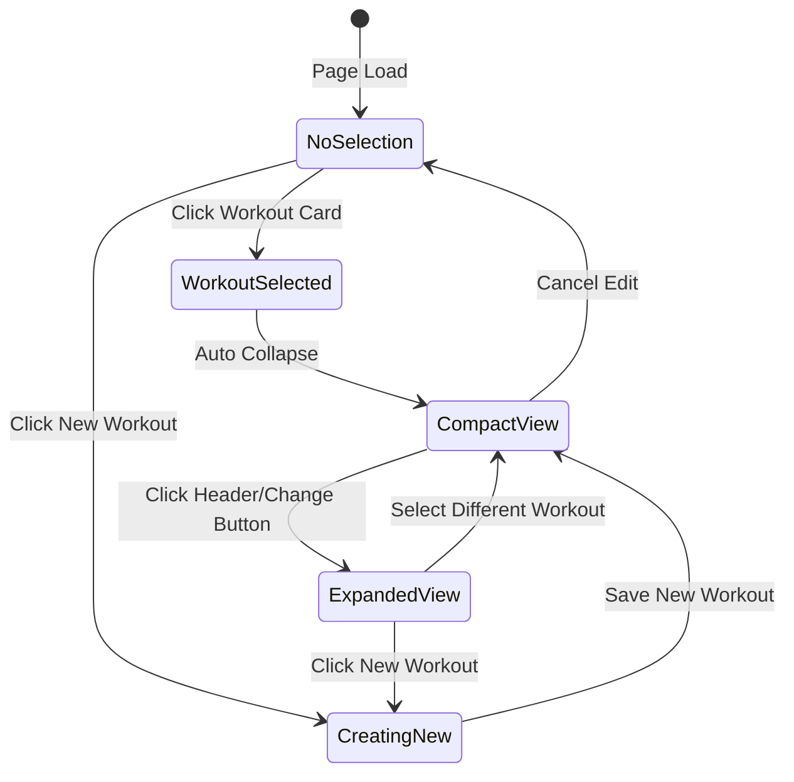

# Workout Selector Accordion - Architecture Plan

## Overview
Transform the workout library section to use a collapsible accordion pattern that shows a compact workout selector when a workout is selected, while maintaining full library access through expansion.

## Current State Analysis

### Desktop Layout (Lines 100-112 in workouts.html)
```html
<div class="d-flex justify-content-between align-items-center mb-3">
  <h6 class="mb-0">My Workouts</h6>
  <div class="d-flex align-items-center gap-2">
    <!-- Search - Desktop only -->
    <div class="input-group input-group-sm d-none d-md-flex" style="width: 250px;">
      <span class="input-group-text"><i class="bx bx-search"></i></span>
      <input type="text" class="form-control" placeholder="Search workouts..." />
    </div>
  </div>
</div>
```

### Mobile Layout (Lines 126-138 in workouts.html)
```html
<!-- Search - Mobile only (above button) -->
<div class="d-md-none mb-3">
  <div class="input-group input-group-sm">
    <span class="input-group-text"><i class="bx bx-search"></i></span>
    <input type="text" class="form-control" placeholder="Search workouts..." />
  </div>
</div>

<!-- New Workout Button -->
<div class="text-center mt-3">
  <button type="button" class="btn btn-primary" id="workoutsViewNewBtn">
    <i class="bx bx-plus me-1"></i>New Workout
  </button>
</div>
```

## Design Requirements

### 1. Button and Search Box Sizing
- **Search box height**: Keep current small size (`input-group-sm`)
- **New Workout button**: Change to small size (`btn-sm`) to match search box height
- **Width**: Both full width on desktop and mobile
- Remove fixed 250px width constraint on search

### 2. Accordion States

#### State 1: No Workout Selected (Default)
```
┌─────────────────────────────────────────┐
│ 🏋️ My Workouts                          │
├─────────────────────────────────────────┤
│ [Search workouts...]                    │
├─────────────────────────────────────────┤
│ [Workout 1] [Workout 2] [Workout 3] ... │ ← Horizontal scroll
├─────────────────────────────────────────┤
│        [+ New Workout]                  │
└─────────────────────────────────────────┘
```

#### State 2: Workout Selected - Collapsed (New)
```
┌─────────────────────────────────────────┐
│ ▼ Currently Editing: Push Day          │ ← Clickable accordion header
│   Upper body push workout               │ ← Description
│   [Change Workout]                      │ ← Action button
└─────────────────────────────────────────┘
```

#### State 3: Workout Selected - Expanded
```
┌─────────────────────────────────────────┐
│ ▲ Currently Editing: Push Day          │ ← Clickable accordion header
│   Upper body push workout               │
├─────────────────────────────────────────┤
│ [Search workouts...]                    │
├─────────────────────────────────────────┤
│ [Workout 1] [Workout 2] [Workout 3] ... │ ← Horizontal scroll
├─────────────────────────────────────────┤
│        [+ New Workout]                  │
└─────────────────────────────────────────┘
```

## Implementation Plan

### Phase 1: HTML Structure Updates

#### 1.1 Wrap Library in Accordion Container
```html
<div class="card mb-3 workout-builder-page">
  <div class="card-body p-3">
    
    <!-- NEW: Accordion Wrapper -->
    <div class="accordion" id="workoutLibraryAccordion">
      <div class="accordion-item border-0">
        
        <!-- NEW: Compact Header (shown when workout selected) -->
        <div id="workoutSelectorCompact" class="workout-selector-compact" style="display: none;">
          <button class="accordion-button collapsed" type="button" 
                  data-bs-toggle="collapse" 
                  data-bs-target="#workoutLibraryCollapse">
            <div class="workout-selector-info">
              <div class="workout-selector-title" id="selectedWorkoutTitle">
                Currently Editing: <span id="selectedWorkoutName"></span>
              </div>
              <div class="workout-selector-description" id="selectedWorkoutDescription"></div>
            </div>
          </button>
          <div class="workout-selector-actions">
            <button class="btn btn-sm btn-outline-primary" 
                    onclick="expandWorkoutLibrary()">
              <i class="bx bx-refresh me-1"></i>Change Workout
            </button>
          </div>
        </div>
        
        <!-- Collapsible Library Content -->
        <div id="workoutLibraryCollapse" class="accordion-collapse collapse show">
          <div class="accordion-body p-0">
            
            <!-- Existing: Header with Search -->
            <div class="d-flex justify-content-between align-items-center mb-3">
              <h6 class="mb-0">
                <i class="bx bx-folder me-1"></i>
                My Workouts
              </h6>
            </div>
            
            <!-- NEW: Full-width Search (Desktop) -->
            <div class="d-none d-md-block mb-3">
              <div class="input-group input-group-sm">
                <span class="input-group-text"><i class="bx bx-search"></i></span>
                <input type="text" class="form-control" 
                       placeholder="Search workouts..."
                       id="workoutsViewSearch"
                       oninput="filterWorkoutsView()" />
              </div>
            </div>
            
            <!-- Horizontal Scrolling Workout Library -->
            <div id="workoutLibraryScroll">
              <!-- Workout cards rendered here -->
            </div>
            
            <!-- Search - Mobile only -->
            <div class="d-md-none mb-3">
              <div class="input-group input-group-sm">
                <span class="input-group-text"><i class="bx bx-search"></i></span>
                <input type="text" class="form-control"
                       placeholder="Search workouts..."
                       id="workoutsViewSearchMobile"
                       oninput="filterWorkoutsView()" />
              </div>
            </div>
            
            <!-- New Workout Button (Small to match search height) -->
            <div class="text-center mt-3">
              <button type="button" class="btn btn-sm btn-primary w-100"
                      id="workoutsViewNewBtn"
                      onclick="createNewWorkoutInEditor()">
                <i class="bx bx-plus me-1"></i>
                New Workout
              </button>
            </div>
            
          </div>
        </div>
        
      </div>
    </div>
    
  </div>
</div>
```

### Phase 2: CSS Styling

#### 2.1 Compact Selector Styles
```css
/* Workout Selector - Compact Mode */
.workout-selector-compact {
  position: relative;
  border: 2px solid var(--bs-primary);
  border-radius: var(--bs-border-radius);
  background: rgba(var(--bs-primary-rgb), 0.05);
  margin-bottom: 1rem;
  transition: all 0.3s ease;
}

.workout-selector-compact:hover {
  background: rgba(var(--bs-primary-rgb), 0.08);
  box-shadow: 0 2px 8px rgba(var(--bs-primary-rgb), 0.15);
}

.workout-selector-compact .accordion-button {
  padding: 1rem;
  background: transparent;
  border: none;
  box-shadow: none;
  font-weight: 600;
  color: var(--bs-heading-color);
}

.workout-selector-compact .accordion-button:not(.collapsed) {
  background: transparent;
  color: var(--bs-primary);
}

.workout-selector-compact .accordion-button::after {
  margin-left: auto;
  flex-shrink: 0;
}

.workout-selector-info {
  flex: 1;
  min-width: 0;
  text-align: left;
}

.workout-selector-title {
  font-size: 1rem;
  font-weight: 600;
  color: var(--bs-primary);
  margin-bottom: 0.25rem;
}

.workout-selector-title span {
  color: var(--bs-heading-color);
}

.workout-selector-description {
  font-size: 0.875rem;
  color: var(--bs-secondary);
  white-space: nowrap;
  overflow: hidden;
  text-overflow: ellipsis;
}

.workout-selector-actions {
  position: absolute;
  right: 3rem;
  top: 50%;
  transform: translateY(-50%);
  z-index: 10;
}

.workout-selector-actions .btn {
  pointer-events: auto;
}

/* Accordion Collapse Transition */
#workoutLibraryCollapse {
  transition: all 0.3s ease;
}

/* Full-width search on desktop */
.workout-builder-page .input-group {
  width: 100%;
}

/* Remove fixed width constraint */
.workout-builder-page .d-none.d-md-flex {
  width: 100% !important;
}

/* Mobile Optimizations */
@media (max-width: 768px) {
  .workout-selector-compact .accordion-button {
    padding: 0.75rem;
    font-size: 0.95rem;
  }
  
  .workout-selector-title {
    font-size: 0.9rem;
  }
  
  .workout-selector-description {
    font-size: 0.8rem;
  }
  
  .workout-selector-actions {
    position: static;
    transform: none;
    margin-top: 0.5rem;
    width: 100%;
  }
  
  .workout-selector-actions .btn {
    width: 100%;
  }
}
```

### Phase 3: JavaScript Logic

#### 3.1 Update loadWorkoutIntoEditor Function
```javascript
/**
 * Load workout into editor and update compact selector
 */
async function loadWorkoutIntoEditor(workoutId) {
  // Existing loading logic...
  
  // NEW: Update compact selector
  updateCompactSelector(workout);
  
  // NEW: Collapse library after selection
  collapseWorkoutLibrary();
}

/**
 * Update compact selector with workout info
 */
function updateCompactSelector(workout) {
  const compactSelector = document.getElementById('workoutSelectorCompact');
  const nameElement = document.getElementById('selectedWorkoutName');
  const descElement = document.getElementById('selectedWorkoutDescription');
  
  if (!compactSelector || !nameElement || !descElement) return;
  
  // Show compact selector
  compactSelector.style.display = 'block';
  
  // Update content
  nameElement.textContent = workout.name;
  descElement.textContent = workout.description || 'No description';
  
  // Update selected card styling
  document.querySelectorAll('.workout-card-compact').forEach(card => {
    card.classList.remove('selected');
  });
  const selectedCard = document.querySelector(`[data-workout-id="${workout.id}"]`);
  if (selectedCard) {
    selectedCard.classList.add('selected');
  }
}

/**
 * Collapse workout library after selection
 */
function collapseWorkoutLibrary() {
  const collapseElement = document.getElementById('workoutLibraryCollapse');
  if (collapseElement) {
    const bsCollapse = new bootstrap.Collapse(collapseElement, {
      toggle: false
    });
    bsCollapse.hide();
  }
}

/**
 * Expand workout library (called from Change Workout button)
 */
function expandWorkoutLibrary() {
  const collapseElement = document.getElementById('workoutLibraryCollapse');
  if (collapseElement) {
    const bsCollapse = bootstrap.Collapse.getInstance(collapseElement) || 
                       new bootstrap.Collapse(collapseElement, { toggle: false });
    bsCollapse.show();
  }
}

/**
 * Hide compact selector when no workout selected
 */
function hideCompactSelector() {
  const compactSelector = document.getElementById('workoutSelectorCompact');
  if (compactSelector) {
    compactSelector.style.display = 'none';
  }
  
  // Ensure library is expanded
  expandWorkoutLibrary();
}

/**
 * Update cancelEditBtn to hide compact selector
 */
document.getElementById('cancelEditBtn')?.addEventListener('click', function() {
  // Existing cancel logic...
  
  // NEW: Hide compact selector
  hideCompactSelector();
});
```

#### 3.2 Update createNewWorkoutInEditor Function
```javascript
function createNewWorkoutInEditor() {
  // Existing logic...
  
  // NEW: Hide compact selector when creating new workout
  hideCompactSelector();
}
```

### Phase 4: Integration Points

#### 4.1 Files to Modify
1. **frontend/workouts.html** (Lines 92-148)
   - Add accordion wrapper structure
   - Add compact selector component
   - Update search box layout to full width
   - Change New Workout button to `btn-sm` class (matches search height)
   - Make New Workout button full width

2. **frontend/assets/css/workout-builder.css**
   - Add compact selector styles
   - Update search box width rules
   - Add mobile responsive styles

3. **frontend/assets/js/dashboard/views.js**
   - Update `renderWorkoutsView()` to handle compact mode
   - Add helper functions for accordion control

4. **frontend/assets/js/components/workout-editor.js** (if exists)
   - Update `loadWorkoutIntoEditor()` function
   - Add compact selector update logic

## User Experience Flow

### Scenario 1: First Visit (No Workout Selected)
1. User sees full workout library with search
2. Search box is full width
3. New Workout button is full width
4. User can scroll through workouts horizontally

### Scenario 2: Selecting a Workout
1. User clicks a workout card
2. Workout loads into editor below
3. Library section smoothly collapses to compact view
4. Compact view shows: "Currently Editing: [Workout Name]" + description
5. "Change Workout" button is visible

### Scenario 3: Changing Workouts
1. User clicks accordion header OR "Change Workout" button
2. Library expands with smooth animation
3. User can search and select different workout
4. Upon selection, library collapses again

### Scenario 4: Creating New Workout
1. User clicks "New Workout" button
2. Library stays expanded (or collapses to show empty compact state)
3. Editor shows empty form
4. After saving, compact selector updates with new workout info

## Accessibility Considerations

1. **Keyboard Navigation**
   - Accordion header is keyboard accessible
   - Tab order: Accordion → Change Workout button → Search → Workout cards

2. **Screen Readers**
   - Proper ARIA labels on accordion
   - Announce state changes (expanded/collapsed)
   - Describe current workout selection

3. **Focus Management**
   - Maintain focus when collapsing/expanding
   - Clear focus indicators

## Performance Considerations

1. **Smooth Animations**
   - Use CSS transitions (0.3s ease)
   - Hardware-accelerated transforms
   - No layout thrashing

2. **State Management**
   - Track accordion state in `window.ghostGym.workoutBuilder`
   - Persist selection across page refreshes (sessionStorage)

3. **Responsive Behavior**
   - Mobile: Stack actions vertically
   - Desktop: Inline actions
   - Touch-friendly tap targets (min 44px)

## Testing Checklist

- [ ] Search box is full width on desktop
- [ ] New Workout button is full width
- [ ] Compact selector appears when workout selected
- [ ] Accordion expands/collapses smoothly
- [ ] "Change Workout" button works
- [ ] Selected workout card has visual indicator
- [ ] Mobile layout stacks properly
- [ ] Keyboard navigation works
- [ ] Screen reader announces changes
- [ ] Works with empty workout list
- [ ] Works when creating new workout
- [ ] Persists state on page refresh

## Mermaid Diagram: State Flow



## Implementation Priority

### High Priority (Must Have)
1. ✅ Full-width search box
2. ✅ Small-sized New Workout button (matches search height)
3. ✅ Full-width New Workout button
4. ✅ Compact selector component
5. ✅ Accordion collapse/expand
6. ✅ Mobile responsive layout

### Medium Priority (Should Have)
1. Smooth animations
2. Keyboard accessibility
3. State persistence
4. Visual feedback on selection

### Low Priority (Nice to Have)
1. Advanced animations
2. Gesture support on mobile
3. Customizable compact view
4. Quick workout switching shortcuts

## Success Metrics

1. **Usability**: Users can switch workouts in < 2 clicks
2. **Visual Clarity**: Selected workout is always visible
3. **Performance**: Animations run at 60fps
4. **Accessibility**: WCAG 2.1 AA compliant
5. **Mobile**: Touch targets ≥ 44px

## Next Steps

1. Review and approve architecture
2. Switch to Code mode for implementation
3. Implement HTML structure changes
4. Add CSS styling
5. Update JavaScript logic
6. Test on multiple devices
7. Gather user feedback
8. Iterate based on feedback