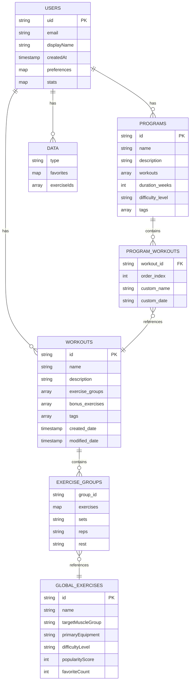

# Current Firestore Schema

## Current Schema Notes

### Collections Hierarchy
- `users/` (top-level)
  - `{userId}/workouts/` (subcollection) - Workout templates
  - `{userId}/programs/` (subcollection) - Training programs
  - `{userId}/data/` (subcollection) - User preferences and favorites
- `global_exercises/` (top-level) - Shared exercise database
- `programs/` (top-level) - Legacy programs (being migrated)

### Key Relationships
1. **Programs → Workouts**: Programs reference workout IDs in their `workouts` array
2. **Workouts → Exercises**: Exercise groups contain exercise names (string references to global exercises)
3. **Users → Data**: User-specific data like favorites stored in data subcollection

### Current Limitations for Weight Logging

**ℹ️ No existing workout session/logging collections found**

**🎯 Missing for Weight Logging:**
- No workout session tracking (instances of workouts performed)
- No exercise performance history (weight, sets, reps per session)
- No real-time workout logging mechanism
- No change history for workout sessions
