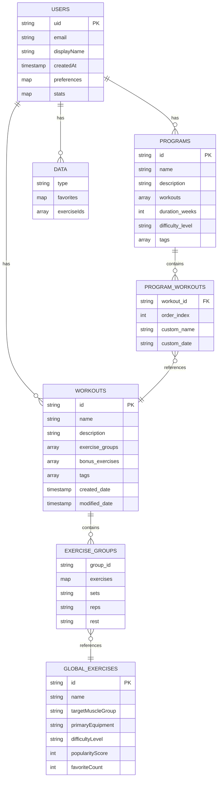

# Firestore Database Structure Summary
Generated: 2025-11-06 10:52:41

## Overview

### Top-Level Collections
- **global_exercises**: 3 documents sampled
- **users**: 0 documents sampled

## User Data Analysis

### Workout Templates
- **Total**: 10 workouts
- **Common Fields**: id, modified_date, tags, sync_status, version, is_template, bonus_exercises, created_date, exercise_groups, name, description

**Sample Workouts:**
- Legs (`workout-06fad623`)
- Push Day (`workout-542be09e`)
- Chest Day (`workout-6338cdee`)
- new new 4 (`workout-7eb8443b`)
- Back & Biceps (`workout-9a39855b`)

### Programs
- **Total**: 10 programs
- **Common Fields**: difficulty_level, id, duration_weeks, modified_date, tags, version, sync_status, workouts, created_date, name, description

**Sample Programs:**
- Fall 2025 v6 (`program-076b2a0c`) - 0 workouts
- Fall 2025 (`program-1f5a9d66`) - 0 workouts
- Fall 2026 (`program-29adc784`) - 0 workouts
- Fall 2025 (`program-2c5c1c98`) - 0 workouts
- Fall 2025 (Copy) (`program-2e3713ec`) - 0 workouts

### Global Exercises
- **Total Sampled**: 100 exercises
- **Required Fields**: 41 fields
- **Optional Fields**: 0 fields

## Existing Logging Mechanisms

- **Users Checked**: 0
- **Logging Collections Found**: 0
- **Weight Fields Found**: 0

**ℹ️ No existing logging collections found - clean slate for implementation**

## Database Schema Diagram

## Current Schema Notes

### Collections Hierarchy
- `users/` (top-level)
  - `{userId}/workouts/` (subcollection) - Workout templates
  - `{userId}/programs/` (subcollection) - Training programs
  - `{userId}/data/` (subcollection) - User preferences and favorites
- `global_exercises/` (top-level) - Shared exercise database
- `programs/` (top-level) - Legacy programs (being migrated)

### Key Relationships
1. **Programs → Workouts**: Programs reference workout IDs in their `workouts` array
2. **Workouts → Exercises**: Exercise groups contain exercise names (string references to global exercises)
3. **Users → Data**: User-specific data like favorites stored in data subcollection

### Current Limitations for Weight Logging

**ℹ️ No existing workout session/logging collections found**

**🎯 Missing for Weight Logging:**
- No workout session tracking (instances of workouts performed)
- No exercise performance history (weight, sets, reps per session)
- No real-time workout logging mechanism
- No change history for workout sessions
