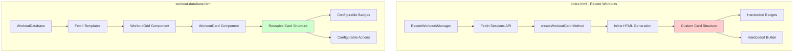
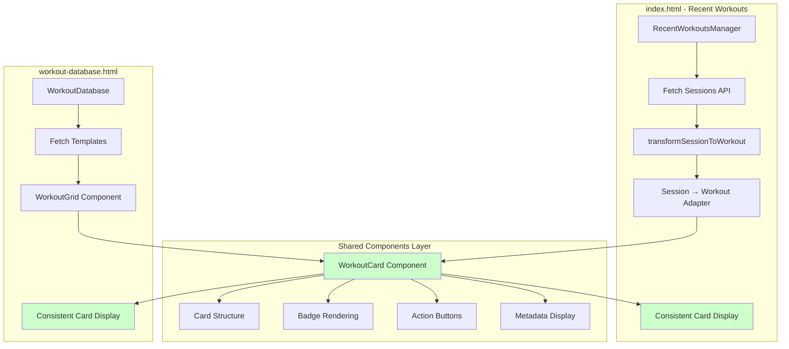
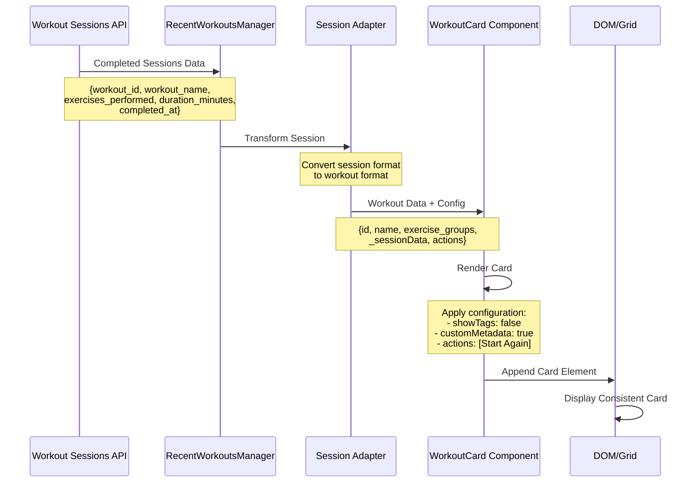
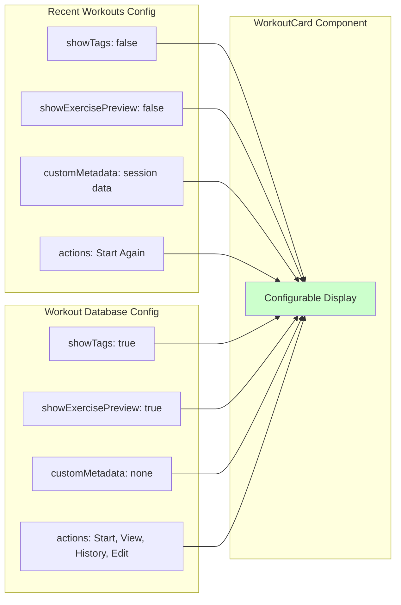
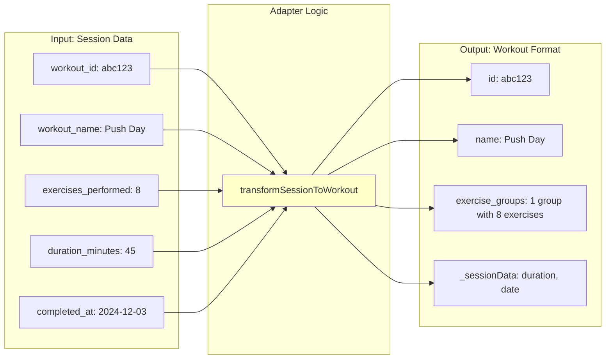
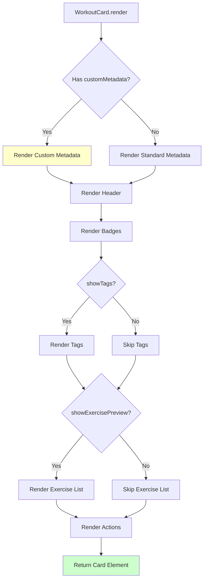
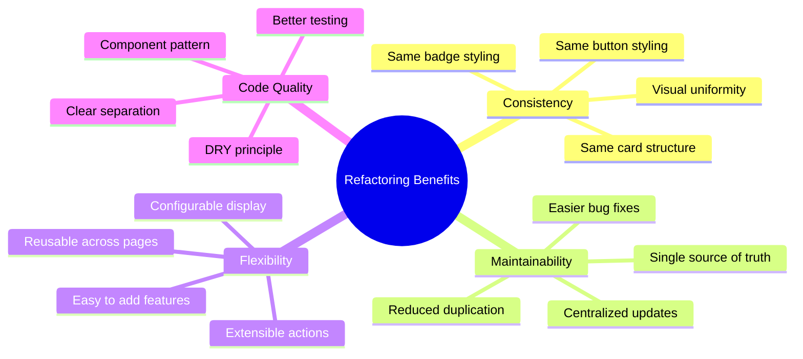
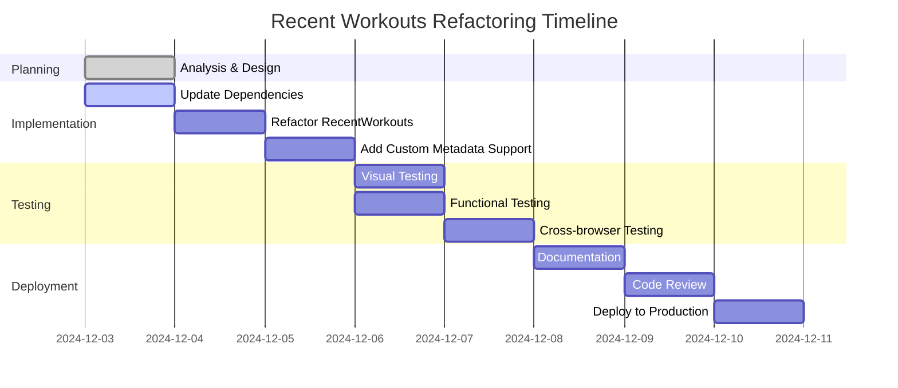

# Recent Workouts Refactoring - Visual Architecture

## Current Architecture (Before Refactoring)



## Refactored Architecture (After)



## Data Flow Diagram



## Component Configuration Comparison



## Session Data Transformation



## Card Rendering Flow



## Benefits Visualization



## Implementation Phases



## File Structure

```
frontend/
├── index.html                          # Add WorkoutCard dependency
├── workout-database.html               # Already uses WorkoutCard
├── assets/
│   ├── css/
│   │   ├── workout-database.css       # Shared card styles
│   │   └── components.css             # Component utilities
│   └── js/
│       ├── components/
│       │   └── workout-card.js        # ✅ Reusable component
│       └── dashboard/
│           ├── recent-workouts.js     # 🔄 Refactor to use WorkoutCard
│           └── workout-database.js    # ✅ Already uses WorkoutCard
```

## Key Takeaways

1. **Adapter Pattern**: Transform session data to workout format
2. **Component Reuse**: Single WorkoutCard for all workout displays
3. **Configuration**: Customize display via config options
4. **Consistency**: Identical visual appearance across pages
5. **Maintainability**: Changes propagate automatically
6. **Extensibility**: Easy to add new features

## Next Steps

1. ✅ Architecture designed
2. ⏳ Implement refactoring
3. ⏳ Test thoroughly
4. ⏳ Document changes
5. ⏳ Deploy to production