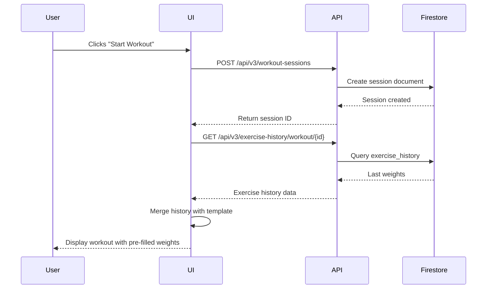
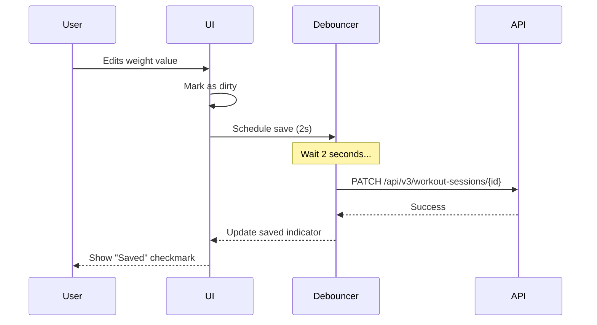
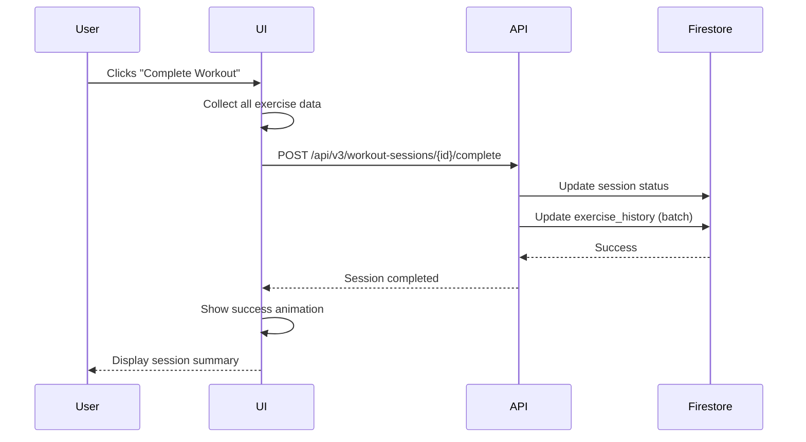

# Weight Logging Frontend Integration Plan
**Version:** 1.0  
**Date:** 2025-11-07  
**Status:** Ready for Implementation

## 📋 Executive Summary

This document provides a detailed implementation plan for integrating the weight logging backend into the Ghost Gym Workout Mode UI. The backend is **fully implemented and tested**, with all API endpoints operational.

### Current Status
- ✅ Backend: Complete (8 API endpoints, tested)
- ✅ Database: Firestore schema deployed
- ✅ Models: Pydantic models implemented
- ⏳ Frontend: Ready to implement

### Implementation Approach
We'll implement in **4 phases**, each building on the previous:
1. **Phase 1**: Basic session management (start/complete)
2. **Phase 2**: Weight input & auto-save
3. **Phase 3**: Visual enhancements (indicators, timers)
4. **Phase 4**: History views & progress tracking

---

## 🎯 Goals & Requirements

### User Experience Goals
1. **Minimal Friction**: Pre-fill weights automatically from last session
2. **Fast & Responsive**: Gym environment requires quick interactions
3. **Clear Feedback**: Visual indicators for weight changes and progress
4. **Offline-Ready**: Cache last weights, sync when online
5. **Mobile-First**: Optimize for phone usage during workouts

### Technical Requirements
1. **Authentication**: All features require Firebase auth
2. **API Integration**: Use existing `/api/v3/workout-sessions` endpoints
3. **State Management**: Track session state throughout workout
4. **Error Handling**: Graceful degradation when offline/errors occur
5. **Performance**: Debounced auto-save, optimized API calls

---

## 📊 Current State Analysis

### Existing Files
```
frontend/
├── workout-mode.html              # Main workout page (251 lines)
├── assets/js/workout-mode.js      # Workout logic (658 lines)
└── assets/css/workout-mode.css    # Workout styles (479 lines)
```

### Current Capabilities
✅ **Working:**
- User can view workout templates
- Exercise groups display with sets/reps/rest
- Rest timer functionality
- Exercise card expand/collapse
- Sound toggle
- Share functionality

❌ **Missing:**
- No weight input fields
- No session tracking
- No weight history display
- No auto-save functionality
- No completion workflow

### Current Workout State
```javascript
window.ghostGym.workoutMode = {
    currentWorkout: null,
    currentExerciseIndex: 0,
    expandedCardIndex: null,
    soundEnabled: true,
    timers: {}
};
```

**Need to Add:**
```javascript
window.ghostGym.workoutMode = {
    // Existing...
    currentWorkout: null,
    
    // NEW: Session tracking
    sessionId: null,
    sessionStatus: 'not_started', // 'not_started' | 'in_progress' | 'completed'
    sessionStartTime: null,
    
    // NEW: Exercise history
    exerciseHistory: {},
    
    // NEW: Auto-save
    autoSaveTimer: null,
    isDirty: false,
    
    // NEW: Weight tracking
    exerciseWeights: {}
};
```

---

## 🔄 Data Flow Architecture

### Workflow 1: Starting a Workout



### Workflow 2: During Workout (Auto-save)



### Workflow 3: Completing Workout



---

## 🛠️ Implementation Plan

## Phase 1: Basic Session Management

### 1.1 Add Session State Management

**File:** `frontend/assets/js/workout-mode.js`

**Add to global state:**
```javascript
window.ghostGym.workoutMode = {
    // Existing properties...
    currentWorkout: null,
    
    // NEW: Session tracking
    session: {
        id: null,
        workoutId: null,
        workoutName: null,
        startedAt: null,
        status: 'not_started', // 'not_started' | 'in_progress' | 'completed'
        exercises: [],
        autoSaveTimer: null
    },
    
    // NEW: Exercise history cache
    exerciseHistory: {}
};
```

### 1.2 Add "Start Workout" Button

**File:** `frontend/workout-mode.html`

**Location:** Inside `.workout-mode-header` (after line 96)

```html
<!-- Session Controls -->
<div class="session-controls text-center mt-3" id="sessionControls">
    <button class="btn btn-lg btn-primary" id="startWorkoutBtn" style="display: none;">
        <i class="bx bx-play-circle me-2"></i>Start Workout
    </button>
    <div id="sessionActiveIndicator" style="display: none;">
        <span class="badge bg-success">
            <i class="bx bx-time-five me-1"></i>
            <span id="sessionTimer">00:00</span>
        </span>
        <span class="badge bg-info ms-2">
            <i class="bx bx-save me-1"></i>
            <span id="autoSaveStatus">Auto-save enabled</span>
        </span>
    </div>
</div>
```

### 1.3 Implement Session Creation

**File:** `frontend/assets/js/workout-mode.js`

**Add new function:**
```javascript
/**
 * Start a new workout session
 */
async function startWorkoutSession(workoutId, workoutName) {
    try {
        console.log('🏋️ Starting workout session:', workoutName);
        
        // Show loading state
        const startBtn = document.getElementById('startWorkoutBtn');
        startBtn.disabled = true;
        startBtn.innerHTML = '<span class="spinner-border spinner-border-sm me-2"></span>Starting...';
        
        // Get auth token
        const token = await getAuthToken();
        if (!token) {
            throw new Error('Authentication required');
        }
        
        // Create session via API
        const response = await fetch('/api/v3/workout-sessions', {
            method: 'POST',
            headers: {
                'Authorization': `Bearer ${token}`,
                'Content-Type': 'application/json'
            },
            body: JSON.stringify({
                workout_id: workoutId,
                workout_name: workoutName,
                started_at: new Date().toISOString()
            })
        });
        
        if (!response.ok) {
            throw new Error(`Failed to create session: ${response.statusText}`);
        }
        
        const session = await response.json();
        
        // Update state
        window.ghostGym.workoutMode.session = {
            id: session.id,
            workoutId: workoutId,
            workoutName: workoutName,
            startedAt: new Date(session.started_at),
            status: 'in_progress',
            exercises: [],
            autoSaveTimer: null
        };
        
        // Fetch exercise history
        await fetchExerciseHistory(workoutId);
        
        // Update UI
        startBtn.style.display = 'none';
        document.getElementById('sessionActiveIndicator').style.display = 'block';
        
        // Start session timer
        startSessionTimer();
        
        // Re-render cards with weight inputs
        renderExerciseCards(window.ghostGym.workoutMode.currentWorkout);
        
        console.log('✅ Workout session started:', session.id);
        
        if (window.showAlert) {
            window.showAlert('Workout session started! 💪', 'success');
        }
        
    } catch (error) {
        console.error('❌ Error starting workout session:', error);
        
        // Reset button
        const startBtn = document.getElementById('startWorkoutBtn');
        startBtn.disabled = false;
        startBtn.innerHTML = '<i class="bx bx-play-circle me-2"></i>Start Workout';
        
        if (window.showAlert) {
            window.showAlert('Failed to start workout session. Please try again.', 'danger');
        }
    }
}
```

### 1.4 Fetch Exercise History

**Add new function:**
```javascript
/**
 * Fetch exercise history for workout
 */
async function fetchExerciseHistory(workoutId) {
    try {
        console.log('📊 Fetching exercise history for workout:', workoutId);
        
        const token = await getAuthToken();
        if (!token) {
            console.warn('No auth token, skipping history fetch');
            return;
        }
        
        const response = await fetch(`/api/v3/exercise-history/workout/${workoutId}`, {
            headers: {
                'Authorization': `Bearer ${token}`
            }
        });
        
        if (!response.ok) {
            throw new Error(`Failed to fetch history: ${response.statusText}`);
        }
        
        const historyData = await response.json();
        
        // Cache exercise history
        window.ghostGym.workoutMode.exerciseHistory = historyData.exercises || {};
        
        console.log('✅ Exercise history loaded:', Object.keys(historyData.exercises || {}).length, 'exercises');
        
    } catch (error) {
        console.error('❌ Error fetching exercise history:', error);
        // Non-fatal error - continue without history
        window.ghostGym.workoutMode.exerciseHistory = {};
    }
}
```

### 1.5 Add "Complete Workout" Button

**File:** `frontend/workout-mode.html`

**Location:** Inside `.workout-mode-footer` (replace existing buttons)

```html
<div class="workout-mode-footer" id="workoutModeFooter" style="display: none;">
    <div class="d-flex justify-content-between align-items-center">
        <!-- Left side: Session info -->
        <div id="sessionInfo" style="display: none;">
            <small class="text-muted">
                <i class="bx bx-time-five me-1"></i>
                <span id="footerSessionTimer">00:00</span>
            </small>
        </div>
        
        <!-- Center: Complete button -->
        <button class="btn btn-success btn-lg flex-grow-1 mx-2" id="completeWorkoutBtn" style="display: none;">
            <i class="bx bx-check-circle me-2"></i>Complete Workout
        </button>
        
        <!-- Right side: Controls -->
        <div class="d-flex gap-2">
            <button class="btn btn-outline-primary" id="shareWorkoutBtn">
                <i class="bx bx-share-alt"></i>
            </button>
            <button class="btn btn-outline-secondary" id="soundToggleBtn">
                <i class="bx bx-volume-full" id="soundIcon"></i>
            </button>
        </div>
    </div>
</div>
```

### 1.6 Implement Session Completion

**Add new function:**
```javascript
/**
 * Complete the current workout session
 */
async function completeWorkoutSession() {
    try {
        const session = window.ghostGym.workoutMode.session;
        
        if (!session.id || session.status !== 'in_progress') {
            throw new Error('No active session to complete');
        }
        
        console.log('🏁 Completing workout session:', session.id);
        
        // Show loading state
        const completeBtn = document.getElementById('completeWorkoutBtn');
        completeBtn.disabled = true;
        completeBtn.innerHTML = '<span class="spinner-border spinner-border-sm me-2"></span>Completing...';
        
        // Collect all exercise data
        const exercisesPerformed = collectExerciseData();
        
        // Get auth token
        const token = await getAuthToken();
        if (!token) {
            throw new Error('Authentication required');
        }
        
        // Complete session via API
        const response = await fetch(`/api/v3/workout-sessions/${session.id}/complete`, {
            method: 'POST',
            headers: {
                'Authorization': `Bearer ${token}`,
                'Content-Type': 'application/json'
            },
            body: JSON.stringify({
                completed_at: new Date().toISOString(),
                exercises_performed: exercisesPerformed,
                notes: ''
            })
        });
        
        if (!response.ok) {
            throw new Error(`Failed to complete session: ${response.statusText}`);
        }
        
        const completedSession = await response.json();
        
        // Update state
        session.status = 'completed';
        session.completedAt = new Date(completedSession.completed_at);
        
        // Stop session timer
        stopSessionTimer();
        
        // Show success message
        showCompletionSummary(completedSession);
        
        console.log('✅ Workout session completed:', session.id);
        
    } catch (error) {
        console.error('❌ Error completing workout session:', error);
        
        // Reset button
        const completeBtn = document.getElementById('completeWorkoutBtn');
        completeBtn.disabled = false;
        completeBtn.innerHTML = '<i class="bx bx-check-circle me-2"></i>Complete Workout';
        
        if (window.showAlert) {
            window.showAlert('Failed to complete workout. Please try again.', 'danger');
        }
    }
}
```

### 1.7 Helper Functions

**Add helper functions:**
```javascript
/**
 * Get Firebase auth token
 */
async function getAuthToken() {
    try {
        if (!firebase.auth().currentUser) {
            return null;
        }
        return await firebase.auth().currentUser.getIdToken();
    } catch (error) {
        console.error('Error getting auth token:', error);
        return null;
    }
}

/**
 * Start session timer
 */
function startSessionTimer() {
    const session = window.ghostGym.workoutMode.session;
    
    if (session.timerInterval) {
        clearInterval(session.timerInterval);
    }
    
    session.timerInterval = setInterval(() => {
        const elapsed = Math.floor((Date.now() - session.startedAt.getTime()) / 1000);
        const minutes = Math.floor(elapsed / 60);
        const seconds = elapsed % 60;
        const timeStr = `${minutes.toString().padStart(2, '0')}:${seconds.toString().padStart(2, '0')}`;
        
        document.getElementById('sessionTimer').textContent = timeStr;
        document.getElementById('footerSessionTimer').textContent = timeStr;
    }, 1000);
}

/**
 * Stop session timer
 */
function stopSessionTimer() {
    const session = window.ghostGym.workoutMode.session;
    
    if (session.timerInterval) {
        clearInterval(session.timerInterval);
        session.timerInterval = null;
    }
}

/**
 * Show completion summary modal
 */
function showCompletionSummary(session) {
    const duration = session.duration_minutes || 0;
    const exerciseCount = session.exercises_performed?.length || 0;
    
    const message = `
        <div class="text-center">
            <i class="bx bx-trophy display-1 text-success mb-3"></i>
            <h4>Workout Complete! 🎉</h4>
            <p class="text-muted">Great job on completing your workout!</p>
            <div class="mt-3">
                <div class="d-flex justify-content-center gap-4">
                    <div>
                        <div class="h5 mb-0">${duration} min</div>
                        <small class="text-muted">Duration</small>
                    </div>
                    <div>
                        <div class="h5 mb-0">${exerciseCount}</div>
                        <small class="text-muted">Exercises</small>
                    </div>
                </div>
            </div>
        </div>
    `;
    
    if (window.showAlert) {
        window.showAlert(message, 'success');
    } else {
        alert('Workout completed successfully!');
    }
    
    // Redirect to workouts page after 3 seconds
    setTimeout(() => {
        window.location.href = 'workouts.html';
    }, 3000);
}
```

### 1.8 Update loadWorkout Function

**Modify existing function to show Start button:**
```javascript
async function loadWorkout(workoutId) {
    try {
        console.log('📥 Loading workout:', workoutId);
        
        // ... existing loading code ...
        
        // Store workout
        window.ghostGym.workoutMode.currentWorkout = workout;
        
        // Update page title
        document.getElementById('workoutName').textContent = workout.name;
        document.title = `👻 ${workout.name} - Workout Mode - Ghost Gym`;
        
        // Render exercise cards
        renderExerciseCards(workout);
        
        // Show Start Workout button (if authenticated)
        const user = firebase.auth().currentUser;
        if (user) {
            const startBtn = document.getElementById('startWorkoutBtn');
            startBtn.style.display = 'block';
            startBtn.onclick = () => startWorkoutSession(workout.id, workout.name);
        }
        
        // Hide loading, show content
        document.getElementById('workoutLoadingState').style.display = 'none';
        document.getElementById('exerciseCardsContainer').style.display = 'block';
        document.getElementById('workoutModeFooter').style.display = 'block';
        
        console.log('✅ Workout loaded:', workout.name);
        
    } catch (error) {
        console.error('❌ Error loading workout:', error);
        showError(error.message);
    }
}
```

---

## Phase 2: Weight Input & Auto-Save

### 2.1 Add Weight Input Fields to Exercise Cards

**Modify `renderExerciseCard` function:**

```javascript
function renderExerciseCard(group, index, isBonus) {
    const exercises = group.exercises || {};
    const mainExercise = exercises.a || 'Unknown Exercise';
    const alternates = [];
    
    // Collect alternate exercises
    if (exercises.b) alternates.push({ label: 'Alt1', name: exercises.b });
    if (exercises.c) alternates.push({ label: 'Alt2', name: exercises.c });
    
    const sets = group.sets || '3';
    const reps = group.reps || '8-12';
    const rest = group.rest || '60s';
    const notes = group.notes || '';
    
    // Parse rest time to seconds
    const restSeconds = parseRestTime(rest);
    const timerId = `timer-${index}`;
    
    const bonusClass = isBonus ? 'bonus-exercise' : '';
    
    // Get exercise history for this exercise
    const history = window.ghostGym.workoutMode.exerciseHistory[mainExercise];
    const lastWeight = history?.last_weight || '';
    const lastWeightUnit = history?.last_weight_unit || 'lbs';
    const lastSessionDate = history?.last_session_date ? 
        new Date(history.last_session_date).toLocaleDateString() : null;
    
    // Check if session is active
    const sessionActive = window.ghostGym.workoutMode.session.status === 'in_progress';
    
    return `
        <div class="card exercise-card ${bonusClass}" data-exercise-index="${index}">
            <!-- Collapsed Header -->
            <div class="card-header exercise-card-header" onclick="toggleExerciseCard(${index})">
                <div class="exercise-card-summary">
                    <h6 class="mb-1">${escapeHtml(mainExercise)}</h6>
                    <div class="exercise-card-meta text-muted small">
                        ${sets} × ${reps} • Rest: ${rest}
                        ${sessionActive && lastWeight ? ` • Last: ${lastWeight} ${lastWeightUnit}` : ''}
                    </div>
                    ${alternates.length > 0 ? `
                        <div class="exercise-card-alts text-muted small mt-1">
                            ${alternates.map(alt => `<span>${alt.label}: ${escapeHtml(alt.name)}</span>`).join('')}
                        </div>
                    ` : ''}
                </div>
                <i class="bx bx-chevron-down expand-icon"></i>
            </div>
            
            <!-- Expanded Body -->
            <div class="card-body exercise-card-body" style="display: none;">
                <!-- Exercise Details -->
                <div class="mb-3">
                    <div class="d-flex justify-content-between align-items-center mb-2">
                        <h5 class="mb-0">${escapeHtml(mainExercise)}</h5>
                        <span class="badge bg-label-primary">${sets} × ${reps}</span>
                    </div>
                    
                    ${notes ? `
                        <div class="alert alert-info mb-3">
                            <i class="bx bx-info-circle me-1"></i>
                            ${escapeHtml(notes)}
                        </div>
                    ` : ''}
                    
                    ${alternates.length > 0 ? `
                        <div class="text-muted small mb-3">
                            <strong>Alternates:</strong><br>
                            ${alternates.map(alt => `${alt.label}: ${escapeHtml(alt.name)}`).join('<br>')}
                        </div>
                    ` : ''}
                </div>
                
                <!-- Weight Input Section (NEW) -->
                ${sessionActive ? `
                    <div class="weight-input-section mb-3">
                        <label class="form-label fw-semibold">Weight</label>
                        <div class="input-group">
                            <input 
                                type="number" 
                                class="form-control form-control-lg weight-input" 
                                id="weight-${index}"
                                data-exercise-name="${escapeHtml(mainExercise)}"
                                data-group-id="${group.group_id || `group-${index}`}"
                                value="${lastWeight}"
                                step="5"
                                min="0"
                                placeholder="Enter weight"
                                onchange="onWeightChange('${escapeHtml(mainExercise)}', this.value)"
                            >
                            <select 
                                class="form-select weight-unit-select" 
                                id="unit-${index}"
                                style="max-width: 80px;"
                                onchange="onWeightUnitChange('${escapeHtml(mainExercise)}', this.value)"
                            >
                                <option value="lbs" ${lastWeightUnit === 'lbs' ? 'selected' : ''}>lbs</option>
                                <option value="kg" ${lastWeightUnit === 'kg' ? 'selected' : ''}>kg</option>
                            </select>
                        </div>
                        ${lastWeight && lastSessionDate ? `
                            <small class="text-muted mt-1 d-block">
                                <i class="bx bx-history me-1"></i>
                                Last: ${lastWeight} ${lastWeightUnit} (${lastSessionDate})
                            </small>
                        ` : ''}
                        <div class="weight-change-indicator mt-2" id="change-${index}" style="display: none;">
                            <!-- Weight change badge will appear here -->
                        </div>
                    </div>
                ` : ''}
                
                <!-- Rest Timer -->
                <div class="rest-timer-container mb-3">
                    <div class="rest-timer" data-rest-seconds="${restSeconds}" data-timer-id="${timerId}">
                        <!-- Timer UI will be rendered here -->
                    </div>
                </div>
                
                <!-- Next Exercise Button -->
                <button class="btn btn-primary w-100" onclick="goToNextExercise(${index})">
                    <i class="bx bx-right-arrow-alt me-1"></i>
                    Next Exercise
                </button>
            </div>
        </div>
    `;
}
```

### 2.2 Implement Auto-Save Logic

**Add auto-save functions:**
```javascript
/**
 * Handle weight change with debounced auto-save
 */
function onWeightChange(exerciseName, weight) {
    const session = window.ghostGym.workoutMode.session;
    
    if (session.status !== 'in_progress') {
        return;
    }
    
    // Update local state
    if (!session.exercises) {
        session.exercises = {};
    }
    
    if (!session.exercises[exerciseName]) {
        session.exercises[exerciseName] = {
            exercise_name: exerciseName,
            weight: parseFloat(weight) || 0,
            weight_unit: 'lbs'
        };
    } else {
        session.exercises[exerciseName].weight = parseFloat(weight) || 0;
    }
    
    // Calculate weight change
    const history = window.ghostGym.workoutMode.exerciseHistory[exerciseName];
    if (history && history.last_weight) {
        const change = (parseFloat(weight) || 0) - history.last_weight;
        session.exercises[exerciseName].weight_change = change;
        session.exercises[exerciseName].previous_weight = history.last_weight;
        
        // Update weight change indicator
        updateWeightChangeIndicator(exerciseName, change);
    }
    
    // Trigger debounced auto-save
    scheduleAutoSave();
}

/**
 * Handle weight unit change
 */
function onWeightUnitChange(exerciseName, unit) {
    const session = window.ghostGym.workoutMode.session;
    
    if (session.status !== 'in_progress') {
        return;
    }
    
    if (!session.exercises[exerciseName]) {
        session.exercises[exerciseName] = {
            exercise_name: exerciseName,
            weight: 0,
            weight_unit: unit
        };
    } else {
        session.exercises[exerciseName].weight_unit = unit;
    }
    
    scheduleAutoSave();
}

/**
 * Schedule auto-save with 2-second debounce
 */
function scheduleAutoSave() {
    const session = window.ghostGym.workoutMode.session;
    
    // Clear existing timer
    if (session.autoSaveTimer) {
        clearTimeout(session.autoSaveTimer);
    }
    
    // Show "saving..." indicator
    updateAutoSaveStatus('saving');
    
    // Schedule new save
    session.autoSaveTimer = setTimeout(async () => {
        await autoSaveSession();
    }, 2000); // 2 second debounce
}

/**
 * Auto-save session progress
 */
async function autoSaveSession() {
    try {
        const session = window.ghostGym.workoutMode.session;
        
        if (!session.id || session.status !== 'in_progress') {
            return;
        }
        
        console.log('💾 Auto-saving session:', session.id);
        
        // Get auth token
        const token = await getAuthToken();
        if (!token) {
            throw new Error('Authentication required');
        }
        
        // Prepare exercises data
        const exercisesPerformed = Object.values(session.exercises);
        
        // Save via API
        const response = await fetch(`/api/v3/workout-sessions/${session.id}`, {
            method: 'PATCH',
            headers: {
                'Authorization': `Bearer ${token}`,
                'Content-Type': 'application/json'
            },
            body: JSON.stringify({
                exercises_performed: exercisesPerformed
            })
        });
        
        if (!response.ok) {
            throw new Error(`Auto-save failed: ${response.statusText}`);
        }
        
        console.log('✅ Session auto-saved');
        updateAutoSaveStatus('saved');
        
    } catch (error) {
        console.error('❌ Auto-save error:', error);
        updateAutoSaveStatus('error');
    }
}

/**
 * Update auto-save status indicator
 */
function updateAutoSaveStatus(status) {
    const statusEl = document.getElementById('autoSaveStatus');
    if (!statusEl) return;
    
    switch (status) {
        case 'saving':
            statusEl.innerHTML = '<span class="spinner-border spinner-border-sm me-1"></span>Saving...';
            break;
        case 'saved':
            statusEl.innerHTML = '<i class="bx bx-check me-1"></i>Saved';
            setTimeout(() => {
                statusEl.innerHTML = '<i class="bx bx-save me-1"></i>Auto-save enabled';
            }, 2000);
            break;
        case 'error':
            statusEl.innerHTML = '<i class="bx bx-error me-1"></i>Save failed';
            setTimeout(() => {
                statusEl.innerHTML = '<i class="bx bx-save me-1"></i>Auto-save enabled';
            }, 3000);
            break;
    }
}
```

### 2.3 Collect Exercise Data for Completion

**Add data collection function:**
```javascript
/**
 * Collect all exercise data for session completion
 */
function collectExerciseData() {
    const workout = window.ghostGym.workoutMode.currentWorkout;
    const session = window.ghostGym.workoutMode.session;
    const exercisesPerformed = [];
    
    let orderIndex = 0;
    
    // Collect from exercise groups
    if (workout.exercise_groups) {
        workout.exercise_groups.forEach((group, groupIndex) => {
            const mainExercise = group.exercises?.a;
            if (!mainExercise
) {
                return;
            }
            
            const exerciseData = session.exercises[mainExercise] || {};
            const history = window.ghostGym.workoutMode.exerciseHistory[mainExercise];
            
            exercisesPerformed.push({
                exercise_name: mainExercise,
                exercise_id: exerciseData.exercise_id || null,
                group_id: group.group_id || `group-${groupIndex}`,
                sets_completed: parseInt(group.sets) || 0,
                target_sets: group.sets || '3',
                target_reps: group.reps || '8-12',
                weight: exerciseData.weight || 0,
                weight_unit: exerciseData.weight_unit || 'lbs',
                previous_weight: history?.last_weight || null,
                weight_change: exerciseData.weight_change || 0,
                order_index: orderIndex++,
                is_bonus: false
            });
        });
    }
    
    // Collect from bonus exercises
    if (workout.bonus_exercises) {
        workout.bonus_exercises.forEach((bonus, bonusIndex) => {
            const exerciseData = session.exercises[bonus.name] || {};
            const history = window.ghostGym.workoutMode.exerciseHistory[bonus.name];
            
            exercisesPerformed.push({
                exercise_name: bonus.name,
                exercise_id: bonus.exercise_id || null,
                group_id: bonus.exercise_id || `bonus-${bonusIndex}`,
                sets_completed: parseInt(bonus.sets) || 0,
                target_sets: bonus.sets || '2',
                target_reps: bonus.reps || '15',
                weight: exerciseData.weight || 0,
                weight_unit: exerciseData.weight_unit || 'lbs',
                previous_weight: history?.last_weight || null,
                weight_change: exerciseData.weight_change || 0,
                order_index: orderIndex++,
                is_bonus: true
            });
        });
    }
    
    return exercisesPerformed;
}
```

---

## Phase 3: Visual Enhancements

### 3.1 Add Weight Change Indicators

**File:** `frontend/assets/js/workout-mode.js`

**Add function:**
```javascript
/**
 * Update weight change indicator badge
 */
function updateWeightChangeIndicator(exerciseName, change) {
    // Find the exercise card
    const cards = document.querySelectorAll('.exercise-card');
    let targetCard = null;
    
    cards.forEach(card => {
        const weightInput = card.querySelector(`input[data-exercise-name="${exerciseName}"]`);
        if (weightInput) {
            targetCard = card;
        }
    });
    
    if (!targetCard) return;
    
    const indicatorId = targetCard.querySelector('.weight-change-indicator').id;
    const indicator = document.getElementById(indicatorId);
    
    if (!indicator) return;
    
    if (change === 0) {
        indicator.style.display = 'none';
        return;
    }
    
    const changeAbs = Math.abs(change);
    const changeSign = change > 0 ? '+' : '';
    const badgeClass = change > 0 ? 'bg-success' : 'bg-danger';
    const icon = change > 0 ? 'bx-trending-up' : 'bx-trending-down';
    
    indicator.innerHTML = `
        <span class="badge ${badgeClass}">
            <i class="bx ${icon} me-1"></i>
            ${changeSign}${changeAbs} lbs from last session
        </span>
    `;
    indicator.style.display = 'block';
}
```

### 3.2 Add CSS Styles for Weight Inputs

**File:** `frontend/assets/css/workout-mode.css`

**Add at end of file:**
```css
/* ============================================
   WEIGHT LOGGING STYLES
   ============================================ */

/* Weight Input Section */
.weight-input-section {
    background: var(--bs-gray-100);
    border-radius: var(--bs-border-radius);
    padding: 1rem;
}

[data-bs-theme="dark"] .weight-input-section {
    background: var(--bs-gray-800);
}

.weight-input {
    font-size: 1.25rem;
    font-weight: 600;
    text-align: center;
}

.weight-unit-select {
    font-weight: 600;
}

/* Weight Change Indicators */
.weight-change-indicator {
    animation: slideIn 0.3s ease;
}

.weight-change-indicator .badge {
    font-size: 0.875rem;
    padding: 0.5rem 0.75rem;
}

@keyframes slideIn {
    from {
        opacity: 0;
        transform: translateY(-10px);
    }
    to {
        opacity: 1;
        transform: translateY(0);
    }
}

/* Session Controls */
.session-controls {
    margin-bottom: 1.5rem;
}

.session-controls .btn-lg {
    padding: 0.75rem 2rem;
    font-size: 1.1rem;
}

#sessionActiveIndicator .badge {
    font-size: 0.9rem;
    padding: 0.5rem 0.75rem;
}

/* Complete Workout Button */
#completeWorkoutBtn {
    min-height: 50px;
    font-size: 1.1rem;
    font-weight: 600;
}

/* Loading States */
.weight-input:disabled {
    background-color: var(--bs-gray-200);
    cursor: not-allowed;
}

/* Mobile Responsive */
@media (max-width: 768px) {
    .weight-input-section {
        padding: 0.75rem;
    }
    
    .weight-input {
        font-size: 1.1rem;
    }
    
    .session-controls .btn-lg {
        padding: 0.6rem 1.5rem;
        font-size: 1rem;
    }
    
    #completeWorkoutBtn {
        min-height: 45px;
        font-size: 1rem;
    }
}

@media (max-width: 576px) {
    .weight-input {
        font-size: 1rem;
    }
    
    .weight-change-indicator .badge {
        font-size: 0.8rem;
        padding: 0.4rem 0.6rem;
    }
}
```

---

## Phase 4: History View

### 4.1 Add History Section to HTML

**File:** `frontend/workout-mode.html`

**Add before exercise cards container:**
```html
<!-- Workout History Section -->
<div id="workoutHistorySection" class="mb-4" style="display: none;">
    <div class="card">
        <div class="card-header d-flex justify-content-between align-items-center">
            <h5 class="mb-0">
                <i class="bx bx-history me-2"></i>Recent Sessions
            </h5>
            <button class="btn btn-sm btn-outline-secondary" onclick="toggleHistorySection()">
                <i class="bx bx-chevron-down" id="historyToggleIcon"></i>
            </button>
        </div>
        <div class="card-body" id="historyContent" style="display: none;">
            <div id="historyLoading" class="text-center py-3">
                <div class="spinner-border spinner-border-sm text-primary"></div>
                <p class="text-muted mt-2 mb-0">Loading history...</p>
            </div>
            <div id="historyList">
                <!-- History items will be rendered here -->
            </div>
        </div>
    </div>
</div>
```

### 4.2 Implement History Fetching

**File:** `frontend/assets/js/workout-mode.js`

**Add functions:**
```javascript
/**
 * Fetch and display workout session history
 */
async function fetchWorkoutHistory(workoutId) {
    try {
        console.log('📊 Fetching workout history:', workoutId);
        
        const token = await getAuthToken();
        if (!token) {
            console.warn('No auth token, skipping history fetch');
            return;
        }
        
        const response = await fetch(`/api/v3/workout-sessions?workout_id=${workoutId}&limit=10`, {
            headers: {
                'Authorization': `Bearer ${token}`
            }
        });
        
        if (!response.ok) {
            throw new Error(`Failed to fetch history: ${response.statusText}`);
        }
        
        const data = await response.json();
        
        // Render history
        renderWorkoutHistory(data.sessions);
        
        // Show history section
        document.getElementById('workoutHistorySection').style.display = 'block';
        
        console.log('✅ Workout history loaded:', data.sessions.length, 'sessions');
        
    } catch (error) {
        console.error('❌ Error fetching workout history:', error);
        // Non-fatal error - hide history section
        document.getElementById('workoutHistorySection').style.display = 'none';
    }
}

/**
 * Render workout history list
 */
function renderWorkoutHistory(sessions) {
    const historyList = document.getElementById('historyList');
    const historyLoading = document.getElementById('historyLoading');
    
    historyLoading.style.display = 'none';
    
    if (!sessions || sessions.length === 0) {
        historyList.innerHTML = `
            <div class="text-center text-muted py-3">
                <i class="bx bx-info-circle display-4 mb-2"></i>
                <p>No previous sessions found</p>
                <small>Complete your first workout to see history here</small>
            </div>
        `;
        return;
    }
    
    let html = '<div class="list-group list-group-flush">';
    
    sessions.forEach(session => {
        const date = new Date(session.completed_at || session.started_at);
        const dateStr = date.toLocaleDateString('en-US', { 
            month: 'short', 
            day: 'numeric',
            year: 'numeric'
        });
        const timeStr = date.toLocaleTimeString('en-US', { 
            hour: '2-digit', 
            minute: '2-digit'
        });
        
        const duration = session.duration_minutes || 0;
        const exerciseCount = session.exercises_performed?.length || 0;
        const status = session.status || 'completed';
        
        const statusBadge = status === 'completed' ? 
            '<span class="badge bg-success">Completed</span>' :
            status === 'in_progress' ?
            '<span class="badge bg-warning">In Progress</span>' :
            '<span class="badge bg-secondary">Abandoned</span>';
        
        html += `
            <div class="list-group-item">
                <div class="d-flex justify-content-between align-items-start">
                    <div class="flex-grow-1">
                        <div class="d-flex align-items-center mb-1">
                            <strong>${dateStr}</strong>
                            <span class="text-muted ms-2">${timeStr}</span>
                            <span class="ms-2">${statusBadge}</span>
                        </div>
                        <div class="text-muted small">
                            <i class="bx bx-time-five me-1"></i>${duration} min
                            <i class="bx bx-dumbbell ms-3 me-1"></i>${exerciseCount} exercises
                        </div>
                    </div>
                    <button class="btn btn-sm btn-outline-primary" onclick="viewSessionDetails('${session.id}')">
                        <i class="bx bx-show"></i>
                    </button>
                </div>
            </div>
        `;
    });
    
    html += '</div>';
    historyList.innerHTML = html;
}

/**
 * Toggle history section visibility
 */
function toggleHistorySection() {
    const content = document.getElementById('historyContent');
    const icon = document.getElementById('historyToggleIcon');
    
    if (content.style.display === 'none') {
        content.style.display = 'block';
        icon.className = 'bx bx-chevron-up';
    } else {
        content.style.display = 'none';
        icon.className = 'bx bx-chevron-down';
    }
}

/**
 * View session details (placeholder for future implementation)
 */
function viewSessionDetails(sessionId) {
    console.log('View session details:', sessionId);
    // TODO: Implement session detail modal
    if (window.showAlert) {
        window.showAlert('Session details view coming soon!', 'info');
    }
}
```

### 4.3 Update loadWorkout to Fetch History

**Modify loadWorkout function:**
```javascript
async function loadWorkout(workoutId) {
    try {
        console.log('📥 Loading workout:', workoutId);
        
        // ... existing loading code ...
        
        // Store workout
        window.ghostGym.workoutMode.currentWorkout = workout;
        
        // Update page title
        document.getElementById('workoutName').textContent = workout.name;
        document.title = `👻 ${workout.name} - Workout Mode - Ghost Gym`;
        
        // Render exercise cards
        renderExerciseCards(workout);
        
        // Fetch workout history (if authenticated)
        const user = firebase.auth().currentUser;
        if (user) {
            await fetchWorkoutHistory(workoutId);
            
            // Show Start Workout button
            const startBtn = document.getElementById('startWorkoutBtn');
            startBtn.style.display = 'block';
            startBtn.onclick = () => startWorkoutSession(workout.id, workout.name);
        }
        
        // Hide loading, show content
        document.getElementById('workoutLoadingState').style.display = 'none';
        document.getElementById('exerciseCardsContainer').style.display = 'block';
        document.getElementById('workoutModeFooter').style.display = 'block';
        
        console.log('✅ Workout loaded:', workout.name);
        
    } catch (error) {
        console.error('❌ Error loading workout:', error);
        showError(error.message);
    }
}
```

---

## 🧪 Testing Strategy

### Unit Testing Checklist

**Session Management:**
- [ ] Start workout creates session successfully
- [ ] Session ID is stored in state
- [ ] Session timer starts correctly
- [ ] Complete workout finalizes session
- [ ] Session status updates correctly

**Weight Tracking:**
- [ ] Weight inputs display last used weights
- [ ] Weight changes trigger auto-save
- [ ] Auto-save debounces correctly (2 seconds)
- [ ] Weight change indicators show correct values
- [ ] Weight unit selection works

**History:**
- [ ] History fetches on page load
- [ ] History displays correctly
- [ ] Empty history shows appropriate message
- [ ] History toggle works

### Integration Testing Checklist

**Full Workflow:**
- [ ] User can start workout
- [ ] Last weights pre-populate
- [ ] User can edit weights
- [ ] Changes auto-save
- [ ] User can complete workout
- [ ] History updates after completion
- [ ] New session shows updated weights

**Error Handling:**
- [ ] Offline mode shows cached weights
- [ ] API errors display user-friendly messages
- [ ] Failed auto-save retries
- [ ] Authentication errors handled gracefully

### User Acceptance Testing

**Scenarios:**
1. **First-time user** (no history)
   - Start workout → Empty weight fields
   - Enter weights → Auto-save works
   - Complete workout → Success message

2. **Returning user** (has history)
   - Start workout → Last weights pre-filled
   - Increase weight → Green indicator shows
   - Complete workout → History updates

3. **Mobile user**
   - All buttons are tappable
   - Inputs are large enough
   - No horizontal scrolling
   - Timer is visible

---

## 🚀 Deployment Plan

### Pre-Deployment Checklist

- [ ] All code reviewed and tested locally
- [ ] No console errors in browser
- [ ] Mobile responsive design verified
- [ ] Authentication flow tested
- [ ] API endpoints tested with real data
- [ ] Error handling tested
- [ ] Loading states tested

### Deployment Steps

1. **Backup Current Files**
   ```bash
   cp frontend/workout-mode.html frontend/workout-mode.html.backup
   cp frontend/assets/js/workout-mode.js frontend/assets/js/workout-mode.js.backup
   cp frontend/assets/css/workout-mode.css frontend/assets/css/workout-mode.css.backup
   ```

2. **Deploy Changes**
   ```bash
   git add frontend/workout-mode.html
   git add frontend/assets/js/workout-mode.js
   git add frontend/assets/css/workout-mode.css
   git commit -m "feat: Add weight logging to Workout Mode

   - Add session management (start/complete)
   - Add weight input fields with auto-save
   - Add weight change indicators
   - Add session history view
   - Add session timer
   - Integrate with weight logging backend API"
   
   git push origin main
   ```

3. **Verify Deployment**
   - Test on staging environment
   - Verify API calls work
   - Test on mobile device
   - Check browser console for errors

4. **Monitor**
   - Watch for error reports
   - Monitor API usage
   - Collect user feedback

### Rollback Plan

If issues occur:
```bash
git revert HEAD
git push origin main
```

Or restore from backup:
```bash
cp frontend/workout-mode.html.backup frontend/workout-mode.html
cp frontend/assets/js/workout-mode.js.backup frontend/assets/js/workout-mode.js
cp frontend/assets/css/workout-mode.css.backup frontend/assets/css/workout-mode.css
```

---

## 📝 Implementation Notes

### Key Design Decisions

1. **Auto-save with 2-second debounce**
   - Balances data safety with API call efficiency
   - Prevents excessive writes during rapid edits

2. **Pre-fill last weights**
   - Reduces user input during workout
   - Supports progressive overload tracking

3. **Session-based tracking**
   - Clear start/end workflow
   - Enables accurate duration tracking

4. **Composite key for exercise history**
   - `{workout_id}_{exercise_name}`
   - Maintains separate history per workout

5. **Graceful degradation**
   - Works without authentication (view-only)
   - Caches data for offline scenarios

### Performance Considerations

- **Debounced auto-save**: Reduces API calls
- **Cached exercise history**: Avoids repeated fetches
- **Lazy load history**: Only fetch when needed
- **Optimistic UI updates**: Show changes immediately

### Security Considerations

- **Authentication required**: All write operations need Firebase auth
- **Token validation**: Backend validates all requests
- **User isolation**: Users can only access their own data
- **Input validation**: Sanitize all user inputs

---

## 🎓 Code Quality Standards

### JavaScript Best Practices

- Use `async/await` for API calls
- Handle errors with try/catch
- Add console logging for debugging
- Use descriptive variable names
- Comment complex logic

### HTML Best Practices

- Use semantic HTML elements
- Add ARIA labels for accessibility
- Use Bootstrap classes consistently
- Keep markup clean and readable

### CSS Best Practices

- Follow existing naming conventions
- Use CSS variables for theming
- Add dark mode support
- Make responsive with media queries

---

## 📚 Additional Resources

### API Documentation
- [`WEIGHT_LOGGING_QUICK_REFERENCE.md`](WEIGHT_LOGGING_QUICK_REFERENCE.md)
- [`WEIGHT_LOGGING_DATABASE_ARCHITECTURE.md`](WEIGHT_LOGGING_DATABASE_ARCHITECTURE.md)
- [`backend/api/workout_sessions.py`](backend/api/workout_sessions.py)

### Backend Models
- [`backend/models.py`](backend/models.py) (lines 773-933)

### Existing Frontend Code
- [`frontend/workout-mode.html`](frontend/workout-mode.html)
- [`frontend/assets/js/workout-mode.js`](frontend/assets/js/workout-mode.js)
- [`frontend/assets/css/workout-mode.css`](frontend/assets/css/workout-mode.css)

---

## ❓ Questions & Answers

### Q1: How should we handle exercises with no previous weight history?
**A:** Show empty weight input fields. User enters weight for first time, which becomes the baseline for future sessions.

### Q2: Should we show a confirmation dialog before completing workout?
**A:** No. Keep it simple - single click to complete. User can always delete session if needed.

### Q3: How should we display weight progression?
**A:** Phase 4 includes a history list. Future enhancement: add charts using Chart.js or similar.

### Q4: Should we allow editing completed sessions?
**A:** Not in initial release. Focus on forward progress. Can add edit feature later if needed.

### Q5: How should we handle abandoned sessions?
**A:** Auto-save preserves data. User can resume or start new session. Old in-progress sessions can be cleaned up via admin tool.

---

## 🎯 Success Metrics

### User Engagement
- % of users who start workout sessions
- Average session completion rate
- Number of workouts logged per week

### Technical Performance
- API response times < 200ms
- Auto-save success rate > 99%
- Zero data loss incidents

### User Satisfaction
- Positive feedback on weight tracking
- Reduced support tickets about logging
- Increased app usage time

---

## 🔄 Future Enhancements

### Phase 5: Advanced Features (Future)
- [ ] Set-by-set tracking (optional detail)
- [ ] Rest timer integration with logging
- [ ] Workout analytics dashboard
- [ ] Export workout history (CSV/PDF)
- [ ] Social sharing of PRs
- [ ] AI-powered weight suggestions
- [ ] Progressive overload recommendations
- [ ] Workout streak tracking
- [ ] Achievement badges
- [ ] Workout templates from history

---

## 📞 Support & Troubleshooting

### Common Issues

**Issue:** "Authentication required" error
**Solution:** Ensure user is logged in with Firebase auth

**Issue:** Auto-save not working
**Solution:** Check browser console for API errors, verify auth token

**Issue:** Last weights not showing
**Solution:** Verify exercise history API returns data, check exercise name matching

**Issue:** Session timer not starting
**Solution:** Check `startSessionTimer()` function, verify interval is set

### Debug Mode

Add to browser console:
```javascript
// Enable debug logging
window.ghostGym.workoutMode.debug = true;

// View current session state
console.log(window.ghostGym.workoutMode.session);

// View exercise history
console.log(window.ghostGym.workoutMode.exerciseHistory);
```

---

## ✅ Final Checklist

Before marking as complete:

- [ ] All Phase 1 features implemented
- [ ] All Phase 2 features implemented
- [ ] All Phase 3 features implemented
- [ ] All Phase 4 features implemented
- [ ] All tests passing
- [ ] Code reviewed
- [ ] Documentation updated
- [ ] Deployed to production
- [ ] User feedback collected
- [ ] Metrics tracking enabled

---

**Status:** Ready for Implementation  
**Estimated Time:** 16-20 hours (4-5 hours per phase)  
**Priority:** High (Core feature for premium users)  
**Last Updated:** 2025-11-07