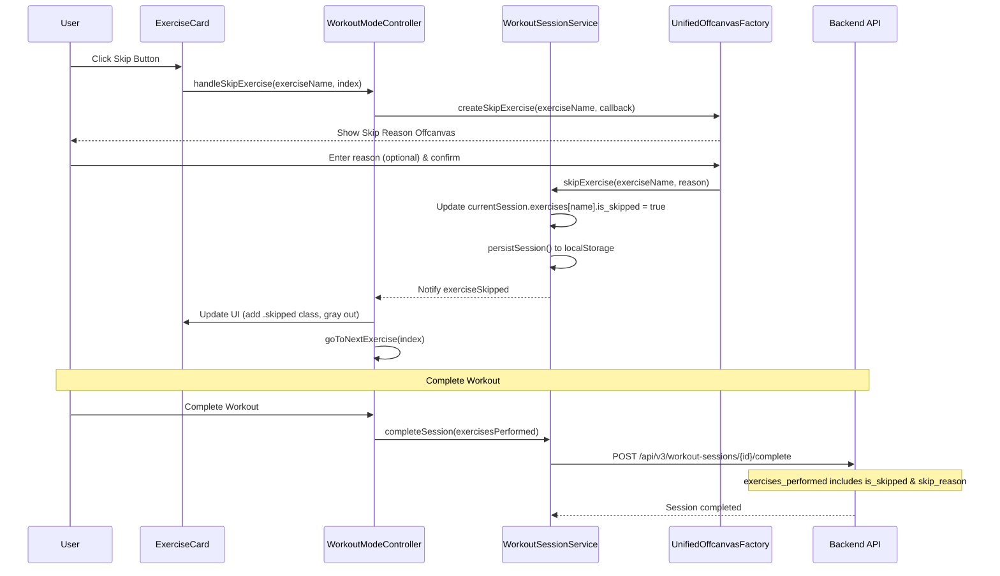

# Phase 2: Skip Functionality - Implementation Plan

**Version:** 1.0.0  
**Date:** 2025-11-27  
**Status:** Ready for Implementation  
**Architecture Reference:** WORKOUT_DATA_PERSISTENCE_ENHANCEMENT_ARCHITECTURE.md

---

## 📋 Executive Summary

This document provides a detailed implementation plan for Phase 2 of the Workout Data Persistence Enhancement: **Skip Functionality**. This feature allows users to skip exercises during their workout session with an optional reason, and displays skipped exercises in workout history.

### Current State Analysis

**Backend Ready ✅**
- [`ExercisePerformance`](backend/models.py:829) model already has `is_skipped` and `skip_reason` fields
- Database schema supports skip tracking
- API endpoints accept skip data in completion requests

**Frontend Needs Implementation ❌**
- No skip button in exercise cards
- No skip reason modal
- No `skipExercise()` / `unskipExercise()` methods in service
- No UI styling for skipped state
- History page doesn't display skipped exercises

---

## 🎯 Implementation Goals

### Primary Objectives
1. ✅ Add skip button to exercise cards (visible only during active session)
2. ✅ Create skip reason offcanvas modal with optional reason input
3. ✅ Implement skip/unskip methods in workout session service
4. ✅ Update UI to show skipped state with visual indicators
5. ✅ Include skipped exercises in completion data
6. ✅ Display skipped exercises in workout history

### Success Criteria
- [ ] Users can skip exercises with one click during active session
- [ ] Skip button is hidden when session is not active
- [ ] Optional skip reason can be provided via offcanvas modal
- [ ] Skipped exercises show grayed out with orange indicator
- [ ] Users can unskip exercises if they change their mind
- [ ] Skipped exercises are saved to database with completion data
- [ ] History page shows skipped exercises with reasons
- [ ] Skipped exercises summary appears in history details

---

## 🏗️ Architecture Overview

### Data Flow



---

## 📝 Detailed Implementation Steps

### Step 1: Add Skip Button to Exercise Card Renderer

**File:** [`frontend/assets/js/components/exercise-card-renderer.js`](frontend/assets/js/components/exercise-card-renderer.js:24)

**Location:** Inside `renderCard()` method, in the card header section

**Implementation:**

```javascript
renderCard(group, index, isBonus = false, totalCards = 0) {
    // ... existing code ...
    
    const isSessionActive = this.sessionService.isSessionActive();
    const weightData = this.sessionService.getExerciseWeight(mainExercise);
    const isSkipped = weightData?.is_skipped || false;
    
    // ... existing code for card rendering ...
    
    return `
        <div class="card exercise-card ${bonusClass} ${isSkipped ? 'skipped' : ''}" 
             data-exercise-index="${index}" 
             data-exercise-name="${this._escapeHtml(mainExercise)}">
            <div class="card-header exercise-card-header" 
                 onclick="window.workoutModeController.toggleExerciseCard(${index})">
                <div class="exercise-card-summary">
                    <div class="d-flex justify-content-between align-items-start mb-1">
                        <h6 class="mb-0">
                            ${isSkipped ? '<i class="bx bx-x-circle text-warning me-1"></i>' : ''}
                            ${this._escapeHtml(mainExercise)}
                        </h6>
                        <div class="d-flex align-items-center gap-2">
                            ${this._renderWeightBadge(currentWeight, currentUnit, weightSource, lastWeight, lastWeightUnit)}
                            ${isSessionActive && !isSkipped ? `
                                <button class="btn btn-sm btn-outline-warning skip-exercise-btn" 
                                        onclick="event.stopPropagation(); window.workoutModeController.handleSkipExercise('${this._escapeHtml(mainExercise)}', ${index});"
                                        title="Skip this exercise">
                                    <i class="bx bx-skip-next"></i>
                                </button>
                            ` : ''}
                            ${isSessionActive && isSkipped ? `
                                <button class="btn btn-sm btn-warning unskip-exercise-btn" 
                                        onclick="event.stopPropagation(); window.workoutModeController.handleUnskipExercise('${this._escapeHtml(mainExercise)}', ${index});"
                                        title="Unskip this exercise">
                                    <i class="bx bx-undo"></i>
                                </button>
                            ` : ''}
                        </div>
                    </div>
                    <!-- ... rest of card content ... -->
                </div>
                <i class="bx bx-chevron-down expand-icon"></i>
            </div>
            
            <div class="card-body exercise-card-body" style="display: none;">
                ${isSkipped ? `
                    <div class="alert alert-warning mb-3">
                        <i class="bx bx-info-circle me-2"></i>
                        <strong>Exercise Skipped</strong>
                        ${weightData?.skip_reason ? `<p class="mb-0 mt-1 small">${this._escapeHtml(weightData.skip_reason)}</p>` : ''}
                    </div>
                ` : ''}
                <!-- ... rest of card body ... -->
            </div>
        </div>
    `;
}
```

**Key Points:**
- Skip button only visible when `isSessionActive === true` and `!isSkipped`
- Unskip button shown when exercise is already skipped
- Button uses `event.stopPropagation()` to prevent card toggle
- Skipped state shown with warning icon and alert in card body

---

### Step 2: Create Skip Reason Offcanvas Modal

**File:** [`frontend/assets/js/components/unified-offcanvas-factory.js`](frontend/assets/js/components/unified-offcanvas-factory.js:682)

**Location:** Add new method after `createBonusExercise()`

**Implementation:**

```javascript
/* ============================================
   SKIP EXERCISE
   ============================================ */

/**
 * Create skip exercise offcanvas with optional reason
 * @param {Object} data - Exercise data
 * @param {string} data.exerciseName - Name of exercise to skip
 * @param {Function} onConfirm - Callback when user confirms skip
 * @returns {Object} Offcanvas instance
 */
static createSkipExercise(data, onConfirm) {
    const { exerciseName } = data;
    
    const offcanvasHtml = `
        <div class="offcanvas offcanvas-bottom offcanvas-bottom-base" tabindex="-1" 
             id="skipExerciseOffcanvas" aria-labelledby="skipExerciseOffcanvasLabel">
            <div class="offcanvas-header border-bottom">
                <h5 class="offcanvas-title" id="skipExerciseOffcanvasLabel">
                    <i class="bx bx-skip-next me-2"></i>Skip Exercise
                </h5>
                <button type="button" class="btn-close" data-bs-dismiss="offcanvas" aria-label="Close"></button>
            </div>
            <div class="offcanvas-body">
                <div class="text-center mb-4">
                    <div class="mb-3">
                        <i class="bx bx-skip-next" style="font-size: 3rem; color: var(--bs-warning);"></i>
                    </div>
                    <h5 class="mb-2">${this.escapeHtml(exerciseName)}</h5>
                    <p class="text-muted mb-0">Skip this exercise for today?</p>
                </div>
                
                <div class="alert alert-info d-flex align-items-start mb-4">
                    <i class="bx bx-info-circle me-2 mt-1"></i>
                    <div>
                        <strong>Skipped exercises are tracked</strong>
                        <p class="mb-0 small">This will be recorded in your workout history. You can optionally add a reason below.</p>
                    </div>
                </div>
                
                <div class="mb-4">
                    <label class="form-label">Reason (Optional)</label>
                    <textarea class="form-control" id="skipReasonInput" 
                              rows="3" maxlength="200"
                              placeholder="e.g., Equipment unavailable, Injury, Fatigue..."></textarea>
                    <small class="text-muted">Max 200 characters</small>
                </div>
                
                <div class="d-flex gap-2">
                    <button type="button" class="btn btn-outline-secondary flex-fill" data-bs-dismiss="offcanvas">
                        <i class="bx bx-x me-1"></i>Cancel
                    </button>
                    <button type="button" class="btn btn-warning flex-fill" id="confirmSkipBtn">
                        <i class="bx bx-check me-1"></i>Skip Exercise
                    </button>
                </div>
            </div>
        </div>
    `;
    
    return this.createOffcanvas('skipExerciseOffcanvas', offcanvasHtml, (offcanvas) => {
        const confirmBtn = document.getElementById('confirmSkipBtn');
        const reasonInput = document.getElementById('skipReasonInput');
        
        if (confirmBtn && reasonInput) {
            confirmBtn.addEventListener('click', async () => {
                const reason = reasonInput.value.trim();
                
                confirmBtn.disabled = true;
                confirmBtn.innerHTML = '<span class="spinner-border spinner-border-sm me-2"></span>Skipping...';
                
                try {
                    await onConfirm(reason);
                    offcanvas.hide();
                } catch (error) {
                    console.error('Error skipping exercise:', error);
                    confirmBtn.disabled = false;
                    confirmBtn.innerHTML = '<i class="bx bx-check me-1"></i>Skip Exercise';
                    alert('Failed to skip exercise. Please try again.');
                }
            });
            
            // Allow Enter key to submit (with Shift+Enter for new line)
            reasonInput.addEventListener('keydown', (e) => {
                if (e.key === 'Enter' && !e.shiftKey) {
                    e.preventDefault();
                    confirmBtn.click();
                }
            });
        }
    });
}
```

**Key Points:**
- Warning color theme (orange) for skip action
- Optional reason textarea with 200 character limit
- Clear info alert explaining skip tracking
- Keyboard support (Enter to submit, Shift+Enter for new line)

---

### Step 3: Implement Skip/Unskip Methods in Service

**File:** [`frontend/assets/js/services/workout-session-service.js`](frontend/assets/js/services/workout-session-service.js:360)

**Location:** Add after `unskipExercise()` placeholder (around line 360)

**Implementation:**

```javascript
/**
 * Mark exercise as skipped
 * @param {string} exerciseName - Exercise name
 * @param {string} reason - Optional reason for skipping (max 200 chars)
 */
skipExercise(exerciseName, reason = '') {
    if (!this.currentSession?.exercises) {
        console.warn('⚠️ No active session to skip exercise');
        return;
    }
    
    const existingData = this.currentSession.exercises[exerciseName] || {};
    
    this.currentSession.exercises[exerciseName] = {
        ...existingData,
        is_skipped: true,
        skip_reason: reason.substring(0, 200), // Enforce 200 char limit
        skipped_at: new Date().toISOString()
    };
    
    console.log('⏭️ Exercise skipped:', exerciseName, reason ? `(${reason})` : '');
    this.notifyListeners('exerciseSkipped', { exerciseName, reason });
    this.persistSession();
}

/**
 * Unskip exercise (if user changes mind)
 * @param {string} exerciseName - Exercise name
 */
unskipExercise(exerciseName) {
    if (!this.currentSession?.exercises?.[exerciseName]) {
        console.warn('⚠️ Exercise not found in session:', exerciseName);
        return;
    }
    
    this.currentSession.exercises[exerciseName].is_skipped = false;
    this.currentSession.exercises[exerciseName].skip_reason = null;
    delete this.currentSession.exercises[exerciseName].skipped_at;
    
    console.log('↩️ Exercise unskipped:', exerciseName);
    this.notifyListeners('exerciseUnskipped', { exerciseName });
    this.persistSession();
}
```

**Key Points:**
- Enforces 200 character limit on skip reason
- Preserves existing exercise data when skipping
- Adds `skipped_at` timestamp for tracking
- Notifies listeners for UI updates
- Persists to localStorage immediately

---

### Step 4: Add Controller Methods

**File:** [`frontend/assets/js/controllers/workout-mode-controller.js`](frontend/assets/js/controllers/workout-mode-controller.js:1369)

**Location:** Add after `goToNextExercise()` method (around line 1369)

**Implementation:**

```javascript
/**
 * Handle skipping an exercise
 * @param {string} exerciseName - Exercise name
 * @param {number} index - Exercise index
 */
handleSkipExercise(exerciseName, index) {
    if (!this.sessionService.isSessionActive()) {
        console.warn('⚠️ Cannot skip exercise - no active session');
        return;
    }
    
    // Show skip reason offcanvas
    window.UnifiedOffcanvasFactory.createSkipExercise(
        { exerciseName },
        async (reason) => {
            // Mark as skipped in session
            this.sessionService.skipExercise(exerciseName, reason);
            
            // Update UI - re-render to show skipped state
            this.renderWorkout();
            
            // Auto-advance to next exercise
            setTimeout(() => {
                this.goToNextExercise(index);
            }, 300);
            
            // Show success message
            if (window.showAlert) {
                const message = reason 
                    ? `${exerciseName} skipped: ${reason}` 
                    : `${exerciseName} skipped`;
                window.showAlert(message, 'warning');
            }
            
            // Auto-save session
            try {
                await this.autoSave(null);
            } catch (error) {
                console.error('❌ Failed to auto-save after skip:', error);
            }
        }
    );
}

/**
 * Handle unskipping an exercise
 * @param {string} exerciseName - Exercise name
 * @param {number} index - Exercise index
 */
handleUnskipExercise(exerciseName, index) {
    if (!this.sessionService.isSessionActive()) {
        console.warn('⚠️ Cannot unskip exercise - no active session');
        return;
    }
    
    const modalManager = this.getModalManager();
    modalManager.confirm(
        'Unskip Exercise',
        `Resume <strong>${this.escapeHtml(exerciseName)}</strong>?`,
        async () => {
            // Mark as not skipped in session
            this.sessionService.unskipExercise(exerciseName);
            
            // Update UI - re-render to remove skipped state
            this.renderWorkout();
            
            // Show success message
            if (window.showAlert) {
                window.showAlert(`${exerciseName} resumed`, 'success');
            }
            
            // Auto-save session
            try {
                await this.autoSave(null);
            } catch (error) {
                console.error('❌ Failed to auto-save after unskip:', error);
            }
        }
    );
}
```

**Key Points:**
- Checks for active session before allowing skip/unskip
- Re-renders workout to update UI immediately
- Auto-advances to next exercise after skip
- Auto-saves session after skip/unskip
- Shows appropriate success messages

---

### Step 5: Update CSS for Skipped State

**File:** [`frontend/assets/css/workout-mode.css`](frontend/assets/css/workout-mode.css:1239)

**Location:** Add at end of file (after line 1239)

**Implementation:**

```css
/* ============================================
   SKIPPED EXERCISE STYLING (Phase 2)
   ============================================ */

/* Skipped exercise card styling */
.exercise-card.skipped {
    opacity: 0.65;
    border-left: 4px solid var(--bs-warning);
    background: linear-gradient(135deg, rgba(var(--bs-warning-rgb), 0.03), rgba(var(--bs-warning-rgb), 0.08));
}

.exercise-card.skipped:hover {
    opacity: 0.75;
    border-color: var(--bs-warning);
    box-shadow: 0 4px 12px rgba(var(--bs-warning-rgb), 0.25);
}

.exercise-card.skipped .exercise-card-header {
    background: rgba(var(--bs-warning-rgb), 0.08);
}

.exercise-card.skipped .exercise-card-summary h6 {
    color: var(--bs-warning);
    text-decoration: line-through;
}

.exercise-card.skipped .exercise-card-meta {
    opacity: 0.7;
}

/* Skip button styling */
.skip-exercise-btn {
    padding: 0.25rem 0.5rem;
    font-size: 0.875rem;
    border-color: var(--bs-warning);
    color: var(--bs-warning);
}

.skip-exercise-btn:hover {
    background-color: var(--bs-warning);
    border-color: var(--bs-warning);
    color: white;
}

/* Unskip button styling */
.unskip-exercise-btn {
    padding: 0.25rem 0.5rem;
    font-size: 0.875rem;
    background-color: var(--bs-warning);
    border-color: var(--bs-warning);
    color: white;
}

.unskip-exercise-btn:hover {
    background-color: #e0a800;
    border-color: #d39e00;
}

/* Dark theme adjustments */
[data-bs-theme="dark"] .exercise-card.skipped {
    background: linear-gradient(135deg, rgba(var(--bs-warning-rgb), 0.08), rgba(var(--bs-warning-rgb), 0.12));
    border-color: var(--bs-warning);
}

[data-bs-theme="dark"] .exercise-card.skipped .exercise-card-header {
    background: linear-gradient(135deg, rgba(var(--bs-warning-rgb), 0.12), rgba(var(--bs-warning-rgb), 0.16));
}

/* Mobile responsive */
@media (max-width: 768px) {
    .skip-exercise-btn,
    .unskip-exercise-btn {
        padding: 0.2rem 0.4rem;
        font-size: 0.8rem;
    }
}
```

**Key Points:**
- Orange/warning color theme for skipped state
- Reduced opacity and strikethrough text
- Left border indicator for quick visual identification
- Hover states for better UX
- Dark theme support
- Mobile responsive sizing

---

### Step 6: Update collectExerciseData()

**File:** [`frontend/assets/js/controllers/workout-mode-controller.js`](frontend/assets/js/controllers/workout-mode-controller.js:452)

**Location:** Update existing `collectExerciseData()` method

**Changes:**

```javascript
collectExerciseData() {
    const exercisesPerformed = [];
    let orderIndex = 0;
    
    // Collect from exercise groups
    if (this.currentWorkout.exercise_groups) {
        this.currentWorkout.exercise_groups.forEach((group, groupIndex) => {
            const mainExercise = group.exercises?.a;
            if (!mainExercise) return;
            
            const weightData = this.sessionService.getExerciseWeight(mainExercise);
            const history = this.sessionService.getExerciseHistory(mainExercise);
            
            const finalWeight = weightData?.weight ?? group.default_weight ?? null;
            const finalUnit = weightData?.weight_unit || group.default_weight_unit || 'lbs';
            
            exercisesPerformed.push({
                exercise_name: mainExercise,
                exercise_id: null,
                group_id: group.group_id || `group-${groupIndex}`,
                sets_completed: parseInt(group.sets) || 0,
                target_sets: group.sets || '3',
                target_reps: group.reps || '8-12',
                weight: finalWeight,
                weight_unit: finalUnit,
                previous_weight: history?.last_weight || null,
                weight_change: weightData?.weight_change || null,
                order_index: orderIndex++,
                is_bonus: false,
                is_modified: weightData?.is_modified || false,
                is_skipped: weightData?.is_skipped || false,      // PHASE 2: Include skip status
                skip_reason: weightData?.skip_reason || null      // PHASE 2: Include skip reason
            });
        });
    }
    
    // Collect from SESSION bonus exercises
    const bonusExercises = this.sessionService.getBonusExercises();
    if (bonusExercises && bonusExercises.length > 0) {
        bonusExercises.forEach((bonus, bonusIndex) => {
            const exerciseName = bonus.name || bonus.exercise_name;
            const weightData = this.sessionService.getExerciseWeight(exerciseName);
            const history = this.sessionService.getExerciseHistory(exerciseName);
            
            const finalWeight = weightData?.weight ?? bonus.weight ?? null;
            
            exercisesPerformed.push({
                exercise_name: exerciseName,
                exercise_id: null,
                group_id: `bonus-${bonusIndex}`,
                sets_completed: parseInt(bonus.sets || bonus.target_sets) || 0,
                target_sets: bonus.sets || bonus.target_sets || '3',
                target_reps: bonus.reps || bonus.target_reps || '12',
                weight: finalWeight,
                weight_unit: weightData?.weight_unit || bonus.weight_unit || 'lbs',
                previous_weight: history?.last_weight || null,
                weight_change: weightData?.weight_change || null,
                order_index: orderIndex++,
                is_bonus: true,
                is_modified: weightData?.is_modified || false,
                is_skipped: weightData?.is_skipped || false,      // PHASE 2: Include skip status
                skip_reason: weightData?.skip_reason || null      // PHASE 2: Include skip reason
            });
        });
    }
    
    return exercisesPerformed;
}
```

**Key Points:**
- Adds `is_skipped` and `skip_reason` to all exercises
- Defaults to `false` and `null` if not skipped
- Works for both regular and bonus exercises
- Backend already accepts these fields

---

### Step 7: Update Workout History Display

**File:** [`frontend/assets/js/dashboard/workout-history.js`](frontend/assets/js/dashboard/workout-history.js:336)

**Location:** Update `renderSessionDetails()` method

**Implementation:**

```javascript
/**
 * Render session details
 */
renderSessionDetails(session) {
    const exercises = session.exercises_performed || [];
    
    return `
        <div class="session-details">
            ${session.notes ? `
                <div class="alert alert-info mb-3">
                    <i class="bx bx-note me-2"></i>${escapeHtml(session.notes)}
                </div>
            ` : ''}
            
            <h6 class="mb-3">Exercises Performed</h6>
            <div class="table-responsive">
                <table class="table table-sm">
                    <thead>
                        <tr>
                            <th>Exercise</th>
                            <th>Weight</th>
                            <th>Sets × Reps</th>
                            <th>Status</th>
                        </tr>
                    </thead>
                    <tbody>
                        ${exercises.map(ex => {
                            // Determine status badge
                            let statusBadge = '';
                            let rowClass = '';
                            
                            if (ex.is_skipped) {
                                statusBadge = '<span class="badge bg-warning">Skipped</span>';
                                rowClass = 'text-muted';
                            } else if (ex.is_modified) {
                                statusBadge = '<span class="badge bg-info">Modified</span>';
                            } else {
                                statusBadge = '<span class="badge bg-secondary">Default</span>';
                            }
                            
                            return `
                                <tr class="${rowClass}">
                                    <td>
                                        ${ex.is_skipped ? '<i class="bx bx-x-circle text-warning me-1"></i>' : ''}
                                        ${escapeHtml(ex.exercise_name)}
                                        ${ex.is_bonus ? ' <span class="badge badge-sm bg-success">Bonus</span>' : ''}
                                    </td>
                                    <td>
                                        ${ex.is_skipped ? '—' : `${ex.weight || '—'} ${ex.weight_unit || ''}`}
                                    </td>
                                    <td>
                                        ${ex.is_skipped ? '—' : `${ex.target_sets} × ${ex.target_reps}`}
                                    </td>
                                    <td>${statusBadge}</td>
                                </tr>
                                ${ex.is_skipped && ex.skip_reason ? `
                                    <tr class="${rowClass}">
                                        <td colspan="4" class="small ps-4">
                                            <i class="bx bx-info-circle text-warning me-1"></i>
                                            <em>${escapeHtml(ex.skip_reason)}</em>
                                        </td>
                                    </tr>
                                ` : ''}
                            `;
                        }).join('')}
                    </tbody>
                </table>
            </div>
            
            ${this.renderSkippedExercisesSummary(exercises)}
        </div>
    `;
}

/**
 * Render skipped exercises summary
 */
renderSkippedExercisesSummary(exercises) {
    const skipped = exercises.filter(ex => ex.is_skipped);
    if (skipped.length === 0) return '';
    
    return `
        <div class="alert alert-warning mt-3">
            <strong><i class="bx bx-info-circle me-2"></i>Skipped Exercises (${skipped.length}):</strong>
            <ul class="mb-0 mt-2">
                ${skipped.map(ex => `
                    <li>
                        <strong>${escapeHtml(ex.exercise_name)}</strong>
                        ${ex.skip_reason ? ` - <em>${escapeHtml(ex.skip_reason)}</em>` : ''}
                    </li>
                `).join('')}
            </ul>
        </div>
    `;
}
```

**Key Points:**
- Skipped exercises shown with warning icon and badge
- Skip reason displayed in indented row below exercise
- Grayed out text for skipped exercises
- Separate summary section for all skipped exercises
- Clear visual distinction from completed exercises

---

## 🧪 Testing Checklist

### Unit Tests
- [ ] `skipExercise()` correctly updates session data
- [ ] `unskipExercise()` correctly removes skip status
- [ ] Skip reason is truncated to 200 characters
- [ ] Skip data persists to localStorage
- [ ] Skip data is included in `collectExerciseData()`

### Integration Tests
- [ ] Skip button appears only during active session
- [ ] Skip button hidden when session not active
- [ ] Skip offcanvas modal opens correctly
- [ ] Skip reason can be entered (optional)
- [ ] Exercise card updates to show skipped state
- [ ] Unskip button appears after skipping
- [ ] Unskip restores exercise to normal state
- [ ] Auto-advance to next exercise after skip
- [ ] Auto-save triggers after skip/unskip
- [ ] Skipped exercises included in completion data
- [ ] History page displays skipped exercises
- [ ] Skip reason shows in history details

### User Acceptance Tests
- [ ] User can skip exercise with one click
- [ ] User can optionally provide skip reason
- [ ] Skipped exercise is clearly visible (grayed out, orange indicator)
- [ ] User can unskip if they change their mind
- [ ] Skipped exercises appear in workout history
- [ ] Skip reasons are visible in history
- [ ] Works on mobile devices
- [ ] Works in dark mode

---

## 📊 Implementation Timeline

### Day 1: Core Functionality
- ✅ Add skip button to exercise card renderer
- ✅ Create skip reason offcanvas modal
- ✅ Implement `skipExercise()` and `unskipExercise()` methods
- ✅ Add controller methods

### Day 2: UI & Styling
- ✅ Update CSS for skipped state
- ✅ Test skip/unskip flow
- ✅ Update `collectExerciseData()` to include skip fields

### Day 3: History Integration
- ✅ Update history page to display skipped exercises
- ✅ Add skipped exercises summary
- ✅ Test end-to-end flow

### Day 4: Testing & Polish
- ✅ Comprehensive testing
- ✅ Mobile responsive testing
- ✅ Dark mode testing
