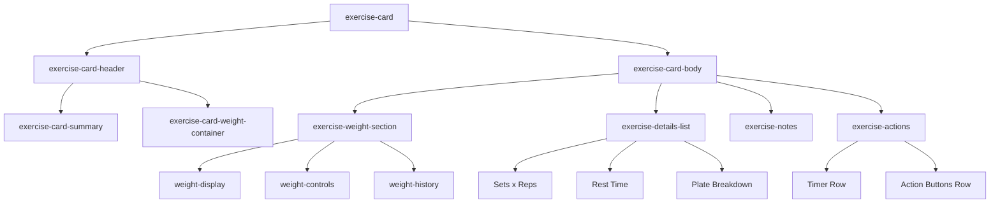

# Exercise Card Expanded Body Redesign Plan

## Problem Statement

The expanded card body in workout mode has inconsistent spacing and too much whitespace. The current implementation uses deeply nested HTML structures that create unpredictable spacing through stacked margins and padding.

## Analysis

### Current Structure Issues

The current implementation in [`exercise-card-renderer.js`](../frontend/assets/js/components/exercise-card-renderer.js:110-188) has these problems:

1. **Over-nested structure** (5+ levels deep):
   ```
   .card-body 
     └─ .exercise-details-panel 
         └─ .detail-grid.mb-3.p-3 
             └─ .row.mb-3 
                 └─ .col-12 
                     └─ .d-flex
   ```

2. **Stacked spacing utilities causing inconsistent whitespace**:
   - `mb-3` on `.detail-grid` (12px margin-bottom)
   - `p-3` on `.detail-grid` (16px padding)
   - `mb-3` on Row 1 (12px margin-bottom)
   - `gap-4` in flex containers (24px gap)
   - `mb-1` on labels
   - Result: 64px+ of vertical spacing accumulated

3. **Redundant wrappers**: `.row > .col-12` adds no value for full-width layouts

4. **Mixed layout systems**: Bootstrap grid rows combined with flexbox

5. **Inconsistent dark mode styling**: Multiple conditional styles scattered throughout CSS

### Current HTML Structure (Simplified)

```html
<div class="card-body exercise-card-body">
  <div class="exercise-details-panel">
    <div class="detail-grid mb-3 p-3 bg-light rounded">
      <!-- Row 1: Weight Section -->
      <div class="row mb-3">
        <div class="col-12">
          <div class="d-flex align-items-center justify-content-between">
            <div>
              <small class="text-muted d-block mb-1">Weight</small>
              <div class="h3 mb-0 text-primary fw-bold">225 lbs</div>
              <small class="text-muted">Last: 220 lbs on 12/15</small>
            </div>
            <div class="btn-group btn-group-sm">...</div>
          </div>
        </div>
      </div>
      
      <!-- Row 2: Sets/Reps & Rest -->
      <div class="row">
        <div class="col-12">
          <div class="d-flex justify-content-start gap-4 align-items-center">
            <div>
              <small>Sets × Reps</small>
              <strong>3 × 8-12</strong>
            </div>
            <div class="vr"></div>
            <div>
              <small>Rest</small>
              <strong>60s</strong>
            </div>
          </div>
        </div>
      </div>
      
      <!-- Optional: Plate breakdown -->
    </div>
    
    <!-- Optional: Notes -->
  </div>
</div>
```

## Sneat Template Best Practices

From analyzing [`cards-basic.html`](../sneat-bootstrap-template/html/cards-basic.html) and [`ui-list-groups.html`](../sneat-bootstrap-template/html/ui-list-groups.html):

1. **Cards use flat structure**: `.card > .card-body > content`
2. **List groups for structured data**: Perfect for displaying label-value pairs
3. **Consistent spacing**: Sneat uses `g-6` for grid gaps (24px at 1rem base)
4. **Minimal nesting**: Max 2-3 levels deep
5. **Dark mode via data attribute**: `[data-bs-theme="dark"]` selectors

## Proposed Redesign

### New HTML Structure

```html
<div class="card-body exercise-card-body">
  <!-- Weight Section - Prominent -->
  <div class="exercise-weight-section">
    <div class="d-flex justify-content-between align-items-center">
      <div class="exercise-weight-display">
        <span class="exercise-weight-value">225</span>
        <span class="exercise-weight-unit">lbs</span>
      </div>
      <div class="btn-group btn-group-sm">
        <button class="btn btn-outline-secondary" title="Decrease">
          <i class="bx bx-minus"></i>
        </button>
        <button class="btn btn-outline-secondary" title="Increase">
          <i class="bx bx-plus"></i>
        </button>
        <button class="btn btn-outline-primary" title="Edit">
          <i class="bx bx-edit-alt"></i>
        </button>
      </div>
    </div>
    <small class="exercise-weight-history">Last: 220 lbs on Dec 15</small>
  </div>
  
  <!-- Exercise Details - List Group Style -->
  <ul class="list-group list-group-flush exercise-details-list">
    <li class="list-group-item d-flex justify-content-between align-items-center px-0">
      <span class="text-muted">Sets × Reps</span>
      <strong>3 × 8-12</strong>
    </li>
    <li class="list-group-item d-flex justify-content-between align-items-center px-0">
      <span class="text-muted">Rest</span>
      <strong><i class="bx bx-time-five me-1"></i>60s</strong>
    </li>
    <!-- Optional: Plate breakdown -->
    <li class="list-group-item d-flex justify-content-between align-items-center px-0 plate-breakdown">
      <span class="text-muted"><i class="bx bx-dumbbell me-1"></i>Plates</span>
      <span class="text-muted small">45lb bar + 2×45lb each side</span>
    </li>
  </ul>
  
  <!-- Notes (if present) -->
  <div class="exercise-notes">
    <i class="bx bx-info-circle me-1"></i>
    <span>Focus on controlled descent</span>
  </div>
  
  <!-- Action Buttons Grid -->
  <div class="exercise-actions">
    <div class="exercise-actions-row">
      <span class="exercise-timer-label">
        <i class="bx bx-time-five"></i> Rest Timer
      </span>
      <button class="btn btn-primary">Start 60s</button>
    </div>
    <div class="exercise-actions-row">
      <button class="btn btn-success flex-fill">
        <i class="bx bx-check me-1"></i>Complete Set
      </button>
      <button class="btn btn-outline-secondary flex-fill">
        <i class="bx bx-skip-next me-1"></i>Skip
      </button>
    </div>
  </div>
</div>
```

### Benefits of New Structure

1. **Reduced nesting**: Max 3 levels deep
2. **Semantic sections**: Clear purpose for each container
3. **Sneat patterns**: Uses list-group for details
4. **Consistent spacing**: All controlled via CSS custom properties
5. **Easier maintenance**: Single point of control for spacing

## CSS Changes

### New CSS Variables

Add to [`workout-mode.css`](../frontend/assets/css/workout-mode.css):

```css
/* ============================================
   EXERCISE CARD SPACING SYSTEM
   ============================================ */

.exercise-card-body {
    --card-section-gap: 1rem;      /* Gap between major sections */
    --card-item-gap: 0.5rem;       /* Gap between items within sections */
    --card-padding: 1rem;          /* Card body padding */
    
    padding: var(--card-padding);
    display: flex;
    flex-direction: column;
    gap: var(--card-section-gap);
}

/* Weight Section */
.exercise-weight-section {
    padding-bottom: var(--card-section-gap);
    border-bottom: 1px solid var(--bs-border-color);
}

.exercise-weight-display {
    display: flex;
    align-items: baseline;
    gap: 0.25rem;
}

.exercise-weight-value {
    font-size: 2rem;
    font-weight: 700;
    color: var(--bs-primary);
    line-height: 1;
}

.exercise-weight-unit {
    font-size: 1rem;
    font-weight: 500;
    color: var(--bs-secondary);
}

.exercise-weight-history {
    display: block;
    margin-top: 0.25rem;
    color: var(--bs-secondary);
    font-size: 0.75rem;
}

/* Details List */
.exercise-details-list {
    margin: 0;
}

.exercise-details-list .list-group-item {
    padding-top: var(--card-item-gap);
    padding-bottom: var(--card-item-gap);
    background: transparent;
    border-color: var(--bs-border-color);
}

.exercise-details-list .list-group-item:first-child {
    padding-top: 0;
    border-top: none;
}

.exercise-details-list .list-group-item:last-child {
    padding-bottom: 0;
    border-bottom: none;
}

/* Notes */
.exercise-notes {
    padding: 0.75rem;
    background: rgba(var(--bs-info-rgb), 0.1);
    border-radius: var(--bs-border-radius);
    font-size: 0.875rem;
    color: var(--bs-info);
}

/* Action Buttons */
.exercise-actions {
    display: flex;
    flex-direction: column;
    gap: var(--card-item-gap);
    padding-top: var(--card-section-gap);
    border-top: 1px solid var(--bs-border-color);
}

.exercise-actions-row {
    display: flex;
    gap: var(--card-item-gap);
    align-items: center;
}

.exercise-actions-row:first-child {
    justify-content: space-between;
}

.exercise-timer-label {
    font-size: 0.875rem;
    font-weight: 600;
    color: var(--bs-primary);
    display: flex;
    align-items: center;
    gap: 0.25rem;
}

/* Mobile Responsive */
@media (max-width: 576px) {
    .exercise-card-body {
        --card-section-gap: 0.75rem;
        --card-item-gap: 0.375rem;
        --card-padding: 0.75rem;
    }
    
    .exercise-weight-value {
        font-size: 1.75rem;
    }
}

/* Dark Mode */
[data-bs-theme="dark"] .exercise-card-body {
    --card-border-color: var(--bs-gray-700);
}

[data-bs-theme="dark"] .exercise-notes {
    background: rgba(var(--bs-info-rgb), 0.15);
}
```

### CSS to Remove/Deprecate

The following classes from the current CSS can be removed or deprecated:

```css
/* REMOVE - Replaced by new spacing system */
.exercise-details-panel { /* Remove */ }
.detail-grid { /* Remove */ }
.morph-weight-target { /* Remove - replaced by .exercise-weight-value */ }
.morph-sets-target { /* Remove */ }
.morph-rest-target { /* Remove */ }
```

## Visual Comparison

### Before (Current)
```
┌─────────────────────────────────────────┐
│ [card-body padding: 1.25rem]            │
│  ┌───────────────────────────────────┐  │
│  │ [details-panel]                   │  │
│  │  ┌─────────────────────────────┐  │  │
│  │  │ [detail-grid p-3 mb-3]      │  │  │
│  │  │  ┌───────────────────────┐  │  │  │
│  │  │  │ [row mb-3]            │  │  │  │
│  │  │  │  Weight: 225 lbs      │  │  │  │
│  │  │  │  [excessive spacing]  │  │  │  │
│  │  │  └───────────────────────┘  │  │  │
│  │  │  ┌───────────────────────┐  │  │  │
│  │  │  │ [row]                 │  │  │  │
│  │  │  │  3×8-12 | Rest: 60s   │  │  │  │
│  │  │  └───────────────────────┘  │  │  │
│  │  └─────────────────────────────┘  │  │
│  └───────────────────────────────────┘  │
└─────────────────────────────────────────┘
Total vertical padding: ~80px+
```

### After (Proposed)
```
┌─────────────────────────────────────────┐
│ [card-body: 1rem padding, 1rem gap]     │
│                                         │
│   225 lbs              [-] [+] [✎]      │
│   Last: 220 lbs on Dec 15               │
│   ─────────────────────────────────     │
│   Sets × Reps              3 × 8-12     │
│   Rest                     ⏱ 60s        │
│   Plates            45 bar + 2×45/side  │
│   ─────────────────────────────────     │
│   ℹ Focus on controlled descent         │
│   ─────────────────────────────────     │
│   ⏱ Rest Timer      [Start 60s]         │
│   [✓ Complete Set] [⏭ Skip]             │
│                                         │
└─────────────────────────────────────────┘
Total vertical padding: ~48px
```

## Implementation Steps

### Files to Modify

1. **[`exercise-card-renderer.js`](../frontend/assets/js/components/exercise-card-renderer.js)**
   - Update `renderCard()` method to use new HTML structure
   - Maintain all data attributes and event handlers
   - Keep morph animation classes where needed

2. **[`workout-mode.css`](../frontend/assets/css/workout-mode.css)**
   - Add new CSS variables and classes
   - Remove deprecated styles
   - Update dark mode selectors

3. **[`workout-mode.html`](../frontend/workout-mode.html)**
   - No changes needed (cards are rendered dynamically)

### Testing Checklist

- [ ] Collapsed card header still displays correctly
- [ ] Expanded card body shows all information
- [ ] Weight editing functionality works
- [ ] Rest timer buttons function correctly
- [ ] Complete Set button works
- [ ] Skip button works (if visible)
- [ ] Notes display when present
- [ ] Plate breakdown shows for barbell exercises
- [ ] Bonus exercise styling works
- [ ] Skipped exercise styling works
- [ ] Dark mode displays correctly
- [ ] Mobile responsive layout works
- [ ] Animations/transitions still smooth

## Mermaid Diagram: Component Structure



## Risks and Mitigations

| Risk | Impact | Mitigation |
|------|--------|------------|
| Breaking existing functionality | High | Thorough testing checklist, maintain all data attributes |
| Animation regressions | Medium | Keep morph classes, test on mobile |
| Dark mode issues | Medium | Explicit dark mode CSS rules |
| Mobile layout breaks | High | Mobile-first CSS variables |

## Success Criteria

1. ✅ Reduced vertical whitespace by ~40%
2. ✅ Consistent spacing throughout expanded card
3. ✅ Follows Sneat template patterns
4. ✅ All existing functionality preserved
5. ✅ Works on mobile and desktop
6. ✅ Dark mode compatible
