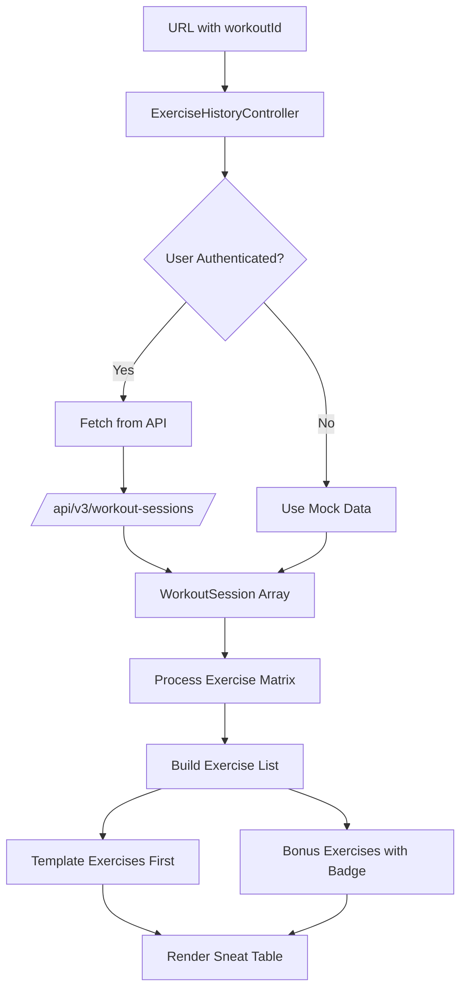

# Exercise History Table Redesign - Implementation Plan

## 📋 Overview

Redesign the exercise history demo page (`frontend/exercise-history-demo.html`) to use a Sneat-style responsive table format with:
- **Sticky first column** for exercise names on mobile
- **Timeline layout**: Newest session on left, oldest on right
- **3 sessions on mobile**, 5 on tablet+
- **Bonus exercises inline** with badge indicators
- **Support for skipped exercises** and exercises added mid-workout

## 🎯 User Requirements

1. Exercise name in column 1 (sticky on mobile for horizontal scroll)
2. Session dates as column headers (newest → oldest, left → right)
3. Template exercises listed first, bonus exercises inline with badge
4. Skipped exercises noted with indicator
5. Blank cells for exercises not present in certain sessions
6. Mobile-optimized design with horizontal scrolling

## 📊 Data Flow Architecture



## 🏗️ Table Structure

### HTML Structure using Sneat Patterns

```html
<!-- Exercise History Card -->
<div class="card">
  <h5 class="card-header d-flex justify-content-between align-items-center">
    <span>
      <i class="bx bx-trending-up me-2"></i>
      Push Day A - Progress History
    </span>
    <a href="dashboard-demo.html" class="btn btn-sm btn-outline-secondary">
      <i class="bx bx-arrow-back"></i>
    </a>
  </h5>
  
  <!-- Progress Summary Stats -->
  <div class="card-body pb-0">
    <div class="row g-2 mb-3">
      <div class="col-4 text-center">
        <span class="badge bg-label-success fs-6">
          <i class="bx bx-trending-up"></i> 4 Improved
        </span>
      </div>
      <div class="col-4 text-center">
        <span class="badge bg-label-secondary fs-6">
          <i class="bx bx-minus"></i> 2 Same
        </span>
      </div>
      <div class="col-4 text-center">
        <span class="badge bg-label-danger fs-6">
          <i class="bx bx-trending-down"></i> 0 Decreased
        </span>
      </div>
    </div>
  </div>
  
  <!-- Responsive Table with Sticky Column -->
  <div class="table-responsive exercise-history-table-wrapper">
    <table class="table table-hover table-sm exercise-history-table">
      <thead class="table-light">
        <tr>
          <th class="sticky-col exercise-col">Exercise</th>
          <th class="session-col">Dec 21<br><small class="text-muted">Today</small></th>
          <th class="session-col">Dec 18<br><small class="text-muted">3 days</small></th>
          <th class="session-col">Dec 15<br><small class="text-muted">6 days</small></th>
        </tr>
      </thead>
      <tbody class="table-border-bottom-0">
        <!-- Template Exercise Row -->
        <tr>
          <td class="sticky-col exercise-col">
            <span class="fw-medium">Bench Press</span>
          </td>
          <td class="session-col text-center increased">
            <div class="weight-display">185 <i class="bx bx-up-arrow-alt text-success"></i></div>
            <small class="text-muted">4×8</small>
            <div class="delta text-success">+5 lbs</div>
          </td>
          <td class="session-col text-center same">
            <div class="weight-display">180</div>
            <small class="text-muted">4×8</small>
          </td>
          <td class="session-col text-center baseline">
            <div class="weight-display">175</div>
            <small class="text-muted">4×8</small>
          </td>
        </tr>
        
        <!-- Bonus Exercise Row with Badge -->
        <tr class="bonus-exercise-row">
          <td class="sticky-col exercise-col">
            <span class="fw-medium">Face Pulls</span>
            <span class="badge bg-label-info badge-sm ms-1">Added</span>
          </td>
          <td class="session-col text-center">
            <div class="weight-display">25</div>
            <small class="text-muted">3×15</small>
          </td>
          <td class="session-col text-center not-present">
            <span class="text-muted">—</span>
          </td>
          <td class="session-col text-center not-present">
            <span class="text-muted">—</span>
          </td>
        </tr>
        
        <!-- Skipped Exercise Row -->
        <tr>
          <td class="sticky-col exercise-col">
            <span class="fw-medium">Tricep Dips</span>
          </td>
          <td class="session-col text-center skipped">
            <span class="badge bg-label-warning">Skipped</span>
          </td>
          <td class="session-col text-center">
            <div class="weight-display">25</div>
            <small class="text-muted">3×12</small>
          </td>
          <td class="session-col text-center">
            <div class="weight-display">20</div>
            <small class="text-muted">3×12</small>
          </td>
        </tr>
      </tbody>
    </table>
  </div>
</div>
```

## 🎨 CSS Additions

Add to `frontend/assets/css/dashboard-demo.css`:

```css
/* ============================================
   EXERCISE HISTORY TABLE - SNEAT STYLE
   ============================================ */

/* Table Wrapper for Horizontal Scroll */
.exercise-history-table-wrapper {
  overflow-x: auto;
  -webkit-overflow-scrolling: touch;
  margin-bottom: 0;
}

/* Base Table Styling */
.exercise-history-table {
  width: 100%;
  min-width: 500px; /* Ensures scroll on mobile */
  margin-bottom: 0;
}

.exercise-history-table th,
.exercise-history-table td {
  vertical-align: middle;
  white-space: nowrap;
}

/* Sticky First Column - Exercise Names */
.exercise-history-table .sticky-col {
  position: sticky;
  left: 0;
  background: var(--bs-card-bg);
  z-index: 2;
  border-right: 2px solid var(--bs-border-color);
}

.exercise-history-table thead .sticky-col {
  background: var(--bs-gray-100);
  z-index: 3;
}

/* Dark mode sticky column */
[data-bs-theme="dark"] .exercise-history-table .sticky-col {
  background: var(--bs-card-bg);
}

[data-bs-theme="dark"] .exercise-history-table thead .sticky-col {
  background: var(--bs-gray-800);
}

/* Exercise Column Width */
.exercise-history-table .exercise-col {
  min-width: 140px;
  max-width: 180px;
  padding-left: 1rem;
  padding-right: 0.75rem;
}

/* Session Columns */
.exercise-history-table .session-col {
  min-width: 90px;
  text-align: center;
  padding: 0.75rem 0.5rem;
}

/* Weight Display */
.exercise-history-table .weight-display {
  font-size: 1.125rem;
  font-weight: 600;
  line-height: 1.2;
}

.exercise-history-table .delta {
  font-size: 0.6875rem;
  font-weight: 600;
  margin-top: 0.125rem;
}

/* Progress State Colors */
.exercise-history-table td.increased {
  background-color: rgba(40, 167, 69, 0.08);
}

.exercise-history-table td.decreased {
  background-color: rgba(220, 53, 69, 0.08);
}

.exercise-history-table td.same {
  background-color: rgba(108, 117, 125, 0.05);
}

.exercise-history-table td.skipped {
  background-color: rgba(255, 193, 7, 0.08);
}

.exercise-history-table td.not-present {
  background-color: rgba(108, 117, 125, 0.03);
}

/* Bonus Exercise Row Styling */
.exercise-history-table .bonus-exercise-row {
  border-left: 3px solid var(--bs-info);
}

.exercise-history-table .bonus-exercise-row .sticky-col {
  border-left: 3px solid var(--bs-info);
}

/* Small badge for Added indicator */
.badge-sm {
  font-size: 0.625rem;
  padding: 0.15rem 0.35rem;
  vertical-align: middle;
}

/* Session Header Styling */
.exercise-history-table thead th {
  font-weight: 600;
  font-size: 0.875rem;
  border-bottom: 2px solid var(--bs-border-color);
}

.exercise-history-table thead th small {
  font-weight: 400;
  font-size: 0.6875rem;
}

/* Hover Effect */
.exercise-history-table tbody tr:hover {
  background-color: var(--bs-gray-50);
}

.exercise-history-table tbody tr:hover .sticky-col {
  background-color: var(--bs-gray-50);
}

[data-bs-theme="dark"] .exercise-history-table tbody tr:hover {
  background-color: var(--bs-gray-800);
}

[data-bs-theme="dark"] .exercise-history-table tbody tr:hover .sticky-col {
  background-color: var(--bs-gray-800);
}

/* Responsive: Show 3 sessions on mobile, 5 on tablet+ */
@media (max-width: 575.98px) {
  .exercise-history-table {
    min-width: 400px;
  }
  
  .exercise-history-table .session-col {
    min-width: 75px;
  }
  
  .exercise-history-table .exercise-col {
    min-width: 120px;
    max-width: 140px;
    font-size: 0.875rem;
  }
  
  .exercise-history-table .weight-display {
    font-size: 1rem;
  }
}

@media (min-width: 768px) {
  .exercise-history-table {
    min-width: 600px;
  }
  
  .exercise-history-table .session-col {
    min-width: 100px;
  }
}
```

## 📦 JavaScript Updates

Update `frontend/assets/js/dashboard/exercise-history-demo.js`:

### Key Changes:

1. **Update mock data** to include bonus exercises with `is_bonus: true`
2. **Build exercise matrix** that tracks all exercises across sessions
3. **Render as HTML table** instead of grid
4. **Handle responsive session count** (3 mobile, 5 tablet)

### Core Data Processing Logic:

```javascript
/**
 * Process sessions into exercise matrix
 * Returns array of exercises with session data
 */
function buildExerciseMatrix(sessions) {
  // Track all exercises and when they first appeared
  const exerciseMap = new Map();
  
  // Process each session (newest first)
  sessions.forEach((session, sessionIndex) => {
    session.exercises.forEach(exercise => {
      const key = exercise.name;
      
      if (!exerciseMap.has(key)) {
        exerciseMap.set(key, {
          name: exercise.name,
          isBonus: exercise.isBonus || false,
          firstSeenSession: sessionIndex,
          sessionData: new Array(sessions.length).fill(null)
        });
      }
      
      exerciseMap.get(key).sessionData[sessionIndex] = {
        weight: exercise.weight,
        sets: exercise.sets,
        reps: exercise.reps,
        isSkipped: exercise.isSkipped || false
      };
    });
  });
  
  // Convert to array and sort
  const exercises = Array.from(exerciseMap.values());
  
  // Sort: template exercises first (not bonus), then bonus
  // Within each group, maintain order of first appearance
  exercises.sort((a, b) => {
    if (a.isBonus !== b.isBonus) {
      return a.isBonus ? 1 : -1; // Non-bonus first
    }
    return a.firstSeenSession - b.firstSeenSession;
  });
  
  return exercises;
}
```

### Render Table Function:

```javascript
/**
 * Render exercise history table
 */
function renderExerciseTable(exercises, sessions) {
  const sessionCount = window.innerWidth < 576 ? 3 : 5;
  const displaySessions = sessions.slice(0, sessionCount);
  
  let html = `
    <div class="card">
      <h5 class="card-header d-flex justify-content-between align-items-center">
        <span>
          <i class="bx bx-trending-up me-2"></i>
          ${escapeHtml(window.exerciseHistory.workoutName)} - Progress History
        </span>
        <a href="dashboard-demo.html" class="btn btn-sm btn-outline-secondary">
          <i class="bx bx-arrow-back"></i>
        </a>
      </h5>
      
      ${renderProgressSummary(exercises)}
      
      <div class="table-responsive exercise-history-table-wrapper">
        <table class="table table-hover table-sm exercise-history-table">
          ${renderTableHeader(displaySessions)}
          <tbody class="table-border-bottom-0">
            ${exercises.map(ex => renderExerciseRow(ex, displaySessions.length)).join('')}
          </tbody>
        </table>
      </div>
    </div>
  `;
  
  return html;
}
```

## 📐 Visual Design Reference

### Mobile View (375px) - 3 Sessions

```
┌──────────────────────────────────────────────────┐
│ 🔼 Push Day A - Progress History        [← Back] │
├──────────────────────────────────────────────────┤
│ [✓4 Improved] [─2 Same] [↓0 Decreased]           │
├──────────────────────────────────────────────────┤
│ Exercise      │ Dec 21   │ Dec 18   │ Dec 15    │
│               │ Today    │ 3 days   │ 6 days    │
├───────────────┼──────────┼──────────┼───────────┤
│ Bench Press   │ 185 ↑    │ 180      │ 175       │
│               │ 4×8      │ 4×8      │ 4×8       │
│               │ +5 lbs   │          │           │
├───────────────┼──────────┼──────────┼───────────┤
│ Incline DB    │ 65 ─     │ 65 ↑     │ 60        │
│               │ 3×10     │ 3×10     │ 3×10      │
├───────────────┼──────────┼──────────┼───────────┤
│ Face Pulls    │ 25       │ —        │ —         │
│ [Added]       │ 3×15     │          │           │
├───────────────┼──────────┼──────────┼───────────┤
│ Tricep Dips   │[Skipped] │ 25       │ 20        │
│               │          │ 3×12     │ 3×12      │
└───────────────┴──────────┴──────────┴───────────┘
       ↑                    ← Horizontal Scroll →
    Sticky
```

### Legend/Key:
- **↑** = Weight increased from previous session (green)
- **↓** = Weight decreased from previous session (red)
- **─** = Weight same as previous session (gray)
- **—** = Exercise not present in that session
- **[Added]** = Bonus exercise badge (info blue)
- **[Skipped]** = Exercise was skipped (warning yellow)

## 🔗 Integration Points

### Data Sources:

1. **API Endpoint**: `GET /api/v3/workout-sessions/?workout_id={id}&page_size=5&sort=desc`
2. **Response Model**: `SessionListResponse` with `List[WorkoutSession]`
3. **Exercise Data**: `ExercisePerformance` model with `is_bonus`, `is_skipped` flags

### Real Data Connection:

```javascript
async function loadRealHistory() {
  const token = await window.dataManager.getAuthToken();
  const workoutId = window.exerciseHistory.workoutId;
  
  const response = await fetch(
    `/api/v3/workout-sessions/?workout_id=${workoutId}&page_size=5&sort=desc`,
    { headers: { 'Authorization': `Bearer ${token}` } }
  );
  
  if (response.ok) {
    const data = await response.json();
    window.exerciseHistory.sessions = data.sessions.map(session => ({
      id: session.id,
      date: session.started_at,
      duration: session.duration_minutes,
      exercises: session.exercises_performed.map(ex => ({
        name: ex.exercise_name,
        weight: ex.weight,
        sets: ex.sets_completed,
        reps: ex.target_reps,
        isSkipped: ex.is_skipped,
        isBonus: ex.is_bonus
      }))
    }));
  }
}
```

## ✅ Implementation Checklist

### Phase 1: HTML Structure
- [ ] Update `exercise-history-demo.html` with Sneat card/table structure
- [ ] Remove old grid-based container divs
- [ ] Add proper Bootstrap table classes

### Phase 2: CSS Updates
- [ ] Add sticky column CSS to `dashboard-demo.css`
- [ ] Add progress state colors (increased/decreased/same)
- [ ] Add bonus exercise row styling
- [ ] Add responsive breakpoints for 3/5 session display
- [ ] Test dark mode compatibility

### Phase 3: JavaScript Updates
- [ ] Update `exercise-history-demo.js` with new render functions
- [ ] Implement `buildExerciseMatrix()` function
- [ ] Update `renderExerciseTable()` for Sneat table format
- [ ] Add responsive session count detection
- [ ] Update mock data to include bonus/skipped exercises

### Phase 4: Testing
- [ ] Test on mobile viewport (375px)
- [ ] Test on tablet viewport (768px)
- [ ] Test horizontal scroll with sticky column
- [ ] Test dark mode rendering
- [ ] Test with real API data (if authenticated)

## 📁 Files to Modify

| File | Changes |
|------|---------|
| `frontend/exercise-history-demo.html` | Update HTML structure for Sneat table |
| `frontend/assets/js/dashboard/exercise-history-demo.js` | Update rendering logic, add exercise matrix builder |
| `frontend/assets/css/dashboard-demo.css` | Add sticky column CSS, progress colors, responsive styles |

## 🔮 Future Enhancements

1. **Click to expand**: Tap exercise row to see detailed stats/notes
2. **Chart view toggle**: Switch between table and line chart visualization
3. **PR indicators**: Gold badge for personal records
4. **Volume trend**: Show total volume change percentage
5. **Filter options**: Show only improved/decreased exercises
