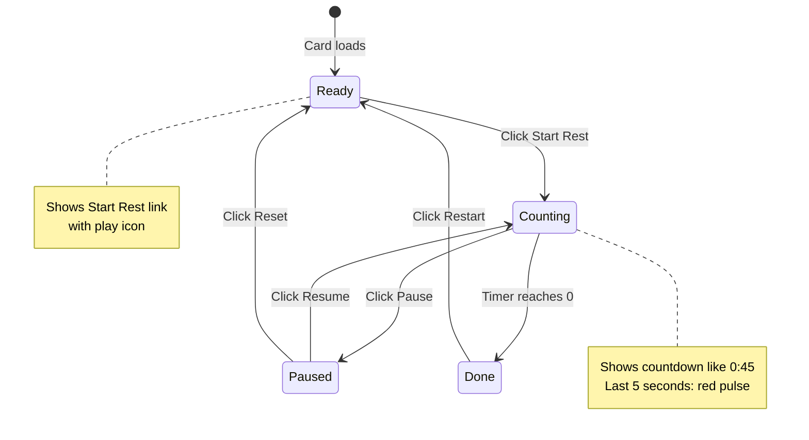
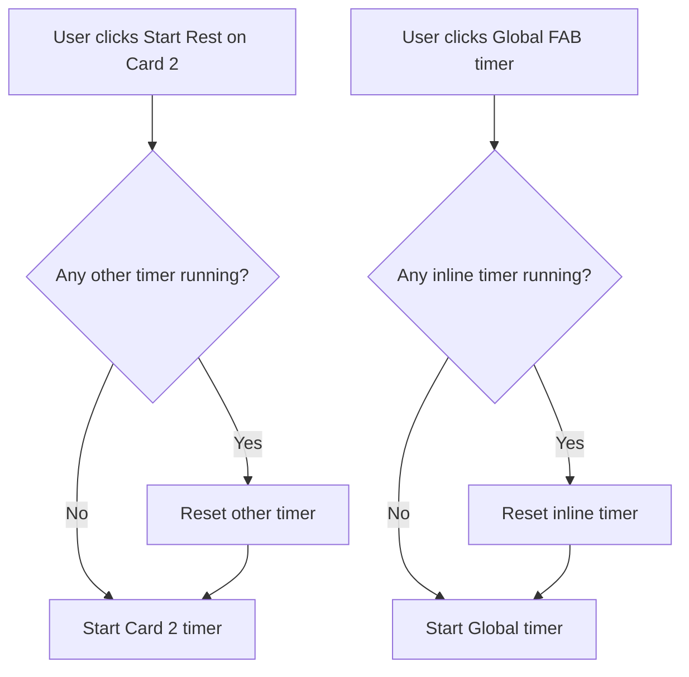

# Inline Rest Timer Implementation Plan

## Overview
Add an inline rest timer feature to exercise cards in workout mode. The timer will appear as a text link next to the rest time display, providing a lightweight alternative to the global floating action button timer.

## User Requirements
- **Independent per-card timers** - Each exercise card can have its own timer
- **Single timer enforcement** - Only one timer can run at a time across the entire app
- **Reuse existing codebase** - Extend the existing `RestTimer` class
- **Global timer as option** - User can turn off global timer and use in-card timers instead
- **Text-based, minimal UI** - Should feel inline with simple icon + text

## Current Architecture

### Existing Components
1. **[`RestTimer`](frontend/assets/js/workout-mode-refactored.js:19)** - Base timer class with states: ready, counting, paused, done
2. **[`GlobalRestTimer`](frontend/assets/js/components/global-rest-timer.js:12)** - Extends RestTimer for FAB display
3. **[`ExerciseCardRenderer`](frontend/assets/js/components/exercise-card-renderer.js:8)** - Renders exercise cards
4. **[`WorkoutTimerManager`](frontend/assets/js/services/workout-timer-manager.js:8)** - Manages multiple timers

### Current Rest Time Display Location
In [`exercise-card-renderer.js`](frontend/assets/js/components/exercise-card-renderer.js:198-201):
```html
<li class="list-group-item d-flex justify-content-between align-items-center px-0">
    <span class="text-muted">Rest</span>
    <strong><i class="bx bx-time-five me-1"></i>${rest}</strong>
</li>
```

## Implementation Plan

### Phase 1: Create InlineRestTimer Class

**File: `frontend/assets/js/components/inline-rest-timer.js`**

```javascript
/**
 * InlineRestTimer - Text-based rest timer for exercise cards
 * Extends RestTimer with inline text display
 */
class InlineRestTimer extends RestTimer {
    constructor(exerciseIndex, restSeconds) {
        super(`inline-${exerciseIndex}`, restSeconds);
        this.exerciseIndex = exerciseIndex;
        this.onTimerStart = null; // Callback when timer starts
    }

    /**
     * Override start to notify manager (single timer enforcement)
     */
    start() {
        if (this.onTimerStart) {
            this.onTimerStart(this);
        }
        super.start();
    }

    /**
     * Render inline text-based timer
     * States:
     * - ready: "Start Rest" link
     * - counting: "0:45" countdown with stop link
     * - paused: "0:45" with resume link
     * - done: "Done! ✓" with restart link
     */
    render() {
        const container = document.querySelector(`[data-inline-timer="${this.exerciseIndex}"]`);
        if (!container) return;

        let html = '';
        
        switch (this.state) {
            case 'ready':
                html = `<a href="#" class="inline-timer-link" onclick="window.inlineTimerStart(${this.exerciseIndex}); return false;">
                    <i class="bx bx-play-circle me-1"></i>Start Rest
                </a>`;
                break;
                
            case 'counting':
                const displayClass = this.remainingSeconds <= 5 ? 'text-danger' : 
                                   this.remainingSeconds <= 10 ? 'text-warning' : 'text-primary';
                html = `<span class="inline-timer-countdown ${displayClass}">
                    <i class="bx bx-time me-1"></i>${this.formatTime(this.remainingSeconds)}
                </span>
                <a href="#" class="inline-timer-stop ms-2" onclick="window.inlineTimerPause(${this.exerciseIndex}); return false;">
                    <i class="bx bx-pause"></i>
                </a>`;
                break;
                
            case 'paused':
                html = `<span class="inline-timer-paused text-warning">
                    <i class="bx bx-time me-1"></i>${this.formatTime(this.remainingSeconds)}
                </span>
                <a href="#" class="inline-timer-resume ms-2" onclick="window.inlineTimerResume(${this.exerciseIndex}); return false;">
                    <i class="bx bx-play"></i>
                </a>
                <a href="#" class="inline-timer-reset ms-1" onclick="window.inlineTimerReset(${this.exerciseIndex}); return false;">
                    <i class="bx bx-reset"></i>
                </a>`;
                break;
                
            case 'done':
                html = `<span class="inline-timer-done text-success">
                    <i class="bx bx-check-circle me-1"></i>Done!
                </span>
                <a href="#" class="inline-timer-restart ms-2" onclick="window.inlineTimerReset(${this.exerciseIndex}); return false;">
                    <i class="bx bx-refresh"></i>Restart
                </a>`;
                break;
        }
        
        container.innerHTML = html;
    }
}
```

### Phase 2: Modify Exercise Card Renderer

**File: `frontend/assets/js/components/exercise-card-renderer.js`**

Update the rest time list item (around line 198-201) to include inline timer container:

```html
<li class="list-group-item d-flex justify-content-between align-items-center px-0">
    <span class="text-muted">Rest</span>
    <div class="d-flex align-items-center gap-2">
        <strong><i class="bx bx-time-five me-1"></i>${rest}</strong>
        <span class="text-muted">|</span>
        <span data-inline-timer="${index}" class="inline-timer-container">
            <a href="#" class="inline-timer-link" onclick="window.inlineTimerStart(${index}); return false;">
                <i class="bx bx-play-circle me-1"></i>Start Rest
            </a>
        </span>
    </div>
</li>
```

### Phase 3: Add CSS Styles

**File: `frontend/assets/css/workout-mode.css`**

Add new section for inline timer styles:

```css
/* ============================================
   INLINE REST TIMER (In-Card Timer)
   ============================================ */

.inline-timer-container {
    display: inline-flex;
    align-items: center;
    font-size: 0.875rem;
}

.inline-timer-link {
    color: var(--bs-primary);
    text-decoration: none;
    font-weight: 500;
    transition: color 0.2s ease;
}

.inline-timer-link:hover {
    color: var(--bs-primary);
    opacity: 0.8;
}

.inline-timer-countdown {
    font-weight: 600;
    font-variant-numeric: tabular-nums;
}

.inline-timer-paused {
    font-weight: 600;
    font-variant-numeric: tabular-nums;
}

.inline-timer-stop,
.inline-timer-resume,
.inline-timer-reset,
.inline-timer-restart {
    color: var(--bs-secondary);
    text-decoration: none;
    transition: color 0.2s ease;
}

.inline-timer-stop:hover,
.inline-timer-resume:hover,
.inline-timer-reset:hover,
.inline-timer-restart:hover {
    color: var(--bs-primary);
}

.inline-timer-done {
    font-weight: 500;
}

/* Animation for countdown in danger zone */
.inline-timer-countdown.text-danger {
    animation: inlineTimerPulse 0.5s infinite;
}

@keyframes inlineTimerPulse {
    0%, 100% { opacity: 1; }
    50% { opacity: 0.7; }
}

/* Dark theme adjustments */
[data-bs-theme="dark"] .inline-timer-link {
    color: var(--bs-primary);
}

/* Reduced motion */
@media (prefers-reduced-motion: reduce) {
    .inline-timer-countdown.text-danger {
        animation: none;
    }
}
```

### Phase 4: Create Shared Timer Manager Update

**File: `frontend/assets/js/services/workout-timer-manager.js`**

Add methods to enforce single-timer rule:

```javascript
/**
 * Register an inline timer and set up single-timer enforcement
 */
registerInlineTimer(timer) {
    timer.onTimerStart = (startingTimer) => {
        this.stopAllOtherTimers(startingTimer);
    };
    this.inlineTimers[timer.exerciseIndex] = timer;
}

/**
 * Stop all timers except the one being started
 */
stopAllOtherTimers(exceptTimer) {
    // Stop global rest timer if running
    if (this.globalRestTimer && this.globalRestTimer !== exceptTimer) {
        if (this.globalRestTimer.state === 'counting' || this.globalRestTimer.state === 'paused') {
            this.globalRestTimer.reset();
        }
    }
    
    // Stop all inline timers except the one being started
    Object.values(this.inlineTimers || {}).forEach(timer => {
        if (timer !== exceptTimer) {
            if (timer.state === 'counting' || timer.state === 'paused') {
                timer.reset();
            }
        }
    });
}
```

### Phase 5: Global Control Functions

**File: `frontend/assets/js/workout-mode-refactored.js`**

Add global functions for inline timer control:

```javascript
// Inline Timer Control Functions
window.inlineTimerStart = function(exerciseIndex) {
    const timer = window.workoutModeController?.timerManager?.inlineTimers?.[exerciseIndex];
    if (timer) {
        timer.start();
    }
};

window.inlineTimerPause = function(exerciseIndex) {
    const timer = window.workoutModeController?.timerManager?.inlineTimers?.[exerciseIndex];
    if (timer) {
        timer.pause();
    }
};

window.inlineTimerResume = function(exerciseIndex) {
    const timer = window.workoutModeController?.timerManager?.inlineTimers?.[exerciseIndex];
    if (timer) {
        timer.resume();
    }
};

window.inlineTimerReset = function(exerciseIndex) {
    const timer = window.workoutModeController?.timerManager?.inlineTimers?.[exerciseIndex];
    if (timer) {
        timer.reset();
    }
};
```

### Phase 6: Initialize Inline Timers

**File: `frontend/assets/js/controllers/workout-mode-controller.js`**

Add initialization when cards are rendered:

```javascript
/**
 * Initialize inline timers for all exercise cards
 */
initializeInlineTimers() {
    const cards = document.querySelectorAll('[data-exercise-index]');
    
    cards.forEach(card => {
        const index = parseInt(card.dataset.exerciseIndex);
        const restTimeElement = card.querySelector('[data-inline-timer]');
        
        if (restTimeElement) {
            const restSeconds = this.getRestSecondsForExercise(index);
            const timer = new InlineRestTimer(index, restSeconds);
            this.timerManager.registerInlineTimer(timer);
            timer.render();
        }
    });
}
```

## UX Flow Diagram



## Single Timer Enforcement Flow



## Files to Modify/Create

### New Files
1. `frontend/assets/js/components/inline-rest-timer.js` - New InlineRestTimer class

### Files to Modify
1. `frontend/assets/js/components/exercise-card-renderer.js` - Add inline timer container to rest row
2. `frontend/assets/css/workout-mode.css` - Add inline timer styles
3. `frontend/assets/js/services/workout-timer-manager.js` - Add single-timer enforcement
4. `frontend/assets/js/workout-mode-refactored.js` - Add global control functions
5. `frontend/assets/js/controllers/workout-mode-controller.js` - Initialize inline timers
6. `frontend/workout-mode.html` - Add script include for inline-rest-timer.js

## Testing Checklist

- [ ] Inline timer shows "Start Rest" link on card load
- [ ] Clicking "Start Rest" starts countdown
- [ ] Countdown displays correctly with color changes at 10s and 5s
- [ ] Pause button works and shows resume/reset options
- [ ] Resume continues countdown from paused time
- [ ] Reset returns to "Start Rest" state
- [ ] Timer completion shows "Done!" with restart option
- [ ] Audio beep plays on completion (if sound enabled)
- [ ] Starting inline timer stops any running global timer
- [ ] Starting global timer stops any running inline timer
- [ ] Starting inline timer on Card 2 stops timer on Card 1
- [ ] Timer persists when card is collapsed and reopened
- [ ] Responsive on mobile devices
- [ ] Dark theme styling works correctly

## Notes

- Reuses 90% of existing RestTimer logic
- Minimal new CSS - mostly text styling
- Single-timer enforcement prevents confusion
- User can choose preferred timer style (global vs inline)

---

## Safety Analysis - Will This Break Existing Functionality?

### ✅ LOW RISK Changes (95%+ confidence)

#### 1. New File Creation: `inline-rest-timer.js`
- **Risk Level**: ✅ NONE
- **Reason**: Creates a new file that extends existing `RestTimer` class
- **Safeguard**: Uses inheritance - if parent class changes, child will still work
- **Fallback**: If file fails to load, cards render normally without inline timer

#### 2. CSS Additions in `workout-mode.css`
- **Risk Level**: ✅ NONE
- **Reason**: Adding new CSS classes (`.inline-timer-*`) - no modification to existing styles
- **Safeguard**: New class names don't conflict with any existing selectors
- **Fallback**: If styles don't load, timer links still work (just unstyled)

#### 3. HTML Modification in `exercise-card-renderer.js`
- **Risk Level**: ✅ LOW
- **Reason**: Adding a new `<span>` element inside an existing list item
- **What Changes**: Line ~198-201, the rest time list item gets an additional span
- **What Stays Same**: All existing data attributes, click handlers, card structure
- **Safeguard**: The inline timer span is purely additive - wrapped in its own container
- **Fallback**: If inline timer JS fails, the span shows "Start Rest" as static text (harmless)

#### 4. Global Functions in `workout-mode-refactored.js`
- **Risk Level**: ✅ NONE
- **Reason**: Adding new global functions (`window.inlineTimerStart`, etc.)
- **Safeguard**: Functions only called by inline timer links - won't affect existing timers
- **Fallback**: If functions don't exist, clicking links does nothing (no crash)

### ⚠️ MEDIUM RISK Changes (Requires Careful Implementation)

#### 5. Timer Manager Updates in `workout-timer-manager.js`
- **Risk Level**: ⚠️ MEDIUM
- **Reason**: Adding new methods for single-timer enforcement
- **What Changes**:
  - New `inlineTimers` object to track inline timers
  - New `registerInlineTimer()` method
  - New `stopAllOtherTimers()` method (called when any timer starts)
- **What Stays Same**:
  - All existing `timers` object functionality
  - `sessionTimerInterval` behavior
  - `globalRestTimer` reference
- **Safeguard**:
  - New methods only called by inline timer code
  - `stopAllOtherTimers()` checks if timers exist before calling methods
  - Null/undefined guards on all timer references
- **Fallback**: If new methods fail, timers work independently (worst case: multiple timers run)

#### 6. HTML Script Include in `workout-mode.html`
- **Risk Level**: ⚠️ LOW
- **Reason**: Adding new script tag for `inline-rest-timer.js`
- **Position**: After `workout-mode-refactored.js` (which defines `RestTimer`)
- **Safeguard**: Load order ensures parent class exists before child
- **Fallback**: If script 404s, page loads normally without inline timers

### How Existing Features Stay Safe

| Feature | How It's Protected |
|---------|-------------------|
| **Card expand/collapse** | No changes to `toggleExerciseCard()` or card click handlers |
| **Weight editing** | No changes to weight modal or direction buttons |
| **Exercise completion** | No changes to `handleCompleteExercise()` |
| **Session timer** | No changes to `startSessionTimer()` / `stopSessionTimer()` |
| **Global rest timer (FAB)** | Only touched by `stopAllOtherTimers()` which is opt-in |
| **Card rendering** | Only adds new content, doesn't modify existing structure |
| **Auto-save** | No changes to auto-save triggers |
| **Auth/data loading** | No changes to initialization flow |

### Implementation Order (Safest First)

1. **CSS styles** - Zero risk, can be added first
2. **`inline-rest-timer.js`** - New file, zero risk to existing code
3. **HTML script include** - Must come after RestTimer is defined
4. **Global control functions** - New window functions, no conflicts
5. **Exercise card renderer modification** - Small HTML addition
6. **Timer manager updates** - Most complex, but isolated methods
7. **Controller initialization** - Add inline timer init call after existing timer init

### Rollback Plan

If issues are discovered after implementation:
1. **Immediate fix**: Remove the script include from `workout-mode.html`
2. **Effect**: Inline timer code won't load, cards render without timer links
3. **Time to rollback**: ~30 seconds

### Test Checklist Before Merge

- [ ] Cards expand and collapse correctly
- [ ] Clicking card header still toggles expand state
- [ ] Weight modal opens from Edit Weight button
- [ ] Exercise completion works (mark complete/uncomplete)
- [ ] Session timer counts up when workout starts
- [ ] Global FAB timer starts/pauses/resets correctly
- [ ] Auto-save triggers on weight changes
- [ ] Inline timer appears next to rest time
- [ ] Inline timer countdown works
- [ ] Only one timer runs at a time
- [ ] Page loads without console errors