# Quick Notes Popover - Implementation Plan

## Overview

Implement Phase 1 of the Quick Notes Popover feature as specified in `QUICK_NOTES_POPOVER_ARCHITECTURE.md`. This replaces the existing inline Decrease/Increase weight direction buttons with a single pencil button that opens a Bootstrap popover.

---

## Current State Analysis

### ✅ Backend Data Flow - VERIFIED COMPLETE

The backend is fully implemented for weight direction persistence:

1. **Models** ([`backend/models.py`](backend/models.py))
   - `ExercisePerformance.next_weight_direction` (line 847) - Saved in session
   - `ExerciseHistory.last_weight_direction` (line 921) - Retrieved from history

2. **Data Service** ([`backend/services/firestore_data_service.py`](backend/services/firestore_data_service.py))
   - `_update_exercise_histories_batch()` (line 1175) - Extracts `next_weight_direction` from completed exercises
   - `update_exercise_history()` (line 1090) - Saves `next_weight_direction` as `last_weight_direction`
   - `get_exercise_history_for_workout()` (line 1026) - Returns `ExerciseHistory` with `last_weight_direction`

### ✅ Frontend Data Flow - VERIFIED COMPLETE

1. **Session Service** ([`frontend/assets/js/services/workout-session-service.js`](frontend/assets/js/services/workout-session-service.js))
   - `setWeightDirection()` (line 641) - Saves to `session.exercises[name].next_weight_direction`
   - `getWeightDirection()` (line 671) - Gets from current session
   - `getLastWeightDirection()` (line 680) - Gets from `exerciseHistory[name].last_weight_direction`

2. **Controller** ([`frontend/assets/js/controllers/workout-mode-controller.js`](frontend/assets/js/controllers/workout-mode-controller.js))
   - `collectExerciseData()` (line 986) - Includes `next_weight_direction` in data sent to backend (lines 1035, 1090)

3. **Exercise Card Renderer** ([`frontend/assets/js/components/exercise-card-renderer.js`](frontend/assets/js/components/exercise-card-renderer.js))
   - Line 54: Gets `lastDirection` via `getLastWeightDirection()`
   - Lines 191-199: Shows reminder alert when NOT in active session

---

## Data Flow Diagram

```mermaid
flowchart TD
    subgraph During Workout Session
        A[User clicks pencil button] --> B[Popover opens]
        B --> C[User selects Increase/Decrease/No change]
        C --> D[handleQuickNoteAction called]
        D --> E[sessionService.setWeightDirection]
        E --> F[session.exercises.next_weight_direction = value]
        F --> G[autoSave triggers]
        G --> H[collectExerciseData includes next_weight_direction]
        H --> I[PUT /api/v3/workout-sessions/id]
    end
    
    subgraph Session Completion
        J[User finishes workout] --> K[completeSession called]
        K --> L[collectExerciseData with next_weight_direction]
        L --> M[POST /api/v3/workout-sessions/id/complete]
        M --> N[_update_exercise_histories_batch]
        N --> O[update_exercise_history with next_weight_direction]
        O --> P[Firestore: exercise_history.last_weight_direction = value]
    end
    
    subgraph Next Session Load
        Q[User loads workout] --> R[fetchExerciseHistory called]
        R --> S[GET /api/v3/workout-sessions/history/workout/id]
        S --> T[ExerciseHistoryResponse with last_weight_direction]
        T --> U[sessionService.exerciseHistory populated]
        U --> V[getLastWeightDirection returns value]
        V --> W[Card renderer shows reminder alert]
    end
```



---

## Implementation Tasks

### Phase 1: Core Component

#### 1. Create Quick Notes Popover Component

**File:** `frontend/assets/js/components/quick-notes/quick-notes-popover.js`

```javascript
class QuickNotesPopover {
    constructor(triggerElement, options) {
        this.trigger = triggerElement;
        this.options = {
            type: 'weight-direction',
            entityId: null,
            currentValue: null,
            onAction: null,
            ...options
        };
        this.init();
    }
    
    init() {
        // Use Bootstrap Popover API
        const content = this._generateContent();
        this.popover = new bootstrap.Popover(this.trigger, {
            html: true,
            sanitize: false,
            trigger: 'manual',
            placement: 'bottom',
            content: content
        });
    }
    
    _generateContent() {
        // Generate popover HTML with action buttons
    }
    
    show() { this.popover.show(); }
    hide() { this.popover.hide(); }
    destroy() { this.popover.dispose(); }
}
```

#### 2. Create Quick Notes Config

**File:** `frontend/assets/js/components/quick-notes/quick-notes-config.js`

```javascript
const QuickNotesPresets = {
    'weight-direction': {
        title: 'Notes for next time',
        iconEmpty: 'bx-pencil',
        iconFilled: 'bxs-pencil',
        actions: [
            { id: 'up', label: 'Increase', icon: 'bx-chevron-up', color: 'success' },
            { id: 'same', label: 'No change', icon: 'bx-minus', color: 'secondary' },
            { id: 'down', label: 'Decrease', icon: 'bx-chevron-down', color: 'warning' }
        ]
    }
};
```

#### 3. Create Quick Notes CSS

**File:** `frontend/assets/css/components/quick-notes-popover.css`

Key styles:
- `.quick-notes-trigger` - Pencil button styling
- `.quick-notes-popover` - Popover container
- `.quick-notes-actions` - Vertical button layout
- `.quick-notes-action.active` - Selected state

#### 4. Update Exercise Card Renderer

**File:** `frontend/assets/js/components/exercise-card-renderer.js`

Replace weight direction buttons with:
```javascript
${isSessionActive ? `
    <div class="d-flex align-items-center gap-2">
        <span class="quick-notes-label-display">${this._getDirectionLabel(currentDirection || 'same')}</span>
        <button class="btn btn-sm quick-notes-trigger ${currentDirection && currentDirection !== 'same' ? 'has-note' : ''}"
                data-exercise-name="${exerciseName}"
                data-note-type="weight-direction"
                data-current-value="${currentDirection || 'same'}"
                onclick="window.workoutModeController.showQuickNotes(this); event.stopPropagation();">
            <i class="bx ${currentDirection && currentDirection !== 'same' ? 'bxs-pencil' : 'bx-pencil'}"></i>
        </button>
    </div>
` : ''}
```

#### 5. Add Controller Methods

**File:** `frontend/assets/js/controllers/workout-mode-controller.js`

Add methods:
- `showQuickNotes(trigger)` - Create and show popover
- `handleQuickNoteAction(exerciseName, action, data)` - Handle selection
- `updateQuickNoteTrigger(exerciseName, value)` - Update button/label state
- `_getDirectionLabel(direction)` - Get display label

#### 6. Update workout-mode.html

Add includes:
```html
<!-- Quick Notes CSS -->
<link rel="stylesheet" href="/static/assets/css/components/quick-notes-popover.css" />

<!-- Quick Notes JS -->
<script src="/static/assets/js/components/quick-notes/quick-notes-config.js"></script>
<script src="/static/assets/js/components/quick-notes/quick-notes-popover.js"></script>
```

---

## UI Specifications

### Trigger Button
- Size: 32×32px
- Icon: `bx-pencil` (empty) / `bxs-pencil` (has value other than 'same')
- Shows pencil on RIGHT side of weight section
- Adjacent label displays current selection text

### Popover Content
```
┌─────────────────────────────┐
│  Notes for next time    [×] │
├─────────────────────────────┤
│  [↑ Increase            ]   │
│  [─ No change           ]   │  ← Default
│  [↓ Decrease            ]   │
└─────────────────────────────┘
```

### Behaviors
- Click trigger → Popover opens
- Click action → Action fires, popover closes
- Click X → Popover closes
- Click outside → Popover closes
- Default selection: "No change"
- Icon fills when direction is 'up' or 'down'

---

## Testing Checklist

1. [ ] Popover opens when pencil button clicked
2. [ ] Correct action is highlighted based on current value
3. [ ] Clicking action updates:
   - Session service `next_weight_direction`
   - Label text display
   - Trigger icon (filled/empty)
4. [ ] Popover closes after action selection
5. [ ] Auto-save includes `next_weight_direction`
6. [ ] Session completion saves to backend
7. [ ] Next session load shows reminder alert
8. [ ] Reminder shows correct message for up/down
9. [ ] "No change" (same) doesn't show reminder alert
10. [ ] Dark theme styling works correctly

---

## Files to Create

| File | Description |
|------|-------------|
| `frontend/assets/js/components/quick-notes/quick-notes-popover.js` | Main component class |
| `frontend/assets/js/components/quick-notes/quick-notes-config.js` | Configuration presets |
| `frontend/assets/css/components/quick-notes-popover.css` | Component styles |

## Files to Modify

| File | Changes |
|------|---------|
| `frontend/assets/js/components/exercise-card-renderer.js` | Replace weight direction with trigger button |
| `frontend/assets/js/controllers/workout-mode-controller.js` | Add popover handling methods |
| `frontend/workout-mode.html` | Add CSS/JS includes |
| `frontend/assets/css/workout-mode.css` | Add deprecation comments to old styles |

---

## Ready for Implementation

The architecture analysis is complete. All backend data flow is verified working. Ready to proceed with frontend component creation in code mode.
