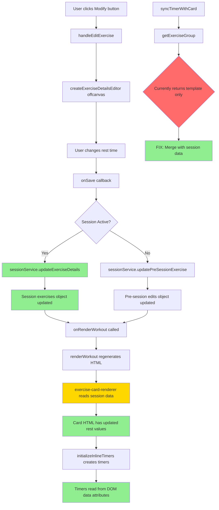

# Rest Time Edit Fix - Implementation Plan

## Issue Summary
When editing rest time via the "Modify" button during an active workout session, the changes are:
1. ❌ Not displayed in the exercise card (collapsed header and expanded body)
2. ❌ Not reflected in the inline rest timer duration
3. ❓ Potentially not saved to session history

## Root Cause Analysis

After tracing the complete data flow, I've identified the following issues:

### Issue #1: ExerciseCardManager.getExerciseGroup() Ignores Session Data
**Location:** [`exercise-card-manager.js`](../frontend/assets/js/components/exercise-card-manager.js:153-175)

The `getExerciseGroup()` method only returns workout **template data**, not the updated session data:

```javascript
getExerciseGroup(index) {
    // Check regular exercise groups first
    if (this.workout.exercise_groups && index < this.workout.exercise_groups.length) {
        return this.workout.exercise_groups[index];  // ← Returns TEMPLATE data only!
    }
    // ...
}
```

This is used by `syncTimerWithCard()` which sets the global timer duration based on stale template data.

### Issue #2: The Rendering Flow Appears Correct BUT...
Looking at [`exercise-card-renderer.js`](../frontend/assets/js/components/exercise-card-renderer.js:38):

```javascript
const rest = exerciseData?.rest || preSessionEdit?.rest || group.rest || '60s';
```

This logic IS correct - it checks session data first. However, there's a potential issue with the **inline timer re-initialization** after editing.

### Issue #3: InlineRestTimer Not Being Updated After Edit
When `onRenderWorkout()` is called after saving edit:
1. Card HTML is regenerated with new `data-rest-seconds` attribute ✓
2. `initializeInlineTimers()` is called ✓
3. **BUT**: The timer manager might not be re-reading the new DOM values correctly

Looking at [`workout-mode-controller.js`](../frontend/assets/js/controllers/workout-mode-controller.js:517-547):
```javascript
initializeInlineTimers() {
    // Clear existing inline timers
    this.timerManager.clearAllInlineTimers();
    
    // Find all inline timer containers
    const timerContainers = document.querySelectorAll('[data-inline-timer]');
    
    timerContainers.forEach(container => {
        const restSeconds = parseInt(container.getAttribute('data-rest-seconds')) || 60;
        // Creates new timer with DOM attribute value
    });
}
```

This SHOULD work correctly since it reads from DOM after render. The bug might be more subtle.

### Issue #4: Potential Session Data Not Including Rest
Looking at [`updateExerciseDetails()`](../frontend/assets/js/services/workout-session-service.js:411-446), the `rest` field IS being saved correctly.

**Most Likely Root Cause**: After further analysis, the most probable issue is that `getExerciseWeight()` returns session data but the session exercises might not be initialized with rest time values from the template.

When `_initializeExercisesFromTemplate()` is called (line 120-167), it DOES include `rest`:
```javascript
exercises[exerciseName] = {
    // ...
    rest: group.rest || '60s',
    // ...
};
```

So the initialization is correct. **The actual bug** is likely that `exerciseData.rest` is returning the value correctly, but something in the display/timer sync is not picking it up.

## Implementation Plan

### Step 1: Add Debug Logging (Verification)
Add temporary console.log statements to trace the exact data flow when editing rest time.

**Files to modify:**
- `workout-exercise-operations-manager.js` - Log the data being saved
- `workout-session-service.js` - Log what's being stored
- `exercise-card-renderer.js` - Log what's being read during render

### Step 2: Fix ExerciseCardManager.getExerciseGroup()
Modify `getExerciseGroup()` to check session data first for updated values.

**File:** [`exercise-card-manager.js`](../frontend/assets/js/components/exercise-card-manager.js)

```javascript
getExerciseGroup(index) {
    // Get base exercise data
    let exerciseGroup = null;
    let exerciseName = null;
    
    if (this.workout.exercise_groups && index < this.workout.exercise_groups.length) {
        exerciseGroup = this.workout.exercise_groups[index];
        exerciseName = exerciseGroup.exercises?.a;
    } else {
        // Check bonus exercises
        const bonusExercises = this.sessionService.getBonusExercises();
        const bonusIndex = index - (this.workout.exercise_groups?.length || 0);
        if (bonusExercises && bonusIndex >= 0 && bonusIndex < bonusExercises.length) {
            const bonus = bonusExercises[bonusIndex];
            exerciseGroup = {
                exercises: { a: bonus.name },
                sets: bonus.sets,
                reps: bonus.reps,
                rest: bonus.rest || '60s',
                default_weight: bonus.weight,
                default_weight_unit: bonus.weight_unit || 'lbs'
            };
            exerciseName = bonus.name;
        }
    }
    
    if (!exerciseGroup) return null;
    
    // ✨ NEW: Merge with session data for updated values
    if (exerciseName && this.sessionService.isSessionActive()) {
        const sessionData = this.sessionService.getExerciseWeight(exerciseName);
        if (sessionData) {
            return {
                ...exerciseGroup,
                sets: sessionData.target_sets || exerciseGroup.sets,
                reps: sessionData.target_reps || exerciseGroup.reps,
                rest: sessionData.rest || exerciseGroup.rest,
                default_weight: sessionData.weight || exerciseGroup.default_weight,
                default_weight_unit: sessionData.weight_unit || exerciseGroup.default_weight_unit
            };
        }
    }
    
    return exerciseGroup;
}
```

### Step 3: Verify Session History Persistence
Ensure the rest time changes are being saved to session history when the workout is completed.

**Files to check:**
- `workout-data-manager.js` - `collectExerciseData()` should include rest
- Backend API - Verify rest is being stored in workout_sessions collection

### Step 4: Test the Fix
1. Start a workout session
2. Expand an exercise card
3. Click "Modify" and change rest time (e.g., 60s → 90s)
4. Save and verify:
   - Collapsed card header shows new rest time
   - Expanded card body shows new rest time  
   - Inline timer shows new duration
   - Global timer syncs to new duration
5. Complete the workout
6. Check session history for saved rest time

## Files to Modify

| File | Changes |
|------|---------|
| `frontend/assets/js/components/exercise-card-manager.js` | Update `getExerciseGroup()` to merge session data |
| `frontend/assets/js/services/workout-session-service.js` | Verify `updateExerciseDetails()` stores rest correctly (likely already correct) |
| `frontend/assets/js/services/workout-data-manager.js` | Verify `collectExerciseData()` includes rest (likely already correct) |

## Verification Checklist

- [ ] Rest time edit updates collapsed card header display
- [ ] Rest time edit updates expanded card body list item
- [ ] Rest time edit updates inline timer duration
- [ ] Rest time edit updates global timer sync
- [ ] Rest time change is saved to session
- [ ] Rest time change persists in workout history
- [ ] Pre-session rest time edits work correctly
- [ ] Active session rest time edits work correctly

## Risk Assessment

**Low Risk**: The changes are isolated to the `getExerciseGroup()` method which merges data sources. The existing data flow and storage mechanisms are already correct - we're just ensuring the display reads from the right source.

## Mermaid Diagram: Data Flow



## Next Steps

1. Switch to Code mode to implement the fix
2. Start with Step 2 (the main fix in `exercise-card-manager.js`)
3. Add debug logging if needed to verify the fix
4. Test thoroughly with both pre-session and active session editing