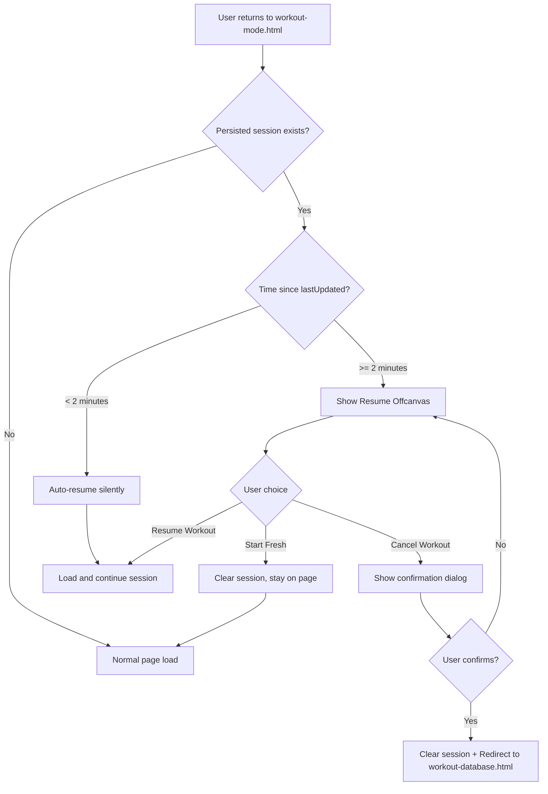

# Resume Session Offcanvas Enhancements

## Overview
Enhance the "Resume Workout?" offcanvas that appears when users return to workout-mode.html with an interrupted session. Two key improvements:

1. **Add Cancel Button** - Allow users to completely abandon a workout and return to the workout database
2. **Auto-Resume Threshold** - If user was away for less than 2 minutes, auto-resume without showing the offcanvas

## Current Behavior

When a user refreshes or leaves the workout-mode.html page during an active session:
1. Session is persisted to localStorage with `lastUpdated` timestamp
2. On page load, `checkPersistedSession()` detects the session
3. Resume offcanvas is shown with two options:
   - **Resume Workout** - Continues the session
   - **Start Fresh** - Discards session, stays on page to start new workout

## Proposed Changes

### 1. Auto-Resume Threshold Logic

**File**: [`frontend/assets/js/services/workout-lifecycle-manager.js`](frontend/assets/js/services/workout-lifecycle-manager.js)

**Location**: `checkPersistedSession()` method (line 289)

**Logic**:
```javascript
async checkPersistedSession() {
    const persistedSession = this.sessionService.restoreSession();
    
    if (persistedSession) {
        // Calculate time since last update
        const lastUpdated = new Date(persistedSession.lastUpdated);
        const minutesSinceUpdate = (Date.now() - lastUpdated.getTime()) / (1000 * 60);
        
        // Auto-resume threshold: 2 minutes
        const AUTO_RESUME_THRESHOLD_MINUTES = 2;
        
        if (minutesSinceUpdate < AUTO_RESUME_THRESHOLD_MINUTES) {
            // User was away briefly - auto-resume silently
            console.log(`🔄 Auto-resuming session (away for ${minutesSinceUpdate.toFixed(1)} minutes)`);
            await this.resumeSession(persistedSession);
            return true;
        }
        
        // User was away longer - show resume prompt
        console.log('🔄 Found persisted session, showing resume prompt...');
        await this.showResumeSessionPrompt(persistedSession);
        return true;
    }
    
    return false;
}
```

### 2. Add Cancel Button to Offcanvas

**File**: [`frontend/assets/js/components/offcanvas/offcanvas-workout.js`](frontend/assets/js/components/offcanvas/offcanvas-workout.js:313)

**Function**: `createResumeSession()` (line 313)

**Changes**:
1. Add `onCancel` parameter to function signature
2. Add Cancel button to the offcanvas HTML
3. Add click handler with confirmation dialog

**Updated Button Layout**:
```
┌─────────────────────────────────────┐
│     [Resume Workout] (Primary)      │
├─────────────────────────────────────┤
│     [Start Fresh] (Secondary)       │
├─────────────────────────────────────┤
│     [Cancel Workout] (Danger)       │
└─────────────────────────────────────┘
```

**Cancel Button Behavior**:
1. User clicks "Cancel Workout"
2. Confirmation modal appears using `ghostGymModalManager.confirm()` (consistent with existing patterns)
3. If confirmed:
   - Hide the offcanvas first (triggers cleanup via `hidden.bs.offcanvas` event)
   - Clear persisted session from localStorage
   - Redirect to workout-database.html
4. If cancelled: Modal closes, offcanvas remains visible

**Implementation Note**: The `ghostGymModalManager.confirm()` API supports:
- `confirmText` - Custom button text (e.g., "Yes, Cancel Workout")
- `confirmClass` - CSS class (use `btn-danger` for destructive action)
- Automatic cleanup after confirmation

### 3. Update Function Signatures

**File**: [`frontend/assets/js/components/offcanvas/offcanvas-workout.js`](frontend/assets/js/components/offcanvas/offcanvas-workout.js:313)

```javascript
// Before
export function createResumeSession(data, onResume, onStartFresh) { ... }

// After  
export function createResumeSession(data, onResume, onStartFresh, onCancel) { ... }
```

**File**: [`frontend/assets/js/components/offcanvas/index.js`](frontend/assets/js/components/offcanvas/index.js:121)

```javascript
// Before
static createResumeSession(data, onResume, onStartFresh) {
    return createResumeSession(data, onResume, onStartFresh);
}

// After
static createResumeSession(data, onResume, onStartFresh, onCancel) {
    return createResumeSession(data, onResume, onStartFresh, onCancel);
}
```

### 4. Update Lifecycle Manager Caller

**File**: [`frontend/assets/js/services/workout-lifecycle-manager.js`](frontend/assets/js/services/workout-lifecycle-manager.js:305)

**Function**: `showResumeSessionPrompt()` (line 305)

```javascript
async showResumeSessionPrompt(sessionData) {
    // ... existing code for calculating elapsed time ...
    
    // Use unified factory to create offcanvas
    window.UnifiedOffcanvasFactory.createResumeSession({
        workoutName: sessionData.workoutName,
        elapsedDisplay,
        exercisesWithWeights,
        totalExercises
    },
    async () => await this.resumeSession(sessionData),  // onResume
    (onDiscardComplete) => {                            // onStartFresh
        this.sessionService.clearPersistedSession();
        if (onDiscardComplete) {
            onDiscardComplete();
        }
    },
    () => {                                             // onCancel (NEW)
        this.sessionService.clearPersistedSession();
        window.location.href = 'workout-database.html';
    });
}
```

## Files to Modify

| File | Changes |
|------|---------|
| [`workout-lifecycle-manager.js`](frontend/assets/js/services/workout-lifecycle-manager.js) | Add auto-resume threshold logic, pass onCancel callback |
| [`offcanvas-workout.js`](frontend/assets/js/components/offcanvas/offcanvas-workout.js) | Add onCancel parameter, Cancel button with confirmation |
| [`index.js`](frontend/assets/js/components/offcanvas/index.js) | Pass through onCancel parameter in factory |

## UI Design

### Resume Session Offcanvas (Updated)

```
┌────────────────────────────────────────┐
│  ← Resume Workout?                     │
├────────────────────────────────────────┤
│                                        │
│        🏋️ [Workout Name]              │
│     You have an active workout         │
│                                        │
│  ┌─────────────┐  ┌─────────────┐     │
│  │ 25m ago     │  │ 3/5 Weights │     │
│  │ Started     │  │ Set         │     │
│  └─────────────┘  └─────────────┘     │
│                                        │
│  ℹ️ Your progress is saved             │
│  Resume to continue where you left     │
│  off, or start fresh to begin a new    │
│  session.                              │
│                                        │
│  ┌────────────────────────────────┐   │
│  │ ▶️ Resume Workout              │   │  ← Primary (blue)
│  └────────────────────────────────┘   │
│  ┌────────────────────────────────┐   │
│  │ 🔄 Start Fresh                 │   │  ← Secondary (outline)
│  └────────────────────────────────┘   │
│  ┌────────────────────────────────┐   │
│  │ ❌ Cancel Workout              │   │  ← Danger (red outline)
│  └────────────────────────────────┘   │
│                                        │
└────────────────────────────────────────┘
```

### Confirmation Dialog

```
┌────────────────────────────────────────┐
│  Cancel Workout?                       │
├────────────────────────────────────────┤
│                                        │
│  Are you sure you want to cancel       │
│  this workout session?                 │
│                                        │
│  All progress from this session will   │
│  be discarded and you will return      │
│  to the workout database.              │
│                                        │
│  ┌──────────┐  ┌──────────────────┐   │
│  │ Go Back  │  │ Yes, Cancel      │   │
│  └──────────┘  └──────────────────┘   │
│                                        │
└────────────────────────────────────────┘
```

## Flow Diagram



## Configuration

The auto-resume threshold can be configured as a constant:

```javascript
// In workout-lifecycle-manager.js
const AUTO_RESUME_THRESHOLD_MINUTES = 2;
```

This could be made configurable via app settings if needed in the future.

## Testing Checklist

- [ ] Refresh page within 2 minutes → Should auto-resume without offcanvas
- [ ] Refresh page after 2+ minutes → Should show offcanvas with all 3 buttons
- [ ] Click "Resume Workout" → Session continues normally
- [ ] Click "Start Fresh" → Session cleared, stays on page
- [ ] Click "Cancel Workout" → Confirmation appears
- [ ] Confirm cancel → Session cleared, redirects to workout-database.html
- [ ] Cancel the confirmation → Returns to offcanvas
- [ ] Test with different session states (some weights set, no weights set, etc.)
