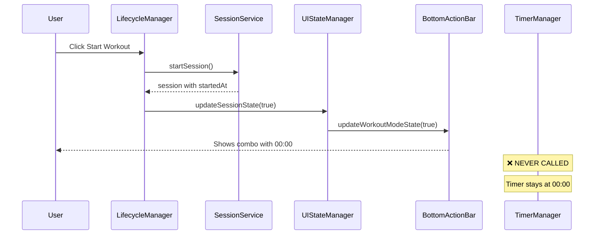
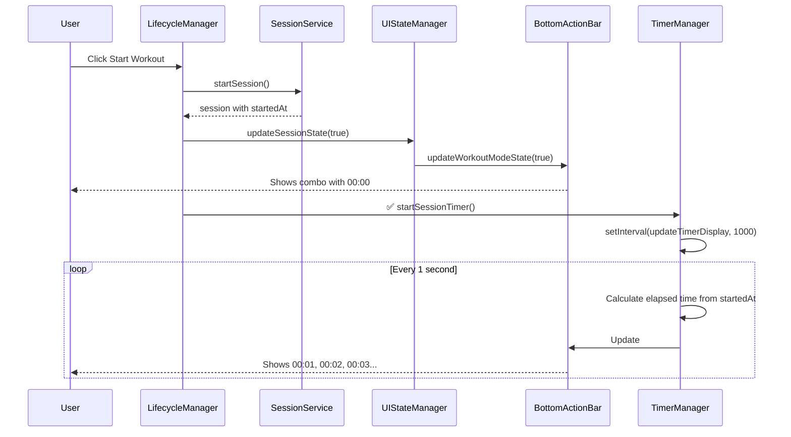

# Session Timer Fix - Implementation Complete ✅

## Bug Summary

**Issue:** Session timer in workout mode stayed stuck at `00:00` when starting a new workout session.

**Root Cause:** The `timerManager.startSessionTimer()` method was never called in the `startNewSession()` flow, even though the session was created with a valid `startedAt` timestamp and the UI was updated to show the timer combo.

**Evidence:** Resumed sessions worked correctly because `resumeSession()` DID call `timerManager.startSessionTimer()`.

---

## Fix Implemented

### File Modified
- [`frontend/assets/js/services/workout-lifecycle-manager.js`](../frontend/assets/js/services/workout-lifecycle-manager.js)

### Change Made
Added a single line to start the session timer after UI state is updated:

```javascript
async startNewSession() {
    try {
        // ... create session ...
        
        // Update UI
        this.uiStateManager.updateSessionState(true, this.sessionService.getCurrentSession());
        
        // ✅ FIX: Start session timer (updates #floatingTimer every second)
        this.timerManager.startSessionTimer();
        
        // Re-render to show weight inputs
        this.onRenderWorkout();
        
        // ... rest of code ...
    }
}
```

**Line Added:** `this.timerManager.startSessionTimer();` at line 124

---

## How It Works

### Before Fix


### After Fix


---

## Testing Instructions

### Test 1: Start New Workout Session
1. Navigate to [`workout-mode.html?id={workout-id}`](../frontend/workout-mode.html)
2. Ensure you're logged in (timer requires active session)
3. Click the **"Start"** button (floating green button or in bottom action bar)
4. **Expected Result:** 
   - Timer combo appears with timer and "End" button
   - Timer starts counting up: `00:01`, `00:02`, `00:03`, etc.
   - ✅ Timer should NOT stay at `00:00`

### Test 2: Resume Persisted Session
1. Start a workout session (Test 1)
2. Wait for timer to count up (e.g., to `00:15`)
3. Refresh the page (F5 or Ctrl+R)
4. Choose "Resume" when prompted
5. **Expected Result:**
   - Timer shows correct elapsed time (e.g., `00:16` if a second passed)
   - Timer continues counting up from there
   - ✅ This should continue to work as before

### Test 3: Reorder Exercises During Session
1. Start a workout session with timer running
2. Click "More" → "Reorder Exercises"
3. Drag exercises to reorder them
4. Save the new order
5. **Expected Result:**
   - Timer continues counting during and after reorder
   - ✅ Timer should NOT reset to `00:00`

### Test 4: Complete Workout
1. Start a workout session
2. Wait for timer to count up
3. Click "End" button → "Complete Workout"
4. **Expected Result:**
   - Completion summary shows correct duration
   - Timer stops after completion
   - ✅ Session should end gracefully

### Console Log Verification

When starting a new workout, you should now see:
```
🏋️ Starting workout session: [Workout Name]
✅ Workout session started: [session-id]
⏱️ Session timer started, updating every 1 second
```

If timer still doesn't work, check console for:
- ❌ `Cannot start timer - no session` → Session creation failed
- ❌ `#floatingTimer element not found` → DOM issue with bottom action bar

---

## Architecture Notes

### Why This Fix Works

1. **Session has valid timestamp:** `sessionService.startSession()` creates session with `startedAt: new Date()`
2. **UI combo is visible:** `updateSessionState()` calls `bottomActionBar.updateWorkoutModeState(true)` which shows the timer combo
3. **Timer interval is created:** `timerManager.startSessionTimer()` creates `setInterval()` that runs every 1 second
4. **Display is updated:** Every second, `updateTimerDisplay()` calculates elapsed time and updates `#floatingTimer.textContent`

### Why It Was Missing

During refactoring, timer logic was moved from inline code to `WorkoutTimerManager`. The `resumeSession()` flow was updated to call `timerManager.startSessionTimer()`, but the `startNewSession()` flow was not.

This is likely because `resumeSession()` was added later (for session persistence feature) and was implemented correctly, while `startNewSession()` retained the old pattern that relied on implicit timer initialization that no longer existed.

### Single Source of Truth

The timer derives its value from `session.startedAt`:
```javascript
const elapsed = Math.floor((Date.now() - session.startedAt.getTime()) / 1000);
```

This means:
- ✅ Timer is always accurate relative to session start
- ✅ Timer survives page refreshes (via persisted session)
- ✅ Timer can't drift from actual elapsed time
- ✅ No need to persist timer state separately

---

## Related Files (Reference)

| File | Role |
|------|------|
| [`workout-timer-manager.js`](../frontend/assets/js/services/workout-timer-manager.js) | Creates and manages timer intervals |
| [`workout-lifecycle-manager.js`](../frontend/assets/js/services/workout-lifecycle-manager.js) | **MODIFIED** - Orchestrates session start/resume |
| [`workout-session-service.js`](../frontend/assets/js/services/workout-session-service.js) | Creates session with `startedAt` timestamp |
| [`workout-ui-state-manager.js`](../frontend/assets/js/services/workout-ui-state-manager.js) | Updates UI state, delegates to bottom action bar |
| [`bottom-action-bar-service.js`](../frontend/assets/js/services/bottom-action-bar-service.js) | Renders timer combo with `#floatingTimer` element |
| [`workout-mode-controller.js`](../frontend/assets/js/controllers/workout-mode-controller.js) | Main controller, delegates to lifecycle manager |

---

## Investigation Document

For the complete technical analysis, see:
- [`SESSION_TIMER_INVESTIGATION_ANALYSIS.md`](SESSION_TIMER_INVESTIGATION_ANALYSIS.md)

This document includes:
- Detailed architecture diagrams
- Sequence diagrams (before/after)
- Console output analysis
- Architectural improvement recommendations

---

## Summary

**Status:** ✅ **FIXED**

**Lines Changed:** 1 line added (+ comment)

**Impact:** Low risk - adds missing initialization that should have been there

**Testing Required:** Manual testing in browser (see testing instructions above)

The session timer will now correctly count up from `00:00` when starting a new workout session, matching the behavior of resumed sessions.
