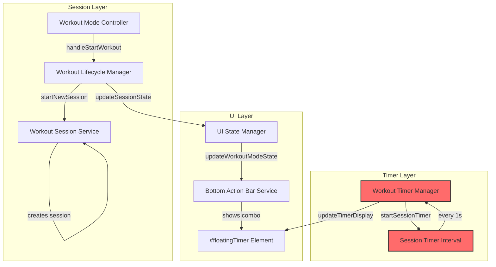
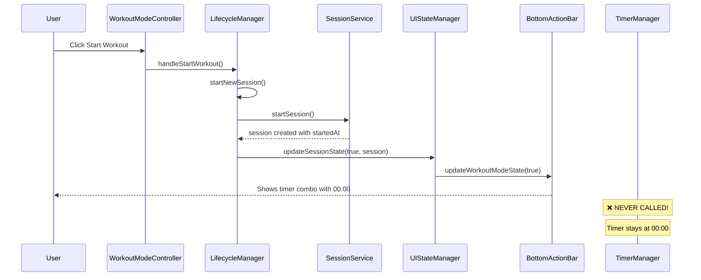

# Session Timer Investigation Analysis

## 🔴 CRITICAL BUG FOUND

**The session timer stays at 00:00 because `timerManager.startSessionTimer()` is NEVER CALLED when a new workout session starts.**

---

## Timer Architecture Overview

### Key Components



### File Responsibilities

| File | Purpose |
|------|---------|
| [`workout-timer-manager.js`](../frontend/assets/js/services/workout-timer-manager.js) | Centralized timer logic - `startSessionTimer()`, `updateTimerDisplay()` |
| [`bottom-action-bar-service.js`](../frontend/assets/js/services/bottom-action-bar-service.js) | Creates `#floatingTimer` element in DOM |
| [`workout-ui-state-manager.js`](../frontend/assets/js/services/workout-ui-state-manager.js) | Updates UI state, toggles timer visibility |
| [`workout-lifecycle-manager.js`](../frontend/assets/js/services/workout-lifecycle-manager.js) | Orchestrates session lifecycle |
| [`workout-session-service.js`](../frontend/assets/js/services/workout-session-service.js) | Creates/manages session data with `startedAt` timestamp |
| [`workout-mode-controller.js`](../frontend/assets/js/controllers/workout-mode-controller.js) | Main controller, delegates to managers |

---

## The Bug: Root Cause Analysis

### Current Flow (BROKEN)



### The Problem

In [`workout-lifecycle-manager.js`](../frontend/assets/js/services/workout-lifecycle-manager.js:108-149), the `startNewSession()` method:

```javascript
async startNewSession() {
    try {
        // Creates session...
        await this.sessionService.startSession(/*...*/);
        
        // Fetches history...
        await this.sessionService.fetchExerciseHistory(/*...*/);
        
        // ✅ Updates UI state (shows timer combo)
        this.uiStateManager.updateSessionState(true, this.sessionService.getCurrentSession());
        
        // Re-renders workout...
        this.onRenderWorkout();
        
        // ❌ MISSING: this.timerManager.startSessionTimer();
        
    } catch (error) {
        // ...
    }
}
```

The `uiStateManager.updateSessionState()` only toggles the UI visibility via `bottomActionBar.updateWorkoutModeState(true)`. It does NOT start the timer interval.

### Compare to Resume Session (WORKS)

In [`workout-lifecycle-manager.js`](../frontend/assets/js/services/workout-lifecycle-manager.js:339-378), the `resumeSession()` method:

```javascript
async resumeSession(sessionData) {
    // ...
    
    // Update UI to show active session
    this.uiStateManager.updateSessionState(true, this.sessionService.getCurrentSession());
    
    // ✅ Start timer (will calculate from original start time)
    this.timerManager.startSessionTimer(this.sessionService.getCurrentSession());
    
    // ...
}
```

**Resume session DOES call `timerManager.startSessionTimer()` - that's why resumed sessions show the correct elapsed time!**

### The `updateSessionUI()` Method (UNUSED)

There's actually a helper method in WorkoutLifecycleManager that does the right thing:

```javascript
updateSessionUI(isActive) {
    // Delegate to UI state manager
    this.uiStateManager.updateSessionState(isActive, this.sessionService.getCurrentSession());
    
    // Handle timers
    if (isActive) {
        this.timerManager.startSessionTimer(this.sessionService.getCurrentSession());
    } else {
        this.timerManager.stopSessionTimer();
    }
}
```

**But `startNewSession()` doesn't use this method!** It directly calls `uiStateManager.updateSessionState()` instead.

---

## Questions Answered

### 1. How is the session timer started?

**Answer:** It's supposed to be started by `timerManager.startSessionTimer()` which creates a `setInterval` that calls `updateTimerDisplay()` every second. However, this function is NOT called when starting a new session.

### 2. What element displays the timer?

**Answer:** The `#floatingTimer` span element, created by [`bottom-action-bar-service.js`](../frontend/assets/js/services/bottom-action-bar-service.js:256-271) in `renderFloatingTimerEndCombo()`:

```html
<div class="floating-timer-display" id="floatingTimerDisplay">
    <i class="bx bx-time-five"></i>
    <span id="floatingTimer">00:00</span>
</div>
```

### 3. What interval/mechanism updates the display?

**Answer:** The [`WorkoutTimerManager.startSessionTimer()`](../frontend/assets/js/services/workout-timer-manager.js:45-60) method creates the interval:

```javascript
startSessionTimer() {
    const session = this.sessionService.getCurrentSession();
    if (!session) return;
    
    if (this.sessionTimerInterval) {
        clearInterval(this.sessionTimerInterval);
    }
    
    // Timer updates every second
    this.sessionTimerInterval = setInterval(() => {
        this.updateTimerDisplay();
    }, 1000);
    
    // Initial display update
    this.updateTimerDisplay();
}
```

### 4. Why might it stay at 00:00?

**Answer:** The timer stays at 00:00 because:
1. ❌ `startSessionTimer()` is never called during `startNewSession()`
2. ❌ No interval is created
3. ❌ `updateTimerDisplay()` is never executed
4. The `#floatingTimer` element exists but is never updated

### 5. Investigate Specifically

| Question | Answer |
|----------|--------|
| Is `startSessionTimer()` being called? | ❌ **NO** - not called in `startNewSession()` |
| Is `sessionTimerInterval` being set? | ❌ **NO** - never created |
| Is `updateTimerDisplay()` being called? | ❌ **NO** - interval never runs |
| Is `session.startedAt` valid? | ✅ **YES** - session service creates valid timestamp |
| Is `#floatingTimer` present in DOM? | ✅ **YES** - created by bottom action bar |

### 6. Console Output Expected

When starting a workout session, you should see:
- ✅ "Session started" logs from session service
- ❌ NO timer-related logs from timer manager (because it's not called)
- ❌ NO "⏱️ Session timer started" log

---

## Proposed Fix

### Option 1: Quick Fix (Minimal Change)

Add one line to [`workout-lifecycle-manager.js`](../frontend/assets/js/services/workout-lifecycle-manager.js:121):

```javascript
async startNewSession() {
    try {
        // ... existing code ...
        
        // Update UI
        this.uiStateManager.updateSessionState(true, this.sessionService.getCurrentSession());
        
        // ✅ ADD THIS LINE: Start session timer
        this.timerManager.startSessionTimer();
        
        // Re-render to show weight inputs
        this.onRenderWorkout();
        
        // ... rest of code ...
    }
}
```

### Option 2: Better Fix (Use Existing Helper)

Replace direct call with the helper method that already handles both UI and timer:

```javascript
async startNewSession() {
    try {
        // ... existing code ...
        
        // ✅ Use updateSessionUI instead of direct uiStateManager call
        this.updateSessionUI(true);
        
        // Re-render to show weight inputs
        this.onRenderWorkout();
        
        // ... rest of code ...
    }
}
```

---

## Proposed Architecture Improvements

### 1. Event-Driven Updates vs Polling ✅ (Current: Polling)

The current 1-second polling approach is acceptable for a timer. Event-driven would be overkill.

**Keep current approach** - 1 second interval is appropriate for timer display.

### 2. Decouple Timer State from Timer Display

Currently, timer state (elapsed time) is derived from `session.startedAt` on every update. This is actually good - it's stateless and resilient to page refreshes.

**Keep current approach** - deriving from `session.startedAt` is the right design.

### 3. Ensure Timer Survives DOM Re-renders

**Potential Issue Found:** In [`workout-mode-controller.js`](../frontend/assets/js/controllers/workout-mode-controller.js:1007-1029), the `applyExerciseOrder()` method has a timer preservation workaround:

```javascript
// TIMER FIX: Preserve timer state before re-render
const timerDisplay = document.getElementById('floatingTimer');
const preservedTime = timerDisplay ? timerDisplay.textContent : null;

// ... renderWorkout() ...

// TIMER FIX: Restore timer state if it was inadvertently cleared
if (isSessionActive && preservedTime && timerDisplay) {
    const currentTime = timerDisplay.textContent;
    if (currentTime === '00:00' && preservedTime !== '00:00') {
        timerDisplay.textContent = preservedTime;
    }
}
```

This suggests there's ANOTHER bug where `renderWorkout()` might reset the timer display. However, this workaround is fragile.

**Improvement:** The timer update interval should continue running regardless of re-renders. Since `#floatingTimer` is in the bottom action bar (not in the exercise cards), it shouldn't be affected by `renderWorkout()`. The workaround may be addressing a different issue.

### 4. Single Source of Truth for Timer Value

**Current:** `session.startedAt` is the source of truth, and elapsed time is calculated on demand.

**This is correct!** The timer value is derived from:
```javascript
const elapsed = Math.floor((Date.now() - session.startedAt.getTime()) / 1000);
```

This ensures the timer is always accurate, even after page refresh or resume.

---

## Implementation Plan

### Phase 1: Fix the Bug (5 min)

1. Edit [`workout-lifecycle-manager.js`](../frontend/assets/js/services/workout-lifecycle-manager.js)
2. Add `this.timerManager.startSessionTimer()` call in `startNewSession()` after `updateSessionState()`
3. Test by starting a new workout session

### Phase 2: Add Logging for Debugging (Optional)

Add console logs to timer manager for easier debugging:

```javascript
startSessionTimer() {
    console.log('⏱️ Starting session timer...');
    const session = this.sessionService.getCurrentSession();
    if (!session) {
        console.warn('⚠️ Cannot start timer - no session');
        return;
    }
    
    // ... existing code ...
    
    console.log('✅ Session timer started, updating every 1 second');
}
```

### Phase 3: Verify Other Timer Scenarios (Testing)

1. ✅ Start new workout - timer should count up from 00:00
2. ✅ Resume persisted session - timer should show correct elapsed time
3. ✅ Reorder exercises - timer should continue counting
4. ✅ Complete workout - timer should stop
5. ✅ Navigate away and back - timer should continue (if session persisted)

---

## Files to Modify

| File | Change |
|------|--------|
| [`workout-lifecycle-manager.js`](../frontend/assets/js/services/workout-lifecycle-manager.js) | Add `timerManager.startSessionTimer()` call in `startNewSession()` |

---

## Summary

| Issue | Root Cause | Fix |
|-------|------------|-----|
| Timer stuck at 00:00 | `startSessionTimer()` never called in `startNewSession()` | Add the call after `updateSessionState()` |

The architecture is fundamentally sound. The bug is simply a missing function call - likely a regression or oversight during the refactoring that moved timer logic to `WorkoutTimerManager`.
