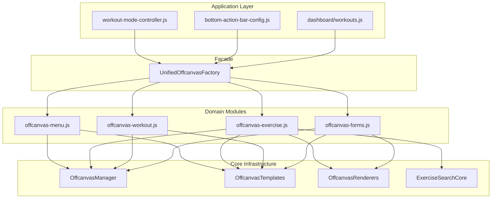

# Unified Offcanvas Factory Refactoring Plan

## Executive Summary

The `unified-offcanvas-factory.js` file has grown to over 3,000 lines and contains significant code duplication, mixed concerns, and maintainability issues. This plan outlines a multi-phase refactoring approach to make the code simpler, more consistent with the rest of the app, and easier to maintain.

> **Production Optimization**: This plan is optimized for a long-term, published production application with scalability, maintainability, and future-proofing in mind.

---

## Production Architecture Decisions

### File Organization: `offcanvas/` Subfolder ✅
- **Decision**: Use dedicated subfolder for better scalability
- **Rationale**: Clear domain boundaries, easier navigation for new developers, follows modern JS conventions

### Module System: Hybrid Approach ✅
- **Decision**: Keep window exports, structure internally for future ES modules
- **Rationale**: Backward compatibility now, migration path for build tooling later
- **Pattern**:
```javascript
class OffcanvasManager { ... }
window.OffcanvasManager = OffcanvasManager;
// Ready for: export { OffcanvasManager };
```

### Implementation Priority (Optimized for Impact) ✅
1. **Phase 4** - Use ExerciseSearchCore (biggest bug-fix impact)
2. **Phase 1** - OffcanvasManager (fixes lifecycle bugs permanently)
3. **Phase 5** - Split Files (maintainability)
4. **Phase 2-3** - Templates/Renderers (code quality)
5. **Phase 6-7** - Cleanup/Consistency (polish)

---

## Current State Analysis

### File Statistics
- **Total Lines**: 3,008 lines
- **Number of Methods**: 18 public static methods
- **Largest Method**: `createBonusExercise` (~830 lines)
- **Active Usage**: 21 call sites across 4 files

### Key Issues Identified

#### 1. **Massive File Size (Critical)**
A single 3,000+ line file violates the Single Responsibility Principle and makes maintenance difficult.

#### 2. **Code Duplication (High)**
The following patterns are duplicated multiple times:
- Exercise list rendering (appears in `createBonusExercise` and `createExerciseSearchOffcanvas`)
- Pagination rendering and logic
- Filter option handling
- State management patterns
- HTML template structures

#### 3. **Mixed Concerns (High)**
Business logic is embedded directly in UI factory methods:
- Exercise loading from cache service
- User favorites API calls
- Filter/search/sort logic
- Auto-create custom exercise logic

#### 4. **Inconsistent Pattern Usage (Medium)**
- `ExerciseSearchCore` exists but isn't used consistently
- Some methods duplicate its functionality entirely
- Callback patterns vary between methods

#### 5. **Deprecated Code Still Present (Low)**
- `createAddExerciseForm` marked deprecated but original implementation kept
- `_createAddExerciseForm_ORIGINAL` exists as dead code

#### 6. **Inline HTML Templates (Medium)**
- Large HTML strings embedded in JavaScript
- No syntax highlighting or validation
- Hard to maintain and prone to errors

---

## Existing Good Patterns in Codebase

These patterns should be followed during refactoring:

### 1. ExerciseSearchCore
```javascript
// Separation of search/filter/pagination logic
class ExerciseSearchCore {
    constructor(config) { ... }
    async loadExercises() { ... }
    filterExercises() { ... }
    applySorting() { ... }
    applyPagination() { ... }
    addListener(callback) { ... }
}
```

### 2. GhostGymModalManager
```javascript
// Lifecycle management pattern
class GhostGymModalManager {
    create(id, options) { ... }
    show(id, data) { ... }
    hide(id) { ... }
    destroy(id) { ... }
    // Pre-configured templates
    confirm(title, message, onConfirm) { ... }
    alert(title, message, type) { ... }
    form(title, fields, onSubmit) { ... }
}
```

### 3. ExerciseCardRenderer
```javascript
// Rendering separated from logic
class ExerciseCardRenderer {
    constructor(sessionService) { ... }
    renderCard(group, index, isBonus, totalCards) { ... }
    _renderWeightBadge(...) { ... }
    _escapeHtml(text) { ... }
}
```

---

## Refactoring Phases

### Phase 1: Create OffcanvasManager (Foundation)

**Goal**: Centralize offcanvas lifecycle management like `GhostGymModalManager`

**New File**: `frontend/assets/js/components/offcanvas-manager.js`

```javascript
class OffcanvasManager {
    constructor() {
        this.instances = new Map();
        this.instanceCounter = 0;
    }
    
    // Core lifecycle methods
    create(id, html, setupCallback = null) { ... }
    show(id) { ... }
    hide(id) { ... }
    destroy(id) { ... }
    
    // Backdrop cleanup
    cleanupBackdrops() { ... }
    
    // Instance tracking
    getActive() { ... }
    exists(id) { ... }
}

window.offcanvasManager = new OffcanvasManager();
```

**Benefits**:
- Single place for backdrop cleanup logic
- Instance tracking prevents orphaned elements
- Consistent show/hide animations
- Easier debugging

---

### Phase 2: Extract HTML Templates

**Goal**: Move HTML templates out of JavaScript for maintainability

**New File**: `frontend/assets/js/components/offcanvas-templates.js`

```javascript
const OffcanvasTemplates = {
    // Base structure
    base: (config) => `
        <div class="offcanvas offcanvas-bottom offcanvas-bottom-base" ...>
            ${OffcanvasTemplates.header(config)}
            ${config.body}
            ${config.footer ? OffcanvasTemplates.footer(config.footer) : ''}
        </div>
    `,
    
    header: (config) => `
        <div class="offcanvas-header border-bottom">
            <h5 class="offcanvas-title">
                ${config.icon ? `<i class="bx ${config.icon} me-2"></i>` : ''}
                ${escapeHtml(config.title)}
            </h5>
            ${config.showClose !== false ? '<button type="button" class="btn-close" data-bs-dismiss="offcanvas"></button>' : ''}
        </div>
    `,
    
    footer: (config) => `
        <div class="offcanvas-footer border-top p-3">
            ${config.buttons.map(btn => OffcanvasTemplates.button(btn)).join('')}
        </div>
    `,
    
    // Reusable components
    exerciseCard: (exercise, config) => `...`,
    pagination: (paginationData) => `...`,
    filterOption: (option, isSelected) => `...`,
    menuItem: (item, index) => `...`,
    
    // Exercise-specific templates
    exerciseSearchBody: () => `...`,
    exerciseFilterBody: (muscleGroups, equipment) => `...`,
    
    // Form templates
    inputField: (config) => `...`,
    selectField: (config) => `...`,
    buttonGroup: (buttons) => `...`
};
```

**Benefits**:
- Templates can be reviewed/edited independently
- Can add syntax validation
- Easier to test rendering
- Better separation of concerns

---

### Phase 3: Extract Renderers

**Goal**: Create dedicated renderers for repeated UI patterns

**New Files**:
- `frontend/assets/js/components/offcanvas-exercise-renderer.js`
- `frontend/assets/js/components/offcanvas-pagination-renderer.js`

#### Exercise Renderer
```javascript
class OffcanvasExerciseRenderer {
    constructor(containerElement) {
        this.container = containerElement;
    }
    
    renderList(exercises, config = {}) {
        const { buttonText = 'Add', buttonIcon = 'bx-plus' } = config;
        this.container.innerHTML = exercises.map(ex => 
            OffcanvasTemplates.exerciseCard(ex, config)
        ).join('');
    }
    
    showLoading() { ... }
    showEmpty(message) { ... }
    showError(message) { ... }
    
    onExerciseClick(callback) {
        this.container.addEventListener('click', (e) => {
            const btn = e.target.closest('[data-exercise-id]');
            if (btn) callback(btn.dataset.exerciseId);
        });
    }
}
```

#### Pagination Renderer
```javascript
class OffcanvasPaginationRenderer {
    constructor(containerElement, onPageChange) {
        this.container = containerElement;
        this.onPageChange = onPageChange;
    }
    
    render(paginationData) {
        const { currentPage, totalPages, startIdx, endIdx, total } = paginationData;
        
        if (totalPages <= 1) {
            this.container.style.display = 'none';
            return;
        }
        
        this.container.style.display = 'block';
        this.container.innerHTML = OffcanvasTemplates.pagination(paginationData);
        this.attachHandlers();
    }
    
    attachHandlers() { ... }
}
```

**Benefits**:
- Eliminates duplicate rendering code
- Consistent UI across all offcanvas types
- Easier to update styling globally
- Can be unit tested

---

### Phase 4: Use ExerciseSearchCore Consistently

**Goal**: Remove duplicate search/filter logic from offcanvas methods

**Changes to `createBonusExercise`**:
```javascript
static createBonusExercise(data, onAddExercise) {
    // Before: 830+ lines with embedded state management
    // After: ~150 lines using ExerciseSearchCore
    
    return this.createOffcanvas('bonusExerciseOffcanvas', html, (offcanvas, element) => {
        // Create search core instance
        const searchCore = new ExerciseSearchCore({
            pageSize: window.innerWidth <= 768 ? 20 : 30,
            showFavorites: true
        });
        
        // Create renderers
        const exerciseRenderer = new OffcanvasExerciseRenderer(
            element.querySelector('#exerciseList')
        );
        const paginationRenderer = new OffcanvasPaginationRenderer(
            element.querySelector('#paginationFooter'),
            (page) => searchCore.goToPage(page)
        );
        
        // Listen to search core events
        searchCore.addListener((event, data) => {
            if (event === 'paginated') {
                exerciseRenderer.renderList(searchCore.state.paginatedExercises);
                paginationRenderer.render(data);
            }
        });
        
        // Load exercises
        searchCore.loadExercises();
    });
}
```

**Benefits**:
- ~680 lines removed from createBonusExercise
- Single source of truth for search logic
- Bug fixes apply to all exercise search features
- Easier to add new search features

---

### Phase 5: Split Into Domain-Specific Files

**Goal**: Organize by domain/feature area

#### New File Structure:
```
frontend/assets/js/components/offcanvas/
├── offcanvas-manager.js          # Core lifecycle management
├── offcanvas-templates.js        # HTML templates
├── offcanvas-renderers.js        # Shared renderers
├── offcanvas-menu.js             # Menu-style offcanvas
├── offcanvas-exercise.js         # Exercise search/filter/add
├── offcanvas-workout.js          # Workout-related (complete, resume, etc.)
├── offcanvas-forms.js            # Form-based offcanvas
└── index.js                      # Main export/facade
```

#### Main Export (index.js):
```javascript
// Import all modules
import { OffcanvasManager } from './offcanvas-manager.js';
import { OffcanvasTemplates } from './offcanvas-templates.js';
import { createMenuOffcanvas } from './offcanvas-menu.js';
import { createBonusExercise, createExerciseSearchOffcanvas, createExerciseFilterOffcanvas } from './offcanvas-exercise.js';
import { createWeightEdit, createCompleteWorkout, createCompletionSummary, createResumeSession } from './offcanvas-workout.js';
import { createExerciseGroupEditor, createSkipExercise } from './offcanvas-forms.js';

// Create facade for backward compatibility
class UnifiedOffcanvasFactory {
    static createMenuOffcanvas = createMenuOffcanvas;
    static createBonusExercise = createBonusExercise;
    static createExerciseSearchOffcanvas = createExerciseSearchOffcanvas;
    // ... etc
}

window.UnifiedOffcanvasFactory = UnifiedOffcanvasFactory;
```

#### offcanvas-menu.js (~100 lines):
```javascript
export function createMenuOffcanvas(config) {
    const { id, title, icon, menuItems = [] } = config;
    
    const html = OffcanvasTemplates.base({
        id,
        title,
        icon,
        body: `<div class="offcanvas-body menu-items">
            ${menuItems.map((item, i) => OffcanvasTemplates.menuItem(item, i)).join('')}
        </div>`
    });
    
    return offcanvasManager.create(id, html, (offcanvas, element) => {
        menuItems.forEach((item, index) => {
            element.querySelector(`[data-menu-action="${index}"]`)
                ?.addEventListener('click', async () => {
                    await item.onClick?.();
                    offcanvas.hide();
                });
        });
    });
}
```

#### offcanvas-exercise.js (~400 lines):
Contains: `createBonusExercise`, `createExerciseSearchOffcanvas`, `createExerciseFilterOffcanvas`

#### offcanvas-workout.js (~350 lines):
Contains: `createWeightEdit`, `createCompleteWorkout`, `createCompletionSummary`, `createResumeSession`, `createWorkoutSelectionPrompt`

#### offcanvas-forms.js (~300 lines):
Contains: `createExerciseGroupEditor`, `createSkipExercise`, `createFilterOffcanvas`

**Benefits**:
- Files are <500 lines each
- Related functionality is grouped
- Easier to find and modify code
- Can load only what's needed (future optimization)

---

### Phase 6: Remove Deprecated Code

**Goal**: Clean up dead code

**Remove**:
1. `createAddExerciseForm` method (deprecated, wrapper only)
2. `_createAddExerciseForm_ORIGINAL` method (dead code)
3. Unused variable `showSearchButton` reference
4. Any `exerciseId` parameter handling in deprecated paths

**Update Call Sites**:
- Ensure all callers use `createExerciseGroupEditor({ mode: 'single', ... })` instead

---

### Phase 7: Improve Error Handling and Consistency

**Goal**: Standardize patterns across all methods

#### Consistent Callback Signatures:
```javascript
// Before: Various signatures
onAddExercise(exerciseData)
onConfirm()
onSelectExercise(exercise)

// After: Consistent with error handling
onAction: {
    success: (data) => void,
    error: (error) => void,   // Optional
    cancel: () => void         // Optional
}
```

#### Consistent Loading States:
```javascript
// Standard loading state helper
function setButtonLoading(button, isLoading, originalHtml) {
    button.disabled = isLoading;
    button.innerHTML = isLoading 
        ? '<span class="spinner-border spinner-border-sm me-2"></span>Loading...'
        : originalHtml;
}
```

#### Consistent Error Handling:
```javascript
// Standard error toast
function showOffcanvasError(message) {
    if (window.showToast) {
        window.showToast({
            message,
            type: 'danger',
            title: 'Error',
            icon: 'bx-error',
            delay: 5000
        });
    } else {
        console.error(message);
    }
}
```

---

## Implementation Approach

### Recommended Order:
1. **Phase 1** - OffcanvasManager (foundation)
2. **Phase 2** - Templates (preparation for refactoring)
3. **Phase 3** - Renderers (preparation for refactoring)
4. **Phase 4** - Use ExerciseSearchCore (biggest impact)
5. **Phase 5** - Split files (organization)
6. **Phase 6** - Remove deprecated (cleanup)
7. **Phase 7** - Error handling (polish)

### Testing Strategy:
After each phase:
1. Test all 21 call sites in the application
2. Verify offcanvas opens/closes correctly
3. Check backdrop cleanup works
4. Verify callbacks fire correctly
5. Test on mobile (bottom offcanvas positioning)

### Key Call Sites to Test:
- **workout-mode-controller.js**: Weight edit, complete workout, resume session, exercise group editor, skip exercise, exercise search
- **bottom-action-bar-config.js**: Menu offcanvas, filter offcanvas
- **dashboard/workouts.js**: Exercise group editor, exercise search

---

## File Size Comparison

| File | Before | After (Estimated) |
|------|--------|-------------------|
| unified-offcanvas-factory.js | 3,008 lines | Removed |
| offcanvas-manager.js | - | ~150 lines |
| offcanvas-templates.js | - | ~300 lines |
| offcanvas-renderers.js | - | ~200 lines |
| offcanvas-menu.js | - | ~100 lines |
| offcanvas-exercise.js | - | ~400 lines |
| offcanvas-workout.js | - | ~350 lines |
| offcanvas-forms.js | - | ~300 lines |
| index.js | - | ~50 lines |
| **Total** | **3,008 lines** | **~1,850 lines** |

**Line Reduction**: ~40% reduction through eliminating duplication

---

## Architecture Diagram



---

## Risk Assessment

| Risk | Likelihood | Impact | Mitigation |
|------|------------|--------|------------|
| Breaking existing functionality | Medium | High | Comprehensive testing at each phase |
| Regression in backdrop cleanup | Low | High | Keep existing cleanup logic, add tests |
| Performance impact | Low | Medium | Profile before/after, lazy loading if needed |
| Incomplete refactoring | Medium | Low | Phases are independent, can pause anytime |

---

## Success Criteria

1. **All existing functionality preserved** - No regressions in any call site
2. **File sizes under 500 lines** - Each new file is manageable
3. **No code duplication** - DRY principle applied
4. **Consistent patterns** - All methods follow same conventions
5. **Better separation of concerns** - Business logic separated from UI
6. **Improved maintainability** - New developers can understand code quickly

---

## Questions for User Review

1. **File Organization**: Do you prefer the proposed folder structure (`offcanvas/`) or keeping all files in `components/`?

2. **Backward Compatibility**: Should we maintain the `UnifiedOffcanvasFactory` facade indefinitely, or plan to deprecate it after updating all call sites?

3. **Module System**: The current codebase uses global window exports. Should we keep this pattern or introduce ES modules with a build step?

4. **Priority**: Which phase is most important to complete first for your immediate needs?

5. **Testing**: Do you have automated tests, or should we document manual test cases?

---

## Next Steps

Once this plan is approved:
1. Switch to **Code mode** to begin implementation
2. Start with Phase 1 (OffcanvasManager)
3. Test thoroughly before proceeding to next phase
4. Create pull request for each phase

---

*Document Version: 1.0*  
*Created: 2025-12-20*  
*Author: Architect Mode*
