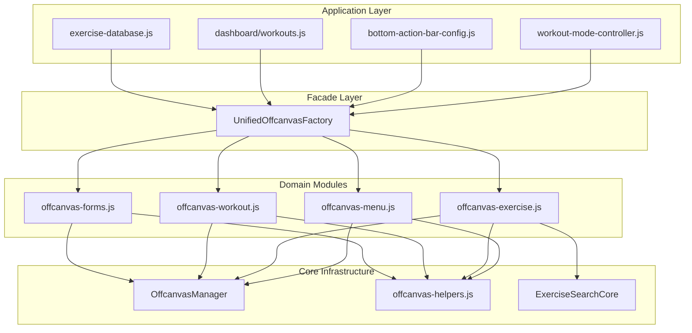

# Unified Offcanvas Factory Refactoring Plan v3.0

## Executive Summary

This plan outlines a **multi-phase refactoring approach** for [`unified-offcanvas-factory.js`](../frontend/assets/js/components/unified-offcanvas-factory.js) (3,008 lines) to make it simpler, more maintainable, and consistent with the rest of the Ghost Gym application.

**Current State:** Phase 1 (OffcanvasManager) is complete. Dead code has been removed. The main refactoring work remains.

**Target Outcome:** ~28% code reduction (~840 lines), better consistency, and improved maintainability.

---

## Current State Analysis

### File Statistics
| Metric | Value |
|--------|-------|
| Total Lines | 3,008 |
| Public Methods | 18 static methods |
| Largest Method | `createBonusExercise()` - 811 lines |
| Active Call Sites | 21 across 4 files |

### What's Already Done ✅
1. **OffcanvasManager** - Centralized lifecycle management (190 lines)
   - Location: [`offcanvas/offcanvas-manager.js`](../frontend/assets/js/components/offcanvas/offcanvas-manager.js)
   - Features: Proper dispose, backdrop cleanup, show timing
   
2. **Dead Code Removal** - 576 lines removed
   - Deleted: `offcanvas-templates.js`, `offcanvas-renderers.js`
   - Updated: 5 HTML files to remove script references

3. **ExerciseSearchCore** - Reusable search logic (434 lines)
   - Location: [`exercise-search-core.js`](../frontend/assets/js/components/exercise-search-core.js)
   - Used by: `createExerciseSearchOffcanvas()` ✅
   - NOT used by: `createBonusExercise()` ❌ (this is the main issue)

### Key Issues Identified

#### 1. Duplicate Logic in createBonusExercise - 811 lines
The `createBonusExercise()` method duplicates ALL functionality that `ExerciseSearchCore` provides:
- Manual state management (lines 796-816)
- Manual `loadExercises()` (lines 842-894)
- Manual `filterExercises()` (lines 934-1000)
- Manual `applySorting()` (lines 1004-1050)
- Manual `applyPagination()` (lines 1053-1127)
- Manual `renderPagination()` (lines 1064-1127)

#### 2. Deprecated Code Still Present
- `createAddExerciseForm()` - deprecated wrapper
- `_createAddExerciseForm_ORIGINAL()` - dead code (~150 lines)

#### 3. Inconsistent Patterns
- Loading state handling varies between methods
- Error handling is inconsistent
- Button state management duplicated

---

## Refactoring Phases

### Phase A: ExerciseSearchCore Integration (HIGHEST IMPACT)

**Target:** `createBonusExercise()` - Lines 615-1426
**Before:** 811 lines
**After:** ~200 lines
**Savings:** ~610 lines (75% reduction)
**Risk:** Medium

#### Approach: Hybrid Pattern
Keep the unique dual-purpose UX while eliminating duplicate logic:

```javascript
static createBonusExercise(data, onAddExercise) {
    return this.createOffcanvas('bonusExerciseOffcanvas', offcanvasHtml, (offcanvas, element) => {
        // ✅ Use ExerciseSearchCore for library management
        const searchCore = new window.ExerciseSearchCore({
            pageSize: window.innerWidth <= 768 ? 20 : 30,
            showFavorites: true
        });
        
        // ✅ Separate UI state for form values - NOT managed by search core
        const uiState = {
            exerciseName: '',
            sets: '3',
            reps: '12',
            rest: '60s'
        };
        
        // Exercise name input: Update BOTH ui state AND search core
        exerciseNameInput.addEventListener('input', (e) => {
            const value = e.target.value.trim();
            uiState.exerciseName = value;        // For Add Exercise button
            searchCore.setSearchQuery(value);    // Filter library
            addExerciseBtn.disabled = !value;
        });
        
        // ✅ Delegate all filter operations to search core
        muscleGroupFilter.addEventListener('change', (e) => {
            searchCore.setMuscleGroup(e.target.value);
        });
        
        // ✅ Listen to search core events for rendering
        searchCore.addListener((event, data) => {
            if (event === 'filtered' || event === 'paginated') {
                renderExerciseList(searchCore.state.paginatedExercises);
                if (event === 'paginated') renderPagination(data);
            }
        });
        
        // Load exercises on show
        searchCore.loadExercises();
    });
}
```

#### What Gets Removed
| Component | Lines | Replaced By |
|-----------|-------|-------------|
| State object | 20 | ExerciseSearchCore.state |
| loadExercises() | 50 | ExerciseSearchCore.loadExercises() |
| loadUserFavorites() | 35 | ExerciseSearchCore.loadUserFavorites() |
| filterExercises() | 65 | ExerciseSearchCore.filterExercises() |
| applySorting() | 45 | ExerciseSearchCore.applySorting() |
| applyPagination() | 75 | ExerciseSearchCore.applyPagination() |
| renderPagination() | 65 | Shared helper or inline |
| Filter handlers | 80 | Delegated to searchCore |
| **Total** | **~435** | |

#### What Gets Kept
- Unique dual-purpose UX (name input = form value + search filter)
- Sets/Reps/Rest input handling
- Add Exercise button with custom exercise creation
- Library exercise click handling
- Filter accordion UI

---

### Phase B: Remove Deprecated Code (LOW RISK)

**Target:** Deprecated methods and dead code
**Savings:** ~150 lines
**Risk:** Low

#### Files to Clean
```javascript
// REMOVE: Lines 2104-2155 - createAddExerciseForm (deprecated wrapper)
static createAddExerciseForm(config = {}, onAddExercise, onSearchClick = null) {
    console.warn('⚠️ createAddExerciseForm is deprecated...');
    // This just wraps createExerciseGroupEditor - remove entirely
}

// REMOVE: Lines 2162-2309 - _createAddExerciseForm_ORIGINAL (dead code)
static _createAddExerciseForm_ORIGINAL(config = {}, onAddExercise, onSearchClick = null) {
    // Never called - pure dead code
}

// REMOVE: Lines 2315-2328 - validateAddButton (only used by deprecated method)
static validateAddButton(searchInput, addBtn) {
    // Orphaned helper
}
```

#### Verification Steps
1. Search codebase for `createAddExerciseForm` calls
2. Confirm all callers use `createExerciseGroupEditor` instead
3. Remove deprecated methods
4. Test affected call sites

---

### Phase C: Extract Common Helpers (CONSISTENCY)

**Target:** Repeated patterns across methods
**Savings:** ~80 lines + consistency improvements
**Risk:** Low

#### 1. Loading State Helper
```javascript
// Current: Repeated in 6+ methods
submitBtn.disabled = true;
submitBtn.innerHTML = '<span class="spinner-border spinner-border-sm me-2"></span>Adding...';

// After: Shared helper
static setButtonLoading(button, isLoading, loadingText = 'Loading...', originalHtml = null) {
    if (!button._originalHtml) button._originalHtml = button.innerHTML;
    button.disabled = isLoading;
    button.innerHTML = isLoading 
        ? `<span class="spinner-border spinner-border-sm me-2"></span>${loadingText}`
        : (originalHtml || button._originalHtml);
}
```

#### 2. Error Toast Helper
```javascript
// Current: Inconsistent error handling
if (window.showToast) {
    window.showToast({
        message: 'Failed to add exercise. Please try again.',
        type: 'danger',
        title: 'Error',
        icon: 'bx-error',
        delay: 3000
    });
}

// After: Standardized helper
static showError(message, title = 'Error') {
    if (window.showToast) {
        window.showToast({
            message,
            type: 'danger',
            title,
            icon: 'bx-error',
            delay: 5000
        });
    } else {
        console.error(`${title}: ${message}`);
    }
}

static showSuccess(message, title = 'Success') {
    if (window.showToast) {
        window.showToast({
            message,
            type: 'success',
            title,
            icon: 'bx-check-circle',
            delay: 3000
        });
    }
}
```

#### 3. Auto-Create Exercise Helper
```javascript
// Current: Repeated in 3 methods
if (window.exerciseCacheService && window.dataManager?.isUserAuthenticated()) {
    const currentUser = window.dataManager.getCurrentUser();
    const userId = currentUser?.uid || null;
    await window.exerciseCacheService.autoCreateIfNeeded(exerciseName, userId);
}

// After: Extracted helper
static async ensureExerciseExists(exerciseName) {
    if (window.exerciseCacheService && window.dataManager?.isUserAuthenticated()) {
        const currentUser = window.dataManager.getCurrentUser();
        await window.exerciseCacheService.autoCreateIfNeeded(exerciseName, currentUser?.uid);
    }
}
```

---

### Phase D: Split Into Domain Files (ORGANIZATION)

**Target:** Single 3,008 line file → Multiple focused files
**Risk:** Low (pure reorganization)

#### Proposed File Structure
```
frontend/assets/js/components/offcanvas/
├── offcanvas-manager.js          # ✅ Already exists (190 lines)
├── offcanvas-helpers.js          # NEW: Shared helpers (~100 lines)
├── offcanvas-exercise.js         # NEW: Exercise-related (~400 lines)
│   ├── createBonusExercise
│   ├── createExerciseSearchOffcanvas
│   └── createExerciseFilterOffcanvas
├── offcanvas-workout.js          # NEW: Workout-related (~350 lines)
│   ├── createWeightEdit
│   ├── createCompleteWorkout
│   ├── createCompletionSummary
│   ├── createResumeSession
│   └── createWorkoutSelectionPrompt
├── offcanvas-forms.js            # NEW: Form-based (~300 lines)
│   ├── createExerciseGroupEditor
│   ├── createSkipExercise
│   └── createFilterOffcanvas
├── offcanvas-menu.js             # NEW: Menu-style (~100 lines)
│   └── createMenuOffcanvas
└── index.js                      # NEW: Facade (~100 lines)
```

#### Backward Compatibility Facade
```javascript
// offcanvas/index.js
import { createMenuOffcanvas } from './offcanvas-menu.js';
import { createBonusExercise, createExerciseSearchOffcanvas } from './offcanvas-exercise.js';
// ... other imports

class UnifiedOffcanvasFactory {
    static createMenuOffcanvas = createMenuOffcanvas;
    static createBonusExercise = createBonusExercise;
    static createExerciseSearchOffcanvas = createExerciseSearchOffcanvas;
    // ... all other methods
    
    // Helper methods
    static escapeHtml = escapeHtml;
    static setButtonLoading = setButtonLoading;
    static showError = showError;
}

window.UnifiedOffcanvasFactory = UnifiedOffcanvasFactory;
```

#### HTML Updates Required
Update script tags in these files:
1. `exercise-database.html`
2. `workout-builder.html`
3. `workout-database.html`
4. `workout-mode-production.html`
5. `workout-mode.html`

---

## Expected Outcomes

### Line Count Summary
| Phase | Before | After | Saved |
|-------|--------|-------|-------|
| A: ExerciseSearchCore | 811 lines | ~200 lines | ~610 |
| B: Deprecated Code | ~150 lines | 0 lines | ~150 |
| C: Common Helpers | ~200 lines | ~120 lines | ~80 |
| **Total** | 3,008 lines | ~2,170 lines | **~840 (28%)** |

### Quality Improvements
- ✅ Single source of truth for exercise search logic
- ✅ Consistent error handling across all offcanvas types
- ✅ Consistent loading state management
- ✅ No dead code
- ✅ Files under 500 lines each
- ✅ Better separation of concerns

---

## Implementation Order

### Recommended Sequence
1. **Phase B first** - Quick win, zero risk, removes confusion
2. **Phase A second** - Biggest impact, requires testing
3. **Phase C third** - Consistency improvements
4. **Phase D last** - Organization (optional, can defer)

### Why This Order?
- Phase B clears out noise before major refactoring
- Phase A is the core refactoring with biggest ROI
- Phase C is easier after A simplifies the code
- Phase D is pure organization, can be done anytime

---

## Testing Requirements

### Phase A Testing Checklist (Critical)
- [ ] Exercise name input filters library in real-time
- [ ] Add Exercise button enabled when name entered
- [ ] Custom exercise not in library creates successfully
- [ ] Library exercise click populates all fields
- [ ] Sets/Reps/Rest values persist during browsing
- [ ] Muscle group filter works
- [ ] Difficulty filter works
- [ ] Equipment multi-select works
- [ ] Favorites toggle works
- [ ] All sort options work
- [ ] Pagination controls work
- [ ] Page info displays correctly
- [ ] Filter accordion expands/collapses
- [ ] Clear name button works
- [ ] Empty state displays when no results
- [ ] Loading state displays during load

### Phase B Testing (Minimal)
- [ ] No console errors on any page
- [ ] createExerciseGroupEditor still works

### Phase C Testing (Moderate)
- [ ] Loading spinners display correctly
- [ ] Error toasts appear on failures
- [ ] Success toasts appear on success

### Phase D Testing (Full Regression)
- [ ] All 18 offcanvas types still work
- [ ] No JavaScript errors
- [ ] Script loading order correct

---

## Risk Assessment

| Phase | Risk Level | Mitigation |
|-------|------------|------------|
| A | Medium | Reference implementation exists; comprehensive testing |
| B | Low | Dead code with 0 references |
| C | Low | Internal helpers only; no API changes |
| D | Low | Pure reorganization; facade maintains compatibility |

### Rollback Plan
Each phase can be independently reverted:
```bash
git revert <phase-commit-hash>
```

---

## Architecture Diagram



---

## Bootstrap Best Practices Applied

### Offcanvas Lifecycle
- ✅ Use `OffcanvasManager.create()` for consistent lifecycle
- ✅ Proper `dispose()` before removing elements
- ✅ Backdrop cleanup on hide event
- ✅ Double RAF + setTimeout for show() stability

### DOM & Events
- ✅ Use `data-bs-dismiss` for close buttons
- ✅ Use `{ once: true }` for one-time events
- ✅ Unique IDs with prefixes to avoid collisions
- ✅ Proper focus management

### Accessibility
- ✅ `aria-labelledby` pointing to title
- ✅ `aria-label` on close buttons
- ✅ `tabindex="-1"` on container
- ✅ Focus trap within offcanvas

---

## Next Steps

1. **Review this plan** - Confirm approach and priorities
2. **Switch to Code mode** - Begin Phase B implementation
3. **Test Phase B** - Verify no regressions
4. **Implement Phase A** - The main refactoring work
5. **Test thoroughly** - All exercise search functionality
6. **Continue with Phase C** - Consistency improvements
7. **Optional: Phase D** - File splitting if desired

---

*Document Version: 3.0*  
*Created: 2025-12-20*  
*Status: Ready for Review*
