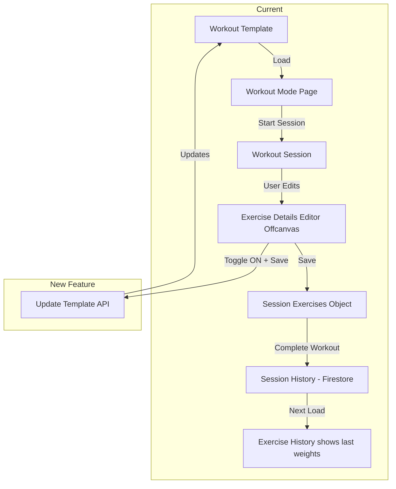

# Update Template from Workout Mode - Implementation Plan

## Overview

This feature allows users to update their workout template directly from workout mode. When users modify exercises (sets, reps, rest, weight) during a workout, they can optionally save those changes back to the original template.

## Current Architecture Understanding

### Data Flow


### Key Files Involved
- [`frontend/assets/js/components/offcanvas/offcanvas-forms.js`](frontend/assets/js/components/offcanvas/offcanvas-forms.js) - Exercise Details Editor
- [`frontend/assets/js/services/workout-exercise-operations-manager.js`](frontend/assets/js/services/workout-exercise-operations-manager.js) - Handles exercise operations
- [`frontend/assets/js/services/workout-session-service.js`](frontend/assets/js/services/workout-session-service.js) - Session management
- [`frontend/assets/js/firebase/data-manager.js`](frontend/assets/js/firebase/data-manager.js) - Firestore API calls
- [`frontend/assets/js/components/offcanvas/offcanvas-workout.js`](frontend/assets/js/components/offcanvas/offcanvas-workout.js) - Workout completion offcanvas
- [`backend/api/workouts.py`](backend/api/workouts.py) - Workout template CRUD API

## Feature Requirements

### Part 1: Exercise Edit Toggle (Primary Focus)

**Location**: Exercise Details Editor Offcanvas

**Behavior**:
1. User expands an exercise card and clicks "Edit" button
2. Exercise Details Editor offcanvas opens with current values
3. User modifies sets, reps, rest, and/or weight
4. **NEW**: Toggle switch "Update template" appears
5. When toggled ON and user clicks Save:
   - Changes save to current session (existing behavior)
   - **AND** changes update the workout template

### Part 2: End-of-Workout Updates (Future Enhancement)

**Location**: Complete Workout Offcanvas

**Behavior**:
1. User clicks "Complete Workout"
2. Complete Workout offcanvas shows session summary
3. **NEW**: Section with update options:
   - [ ] Update weights, sets, reps
   - [ ] Update exercise order
   - [ ] Add new exercises to template (for bonus exercises)
4. User confirms completion
5. Selected updates are applied to template

---

## Part 1: Detailed Implementation

### UI Design - Exercise Details Editor

```
┌────────────────────────────────────────┐
│  ✏️ Edit Exercise              [X]    │
├────────────────────────────────────────┤
│  Bench Press                           │
│                                        │
│  ┌────────┐ ┌────────┐ ┌────────┐     │
│  │ Sets   │ │ Reps   │ │ Rest   │     │
│  │  3     │ │ 8-12   │ │  60s   │     │
│  └────────┘ └────────┘ └────────┘     │
│                                        │
│  🏋️ Weight                             │
│  ┌────────────────┐  ┌────────────┐   │
│  │      135       │  │ lbs  ▼    │   │
│  └────────────────┘  └────────────┘   │
│                                        │
│  ┌─────────────────────────────────┐  │
│  │ 🔄 Update template              │  │
│  │    ○────────────────────●       │  │ ← NEW TOGGLE
│  │    Save changes to workout      │  │
│  │    template for future sessions │  │
│  └─────────────────────────────────┘  │
│                                        │
│  ℹ️ Changes will be saved to your     │
│     workout session history.          │
│                                        │
│  ┌─────────────┐  ┌─────────────────┐ │
│  │   Cancel    │  │  Save Changes   │ │
│  └─────────────┘  └─────────────────┘ │
└────────────────────────────────────────┘
```

### Implementation Steps

#### Step 1: Modify Exercise Details Editor UI
**File**: `frontend/assets/js/components/offcanvas/offcanvas-forms.js`

Add toggle switch after the weight input section:

```javascript
// NEW: Update template toggle section
<div class="form-check form-switch mb-3 p-3 bg-light rounded">
    <input class="form-check-input" type="checkbox" role="switch" 
           id="updateTemplateToggle">
    <label class="form-check-label" for="updateTemplateToggle">
        <i class="bx bx-sync me-1"></i>
        <strong>Update template</strong>
        <small class="d-block text-muted">
            Save changes to workout template for future sessions
        </small>
    </label>
</div>
```

#### Step 2: Add Template Update Logic
**File**: `frontend/assets/js/services/workout-exercise-operations-manager.js`

Modify `handleEditExercise()` to accept template update flag:

```javascript
handleEditExercise(exerciseName, index) {
    // ... existing code ...
    
    window.UnifiedOffcanvasFactory.createExerciseDetailsEditor(
        currentData,
        async (updatedData) => {
            // Existing session update logic
            if (isSessionActive) {
                this.sessionService.updateExerciseDetails(exerciseName, updatedData);
                await this.onAutoSave();
            } else {
                this.sessionService.updatePreSessionExercise(exerciseName, updatedData);
            }
            
            // NEW: Template update logic
            if (updatedData.updateTemplate) {
                await this.updateWorkoutTemplate(exerciseName, updatedData);
            }
            
            this.onRenderWorkout();
        }
    );
}

// NEW METHOD
async updateWorkoutTemplate(exerciseName, updatedData) {
    try {
        const workoutId = this.getCurrentWorkoutId();
        if (!workoutId) {
            console.warn('⚠️ Cannot update template - no workout ID');
            return;
        }
        
        // Fetch current workout template
        const workout = await window.dataManager.getWorkout(workoutId);
        if (!workout) {
            throw new Error('Workout template not found');
        }
        
        // Find and update the exercise in the template
        const updatedGroups = this.applyExerciseUpdate(
            workout.exercise_groups, 
            exerciseName, 
            updatedData
        );
        
        // Update the workout template
        await window.dataManager.updateWorkout(workoutId, {
            ...workout,
            exercise_groups: updatedGroups
        });
        
        if (window.showAlert) {
            window.showAlert(`Template updated: ${exerciseName}`, 'success');
        }
        
        console.log('✅ Workout template updated successfully');
        
    } catch (error) {
        console.error('❌ Failed to update workout template:', error);
        if (window.showAlert) {
            window.showAlert('Failed to update template. Changes saved to session only.', 'warning');
        }
    }
}
```

#### Step 3: Update Offcanvas Forms to Pass Toggle State
**File**: `frontend/assets/js/components/offcanvas/offcanvas-forms.js`

Modify the save button handler:

```javascript
saveBtn.addEventListener('click', async () => {
    // ... validation code ...
    
    const updatedData = {
        sets: setsInput.value.trim() || '3',
        reps: repsInput.value.trim() || '8-12',
        rest: validatedRest,
        weight: weightInput.value.trim(),
        weightUnit: unitSelect.value,
        // NEW: Include template update flag
        updateTemplate: document.getElementById('updateTemplateToggle')?.checked || false
    };
    
    await onSave(updatedData);
    offcanvas.hide();
});
```

#### Step 4: Add getWorkout Method to Data Manager
**File**: `frontend/assets/js/firebase/data-manager.js`

Add method to fetch single workout:

```javascript
async getWorkout(workoutId) {
    try {
        if (this.storageMode === 'firestore' && this.isOnline) {
            return await this.getFirestoreWorkout(workoutId);
        } else {
            return this.getLocalStorageWorkout(workoutId);
        }
    } catch (error) {
        console.error('❌ Error getting workout:', error);
        return null;
    }
}

async getFirestoreWorkout(workoutId) {
    const url = window.config.api.getUrl(`/api/v3/firebase/workouts/${workoutId}`);
    
    const response = await fetch(url, {
        headers: {
            'Authorization': `Bearer ${await this.getAuthToken()}`
        }
    });
    
    if (!response.ok) {
        throw new Error('Failed to fetch workout');
    }
    
    return await response.json();
}

getLocalStorageWorkout(workoutId) {
    const stored = localStorage.getItem('gym_workouts');
    const workouts = stored ? JSON.parse(stored) : [];
    return workouts.find(w => w.id === workoutId) || null;
}
```

---

## Part 2: End-of-Workout Template Updates (Future)

### UI Design - Complete Workout Offcanvas

```
┌────────────────────────────────────────┐
│  ✅ Complete Workout           [X]    │
├────────────────────────────────────────┤
│  🏆 Great workout!                     │
│                                        │
│  Duration: 45:23                       │
│  Exercises: 6 completed, 1 skipped     │
│                                        │
├────────────────────────────────────────┤
│  📝 Update Template                    │
│  ─────────────────────────────────     │
│                                        │
│  ☑️ Update weights, sets, reps         │
│     Apply your session values to       │
│     the workout template               │
│                                        │
│  ☐ Update exercise order               │
│     Save the order you used today      │
│                                        │
│  ☐ Add bonus exercises to template     │
│     Add "Tricep Pushdown" and          │
│     "Cable Flyes" to template          │
│                                        │
├────────────────────────────────────────┤
│  ┌─────────────┐  ┌─────────────────┐ │
│  │   Cancel    │  │ Complete Workout│ │
│  └─────────────┘  └─────────────────┘ │
└────────────────────────────────────────┘
```

### Implementation Considerations for Part 2

1. **Batch Template Updates**: When completing workout, may need to update multiple exercises at once
2. **Conflict Resolution**: What if user modified an exercise but template was also changed by another device?
3. **Bonus Exercise Integration**: How to convert session bonus exercises to template bonus exercises
4. **Exercise Order**: Store custom order in template vs. just using session history

---

## API Endpoints Used

### Existing Endpoints (No Changes Needed)

| Method | Endpoint | Purpose |
|--------|----------|---------|
| GET | `/api/v3/firebase/workouts/{workout_id}` | Fetch workout template |
| PUT | `/api/v3/firebase/workouts/{workout_id}` | Update workout template |

### Data Payload for Update

```json
{
  "name": "Push Day",
  "description": "...",
  "exercise_groups": [
    {
      "group_id": "group-123",
      "exercises": { "a": "Bench Press", "b": "Dumbbell Press" },
      "sets": "4",           // Updated from "3"
      "reps": "8-10",        // Updated from "8-12"
      "rest": "90s",         // Updated from "60s"
      "default_weight": "155", // Updated from "135"
      "default_weight_unit": "lbs"
    }
    // ... other groups
  ],
  "bonus_exercises": [...],
  "tags": [...]
}
```

---

## Testing Checklist

### Part 1: Exercise Edit Toggle

- [ ] Toggle appears in exercise details editor
- [ ] Toggle default state is OFF
- [ ] Saving with toggle OFF only updates session
- [ ] Saving with toggle ON updates session AND template
- [ ] Template update shows success message
- [ ] Template update failure shows warning but saves session
- [ ] Updated template shows new values on next workout load
- [ ] Works for weight changes
- [ ] Works for sets changes
- [ ] Works for reps changes
- [ ] Works for rest changes
- [ ] Works for combined changes

### Part 2: End-of-Workout (Future)

- [ ] Checkboxes appear on complete workout screen
- [ ] Multiple exercises can be batch updated
- [ ] Bonus exercises can be added to template
- [ ] Exercise order can be saved to template

---

## Risk Assessment

| Risk | Mitigation |
|------|------------|
| User accidentally updates template | Toggle defaults to OFF, requires explicit action |
| API failure during update | Save session first, then attempt template update with error handling |
| Stale template data | Fetch fresh template before updating |
| Concurrent edits from multiple devices | Last write wins (acceptable for single-user scenarios) |

---

## Implementation Priority

### Phase 1 (This Implementation)
1. ✅ Add toggle UI to exercise details editor
2. ✅ Add template update logic
3. ✅ Add getWorkout method to data manager
4. ✅ Test and verify

### Phase 2 (Future)
1. Add end-of-workout batch update options
2. Add bonus exercise to template conversion
3. Add exercise order persistence

### Phase 3 (If Needed)
1. Template version history
2. Template restore functionality
3. Template diff viewer

---

## Files to Modify

| File | Changes |
|------|---------|
| `frontend/assets/js/components/offcanvas/offcanvas-forms.js` | Add toggle UI, pass flag to onSave |
| `frontend/assets/js/services/workout-exercise-operations-manager.js` | Add updateWorkoutTemplate method |
| `frontend/assets/js/firebase/data-manager.js` | Add getWorkout method |
| `frontend/assets/css/components/unified-offcanvas.css` | Style for toggle section (optional) |

---

## Success Criteria

1. User can update workout template from exercise edit during workout
2. Template updates are persisted to Firestore
3. Next time user loads the workout, updated values appear as defaults
4. Feature works for all editable fields: sets, reps, rest, weight
5. User has clear visual feedback when template is updated
6. Session data is always saved even if template update fails