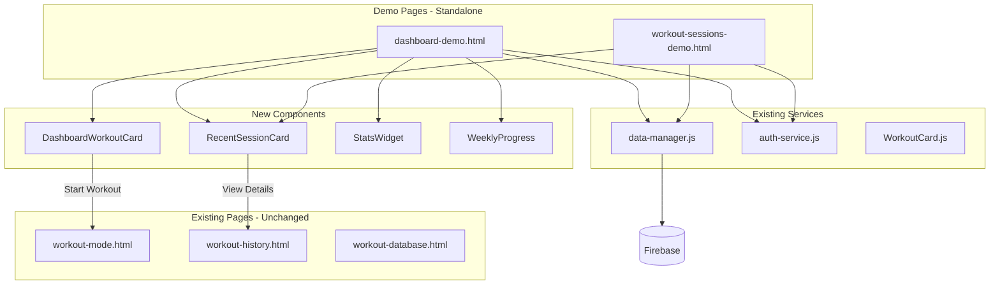

# User Dashboard Implementation Plan

## Overview

This plan outlines the creation of a mobile-first user dashboard for Ghost Gym, inspired by Amazon's home page layout patterns. The dashboard will feature horizontal scrolling workout cards, stats boxes, and a dedicated page for reviewing past workouts.

**Key Requirements:**
- Mobile-first design (primary focus)
- Horizontal scrolling workout cards
- Information boxes with key stats
- Bootstrap 5 + Sneat template patterns
- Demo page that connects to existing site without modifying current pages
- Two new pages: Dashboard Home + Past Workouts Review

---

## Architecture Diagram



---

## Page 1: Dashboard Home (dashboard-demo.html)

### Mobile Layout Design

```
┌─────────────────────────────────────┐
│         👋 Good Morning, John       │  ← Greeting with user name
├─────────────────────────────────────┤
│                                     │
│  ┌───────────────────────────────┐  │
│  │    🔥 Start Your Workout      │  │  ← Primary CTA
│  │    Choose a workout below     │  │
│  └───────────────────────────────┘  │
│                                     │
├─────────────────────────────────────┤
│  📊 This Week              View →   │  ← Section header
│  ┌─────────┬─────────┐              │
│  │  3/5    │  🔥 12  │              │  ← Weekly stats
│  │ Workouts│ Streak  │              │
│  └─────────┴─────────┘              │
│  ▓▓▓▓▓▓▓▓░░ 60% complete            │  ← Progress bar
│                                     │
├─────────────────────────────────────┤
│  💪 My Workouts            View →   │  ← Section header
│  ┌──────────┐ ┌──────────┐ ┌─────   │
│  │ Push Day │ │ Pull Day │ │ Leg   │  ← Horizontal scroll
│  │ A        │ │          │ │ Day   │
│  │ 6 exer.  │ │ 5 exer.  │ │       │
│  │ 45 min   │ │ 40 min   │ │       │
│  │          │ │          │ │       │
│  │ [Start]  │ │ [Start]  │ │       │
│  └──────────┘ └──────────┘ └─────   │
│              ← scroll →              │
│                                     │
├─────────────────────────────────────┤
│  🕒 Recent Activity        View →   │  ← Section header
│  ┌───────────────────────────────┐  │
│  │ 📅 Today • Push Day A         │  │
│  │ ⏱️ 52 min • ✅ 6/6 completed  │  │
│  └───────────────────────────────┘  │
│  ┌───────────────────────────────┐  │
│  │ 📅 Yesterday • Pull Day       │  │
│  │ ⏱️ 48 min • ✅ 5/5 completed  │  │
│  └───────────────────────────────┘  │
│                                     │
├─────────────────────────────────────┤
│  📈 Quick Stats                     │  ← Stats grid
│  ┌─────────┬─────────┐              │
│  │  48     │  45min  │              │
│  │  Total  │  Avg    │              │
│  │ Workouts│ Duration│              │
│  ├─────────┼─────────┤              │
│  │  156K   │  Best   │              │
│  │  Volume │ Streak  │              │
│  │  (lbs)  │  21 days│              │
│  └─────────┴─────────┘              │
│                                     │
└─────────────────────────────────────┘
```

### Section Details

#### 1. Greeting Header
- Shows time-based greeting: Good Morning/Afternoon/Evening
- Displays user's display name
- Simple, welcoming feel

#### 2. Primary CTA
- Large, prominent button to start a workout
- If user has an in-progress workout, shows "Continue Workout"
- Uses Sneat's `.bg-label-primary` card style

#### 3. Weekly Progress
- Shows workouts completed vs weekly goal (default 5)
- Streak counter with fire emoji
- Bootstrap progress bar for visual representation
- Compact 2-column layout

#### 4. My Workouts (Horizontal Scroll)
- Cards fixed width ~280px
- Horizontal scroll with touch momentum
- Each card shows:
  - Workout name
  - Exercise count
  - Estimated duration
  - Last completed date
  - Start button
- "View All" link at end of scroll

#### 5. Recent Activity
- Last 3 completed workout sessions
- Each card shows date, workout name, duration, completion status
- Tap to expand or navigate to full history
- Links to workout-history.html for details

#### 6. Quick Stats Grid
- 2x2 grid of key metrics
- Total workouts completed
- Average workout duration
- Total volume lifted
- Best streak achieved

---

## Page 2: Past Workouts Review (workout-sessions-demo.html)

### Mobile Layout Design

```
┌─────────────────────────────────────┐
│  ← Back    Past Workouts    Filter  │  ← Header
├─────────────────────────────────────┤
│  ┌───────────────────────────────┐  │
│  │ 📅 Date Range: Last 30 Days ▼│  │  ← Filter controls
│  └───────────────────────────────┘  │
│  ┌───────────────────────────────┐  │
│  │ 🏋️ Workout: All Workouts   ▼│  │
│  └───────────────────────────────┘  │
├─────────────────────────────────────┤
│  December 2024                      │  ← Month grouping
│  ┌───────────────────────────────┐  │
│  │ Push Day A         Dec 21     │  │
│  │ ⏱️ 52 min • 12,450 lbs       │  │
│  │ ✅ 6/6 exercises              │  │
│  │ ────────────────────────────  │  │
│  │ Bench Press: 185 lbs → 190 ↑ │  │
│  │ Incline DB: 65 lbs           │  │
│  │ [View Full Details →]         │  │
│  └───────────────────────────────┘  │
│                                     │
│  ┌───────────────────────────────┐  │
│  │ Pull Day            Dec 20    │  │
│  │ ⏱️ 48 min • 11,200 lbs       │  │
│  │ ✅ 5/5 exercises              │  │
│  └───────────────────────────────┘  │
│                                     │
│  ┌───────────────────────────────┐  │
│  │ Leg Day             Dec 19    │  │
│  │ ⏱️ 55 min • 18,500 lbs       │  │
│  │ ✅ 7/7 exercises              │  │
│  └───────────────────────────────┘  │
│                                     │
├─────────────────────────────────────┤
│  November 2024                      │  ← Month grouping
│  ...                                │
│                                     │
└─────────────────────────────────────┘
```

### Features
- **Date Range Filter**: Last 7 days, 30 days, 90 days, All time
- **Workout Filter**: Filter by specific workout template
- **Grouped by Month**: Visual separation of sessions
- **Session Cards**: Expandable to show exercise details
- **Quick Stats**: Volume, duration, completion rate
- **Navigation**: Links to detailed workout-history.html

---

## Component Specifications

### 1. DashboardWorkoutCard

Compact card for horizontal scroll carousel.

```javascript
class DashboardWorkoutCard {
  constructor(workout, options = {}) {
    this.workout = workout;
    this.options = {
      width: '280px',
      showLastCompleted: true,
      onStart: null, // callback
      ...options
    };
  }
  
  render() {
    // Returns card HTML element
  }
}
```

**Visual Design:**
```html
<div class="card dashboard-workout-card" style="min-width: 280px; flex-shrink: 0;">
  <div class="card-body">
    <div class="d-flex align-items-center mb-2">
      <div class="avatar avatar-sm me-2">
        <span class="avatar-initial rounded bg-label-primary">
          <i class="bx bx-dumbbell"></i>
        </span>
      </div>
      <h6 class="mb-0 text-truncate">Push Day A</h6>
    </div>
    <div class="mb-2">
      <span class="badge bg-label-info me-1">6 exercises</span>
      <span class="badge bg-label-secondary">~45 min</span>
    </div>
    <small class="text-muted d-block mb-3">Last: 3 days ago</small>
    <button class="btn btn-primary btn-sm w-100">
      <i class="bx bx-play me-1"></i>Start
    </button>
  </div>
</div>
```

### 2. RecentSessionCard

Card for displaying completed workout session.

```javascript
class RecentSessionCard {
  constructor(session, options = {}) {
    this.session = session;
    this.options = {
      showExercises: false, // expandable
      maxExercises: 3,
      onViewDetails: null,
      ...options
    };
  }
  
  render() {
    // Returns card HTML element
  }
}
```

### 3. StatsWidget

Configurable stats display widget.

```javascript
class StatsWidget {
  constructor(stats, layout = '2x2') {
    this.stats = stats;
    this.layout = layout; // '2x2', '4x1', '1x4'
  }
  
  render() {
    // Returns grid HTML
  }
}
```

### 4. WeeklyProgress

Visual progress indicator for weekly goals.

```javascript
class WeeklyProgress {
  constructor(data) {
    this.completed = data.completed;
    this.goal = data.goal;
    this.streak = data.streak;
  }
  
  render() {
    // Returns progress section HTML
  }
}
```

---

## File Structure

```
frontend/
├── dashboard-demo.html           # Main demo dashboard page
├── workout-sessions-demo.html    # Past workouts review page
├── assets/
│   ├── css/
│   │   └── dashboard-demo.css    # Dashboard-specific styles
│   └── js/
│       └── dashboard/
│           ├── dashboard-demo.js        # Main dashboard logic
│           ├── dashboard-workout-card.js # Compact workout card
│           ├── recent-session-card.js    # Session card component
│           ├── stats-widget.js           # Stats grid component
│           └── weekly-progress.js        # Progress component
```

---

## CSS Patterns

### Horizontal Scroll Container
```css
.horizontal-scroll-container {
  display: flex;
  flex-wrap: nowrap;
  overflow-x: auto;
  gap: 1rem;
  padding-bottom: 0.5rem;
  -webkit-overflow-scrolling: touch;
  scrollbar-width: none; /* Firefox */
  scroll-snap-type: x mandatory;
}

.horizontal-scroll-container::-webkit-scrollbar {
  display: none; /* Chrome, Safari */
}

.horizontal-scroll-container > .card {
  scroll-snap-align: start;
  flex-shrink: 0;
}
```

### Compact Dashboard Card
```css
.dashboard-workout-card {
  min-width: 280px;
  max-width: 280px;
  transition: transform 0.2s, box-shadow 0.2s;
}

.dashboard-workout-card:active {
  transform: scale(0.98);
}
```

### Stats Grid
```css
.stats-grid {
  display: grid;
  grid-template-columns: repeat(2, 1fr);
  gap: 0.75rem;
}

.stats-grid .stat-card {
  text-align: center;
  padding: 1rem;
  border-radius: 0.5rem;
  background: var(--bs-card-bg);
  border: 1px solid var(--bs-border-color);
}

.stats-grid .stat-value {
  font-size: 1.5rem;
  font-weight: 600;
  color: var(--bs-primary);
}

.stats-grid .stat-label {
  font-size: 0.75rem;
  color: var(--bs-secondary);
  text-transform: uppercase;
}
```

---

## Data Integration

### Dashboard Data Service
```javascript
class DashboardDataService {
  constructor() {
    this.dataManager = window.dataManager;
  }

  async getWeeklyStats() {
    // Fetch and calculate weekly progress
    const sessions = await this.getRecentSessions(7);
    return {
      completed: sessions.length,
      goal: 5, // default or user preference
      streak: await this.calculateStreak()
    };
  }

  async getRecentSessions(days = 7) {
    // Fetch recent workout sessions
  }

  async calculateStreak() {
    // Calculate consecutive days with workouts
  }

  async getQuickStats() {
    // Aggregate statistics
    return {
      totalWorkouts: 0,
      avgDuration: 0,
      totalVolume: 0,
      bestStreak: 0
    };
  }
}
```

### Mock Data for Demo
```javascript
const MOCK_WORKOUTS = [
  {
    id: 'mock-1',
    name: 'Push Day A',
    exercise_count: 6,
    estimated_duration: 45,
    last_completed: '2024-12-18T10:30:00Z',
    tags: ['push', 'chest']
  },
  // ... more mock workouts
];

const MOCK_SESSIONS = [
  {
    id: 'session-1',
    workout_name: 'Push Day A',
    completed_at: '2024-12-21T10:30:00Z',
    duration_minutes: 52,
    exercises_performed: [/* ... */],
    total_volume: 12450
  },
  // ... more mock sessions
];
```

---

## Integration Points

| Component | Connects To | Purpose |
|-----------|-------------|---------|
| Start Workout Button | workout-mode.html?id=xxx | Start selected workout |
| View Details Link | workout-history.html?id=xxx | View session details |
| View All Workouts | workout-database.html | Full workout list |
| User Data | data-manager.js | Firebase workouts/sessions |
| Authentication | auth-service.js | User context |

---

## Implementation Phases

### Phase 1: Static Demo
1. Create HTML structure with mock data
2. Implement CSS for mobile layout
3. Test horizontal scroll behavior
4. Verify responsiveness

### Phase 2: Component JavaScript
1. Create DashboardWorkoutCard class
2. Create RecentSessionCard class
3. Create StatsWidget class
4. Create WeeklyProgress class

### Phase 3: Data Integration
1. Create DashboardDataService
2. Connect to data-manager.js
3. Implement real data fetching
4. Add loading states

### Phase 4: Past Workouts Page
1. Create workout-sessions-demo.html
2. Implement filters
3. Add session list with grouping
4. Connect to session API

### Phase 5: Polish & Testing
1. Add empty states
2. Add error handling
3. Test on various mobile devices
4. Optimize performance

---

## Success Criteria

- [ ] Dashboard loads quickly on mobile
- [ ] Horizontal scroll is smooth and touch-friendly
- [ ] Cards are appropriately sized for thumb interaction
- [ ] Stats update correctly with real data
- [ ] Navigation to workout-mode works correctly
- [ ] Past workouts page shows filtered history
- [ ] Dark mode support maintained
- [ ] No changes to existing pages required
