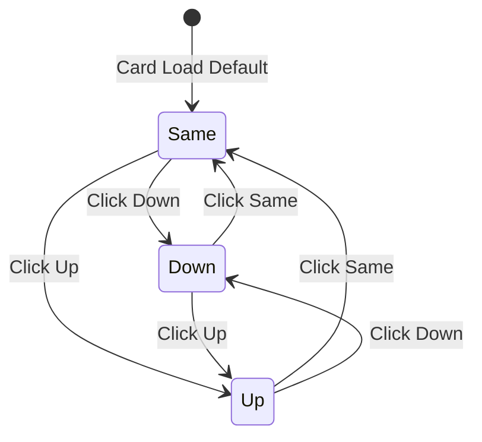

# Weight Direction Buttons Redesign Plan

## Overview
Redesign the weight progression indicator buttons in the workout mode exercise card to be cleaner, with better spacing, and include a "keep same" default option.

## Current State

### Current Implementation (Lines 141-158 in exercise-card-renderer.js)
```html
<div class="btn-group btn-group-sm weight-direction-group">
    <button class="btn weight-direction-btn" data-direction="down">
        <i class="bx bx-chevron-down"></i>
    </button>
    <button class="btn weight-direction-btn" data-direction="up">
        <i class="bx bx-chevron-up"></i>
    </button>
</div>
```

### Current Behavior
- Two buttons: Down (decrease) and Up (increase)
- No default selection
- Toggle behavior: clicking same button twice clears selection
- Valid directions: `['up', 'down', null]`

---

## Target Design

### Visual Layout
```
┌─────────────────────────────────────────────────────────────────┐
│  Weight Section                                                  │
│  ┌──────────┐                                                   │
│  │  135 lbs │           Next session:  [↓] [=] [↑]             │
│  └──────────┘                                                   │
└─────────────────────────────────────────────────────────────────┘
```

### HTML Structure (Proposed)
```html
<div class="weight-direction-container">
    <span class="weight-direction-label">Next session:</span>
    <div class="btn-group btn-group-sm weight-direction-group" role="group">
        <button class="btn weight-direction-btn" data-direction="down" title="Decrease weight">
            <i class="bx bx-chevron-down"></i>
        </button>
        <button class="btn weight-direction-btn active" data-direction="same" title="Keep same weight">
            <i class="bx bx-minus"></i>
        </button>
        <button class="btn weight-direction-btn" data-direction="up" title="Increase weight">
            <i class="bx bx-chevron-up"></i>
        </button>
    </div>
</div>
```

### Key Features
1. **Label on left**: "Next session:" text explains the button purpose
2. **Three buttons**: Down → Same → Up
3. **Default selection**: "Same" button is pre-selected
4. **Icon-only**: Clean, minimal icon buttons
5. **Improved spacing**: Gap between buttons for better touch targets

---

## Files to Modify

### 1. workout-session-service.js
**Location**: `frontend/assets/js/services/workout-session-service.js`
**Changes**:
- Line 647: Add 'same' to valid directions array
- Update `setWeightDirection()` to accept 'same'
- Default to 'same' when no direction is set

```javascript
// Before (line 647)
const validDirections = ['up', 'down', null];

// After
const validDirections = ['up', 'down', 'same', null];
```

### 2. exercise-card-renderer.js
**Location**: `frontend/assets/js/components/exercise-card-renderer.js`
**Changes**:
- Lines 141-158: Replace current 2-button layout with new 3-button layout
- Add "Next session:" label
- Set 'same' as default when `currentDirection` is null

```javascript
// New implementation
${isSessionActive ? `
    <div class="weight-direction-container">
        <span class="weight-direction-label">Next session:</span>
        <div class="btn-group btn-group-sm weight-direction-group" role="group" aria-label="Weight progression for next session">
            <button class="btn weight-direction-btn ${currentDirection === 'down' ? 'active btn-direction-down' : 'btn-outline-secondary'}"
                    data-exercise-name="${this._escapeHtml(mainExercise)}"
                    data-direction="down"
                    onclick="window.workoutModeController.handleWeightDirection(this); event.stopPropagation();"
                    title="Decrease weight next time"
                    aria-label="Decrease weight next session">
                <i class="bx bx-chevron-down"></i>
            </button>
            <button class="btn weight-direction-btn ${(!currentDirection || currentDirection === 'same') ? 'active btn-direction-same' : 'btn-outline-secondary'}"
                    data-exercise-name="${this._escapeHtml(mainExercise)}"
                    data-direction="same"
                    onclick="window.workoutModeController.handleWeightDirection(this); event.stopPropagation();"
                    title="Keep same weight next time"
                    aria-label="Keep same weight next session">
                <i class="bx bx-minus"></i>
            </button>
            <button class="btn weight-direction-btn ${currentDirection === 'up' ? 'active btn-direction-up' : 'btn-outline-secondary'}"
                    data-exercise-name="${this._escapeHtml(mainExercise)}"
                    data-direction="up"
                    onclick="window.workoutModeController.handleWeightDirection(this); event.stopPropagation();"
                    title="Increase weight next time"
                    aria-label="Increase weight next session">
                <i class="bx bx-chevron-up"></i>
            </button>
        </div>
    </div>
` : ''}
```

### 3. workout-mode.css
**Location**: `frontend/assets/css/workout-mode.css`
**Changes**:
- Add new `.weight-direction-container` styles
- Add `.weight-direction-label` styles
- Update `.weight-direction-btn` for 3-button layout
- Add `.btn-direction-same` active state styling
- Improve button spacing with gap

```css
/* Weight Direction Container - New Layout */
.weight-direction-container {
    display: flex;
    align-items: center;
    gap: 0.75rem;
}

.weight-direction-label {
    font-size: 0.8125rem;
    color: var(--bs-secondary);
    white-space: nowrap;
}

/* Weight Direction Button Group - Improved Spacing */
.weight-direction-group {
    display: flex;
    gap: 0.375rem;  /* Add spacing between buttons */
}

.weight-direction-group .btn {
    border-radius: 6px !important;  /* Individual rounded corners */
}

/* Same direction active state */
.weight-direction-btn.active.btn-direction-same {
    background: linear-gradient(135deg, rgba(var(--bs-secondary-rgb), 0.15), rgba(var(--bs-secondary-rgb), 0.2));
    border-color: var(--bs-secondary);
    color: var(--bs-secondary);
    font-weight: 600;
    box-shadow: 0 2px 6px rgba(var(--bs-secondary-rgb), 0.25);
}
```

### 4. workout-mode-controller.js
**Location**: `frontend/assets/js/controllers/workout-mode-controller.js`
**Changes**:
- Update `handleWeightDirection()` to handle 'same' direction
- Remove toggle-to-clear behavior (always select one option)

```javascript
handleWeightDirection(button) {
    const exerciseName = button.getAttribute('data-exercise-name');
    const direction = button.getAttribute('data-direction');
    
    // Simply set the new direction (no toggle-to-clear)
    this.sessionService.setWeightDirection(exerciseName, direction);
    
    // Update all direction buttons for this exercise
    this.updateDirectionButtons(exerciseName, direction);
}
```

---

## CSS Styling Details

### Button States
| State | Background | Border | Color | Shadow |
|-------|------------|--------|-------|--------|
| Default (unselected) | transparent | --bs-border-color | --bs-body-color | none |
| Hover | rgba(primary, 0.08) | --bs-primary | --bs-primary | none |
| Down (active) | gradient warning | --bs-warning | --bs-warning | warning shadow |
| Same (active) | gradient secondary | --bs-secondary | --bs-secondary | secondary shadow |
| Up (active) | gradient success | --bs-success | --bs-success | success shadow |

### Responsive Behavior
- **Desktop**: Full layout with label and buttons
- **Mobile (< 768px)**: Slightly smaller buttons, same layout
- **Extra small (< 576px)**: Compact buttons, label font-size reduced

### Dark Theme
- Increased background opacity for active states
- Brighter border colors for visibility
- Enhanced box shadows

---

## Implementation Order

1. **Update workout-session-service.js** - Add 'same' to valid directions
2. **Update workout-mode.css** - Add new styles for container, label, and buttons
3. **Update exercise-card-renderer.js** - New HTML structure with 3 buttons
4. **Update workout-mode-controller.js** - Handle 'same' direction in click handler
5. **Test** - Verify all three states work correctly

---

## Mermaid Diagram: Button State Flow



---

## Acceptance Criteria

- [ ] Three buttons displayed: Down, Same, Up
- [ ] "Next session:" label appears to the left of buttons
- [ ] "Same" button is selected by default when card loads
- [ ] Only one button can be active at a time
- [ ] Buttons have visible spacing between them
- [ ] Active states have distinct colors (warning for down, secondary for same, success for up)
- [ ] Works correctly on mobile devices
- [ ] Dark theme styling is correct
- [ ] Accessibility: proper aria-labels and keyboard navigation
