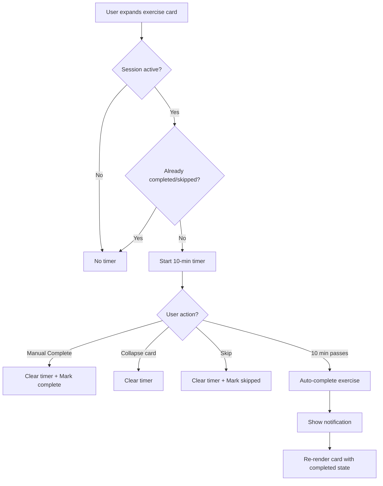

# Workout Card Live Edit & Complete Button Implementation Plan

## Overview

This plan addresses two requirements:
1. **Bug Fix**: Card doesn't show updated values after editing (needs live update)
2. **New Feature**: Add Complete button with auto-complete after 10 minutes

## Problem Analysis

### Issue 1: Card Not Updating After Edit

**Root Cause**: In `exercise-card-renderer.js`, the `renderCard()` method reads `sets`, `reps`, `rest` from the template `group` object (lines 29-32), but doesn't check session data first:

```javascript
// Current code (wrong)
const sets = group.sets || '3';
const reps = group.reps || '8-12';
const rest = group.rest || '60s';
```

The session stores edited values as:
- `target_sets` - not `sets`
- `target_reps` - not `reps`  
- `rest` - same name

**Solution**: Check session data first using `getExerciseWeight()`, then fall back to template data.

### Issue 2: Need Complete Button

**Requirements**:
- Add a "Complete" button alongside Skip and Edit
- Track when exercise was completed (`completed_at` timestamp)
- Auto-complete exercises after 10 minutes of in-workout time
- Show completion status visually on the card
- Store in session history for progress tracking

## Implementation Details

### 1. Fix Card Not Updating (exercise-card-renderer.js)

**File**: [`frontend/assets/js/components/exercise-card-renderer.js`](frontend/assets/js/components/exercise-card-renderer.js)

**Change Location**: Lines 25-35 in `renderCard()` method

**Before**:
```javascript
renderCard(group, index, isBonus = false, totalCards = 0) {
    const exercises = group.exercises || {};
    const mainExercise = exercises.a || 'Unknown Exercise';
    const alternates = this._getAlternates(exercises);
    
    const sets = group.sets || '3';
    const reps = group.reps || '8-12';
    const rest = group.rest || '60s';
    const notes = group.notes || '';
    // ...
}
```

**After**:
```javascript
renderCard(group, index, isBonus = false, totalCards = 0) {
    const exercises = group.exercises || {};
    const mainExercise = exercises.a || 'Unknown Exercise';
    const alternates = this._getAlternates(exercises);
    
    // ✨ FIX: Check session data first, then fall back to template
    const exerciseData = this.sessionService.getExerciseWeight(mainExercise);
    const sets = exerciseData?.target_sets || group.sets || '3';
    const reps = exerciseData?.target_reps || group.reps || '8-12';
    const rest = exerciseData?.rest || group.rest || '60s';
    const notes = exerciseData?.notes || group.notes || '';
    // ...
}
```

### 2. Add Complete Button (exercise-card-renderer.js)

**File**: [`frontend/assets/js/components/exercise-card-renderer.js`](frontend/assets/js/components/exercise-card-renderer.js)

**Change Location**: `_renderCardActionButtons()` method (lines 307-339)

**Update Method Signature**:
```javascript
_renderCardActionButtons(exerciseName, index, isSkipped, isCompleted, isSessionActive) {
```

**Updated HTML**:
```javascript
_renderCardActionButtons(exerciseName, index, isSkipped, isCompleted, isSessionActive) {
    if (!isSessionActive) {
        return '';
    }
    
    return `
        <div class="card-action-buttons mt-3 pt-3 border-top d-flex gap-2">
            ${isSkipped ? `
                <button class="btn btn-sm btn-warning flex-fill"
                        onclick="window.workoutModeController.handleUnskipExercise('${this._escapeHtml(exerciseName)}', ${index}); event.stopPropagation();"
                        title="Resume this exercise">
                    <i class="bx bx-undo me-1"></i>Unskip
                </button>
            ` : `
                ${isCompleted ? `
                    <button class="btn btn-sm btn-success flex-fill"
                            onclick="window.workoutModeController.handleUncompleteExercise('${this._escapeHtml(exerciseName)}', ${index}); event.stopPropagation();"
                            title="Mark as not completed">
                        <i class="bx bx-check-circle me-1"></i>Completed
                    </button>
                ` : `
                    <button class="btn btn-sm btn-outline-success flex-fill"
                            onclick="window.workoutModeController.handleCompleteExercise('${this._escapeHtml(exerciseName)}', ${index}); event.stopPropagation();"
                            title="Mark exercise as complete">
                        <i class="bx bx-check me-1"></i>Complete
                    </button>
                `}
                <button class="btn btn-sm btn-outline-warning flex-fill"
                        onclick="window.workoutModeController.handleSkipExercise('${this._escapeHtml(exerciseName)}', ${index}); event.stopPropagation();"
                        title="Skip this exercise">
                    <i class="bx bx-skip-next me-1"></i>Skip
                </button>
            `}
            <button class="btn btn-sm btn-outline-primary flex-fill"
                    onclick="window.workoutModeController.handleEditExercise('${this._escapeHtml(exerciseName)}', ${index}); event.stopPropagation();"
                    title="Edit exercise details">
                <i class="bx bx-edit me-1"></i>Edit
            </button>
        </div>
    `;
}
```

**Update renderCard() Call**:
```javascript
// In renderCard(), update the call to include isCompleted
const isCompleted = weightData?.is_completed || false;

// ...in the HTML template:
${this._renderCardActionButtons(mainExercise, index, isSkipped, isCompleted, isSessionActive)}
```

### 3. Add Visual Completion Indicator (exercise-card-renderer.js)

**Add Completion Indicator in Card Header**:
```javascript
// In renderCard() HTML template, update the title section:
<h6 class="mb-0 morph-title" data-morph-id="title-${index}">
    ${isCompleted ? '<i class="bx bx-check-circle text-success me-1"></i>' : ''}
    ${isSkipped ? '<i class="bx bx-x-circle text-warning me-1"></i>' : ''}
    ${this._escapeHtml(mainExercise)}
</h6>
```

**Add Completed Class to Card**:
```javascript
// In the card div:
<div class="card exercise-card ${bonusClass} ${isSkipped ? 'skipped' : ''} ${isCompleted ? 'completed' : ''}" ...>
```

### 4. Add completeExercise Method (workout-session-service.js)

**File**: [`frontend/assets/js/services/workout-session-service.js`](frontend/assets/js/services/workout-session-service.js)

**Add After Line 442** (after `unskipExercise()`):

```javascript
/**
 * Mark exercise as completed
 * @param {string} exerciseName - Exercise name
 */
completeExercise(exerciseName) {
    if (!this.currentSession?.exercises) {
        console.warn('⚠️ No active session to complete exercise');
        return;
    }
    
    const existingData = this.currentSession.exercises[exerciseName] || {};
    
    this.currentSession.exercises[exerciseName] = {
        ...existingData,
        is_completed: true,
        completed_at: new Date().toISOString()
    };
    
    console.log('✅ Exercise completed:', exerciseName);
    this.notifyListeners('exerciseCompleted', { exerciseName });
    this.persistSession();
}

/**
 * Uncomplete exercise (if user changes mind)
 * @param {string} exerciseName - Exercise name
 */
uncompleteExercise(exerciseName) {
    if (!this.currentSession?.exercises?.[exerciseName]) {
        console.warn('⚠️ Exercise not found in session:', exerciseName);
        return;
    }
    
    this.currentSession.exercises[exerciseName].is_completed = false;
    delete this.currentSession.exercises[exerciseName].completed_at;
    
    console.log('↩️ Exercise uncompleted:', exerciseName);
    this.notifyListeners('exerciseUncompleted', { exerciseName });
    this.persistSession();
}
```

### 5. Add Auto-Complete Timer (workout-session-service.js)

**File**: [`frontend/assets/js/services/workout-session-service.js`](frontend/assets/js/services/workout-session-service.js)

**Add Property in Constructor**:
```javascript
constructor() {
    // ...existing code...
    this.exerciseStartTimes = {};  // Track when each exercise was expanded
    this.autoCompleteTimers = {};  // Store auto-complete timers
}
```

**Add Methods**:
```javascript
/**
 * Start auto-complete timer for an exercise
 * Called when exercise card is expanded
 * @param {string} exerciseName - Exercise name
 * @param {number} timeoutMinutes - Minutes until auto-complete (default 10)
 */
startAutoCompleteTimer(exerciseName, timeoutMinutes = 10) {
    if (!this.isSessionActive()) return;
    
    // Don't start timer if already completed or skipped
    const exerciseData = this.currentSession?.exercises?.[exerciseName];
    if (exerciseData?.is_completed || exerciseData?.is_skipped) {
        console.log('⏭️ Skipping auto-complete timer - exercise already completed/skipped');
        return;
    }
    
    // Clear existing timer for this exercise
    this.clearAutoCompleteTimer(exerciseName);
    
    // Track start time
    this.exerciseStartTimes[exerciseName] = Date.now();
    
    // Set timer for auto-complete
    const timeoutMs = timeoutMinutes * 60 * 1000;
    this.autoCompleteTimers[exerciseName] = setTimeout(() => {
        console.log(`⏰ Auto-completing ${exerciseName} after ${timeoutMinutes} minutes`);
        this.completeExercise(exerciseName);
        this.notifyListeners('exerciseAutoCompleted', { exerciseName, timeoutMinutes });
    }, timeoutMs);
    
    console.log(`⏱️ Auto-complete timer started for ${exerciseName}: ${timeoutMinutes} minutes`);
}

/**
 * Clear auto-complete timer for an exercise
 * Called when card is collapsed or manually completed
 * @param {string} exerciseName - Exercise name
 */
clearAutoCompleteTimer(exerciseName) {
    if (this.autoCompleteTimers[exerciseName]) {
        clearTimeout(this.autoCompleteTimers[exerciseName]);
        delete this.autoCompleteTimers[exerciseName];
        delete this.exerciseStartTimes[exerciseName];
        console.log(`⏱️ Auto-complete timer cleared for ${exerciseName}`);
    }
}

/**
 * Clear all auto-complete timers
 * Called when session ends
 */
clearAllAutoCompleteTimers() {
    Object.keys(this.autoCompleteTimers).forEach(exerciseName => {
        this.clearAutoCompleteTimer(exerciseName);
    });
    console.log('🧹 All auto-complete timers cleared');
}

/**
 * Get remaining time for auto-complete
 * @param {string} exerciseName - Exercise name
 * @returns {number|null} Seconds remaining or null if no timer
 */
getAutoCompleteRemainingTime(exerciseName) {
    if (!this.exerciseStartTimes[exerciseName]) return null;
    
    const elapsed = (Date.now() - this.exerciseStartTimes[exerciseName]) / 1000;
    const remaining = (10 * 60) - elapsed; // 10 minutes default
    return Math.max(0, Math.floor(remaining));
}
```

### 6. Add Handler Methods (workout-mode-controller.js)

**File**: [`frontend/assets/js/controllers/workout-mode-controller.js`](frontend/assets/js/controllers/workout-mode-controller.js)

**Add After handleEditExercise() (around line 1659)**:

```javascript
/**
 * Handle completing an exercise
 * @param {string} exerciseName - Exercise name
 * @param {number} index - Exercise index
 */
handleCompleteExercise(exerciseName, index) {
    if (!this.sessionService.isSessionActive()) {
        console.warn('⚠️ Cannot complete exercise - no active session');
        return;
    }
    
    // Clear auto-complete timer since user manually completed
    this.sessionService.clearAutoCompleteTimer(exerciseName);
    
    // Mark as completed
    this.sessionService.completeExercise(exerciseName);
    
    // Re-render to show completed state
    this.renderWorkout();
    
    // Show success message
    if (window.showAlert) {
        window.showAlert(`${exerciseName} completed! 💪`, 'success');
    }
    
    // Auto-save session
    this.autoSave(null).catch(error => {
        console.error('❌ Failed to auto-save after completion:', error);
    });
    
    // Auto-advance to next exercise after short delay
    setTimeout(() => {
        this.goToNextExercise(index);
    }, 500);
}

/**
 * Handle uncompleting an exercise
 * @param {string} exerciseName - Exercise name
 * @param {number} index - Exercise index
 */
handleUncompleteExercise(exerciseName, index) {
    if (!this.sessionService.isSessionActive()) {
        console.warn('⚠️ Cannot uncomplete exercise - no active session');
        return;
    }
    
    const modalManager = this.getModalManager();
    modalManager.confirm(
        'Uncomplete Exercise',
        `Mark <strong>${this.escapeHtml(exerciseName)}</strong> as not completed?`,
        async () => {
            // Mark as not completed
            this.sessionService.uncompleteExercise(exerciseName);
            
            // Re-render to remove completed state
            this.renderWorkout();
            
            // Show message
            if (window.showAlert) {
                window.showAlert(`${exerciseName} marked as not completed`, 'info');
            }
            
            // Auto-save session
            try {
                await this.autoSave(null);
            } catch (error) {
                console.error('❌ Failed to auto-save after uncomplete:', error);
            }
        }
    );
}
```

**Update toggleExerciseCard() to Start Auto-Complete Timer**:
```javascript
toggleExerciseCard(index) {
    const card = document.querySelector(`.exercise-card[data-exercise-index="${index}"]`);
    if (!card) return;
    
    const isExpanded = card.classList.contains('expanded');
    const exerciseName = card.getAttribute('data-exercise-name');
    
    if (isExpanded) {
        this.collapseCard(card);
        // Clear auto-complete timer when collapsing
        if (exerciseName && this.sessionService.isSessionActive()) {
            this.sessionService.clearAutoCompleteTimer(exerciseName);
        }
    } else {
        // Collapse all other cards
        document.querySelectorAll('.exercise-card.expanded').forEach(otherCard => {
            const otherName = otherCard.getAttribute('data-exercise-name');
            this.collapseCard(otherCard);
            // Clear timer for collapsed cards
            if (otherName && this.sessionService.isSessionActive()) {
                this.sessionService.clearAutoCompleteTimer(otherName);
            }
        });
        this.expandCard(card);
        
        // Start auto-complete timer when expanding (only during active session)
        if (exerciseName && this.sessionService.isSessionActive()) {
            this.sessionService.startAutoCompleteTimer(exerciseName, 10); // 10 minutes
        }
        
        // Sync global timer with newly expanded card
        this.syncGlobalTimerWithExpandedCard();
    }
}
```

**Update Session Clear to Clean Up Timers**:
In `clearSession()` of session service:
```javascript
clearSession() {
    // Clear all auto-complete timers first
    this.clearAllAutoCompleteTimers();
    
    this.currentSession = null;
    this.exerciseHistory = {};
    // ...rest of existing code
}
```

### 7. Add CSS for Complete Button (workout-mode.css)

**File**: [`frontend/assets/css/workout-mode.css`](frontend/assets/css/workout-mode.css)

**Add to Card Action Buttons Section**:
```css
/* Completed Exercise Card State */
.exercise-card.completed {
    border-color: var(--bs-success) !important;
    box-shadow: 0 0 0 2px rgba(40, 167, 69, 0.15);
}

.exercise-card.completed .exercise-card-header {
    background-color: rgba(40, 167, 69, 0.08);
}

/* Completed badge in header */
.exercise-card.completed .morph-title .bx-check-circle {
    color: var(--bs-success);
}

/* Complete button states */
.card-action-buttons .btn-success {
    background-color: var(--bs-success);
    border-color: var(--bs-success);
}

.card-action-buttons .btn-outline-success:hover {
    background-color: var(--bs-success);
    color: #fff;
}
```

## Session Data Structure Update

After implementing, the exercise data in session will include:

```javascript
currentSession.exercises[exerciseName] = {
    // Existing fields
    weight: "135",
    weight_unit: "lbs",
    target_sets: "4",
    target_reps: "10",
    rest: "90s",
    previous_weight: 125,
    weight_change: 10,
    order_index: 2,
    is_bonus: false,
    is_modified: true,
    modified_at: "2025-12-23T...",
    is_skipped: false,
    skip_reason: null,
    notes: "",
    
    // NEW: Completion tracking
    is_completed: true,
    completed_at: "2025-12-23T03:15:00.000Z"  // When user completed
};
```

## Auto-Complete Flow



## Button Layout (3 buttons)

```
+-----------------------------------+
|  Card Body Content                |
|                                   |
+-----------------------------------+
| [✓ Complete] [⏭ Skip] [✏ Edit]   |
+-----------------------------------+
```

When completed:
```
+-----------------------------------+
|  Card Body Content                |
|                                   |
+-----------------------------------+
| [✓ Completed] [⏭ Skip] [✏ Edit]  |  <- Green filled button
+-----------------------------------+
```

When skipped:
```
+-----------------------------------+
|  Card Body Content                |
|  ⚠ Exercise Skipped              |
+-----------------------------------+
| [↶ Unskip] [✏ Edit]              |  <- No Complete/Skip
+-----------------------------------+
```

## Files to Modify

1. **[`frontend/assets/js/components/exercise-card-renderer.js`](frontend/assets/js/components/exercise-card-renderer.js)**
   - Fix: Read sets/reps/rest from session first
   - Add: Pass `isCompleted` to `_renderCardActionButtons()`
   - Add: Complete button in `_renderCardActionButtons()`
   - Add: Visual completion indicator in card header

2. **[`frontend/assets/js/services/workout-session-service.js`](frontend/assets/js/services/workout-session-service.js)**
   - Add: `completeExercise()` method
   - Add: `uncompleteExercise()` method
   - Add: `startAutoCompleteTimer()` method
   - Add: `clearAutoCompleteTimer()` method
   - Add: `clearAllAutoCompleteTimers()` method
   - Update: `clearSession()` to clear timers

3. **[`frontend/assets/js/controllers/workout-mode-controller.js`](frontend/assets/js/controllers/workout-mode-controller.js)**
   - Add: `handleCompleteExercise()` method
   - Add: `handleUncompleteExercise()` method
   - Update: `toggleExerciseCard()` to manage timers

4. **[`frontend/assets/css/workout-mode.css`](frontend/assets/css/workout-mode.css)**
   - Add: Completed card styling
   - Add: Complete button styling

## Testing Checklist

- [ ] Edit button saves and displays updated values immediately
- [ ] Sets/reps/rest show session values, not just template
- [ ] Complete button marks exercise as completed
- [ ] Completed state shows visual indicator (checkmark, green border)
- [ ] Auto-complete triggers after 10 minutes
- [ ] Collapsing card clears auto-complete timer
- [ ] Manual complete clears auto-complete timer
- [ ] Skipped exercises don't show Complete button
- [ ] Uncomplete button allows reverting completion
- [ ] All changes persist in session history

## Implementation Order

1. Fix card renderer to read session data first (bug fix)
2. Add `completeExercise()` and `uncompleteExercise()` methods
3. Add Complete button to card action buttons
4. Add visual completion indicator
5. Add handler methods in controller
6. Add auto-complete timer logic
7. Update `toggleExerciseCard()` for timer management
8. Add CSS styling
9. Test end-to-end
