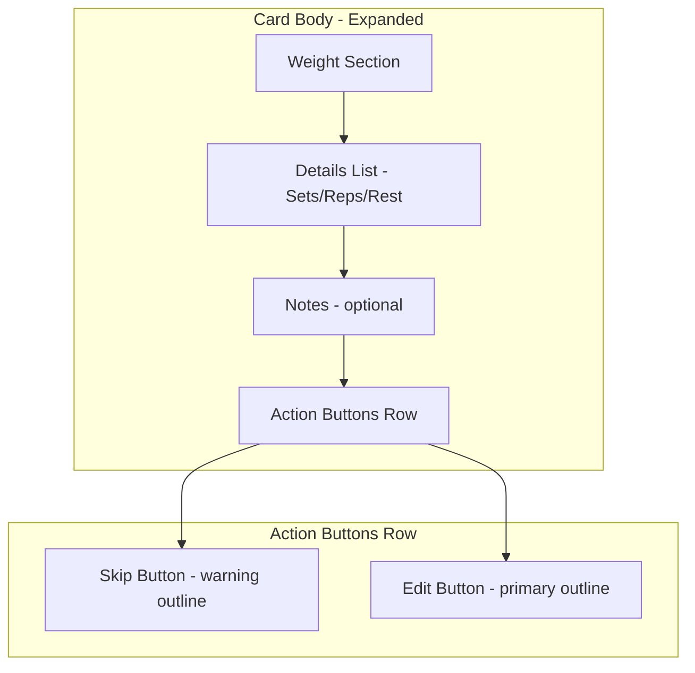
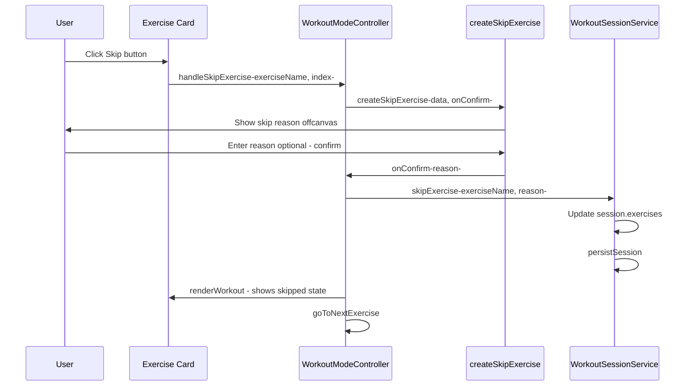
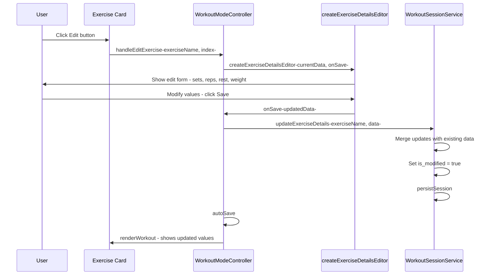

# Workout Card Skip & Edit Buttons Implementation Plan

## Overview

Add **Skip** and **Edit** buttons to the exercise card body in workout mode. These buttons should:
1. Be placed at the bottom of the expanded card
2. Reuse existing offcanvas components and patterns
3. Follow Bootstrap and Sneat template best practices
4. Save all changes to the workout session for history/progress tracking

## Current Architecture Analysis

### Exercise Card Structure ([`exercise-card-renderer.js`](../frontend/assets/js/components/exercise-card-renderer.js:24))

```
exercise-card
├── card-header (collapsed view - clickable to expand)
│   ├── exercise-card-summary (name, meta, alternates)
│   └── exercise-card-weight-container (weight badge, chevron)
│
└── card-body (expanded view - shown when card is expanded)
    ├── exercise-weight-section (weight display + edit button)
    ├── exercise-details-list (sets/reps, rest, plates)
    └── exercise-notes (optional notes display)
    └── [NEW: card-action-buttons - Skip + Edit buttons]
```

### Existing Infrastructure to Reuse

| Component | Location | Purpose | Reuse For |
|-----------|----------|---------|-----------|
| `createSkipExercise()` | [`offcanvas-forms.js:100`](../frontend/assets/js/components/offcanvas/offcanvas-forms.js:100) | Skip exercise with optional reason | Skip button |
| `handleSkipExercise()` | [`workout-mode-controller.js:1529`](../frontend/assets/js/controllers/workout-mode-controller.js:1529) | Orchestrates skip flow | Skip button handler |
| `createWeightEdit()` | [`offcanvas-workout.js:22`](../frontend/assets/js/components/offcanvas/offcanvas-workout.js:22) | Edit weight only | Pattern for edit |
| `updateExerciseWeight()` | [`workout-session-service.js:316`](../frontend/assets/js/services/workout-session-service.js:316) | Save weight to session | Pattern for edit save |
| `skipExercise()` | [`workout-session-service.js:357`](../frontend/assets/js/services/workout-session-service.js:357) | Mark exercise as skipped | Already used |

### Session Data Structure ([`workout-session-service.js:109`](../frontend/assets/js/services/workout-session-service.js:109))

```javascript
currentSession.exercises[exerciseName] = {
    weight: string | null,
    weight_unit: 'lbs' | 'kg' | 'other',
    target_sets: string,
    target_reps: string,
    rest: string,
    previous_weight: number | null,
    weight_change: number,
    order_index: number,
    is_bonus: boolean,
    is_modified: boolean,   // Track if user modified
    is_skipped: boolean,
    skip_reason: string | null,
    notes: string
};
```

## Implementation Design

### 1. Exercise Card Layout Update

Add action buttons section at the bottom of the card body:



### 2. Skip Button Flow

Uses existing infrastructure - minimal new code:



### 3. Edit Button Flow

New offcanvas for editing exercise details:



### 4. New Offcanvas: Exercise Details Editor

Create a new offcanvas that edits sets, reps, rest, and weight in one form:

```
┌─────────────────────────────────────────────┐
│ ✏️ Edit Exercise                      [X]   │
├─────────────────────────────────────────────┤
│                                             │
│  Exercise Name Here                         │
│                                             │
│  ┌─────────────────────────────────────┐   │
│  │ Sets    │ Reps    │ Rest            │   │
│  │ [3   ]  │ [8-12]  │ [60s  ]         │   │
│  └─────────────────────────────────────┘   │
│                                             │
│  🏋️ Weight                                  │
│  ┌─────────────────────────────────────┐   │
│  │ [135                    ] [lbs ▼]   │   │
│  └─────────────────────────────────────┘   │
│  ℹ️ Changes save to your workout history    │
│                                             │
│  [Cancel]           [💾 Save Changes]       │
│                                             │
└─────────────────────────────────────────────┘
```

## File Changes Required

### 1. [`exercise-card-renderer.js`](../frontend/assets/js/components/exercise-card-renderer.js)

**Add action buttons to card body** (around line 172):

```javascript
// After notes section, before closing card-body div
${this._renderCardActionButtons(mainExercise, index, isSkipped)}
```

**New method:**
```javascript
_renderCardActionButtons(exerciseName, index, isSkipped) {
    return `
        <div class="card-action-buttons mt-3 pt-3 border-top d-flex gap-2">
            ${isSkipped ? `
                <button class="btn btn-sm btn-warning flex-fill"
                        onclick="window.workoutModeController.handleUnskipExercise('${this._escapeHtml(exerciseName)}', ${index}); event.stopPropagation();">
                    <i class="bx bx-undo me-1"></i>Unskip
                </button>
            ` : `
                <button class="btn btn-sm btn-outline-warning flex-fill"
                        onclick="window.workoutModeController.handleSkipExercise('${this._escapeHtml(exerciseName)}', ${index}); event.stopPropagation();">
                    <i class="bx bx-skip-next me-1"></i>Skip
                </button>
            `}
            <button class="btn btn-sm btn-outline-primary flex-fill"
                    onclick="window.workoutModeController.handleEditExercise('${this._escapeHtml(exerciseName)}', ${index}); event.stopPropagation();">
                <i class="bx bx-edit me-1"></i>Edit
            </button>
        </div>
    `;
}
```

### 2. [`workout-mode-controller.js`](../frontend/assets/js/controllers/workout-mode-controller.js)

**Add new method: `handleEditExercise()`**:

```javascript
/**
 * Handle editing an exercise's details
 * @param {string} exerciseName - Exercise name
 * @param {number} index - Exercise index
 */
handleEditExercise(exerciseName, index) {
    if (!this.sessionService.isSessionActive()) {
        if (window.showAlert) {
            window.showAlert('Start your workout session to edit exercises', 'warning');
        }
        return;
    }
    
    // Get current exercise data from session
    const exerciseData = this.sessionService.getExerciseWeight(exerciseName);
    const exerciseGroup = this.getExerciseGroupByIndex(index);
    
    const currentData = {
        exerciseName,
        sets: exerciseData?.target_sets || exerciseGroup?.sets || '3',
        reps: exerciseData?.target_reps || exerciseGroup?.reps || '8-12',
        rest: exerciseData?.rest || exerciseGroup?.rest || '60s',
        weight: exerciseData?.weight || exerciseGroup?.default_weight || '',
        weightUnit: exerciseData?.weight_unit || exerciseGroup?.default_weight_unit || 'lbs'
    };
    
    // Show edit offcanvas
    window.UnifiedOffcanvasFactory.createExerciseDetailsEditor(
        currentData,
        async (updatedData) => {
            // Update session with new values
            this.sessionService.updateExerciseDetails(exerciseName, updatedData);
            
            // Auto-save to server
            try {
                await this.autoSave(null);
                if (window.showAlert) {
                    window.showAlert(`${exerciseName} updated`, 'success');
                }
            } catch (error) {
                console.error('Failed to save exercise updates:', error);
            }
            
            // Re-render to show updated values
            this.renderWorkout();
        }
    );
}
```

### 3. [`workout-session-service.js`](../frontend/assets/js/services/workout-session-service.js)

**Add new method: `updateExerciseDetails()`**:

```javascript
/**
 * Update exercise details (sets, reps, rest, weight) in current session
 * @param {string} exerciseName - Exercise name
 * @param {Object} details - Updated details
 * @param {string} details.sets - Target sets
 * @param {string} details.reps - Target reps
 * @param {string} details.rest - Rest time
 * @param {string} details.weight - Weight value
 * @param {string} details.weightUnit - Weight unit
 */
updateExerciseDetails(exerciseName, details) {
    if (!this.currentSession) {
        console.warn('No active session to update');
        return;
    }
    
    if (!this.currentSession.exercises) {
        this.currentSession.exercises = {};
    }
    
    // Get previous weight for change calculation
    const history = this.exerciseHistory[exerciseName];
    const previousWeight = history?.last_weight || 0;
    const weightValue = parseFloat(details.weight) || 0;
    const weightChange = weightValue - previousWeight;
    
    // Merge with existing data
    const existingData = this.currentSession.exercises[exerciseName] || {};
    this.currentSession.exercises[exerciseName] = {
        ...existingData,
        target_sets: details.sets || existingData.target_sets || '3',
        target_reps: details.reps || existingData.target_reps || '8-12',
        rest: details.rest || existingData.rest || '60s',
        weight: details.weight,
        weight_unit: details.weightUnit || 'lbs',
        previous_weight: previousWeight,
        weight_change: weightChange,
        is_modified: true,
        modified_at: new Date().toISOString()
    };
    
    console.log('📝 Updated exercise details:', exerciseName, details);
    this.notifyListeners('exerciseDetailsUpdated', { exerciseName, details });
    
    // Persist after update
    this.persistSession();
}
```

### 4. [`offcanvas-forms.js`](../frontend/assets/js/components/offcanvas/offcanvas-forms.js)

**Add new function: `createExerciseDetailsEditor()`**:

```javascript
/**
 * Create exercise details editor offcanvas
 * For editing sets, reps, rest, and weight during a workout
 * @param {Object} data - Current exercise data
 * @param {string} data.exerciseName - Exercise name
 * @param {string} data.sets - Current sets
 * @param {string} data.reps - Current reps
 * @param {string} data.rest - Current rest
 * @param {string} data.weight - Current weight
 * @param {string} data.weightUnit - Current weight unit
 * @param {Function} onSave - Callback when user saves changes
 * @returns {Object} Offcanvas instance
 */
export function createExerciseDetailsEditor(data, onSave) {
    const { exerciseName, sets, reps, rest, weight, weightUnit } = data;
    
    const offcanvasHtml = `
        <div class="offcanvas offcanvas-bottom offcanvas-bottom-base" tabindex="-1"
             id="exerciseDetailsEditorOffcanvas" aria-labelledby="exerciseDetailsEditorLabel" data-bs-scroll="false">
            <div class="offcanvas-header border-bottom">
                <h5 class="offcanvas-title" id="exerciseDetailsEditorLabel">
                    <i class="bx bx-edit me-2"></i>Edit Exercise
                </h5>
                <button type="button" class="btn-close" data-bs-dismiss="offcanvas" aria-label="Close"></button>
            </div>
            <div class="offcanvas-body">
                <h6 class="mb-4">${escapeHtml(exerciseName)}</h6>
                
                <!-- Sets, Reps, Rest Row -->
                <div class="row g-2 mb-3">
                    <div class="col-4">
                        <label class="form-label">Sets</label>
                        <input type="text" class="form-control text-center" id="editSetsInput"
                               value="${escapeHtml(sets)}" placeholder="3">
                    </div>
                    <div class="col-4">
                        <label class="form-label">Reps</label>
                        <input type="text" class="form-control text-center" id="editRepsInput"
                               value="${escapeHtml(reps)}" placeholder="8-12">
                    </div>
                    <div class="col-4">
                        <label class="form-label">Rest</label>
                        <input type="text" class="form-control text-center" id="editRestInput"
                               value="${escapeHtml(rest)}" placeholder="60s">
                    </div>
                </div>
                
                <!-- Weight -->
                <div class="mb-3">
                    <label class="form-label"><i class="bx bx-dumbbell me-1"></i>Weight</label>
                    <div class="d-flex gap-2">
                        <input type="text" class="form-control" id="editWeightInput"
                               value="${escapeHtml(weight)}" placeholder="135" style="flex: 1;">
                        <select class="form-select" id="editWeightUnitSelect" style="width: 100px;">
                            <option value="lbs" ${weightUnit === 'lbs' ? 'selected' : ''}>lbs</option>
                            <option value="kg" ${weightUnit === 'kg' ? 'selected' : ''}>kg</option>
                            <option value="other" ${weightUnit === 'other' ? 'selected' : ''}>DIY</option>
                        </select>
                    </div>
                </div>
                
                <div class="alert alert-info mb-4">
                    <i class="bx bx-info-circle me-2"></i>
                    <small>Changes will be saved to your workout session history.</small>
                </div>
                
                <div class="d-flex gap-2">
                    <button type="button" class="btn btn-outline-secondary flex-fill" data-bs-dismiss="offcanvas">
                        Cancel
                    </button>
                    <button type="button" class="btn btn-primary flex-fill" id="saveExerciseDetailsBtn">
                        <i class="bx bx-save me-1"></i>Save Changes
                    </button>
                </div>
            </div>
        </div>
    `;
    
    return createOffcanvas('exerciseDetailsEditorOffcanvas', offcanvasHtml, (offcanvas) => {
        const saveBtn = document.getElementById('saveExerciseDetailsBtn');
        const setsInput = document.getElementById('editSetsInput');
        const repsInput = document.getElementById('editRepsInput');
        const restInput = document.getElementById('editRestInput');
        const weightInput = document.getElementById('editWeightInput');
        const unitSelect = document.getElementById('editWeightUnitSelect');
        
        if (saveBtn) {
            saveBtn.addEventListener('click', async () => {
                saveBtn.disabled = true;
                saveBtn.innerHTML = '<span class="spinner-border spinner-border-sm me-1"></span>Saving...';
                
                try {
                    const updatedData = {
                        sets: setsInput.value.trim() || '3',
                        reps: repsInput.value.trim() || '8-12',
                        rest: restInput.value.trim() || '60s',
                        weight: weightInput.value.trim(),
                        weightUnit: unitSelect.value
                    };
                    
                    await onSave(updatedData);
                    offcanvas.hide();
                } catch (error) {
                    console.error('Error saving exercise details:', error);
                    saveBtn.disabled = false;
                    saveBtn.innerHTML = '<i class="bx bx-save me-1"></i>Save Changes';
                    alert('Failed to save changes. Please try again.');
                }
            });
        }
    });
}
```

### 5. [`index.js`](../frontend/assets/js/components/offcanvas/index.js) (Offcanvas Factory)

**Add export for new function**:

```javascript
// Import
import { createExerciseDetailsEditor } from './offcanvas-forms.js';

// Add to class
static createExerciseDetailsEditor(data, onSave) {
    return createExerciseDetailsEditor(data, onSave);
}

// Add to module exports
export { createExerciseDetailsEditor };
```

### 6. [`workout-mode.css`](../frontend/assets/css/workout-mode.css)

**Add styles for card action buttons**:

```css
/* ============================================
   CARD ACTION BUTTONS (Skip/Edit)
   ============================================ */

.card-action-buttons {
    border-color: var(--bs-border-color) !important;
}

.card-action-buttons .btn {
    font-size: 0.875rem;
    padding: 0.5rem 0.75rem;
    font-weight: 500;
}

.card-action-buttons .btn i {
    font-size: 1rem;
}

/* Ensure buttons don't trigger card collapse */
.card-action-buttons .btn:focus {
    box-shadow: 0 0 0 0.2rem rgba(var(--bs-primary-rgb), 0.25);
}

/* Mobile responsive */
@media (max-width: 576px) {
    .card-action-buttons .btn {
        font-size: 0.8rem;
        padding: 0.4rem 0.6rem;
    }
    
    .card-action-buttons .btn i {
        font-size: 0.9rem;
    }
}

/* Dark theme adjustments */
[data-bs-theme="dark"] .card-action-buttons {
    border-color: var(--bs-gray-700) !important;
}
```

## Summary of Changes

| File | Changes |
|------|---------|
| `exercise-card-renderer.js` | Add `_renderCardActionButtons()` method, call it in `renderCard()` |
| `workout-mode-controller.js` | Add `handleEditExercise()` method |
| `workout-session-service.js` | Add `updateExerciseDetails()` method |
| `offcanvas-forms.js` | Add `createExerciseDetailsEditor()` function |
| `offcanvas/index.js` | Export new `createExerciseDetailsEditor` function |
| `workout-mode.css` | Add `.card-action-buttons` styles |

## Data Flow

### Session History Persistence

When user edits an exercise:
1. `updateExerciseDetails()` updates `currentSession.exercises[name]`
2. `is_modified = true` flags the exercise as user-modified
3. `persistSession()` saves to localStorage for crash recovery
4. `autoSave()` sends to backend API (`PUT /api/v3/workout-sessions/{id}`)
5. On completion, `completeSession()` sends full `exercises_performed` array
6. Backend stores in workout history for progress/analytics pages

### Weight History Tracking

The `weight_change` field tracks progression:
- Calculated as: `current_weight - previous_weight` (from exercise history)
- Used in progress pages to show trends
- Also visible in weight badges (green ↑, red ↓, gray →)

## Testing Checklist

- [ ] Skip button appears in expanded card when session is active
- [ ] Skip button calls existing skip flow with offcanvas
- [ ] Unskip button appears when exercise is skipped
- [ ] Edit button appears in expanded card when session is active
- [ ] Edit offcanvas pre-fills with current values
- [ ] Save updates session data correctly
- [ ] Changes persist after page refresh (localStorage)
- [ ] Changes save to server (auto-save)
- [ ] Completed workout includes edited values in history
- [ ] Buttons don't trigger card collapse (stopPropagation)
- [ ] Mobile responsive layout works
- [ ] Dark theme styling correct
