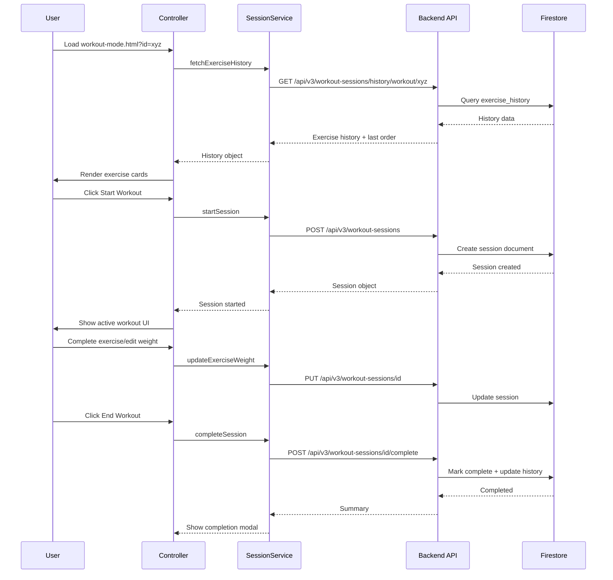

# Workout Mode Section - Comprehensive Audit Report

**Date:** December 28, 2025  
**Auditor:** Claude (Architect Mode)  
**Scope:** Complete audit of workout mode section including HTML pages, JavaScript files, CSS, and backend API integration

---

## Executive Summary

The workout mode section has accumulated significant technical debt with **4 different HTML page versions**, duplicated JavaScript logic, and inconsistent implementations. The main production page (`workout-mode.html`) is well-architected using a proper controller pattern, but deprecated and demo pages contain substantial code duplication that should be cleaned up.

### Key Findings
- ✅ **Main page (`workout-mode.html`)** - Well-structured, uses proper MVC pattern
- ⚠️ **3 redundant HTML pages** - Should be removed or consolidated
- ⚠️ **~900 lines of inline JavaScript** in `workout-mode-production.html`
- ❌ **Hardcoded exercise database** (10 exercises) in production.html
- ⚠️ **Duplicate RestTimer class** in demo pages
- ✅ **Backend API** - Complete and well-documented

---

## 1. File Inventory

### 1.1 HTML Pages

| File | Lines | Purpose | Status | Recommendation |
|------|-------|---------|--------|----------------|
| [`workout-mode.html`](../frontend/workout-mode.html) | 286 | **Main production page** | ✅ Active | Keep - Primary implementation |
| [`workout-mode-old.html`](../frontend/workout-mode-old.html) | 252 | Deprecated version | ❌ Deprecated | **DELETE** |
| [`workout-mode-demo.html`](../frontend/workout-mode-demo.html) | 954 | Demo page v1 | ⚠️ Demo | **DELETE or consolidate** |
| [`workout-mode-demo-v2.html`](../frontend/workout-mode-demo-v2.html) | ~956 | Demo page v2 | ⚠️ Demo | **DELETE or consolidate** |
| [`workout-mode-production.html`](../frontend/workout-mode-production.html) | 1177 | Alternative production | ⚠️ Outdated | **DELETE** - superseded |

**Total redundant lines:** ~3,339 lines across 4 files

### 1.2 JavaScript Files

| File | Lines | Purpose | Recommendation |
|------|-------|---------|----------------|
| [`controllers/workout-mode-controller.js`](../frontend/assets/js/controllers/workout-mode-controller.js) | ~2165 | Main controller | ✅ Keep |
| [`services/workout-session-service.js`](../frontend/assets/js/services/workout-session-service.js) | 1334 | Session lifecycle | ✅ Keep |
| [`workout-mode-refactored.js`](../frontend/assets/js/workout-mode-refactored.js) | ~244 | RestTimer + compat | ✅ Keep |
| [`components/exercise-card-renderer.js`](../frontend/assets/js/components/exercise-card-renderer.js) | ~400 | Card rendering | ✅ Keep |
| [`components/global-rest-timer.js`](../frontend/assets/js/components/global-rest-timer.js) | ~200 | Global timer widget | ✅ Keep |

### 1.3 CSS Files

| File | Est. Lines | Purpose | Recommendation |
|------|------------|---------|----------------|
| [`workout-mode.css`](../frontend/assets/css/workout-mode.css) | ~1400 | Main styles | ✅ Keep - review for cleanup |
| [`workout-database.css`](../frontend/assets/css/workout-database.css) | ~300 | Workout list styles | ✅ Keep |
| [`bottom-action-bar.css`](../frontend/assets/css/bottom-action-bar.css) | ~250 | Action bar | ✅ Keep |
| [`components/bonus-exercise-search.css`](../frontend/assets/css/components/bonus-exercise-search.css) | ~150 | Search component | ✅ Keep |
| [`components/unified-offcanvas.css`](../frontend/assets/css/components/unified-offcanvas.css) | ~200 | Offcanvas styles | ✅ Keep |

---

## 2. Detailed File Analysis

### 2.1 Main Page: `workout-mode.html` (286 lines)

**Status:** ✅ **PRODUCTION READY**

**Architecture:**
- Uses proper controller pattern via [`workout-mode-controller.js`](../frontend/assets/js/controllers/workout-mode-controller.js)
- Integrates with [`workout-session-service.js`](../frontend/assets/js/services/workout-session-service.js) for session management
- Uses centralized [`bottom-action-bar-config.js`](../frontend/assets/js/config/bottom-action-bar-config.js) for page actions
- Proper loading/error states implemented

**CSS Includes (Correct Order):**
```html
core.css → demo.css → ghost-gym-custom.css → navbar-custom.css → 
components.css → unified-offcanvas.css → bonus-exercise-search.css → 
workout-mode.css → workout-database.css → bottom-action-bar.css
```

**JavaScript Includes (Correct Order):**
```html
Core → Templates → Injection Services → Firebase → Utilities → 
Exercise Services → Components → Session Service → Controller
```

**Strengths:**
- ✅ Proper separation of concerns
- ✅ Uses centralized API config (`window.config.api.getUrl()`)
- ✅ Auth-aware with proper timing fix
- ✅ Loading states with detailed messages
- ✅ Error handling with retry button
- ✅ Reorder mode toggle for exercise reordering
- ✅ Exercise cards section wrapper

**Issues Found:**
1. **Missing navbar component** - No top navbar injection (uses side menu only)
2. **Version cache busting** - CSS uses `?v=20251207-05`, good practice

### 2.2 Deprecated Page: `workout-mode-old.html` (252 lines)

**Status:** ❌ **SHOULD BE DELETED**

**Differences from main:**
1. **Missing CSS:** `bonus-exercise-search.css` not included
2. **Missing wrapper:** No `#exerciseCardsSection` wrapper div
3. **Missing header:** No `#exerciseCardsHeader` with reorder toggle
4. **Missing offcanvas manager:** `offcanvas-manager.js` not included

**Recommendation:** Delete immediately - provides no value and risks confusion.

### 2.3 Demo Page: `workout-mode-demo.html` (954 lines)

**Status:** ⚠️ **DEMO - CONSIDER DELETION**

**Code Duplication Issues:**
1. **RestTimer class copy** (lines 322-508) - Full copy of RestTimer from `workout-mode-refactored.js`
2. **Inline demo data** (lines 183-314) - Hardcoded workout and history data
3. **Card renderer copy** (lines 697-818) - Duplicates `exercise-card-renderer.js` logic
4. **Weight badge renderer** (lines 636-689) - Duplicates session service logic

**Lines of duplicated code:** ~500+ lines

**Recommendation:** 
- If demos are needed, create a single consolidated demo page
- Use shared components with mock data injection rather than inline copies
- Otherwise, delete both demo pages

### 2.4 Alternative Production: `workout-mode-production.html` (1177 lines)

**Status:** ❌ **OUTDATED - SHOULD BE DELETED**

**Critical Issues:**

1. **Hardcoded Exercise Database (lines 268-279):**
```javascript
const bonusExercisesDatabase = [
    { id: 1, name: 'Cable Flyes', category: 'chest', ... },
    // Only 10 exercises hardcoded!
];
```
This bypasses the proper exercise cache service.

2. **~900 lines of inline JavaScript** (lines 266-1175):
   - Duplicates session service logic
   - Duplicates exercise card rendering
   - Duplicates rest timer functionality
   - Duplicates bonus exercise offcanvas

3. **Outdated UI patterns:**
   - Uses `prompt()` dialogs for exercise editing (line 634-641)
   - Custom notification system instead of shared toast service
   - Custom global rest timer instead of `global-rest-timer.js`

4. **Missing Features:**
   - No exercise reorder functionality
   - No proper exercise history integration
   - No pre-session editing

**Recommendation:** Delete - completely superseded by main `workout-mode.html`

---

## 3. Backend API Endpoints

### 3.1 Workout Sessions API (`/api/v3/workout-sessions`)

| Endpoint | Method | Purpose | Auth Required |
|----------|--------|---------|---------------|
| `/api/v3/workout-sessions/` | POST | Create new session | ✅ Yes |
| `/api/v3/workout-sessions/{id}` | GET | Get session by ID | ✅ Yes |
| `/api/v3/workout-sessions/{id}` | PUT | Update session (auto-save) | ✅ Yes |
| `/api/v3/workout-sessions/{id}/complete` | POST | Complete session | ✅ Yes |
| `/api/v3/workout-sessions/` | GET | List user sessions | ✅ Yes |
| `/api/v3/workout-sessions/{id}` | DELETE | Delete session | ✅ Yes |

### 3.2 Exercise History API

| Endpoint | Method | Purpose | Auth Required |
|----------|--------|---------|---------------|
| `/api/v3/workout-sessions/history/workout/{id}` | GET | Get workout exercise history | ✅ Yes |
| `/api/v3/workout-sessions/history/{workout_id}/{exercise_name}` | GET | Get specific exercise history | ✅ Yes |
| `/api/v3/workout-sessions/history/workout/{id}/bonus` | GET | Get bonus exercise history | ✅ Yes |

### 3.3 Request/Response Patterns

**Create Session Request:**
```javascript
POST /api/v3/workout-sessions/
{
    workout_id: "string",
    workout_name: "string",
    started_at: "ISO8601 datetime"
}
```

**Complete Session Request:**
```javascript
POST /api/v3/workout-sessions/{id}/complete
{
    completed_at: "ISO8601 datetime",
    exercises_performed: [
        {
            exercise_name: "string",
            weight: number,
            weight_unit: "lbs|kg|bw|other",
            target_sets: "string",
            target_reps: "string",
            is_bonus: boolean,
            is_skipped: boolean,
            skip_reason: "string (optional)"
        }
    ],
    exercise_order: ["string"] // Optional custom order
}
```

**Exercise History Response:**
```javascript
{
    workout_id: "string",
    workout_name: "string",
    exercises: {
        "Exercise Name": {
            last_weight: number,
            last_weight_unit: "string",
            last_session_date: "ISO8601",
            personal_record: number,
            total_sessions: number
        }
    },
    last_exercise_order: ["string"] // From last session
}
```

---

## 4. Bootstrap/Sneat Integration Analysis

### 4.1 Template Compliance

**Correct Usage:**
- ✅ Layout classes: `layout-menu-fixed layout-compact`
- ✅ Container: `container-xxl flex-grow-1 container-p-y`
- ✅ Card structure: Proper `.card`, `.card-header`, `.card-body`
- ✅ Bootstrap utilities: `mb-3`, `d-flex`, `text-muted`, etc.
- ✅ Icons: Consistent use of Boxicons (`bx-*`)

**Styling Consistency Issues:**
1. **workout-mode-production.html** uses inline `<style>` tag (lines 57-76)
2. **Demo pages** have custom demo-specific styles
3. **Main page** properly uses external stylesheets only

### 4.2 Theme Variables

The workout mode CSS properly uses Sneat theme variables:
```css
/* Correct usage in workout-mode.css */
background: var(--bs-body-bg);
color: var(--bs-primary);
border-color: var(--bs-border-color);
```

---

## 5. File Size Analysis

### 5.1 JavaScript Files

| File | Size (Est.) | Status |
|------|-------------|--------|
| `workout-mode-controller.js` | ~70KB | ⚠️ Large - consider splitting |
| `workout-session-service.js` | ~45KB | ✅ Acceptable |
| `workout-mode-refactored.js` | ~8KB | ✅ Small |
| `exercise-card-renderer.js` | ~15KB | ✅ Acceptable |
| `global-rest-timer.js` | ~7KB | ✅ Small |

### 5.2 Recommendations for Large Files

**`workout-mode-controller.js` (~2165 lines):**

Consider splitting into:
1. `workout-mode-ui.js` - UI rendering and DOM manipulation
2. `workout-mode-actions.js` - User action handlers
3. `workout-mode-state.js` - State management
4. Keep controller as orchestrator

### 5.3 HTML Pages

| File | Size (Lines) | Inline JS Lines | Status |
|------|--------------|-----------------|--------|
| `workout-mode.html` | 286 | ~25 | ✅ Clean |
| `workout-mode-old.html` | 252 | ~25 | ❌ Delete |
| `workout-mode-demo.html` | 954 | ~775 | ❌ Delete |
| `workout-mode-production.html` | 1177 | ~910 | ❌ Delete |

---

## 6. Issues and Recommendations

### 6.1 Critical (Fix Immediately)

| # | Issue | File | Recommendation |
|---|-------|------|----------------|
| 1 | **Redundant deprecated page** | `workout-mode-old.html` | Delete file |
| 2 | **Hardcoded 10-exercise database** | `workout-mode-production.html:268-279` | Delete file |
| 3 | **~900 lines inline JS** | `workout-mode-production.html` | Delete file |

### 6.2 High Priority (Fix Soon)

| # | Issue | File | Recommendation |
|---|-------|------|----------------|
| 4 | Demo pages duplicate core logic | `workout-mode-demo*.html` | Consolidate or delete |
| 5 | Duplicate RestTimer class | `workout-mode-demo.html:322-508` | Use shared module |
| 6 | Large controller file | `workout-mode-controller.js` | Consider splitting |

### 6.3 Medium Priority (Improvement)

| # | Issue | File | Recommendation |
|---|-------|------|----------------|
| 7 | Missing top navbar | `workout-mode.html` | Add navbar injection |
| 8 | workout-mode.css is large | `workout-mode.css` | Audit for dead code |
| 9 | No offline support | All | Consider service worker |

### 6.4 Low Priority (Nice to Have)

| # | Issue | File | Recommendation |
|---|-------|------|----------------|
| 10 | Accessibility audit needed | All workout pages | Add ARIA labels |
| 11 | Mobile responsive review | `workout-mode.css` | Test on various devices |

---

## 7. Prioritized Action Plan

### Phase 1: File Cleanup (Immediate)

```bash
# Files to delete
rm frontend/workout-mode-old.html
rm frontend/workout-mode-production.html
rm frontend/workout-mode-demo.html
rm frontend/workout-mode-demo-v2.html
```

**Lines of code removed:** ~3,339 lines
**Risk:** Low - these are deprecated/demo files not used in production

### Phase 2: Consolidation (If Demos Needed)

If demo functionality is required:
1. Create `frontend/workout-mode-demo-unified.html`
2. Use mock data injection pattern
3. Reference shared components, don't duplicate

### Phase 3: Controller Refactoring (Future)

Split `workout-mode-controller.js` into focused modules:

```
controllers/
├── workout-mode-controller.js    # Orchestrator (~500 lines)
├── workout-mode-ui.js           # UI/rendering (~600 lines)
├── workout-mode-actions.js      # Action handlers (~500 lines)
└── workout-mode-state.js        # State management (~400 lines)
```

### Phase 4: Accessibility Improvements

1. Add ARIA labels to exercise cards
2. Add keyboard navigation for card expansion
3. Add screen reader announcements for timer states
4. Verify focus management in offcanvas components

---

## 8. Navigation Link Verification

### 8.1 Outbound Links from Workout Mode

| Link Target | Usage | Status |
|-------------|-------|--------|
| `workout-database.html` | Redirect when no workout selected | ✅ Valid |
| `workout-builder.html` | Edit workout button | ✅ Valid |

### 8.2 Inbound Links to Workout Mode

| Source | Link | Status |
|--------|------|--------|
| `workout-database.html` | Card click → `workout-mode.html?id={id}` | ✅ Valid |
| `index.html` (Dashboard) | Recent workout cards | ✅ Valid |

---

## 9. Conclusion

The main `workout-mode.html` page is well-architected and production-ready. The primary technical debt is in the **3 redundant HTML pages** that should be deleted immediately:

1. **`workout-mode-old.html`** - Deprecated, missing features
2. **`workout-mode-production.html`** - Outdated approach, hardcoded data
3. **`workout-mode-demo.html`** / **`workout-mode-demo-v2.html`** - Demo with duplicated code

**Deleting these files would remove ~3,339 lines of redundant code** while maintaining full production functionality.

The backend API is complete and well-integrated. The controller pattern used in the main page follows best practices and should be maintained.

---

## Appendix A: File Dependency Diagram

```mermaid
graph TD
    A[workout-mode.html] --> B[workout-mode-controller.js]
    B --> C[workout-session-service.js]
    B --> D[exercise-card-renderer.js]
    B --> E[global-rest-timer.js]
    B --> F[workout-mode-refactored.js]
    
    C --> G[Backend API]
    G --> H[/api/v3/workout-sessions]
    G --> I[/api/v3/firebase/workouts]
    
    A --> J[workout-mode.css]
    A --> K[bottom-action-bar-service.js]
    K --> L[bottom-action-bar-config.js]
    
    B --> M[UnifiedOffcanvasFactory]
    M --> N[offcanvas/index.js]
```

## Appendix B: Backend API Flow



---

*Report generated by Claude Architect Mode*
