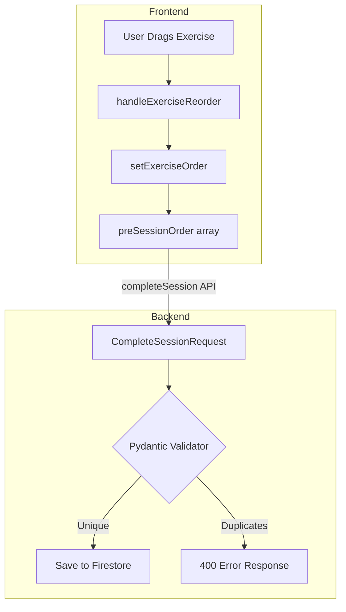

# Implementation Plan: Workout Mode Editing & Reorder Fixes

**Created:** 2025-12-23  
**Based On:** Code Review Results (validated against project patterns)

---

## Overview

This plan includes only the recommendations that **align with the project's established patterns** based on Bootstrap/Sneat conventions and existing code standards.

### Items REMOVED (Not Aligned with Project Patterns)

| Original Recommendation | Reason Removed |
|------------------------|----------------|
| Add CDN integrity hashes | Project doesn't use integrity hashes on any CDN scripts (Bootstrap, Fuse.js, SortableJS) |
| Change `hasattr()` to `getattr()` | Project uses `hasattr()` consistently (8 occurrences) as the standard pattern |

### Items INCLUDED (Aligned with Project Patterns)

1. ✅ Add ARIA accessibility labels to drag handles
2. ✅ Add JSDoc comments to new service methods  
3. ✅ Add Pydantic validator for `exercise_order` uniqueness

---

## Implementation Tasks

### Task 1: Add ARIA Accessibility Labels to Drag Handle

**File:** `frontend/assets/js/components/exercise-card-renderer.js`  
**Line:** ~82-84

**Current Code:**
```html
<div class="exercise-drag-handle" title="Drag to reorder">
    <i class="bx bx-menu"></i>
</div>
```

**Updated Code:**
```html
<div class="exercise-drag-handle" 
     title="Drag to reorder" 
     role="button" 
     tabindex="0" 
     aria-label="Drag handle to reorder ${this._escapeHtml(mainExercise)}">
    <i class="bx bx-menu" aria-hidden="true"></i>
</div>
```

**Why:** Project uses `aria-label` extensively (56 occurrences found). This follows the established pattern.

---

### Task 2: Add JSDoc Comments to New Service Methods

**File:** `frontend/assets/js/services/workout-session-service.js`

The following methods need JSDoc comments (matching the extensive JSDoc usage in the project):

#### 2.1 `setExerciseOrder()` (Line ~515)

**Current:**
```javascript
// PHASE 2: Set custom exercise order for reordering
setExerciseOrder(exerciseNames) {
```

**Updated:**
```javascript
/**
 * PHASE 2: Set custom exercise order for reordering
 * Stores the exercise order for drag-and-drop reordering before session starts
 * @param {string[]} exerciseNames - Ordered array of exercise names
 * @fires exerciseOrderUpdated - Notifies listeners when order changes
 */
setExerciseOrder(exerciseNames) {
```

#### 2.2 `getExerciseOrder()` (Line ~525)

**Current:**
```javascript
// PHASE 2: Get current exercise order
getExerciseOrder() {
```

**Updated:**
```javascript
/**
 * PHASE 2: Get current exercise order
 * Returns the custom exercise order if set, or empty array
 * @returns {string[]} Array of exercise names in custom order
 */
getExerciseOrder() {
```

#### 2.3 `clearExerciseOrder()` (Line ~532)

**Current:**
```javascript
// PHASE 2: Clear exercise order
clearExerciseOrder() {
```

**Updated:**
```javascript
/**
 * PHASE 2: Clear exercise order
 * Resets the custom order back to empty (template order will be used)
 * @fires exerciseOrderCleared - Notifies listeners when order is cleared
 */
clearExerciseOrder() {
```

#### 2.4 `hasCustomOrder()` (Line ~540)

**Current:**
```javascript
// PHASE 2: Check if custom order is set
hasCustomOrder() {
```

**Updated:**
```javascript
/**
 * PHASE 2: Check if custom exercise order is set
 * @returns {boolean} True if exercises have been reordered from template order
 */
hasCustomOrder() {
```

---

### Task 3: Add Pydantic Validator for `exercise_order` Uniqueness

**File:** `backend/models.py`  
**Location:** After line ~877 (after `exercise_order` field in `WorkoutSession`)

**Add Validator:**
```python
@field_validator('exercise_order', mode='before')
@classmethod
def validate_exercise_order_unique(cls, v):
    """Ensure exercise order contains unique exercise names."""
    if v is None:
        return v
    if len(v) != len(set(v)):
        raise ValueError("Exercise order must contain unique exercise names")
    return v
```

**Also add to `CompleteSessionRequest` model (~line 970):**
```python
@field_validator('exercise_order', mode='before')
@classmethod
def validate_exercise_order_unique(cls, v):
    """Ensure exercise order contains unique exercise names."""
    if v is None:
        return v
    if len(v) != len(set(v)):
        raise ValueError("Exercise order must contain unique exercise names")
    return v
```

**Why:** Project uses `@field_validator` pattern (2 existing validators in models.py). This follows the established pattern.

---

## Implementation Checklist

```markdown
[ ] Task 1: Add ARIA labels to drag handle in exercise-card-renderer.js
[ ] Task 2.1: Add JSDoc to setExerciseOrder() 
[ ] Task 2.2: Add JSDoc to getExerciseOrder()
[ ] Task 2.3: Add JSDoc to clearExerciseOrder()
[ ] Task 2.4: Add JSDoc to hasCustomOrder()
[ ] Task 3.1: Add Pydantic validator to WorkoutSession.exercise_order
[ ] Task 3.2: Add Pydantic validator to CompleteSessionRequest.exercise_order
[ ] Test: Verify drag handle is accessible via keyboard
[ ] Test: Verify duplicate exercise names are rejected by API
```

---

## Files Modified

| File | Changes |
|------|---------|
| `frontend/assets/js/components/exercise-card-renderer.js` | Add ARIA attributes to drag handle |
| `frontend/assets/js/services/workout-session-service.js` | Add JSDoc to 4 methods |
| `backend/models.py` | Add 2 Pydantic validators |

---

## Testing Notes

### ARIA Accessibility Testing
- Use keyboard Tab to focus drag handle
- Verify screen reader announces "Drag handle to reorder [exercise name]"
- Confirm drag handle is properly focusable

### Pydantic Validator Testing
```python
# This should raise ValidationError:
{
    "exercise_order": ["Bench Press", "Squat", "Bench Press"]  # Duplicate!
}

# This should pass:
{
    "exercise_order": ["Bench Press", "Squat", "Deadlift"]  # All unique
}
```

---

## Estimated Scope

- **Files to modify:** 3
- **Lines to add:** ~35
- **Risk level:** Low (non-breaking additions)
- **Testing required:** Basic functional testing

---

## Diagram: Data Flow with Validation



---

## Next Steps

1. Review this plan and confirm alignment with your expectations
2. Switch to **Code mode** to implement these changes
3. Test the changes locally
4. Deploy and verify in staging
