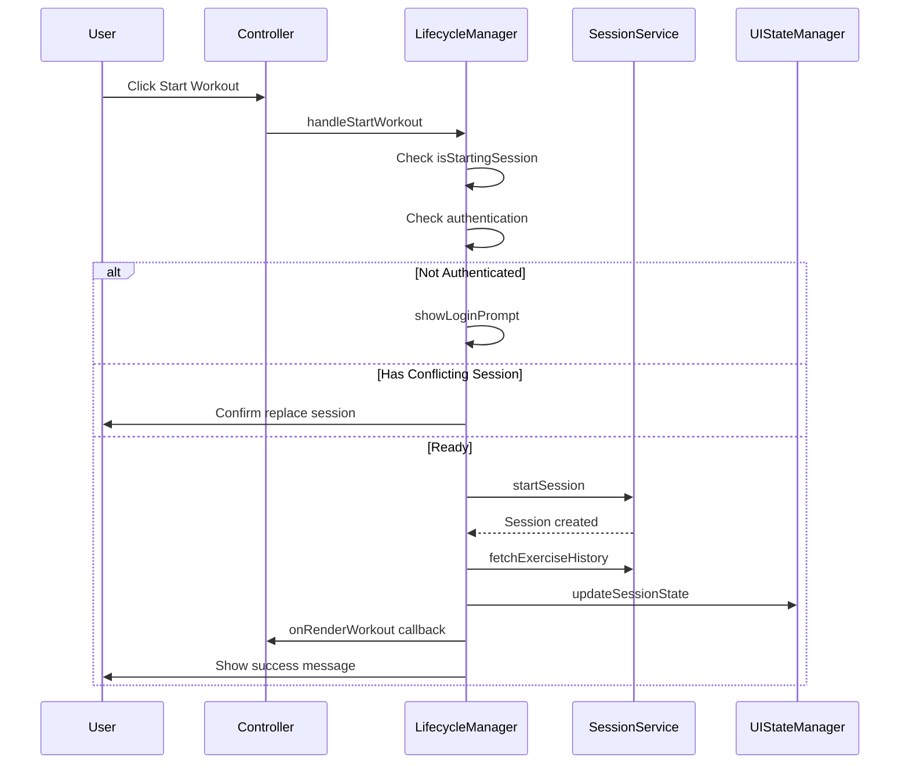
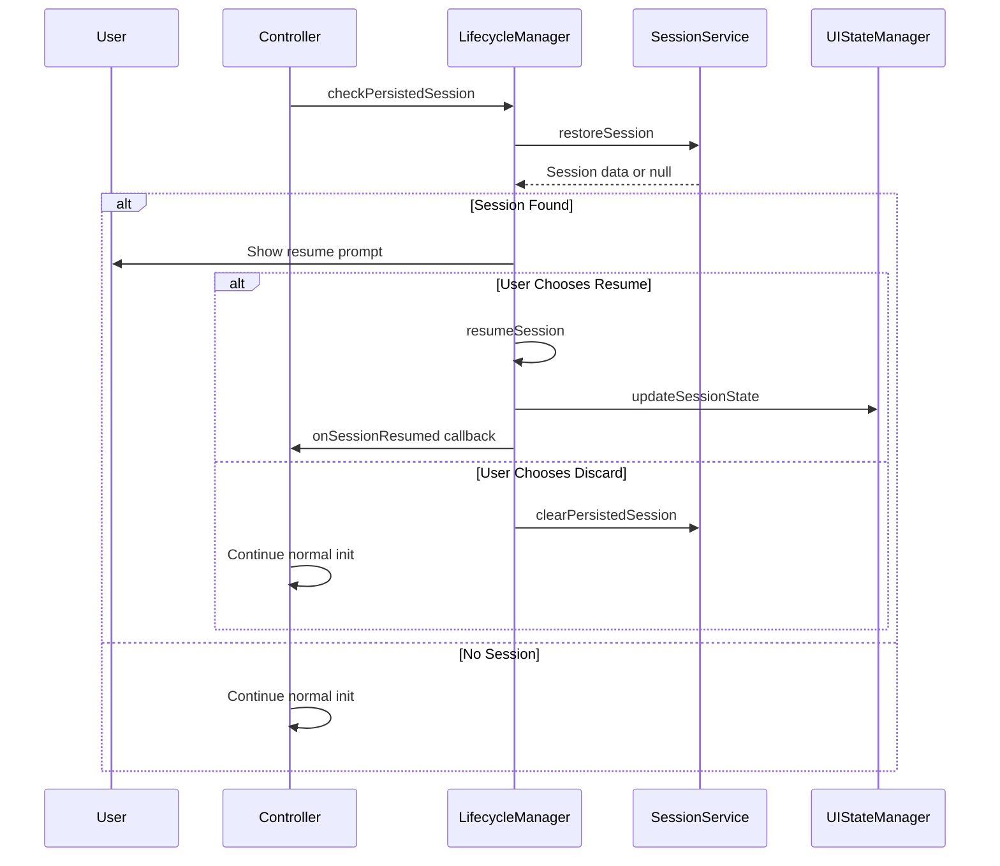

# Workout Mode Refactoring - Phase 5: Session Lifecycle Management

**Date:** 2026-01-05  
**Status:** 📋 Planning  
**Priority:** High (Builds on Phase 4 Data Manager)  
**Risk Level:** Medium-High (Core workflow functionality)

---

## Overview

Extract session lifecycle orchestration logic from the controller into a dedicated service. This handles the complete workflow of starting, completing, and resuming workout sessions, coordinating between UI updates and the underlying `WorkoutSessionService`.

---

## Goals

1. **Extract session start/complete orchestration** from controller
2. **Centralize resume session flow** into single service
3. **Create reusable lifecycle hooks** for UI updates
4. **Simplify controller** by delegating workflow logic

---

## Module to Create

### WorkoutLifecycleManager

**File:** `frontend/assets/js/services/workout-lifecycle-manager.js`  
**Lines:** ~350 lines  
**Purpose:** Orchestrate workout session lifecycle (start → in-progress → complete)

---

## Methods to Extract

### From Controller

| Method | Line | Lines | Purpose |
|--------|------|-------|---------|
| `handleStartWorkout()` | 1048 | ~50 | Validates state, checks auth, handles conflicts |
| `startNewSession()` | 1117 | ~35 | Creates session, fetches history, updates UI |
| `handleCompleteWorkout()` | 1167 | ~4 | Triggers completion offcanvas |
| `showCompleteWorkoutOffcanvas()` | 1175 | ~23 | Creates completion offcanvas with stats |
| `showCompletionSummary()` | 1202 | ~7 | Shows completion summary |
| `showLoginPrompt()` | 1213 | ~70 | Login required modal |
| `showResumeSessionPrompt()` | 1294 | ~30 | Resume session prompt offcanvas |
| `resumeSession()` | 1329 | ~54 | Restores session from localStorage |
| `updateSessionUI()` | 1495 | ~11 | Updates UI for session state changes |

**Total:** ~284 lines to extract

---

## Interface Design

```javascript
/**
 * Manages workout session lifecycle orchestration
 * Coordinates between SessionService, UIStateManager, and Controller
 */
class WorkoutLifecycleManager {
    constructor(options) {
        this.sessionService = options.sessionService;
        this.uiStateManager = options.uiStateManager;
        this.authService = options.authService;
        this.dataManager = options.dataManager;
        this.timerManager = options.timerManager;
        
        // Callbacks for controller coordination
        this.onSessionStarted = options.onSessionStarted || (() => {});
        this.onSessionCompleted = options.onSessionCompleted || (() => {});
        this.onSessionResumed = options.onSessionResumed || (() => {});
        this.onRenderWorkout = options.onRenderWorkout || (() => {});
        
        // State
        this.isStartingSession = false;
        this.currentWorkout = null;
    }
    
    /**
     * Set current workout context
     * @param {Object} workout - Current workout object
     */
    setWorkout(workout) {
        this.currentWorkout = workout;
    }
    
    /**
     * Handle start workout button click
     * Validates state, checks auth, handles conflicts
     * @returns {Promise<boolean>} Success status
     */
    async handleStartWorkout() {
        // Prevent concurrent starts
        // Check authentication
        // Check for conflicting sessions
        // Call startNewSession()
    }
    
    /**
     * Start a new workout session
     * Creates session, fetches history, updates UI
     * @returns {Promise<Object>} Session object
     */
    async startNewSession() {
        // Call sessionService.startSession()
        // Fetch exercise history
        // Update UI state
        // Trigger render callback
        // Expand first card
        // Show success message
    }
    
    /**
     * Handle complete workout button click
     * Shows completion offcanvas
     * @param {Function} onComplete - Callback after completion
     */
    handleCompleteWorkout(onComplete) {
        // Calculate session stats
        // Create completion offcanvas
        // Handle completion flow
    }
    
    /**
     * Show completion summary
     * @param {Object} session - Completed session data
     */
    showCompletionSummary(session) {
        // Create summary offcanvas
        // Show stats and history link
    }
    
    /**
     * Show login prompt modal
     * Called when unauthenticated user tries to start workout
     */
    showLoginPrompt() {
        // Create login modal HTML
        // Show benefits of account
        // Handle login redirect
    }
    
    /**
     * Check for and handle persisted session on page load
     * @returns {Promise<boolean>} True if session was found and handled
     */
    async checkPersistedSession() {
        // Restore session from localStorage
        // Show resume prompt if found
        // Return whether session was found
    }
    
    /**
     * Show resume session prompt
     * @param {Object} sessionData - Persisted session data
     */
    showResumeSessionPrompt(sessionData) {
        // Calculate elapsed time
        // Count exercises with weights
        // Create resume offcanvas
        // Handle resume/discard choice
    }
    
    /**
     * Resume a persisted session
     * @param {Object} sessionData - Persisted session data
     * @returns {Promise<void>}
     */
    async resumeSession(sessionData) {
        // Restore session to service
        // Load workout data
        // Update UI state
        // Start timers
        // Show success message
    }
    
    /**
     * Update UI for session state changes
     * @param {boolean} isActive - Whether session is active
     */
    updateSessionUI(isActive) {
        // Delegate to uiStateManager
        // Handle timers
    }
    
    /**
     * Check if user is authenticated
     * @returns {boolean} Authentication status
     */
    isAuthenticated() {
        return this.authService.isUserAuthenticated();
    }
}
```

---

## Workflow Diagrams

### Start Workout Flow



### Resume Session Flow



---

## Implementation Steps

### Step 1: Create WorkoutLifecycleManager Module
- [ ] Create file structure with constructor
- [ ] Define callback interface
- [ ] Add state management

### Step 2: Extract Start Workflow
- [ ] Move `handleStartWorkout()` logic
- [ ] Move `startNewSession()` logic
- [ ] Move `showLoginPrompt()` logic
- [ ] Handle callback coordination

### Step 3: Extract Complete Workflow
- [ ] Move `handleCompleteWorkout()` logic
- [ ] Move `showCompleteWorkoutOffcanvas()` logic
- [ ] Move `showCompletionSummary()` logic
- [ ] Integrate with WorkoutDataManager

### Step 4: Extract Resume Workflow
- [ ] Move `showResumeSessionPrompt()` logic
- [ ] Move `resumeSession()` logic
- [ ] Move `checkPersistedSession()` logic

### Step 5: Extract UI Updates
- [ ] Move `updateSessionUI()` logic
- [ ] Coordinate with UIStateManager
- [ ] Handle timer state

### Step 6: Controller Integration
- [ ] Initialize LifecycleManager in constructor
- [ ] Wire up callbacks
- [ ] Update initialize() to use LifecycleManager
- [ ] Replace methods with facades

### Step 7: Update HTML
- [ ] Add script tag for new module
- [ ] Update version number

---

## Controller Integration

### Constructor Update
```javascript
constructor() {
    // ...existing code...
    
    // Phase 5: Initialize Lifecycle Manager
    this.lifecycleManager = new WorkoutLifecycleManager({
        sessionService: this.sessionService,
        uiStateManager: this.uiStateManager,
        authService: this.authService,
        dataManager: this.dataManager,
        timerManager: this.timerManager,
        onSessionStarted: () => this.onSessionStarted(),
        onSessionCompleted: (session) => this.onSessionCompleted(session),
        onSessionResumed: (session) => this.onSessionResumed(session),
        onRenderWorkout: () => this.renderWorkout()
    });
}
```

### Method Delegation
```javascript
// Controller delegates to lifecycleManager
async handleStartWorkout() {
    return this.lifecycleManager.handleStartWorkout();
}

async handleCompleteWorkout() {
    const exercisesPerformed = this.collectExerciseData();
    return this.lifecycleManager.handleCompleteWorkout(
        this.currentWorkout,
        exercisesPerformed,
        async (session) => {
            await this.updateWorkoutTemplateWeights(exercisesPerformed);
        }
    );
}

showLoginPrompt() {
    return this.lifecycleManager.showLoginPrompt();
}
```

---

## Dependencies

### Required Services
- `WorkoutSessionService` - Core session operations
- `WorkoutUIStateManager` - UI state updates (Phase 1)
- `WorkoutTimerManager` - Timer management (Phase 2)
- `WorkoutDataManager` - Data collection (Phase 4)
- `AuthService` - Authentication
- `UnifiedOffcanvasFactory` - Offcanvas creation

### Callbacks Required
- `onRenderWorkout()` - Re-render workout cards
- `onSessionStarted()` - Hook for additional startup logic
- `onSessionCompleted()` - Hook for completion logic
- `onSessionResumed()` - Hook for resume logic

---

## Risk Assessment

| Risk | Impact | Mitigation |
|------|--------|------------|
| Session start failures | High | Comprehensive error handling with user feedback |
| Race conditions in start flow | High | isStartingSession flag already exists |
| Resume data corruption | Medium | Validate restored session data |
| Timer synchronization | Medium | Coordinate with TimerManager |
| Authentication edge cases | Medium | Clear auth state checks |

---

## Testing Strategy

### Unit Tests
```javascript
describe('WorkoutLifecycleManager', () => {
    describe('handleStartWorkout', () => {
        it('should prevent concurrent session starts');
        it('should show login prompt when not authenticated');
        it('should handle conflicting sessions');
        it('should call sessionService.startSession');
    });
    
    describe('resumeSession', () => {
        it('should restore session from persisted data');
        it('should load correct workout');
        it('should update UI state');
        it('should handle expired sessions');
    });
});
```

### Integration Tests
- Start workout → Complete workout flow
- Resume interrupted session flow
- Login prompt → Login → Start workflow

---

## Success Criteria

- [ ] ~284 lines extracted from controller
- [ ] Controller reduced to ~1,500 lines (after Phase 4 + 5)
- [ ] All session lifecycle tests pass
- [ ] Start/Complete/Resume flows work correctly
- [ ] Zero breaking changes to user experience
- [ ] Proper error handling and user feedback

---

*Plan created: 2026-01-05*
