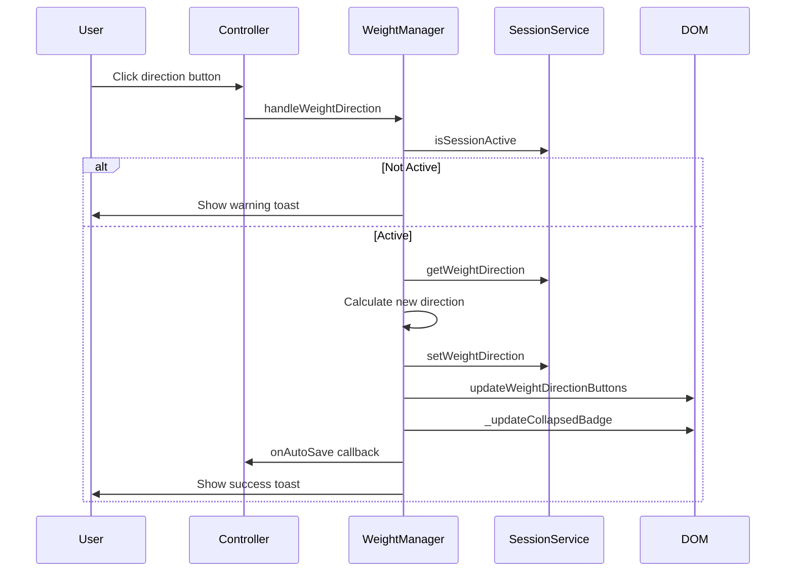
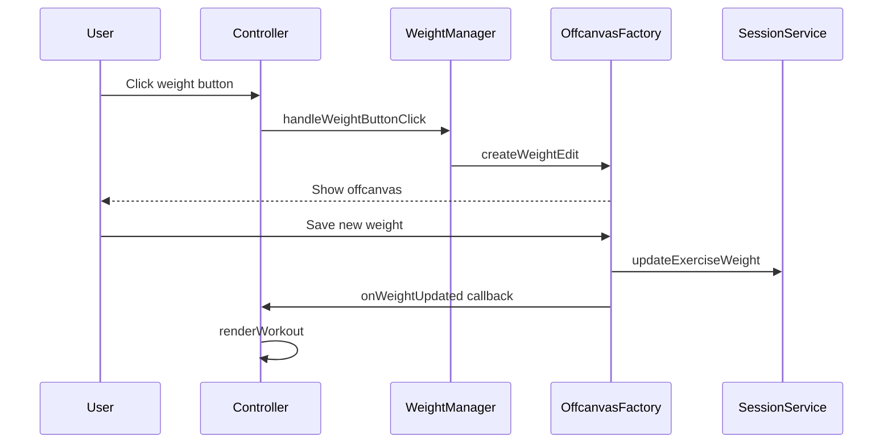

# Workout Mode Refactoring - Phase 6: Weight Management

**Date:** 2026-01-05  
**Status:** 📋 Planning  
**Priority:** Medium (UI/UX Enhancement)  
**Risk Level:** Low-Medium (Self-contained feature)

---

## Overview

Extract weight editing, direction indicators, quick notes, and plate calculator logic from the controller into a dedicated service. This centralizes all weight-related UI interactions and business logic.

---

## Goals

1. **Extract weight editing orchestration** from controller
2. **Centralize direction indicator logic** (increase/decrease weight next session)
3. **Consolidate quick notes popover handling**
4. **Integrate plate calculator settings**
5. **Simplify controller** by delegating weight UI logic

---

## Module to Create

### WorkoutWeightManager

**File:** `frontend/assets/js/services/workout-weight-manager.js`  
**Lines:** ~320 lines  
**Purpose:** Manage all weight-related UI interactions and state

---

## Methods to Extract

### From Controller

| Method | Line | Lines | Purpose |
|--------|------|-------|---------|
| `handleWeightButtonClick()` | 636 | ~11 | Parse weight button attributes and open modal |
| `showWeightModal()` | 651 | ~11 | Create weight edit offcanvas |
| `handleWeightDirection()` | 668 | ~42 | Toggle direction indicators |
| `updateWeightDirectionButtons()` | 717 | ~34 | Update direction button DOM states |
| `showQuickNotes()` | 756 | ~17 | Show quick notes popover |
| `handleQuickNoteAction()` | 780 | ~25 | Process quick note actions |
| `updateQuickNoteTrigger()` | 811 | ~45 | Update quick note trigger states |
| `_updateCollapsedBadge()` | 863 | ~53 | Update collapsed card weight badge |
| `_getDirectionLabel()` | 923 | ~8 | Get direction label text |
| `showPlateSettings()` | 936 | ~11 | Open plate calculator settings |

**Total:** ~257 lines to extract

---

## Interface Design

```javascript
/**
 * Manages weight editing, direction indicators, and related UI
 * Coordinates between SessionService and DOM updates
 */
class WorkoutWeightManager {
    constructor(options) {
        this.sessionService = options.sessionService;
        
        // Callbacks for controller coordination
        this.onWeightUpdated = options.onWeightUpdated || (() => {});
        this.onRenderWorkout = options.onRenderWorkout || (() => {});
        this.onAutoSave = options.onAutoSave || (() => {});
    }
    
    /**
     * Handle weight button click from card
     * Parses data attributes and opens weight modal
     * @param {HTMLElement} button - Weight button element
     */
    handleWeightButtonClick(button) {
        // Extract data attributes
        // Call showWeightModal
    }
    
    /**
     * Show weight edit offcanvas
     * @param {string} exerciseName - Exercise name
     * @param {Object} weightData - Current weight data
     * @param {string} weightData.currentWeight - Current weight value
     * @param {string} weightData.currentUnit - Current unit (lbs/kg)
     * @param {string} weightData.lastWeight - Last session weight
     * @param {string} weightData.lastWeightUnit - Last session unit
     * @param {string} weightData.lastSessionDate - Date of last session
     * @param {boolean} weightData.isSessionActive - Whether session is active
     */
    showWeightModal(exerciseName, weightData) {
        // Use UnifiedOffcanvasFactory.createWeightEdit
    }
    
    /**
     * Handle weight direction toggle
     * Two-button layout: decrease, increase with toggle behavior
     * @param {HTMLElement} button - Direction button element
     */
    handleWeightDirection(button) {
        // Check session active
        // Get current direction
        // Toggle or set new direction
        // Update session service
        // Update UI directly (no re-render)
        // Auto-save
        // Show toast
    }
    
    /**
     * Update weight direction buttons in DOM without re-rendering
     * Prevents card collapse when direction buttons are clicked
     * @param {string} exerciseName - Exercise name
     * @param {string|null} direction - up, down, or null
     */
    updateWeightDirectionButtons(exerciseName, direction) {
        // Find card
        // Update button classes
        // Toggle dot visibility
    }
    
    /**
     * Show quick notes popover for weight direction
     * @param {HTMLElement} trigger - Trigger button element
     */
    showQuickNotes(trigger) {
        // Extract data attributes
        // Create QuickNotesPopover
        // Show popover
    }
    
    /**
     * Handle quick note action
     * @param {string} exerciseName - Exercise name
     * @param {string} action - Action taken (up, down, same)
     * @param {Object} data - Additional data
     */
    handleQuickNoteAction(exerciseName, action, data) {
        // Handle weight-direction type
        // Update session service
        // Update trigger button
        // Show toast
        // Auto-save
    }
    
    /**
     * Update quick note trigger button state and label
     * @param {string} exerciseName - Exercise name
     * @param {string|null} value - Current value
     */
    updateQuickNoteTrigger(exerciseName, value) {
        // Find card
        // Update trigger button state
        // Update icon
        // Update label display
        // Update collapsed badge
    }
    
    /**
     * Update weight badge on collapsed card
     * Shows current direction indicator
     * @param {string} exerciseName - Exercise name
     * @param {string|null} direction - Direction value
     * @private
     */
    _updateCollapsedBadge(exerciseName, direction) {
        // Find card and badge
        // Update data attribute
        // Update direction classes
        // Update badge icon and text
        // Update tooltip
    }
    
    /**
     * Get direction label text
     * @param {string} direction - up, down, or same
     * @returns {string} Label text
     */
    getDirectionLabel(direction) {
        // Return 'Increase', 'Decrease', or 'No change'
    }
    
    /**
     * Show plate calculator settings offcanvas
     */
    showPlateSettings() {
        // Use UnifiedOffcanvasFactory.createPlateSettings
        // Handle save callback
        // Trigger re-render
    }
    
    /**
     * Get weight history for exercise
     * @param {string} exerciseName - Exercise name
     * @returns {Object|null} Weight history data
     */
    getWeightHistory(exerciseName) {
        return this.sessionService.getExerciseHistory(exerciseName);
    }
    
    /**
     * Get current weight direction for exercise
     * @param {string} exerciseName - Exercise name
     * @returns {string|null} Direction or null
     */
    getCurrentDirection(exerciseName) {
        return this.sessionService.getWeightDirection(exerciseName);
    }
    
    /**
     * Get last weight direction from history
     * @param {string} exerciseName - Exercise name
     * @returns {string|null} Last direction or null
     */
    getLastDirection(exerciseName) {
        return this.sessionService.getLastWeightDirection(exerciseName);
    }
}
```

---

## Workflow Diagrams

### Weight Direction Flow



### Weight Edit Flow



---

## Implementation Steps

### Step 1: Create WorkoutWeightManager Module
- [ ] Create file structure with constructor
- [ ] Define callback interface
- [ ] Import dependencies

### Step 2: Extract Weight Modal Logic
- [ ] Move `handleWeightButtonClick()` logic
- [ ] Move `showWeightModal()` logic
- [ ] Integrate with UnifiedOffcanvasFactory

### Step 3: Extract Direction Indicator Logic
- [ ] Move `handleWeightDirection()` logic
- [ ] Move `updateWeightDirectionButtons()` logic
- [ ] Move `_updateCollapsedBadge()` logic
- [ ] Move `_getDirectionLabel()` logic

### Step 4: Extract Quick Notes Logic
- [ ] Move `showQuickNotes()` logic
- [ ] Move `handleQuickNoteAction()` logic
- [ ] Move `updateQuickNoteTrigger()` logic
- [ ] Integrate with QuickNotesPopover

### Step 5: Extract Plate Settings
- [ ] Move `showPlateSettings()` logic
- [ ] Handle save callback and re-render

### Step 6: Controller Integration
- [ ] Initialize WeightManager in constructor
- [ ] Wire up callbacks
- [ ] Replace methods with facades

### Step 7: Update HTML
- [ ] Add script tag for new module
- [ ] Update version number

---

## Controller Integration

### Constructor Update
```javascript
constructor() {
    // ...existing code...
    
    // Phase 6: Initialize Weight Manager
    this.weightManager = new WorkoutWeightManager({
        sessionService: this.sessionService,
        onWeightUpdated: (exerciseName, weight) => this.onWeightUpdated(exerciseName, weight),
        onRenderWorkout: () => this.renderWorkout(),
        onAutoSave: () => this.autoSave(null)
    });
}
```

### Method Delegation
```javascript
// Controller delegates to weightManager
handleWeightButtonClick(button) {
    return this.weightManager.handleWeightButtonClick(button);
}

showWeightModal(exerciseName, currentWeight, currentUnit, lastWeight, lastWeightUnit, lastSessionDate, isSessionActive) {
    return this.weightManager.showWeightModal(exerciseName, {
        currentWeight, currentUnit, lastWeight, lastWeightUnit, lastSessionDate, isSessionActive
    });
}

handleWeightDirection(button) {
    return this.weightManager.handleWeightDirection(button);
}

showQuickNotes(trigger) {
    return this.weightManager.showQuickNotes(trigger);
}

showPlateSettings() {
    return this.weightManager.showPlateSettings();
}
```

---

## Dependencies

### Required Services
- `WorkoutSessionService` - Weight storage and history
- `UnifiedOffcanvasFactory` - Offcanvas creation
- `QuickNotesPopover` - Quick notes popover component

### Callbacks Required
- `onWeightUpdated()` - Hook after weight changes
- `onRenderWorkout()` - Re-render workout cards
- `onAutoSave()` - Trigger auto-save

---

## Risk Assessment

| Risk | Impact | Mitigation |
|------|--------|------------|
| DOM update timing | Low | Direct DOM manipulation (no re-render) |
| Card collapse on interaction | Low | Already handled with direct updates |
| Direction state sync | Low | Single source of truth in SessionService |
| Popover positioning | Low | Existing QuickNotesPopover handles this |

---

## Testing Strategy

### Unit Tests
```javascript
describe('WorkoutWeightManager', () => {
    describe('handleWeightDirection', () => {
        it('should toggle direction on active session');
        it('should show warning when no session');
        it('should clear direction when same button clicked twice');
    });
    
    describe('updateWeightDirectionButtons', () => {
        it('should update button classes correctly');
        it('should toggle dot visibility');
    });
    
    describe('_updateCollapsedBadge', () => {
        it('should update badge text with direction icon');
        it('should update tooltip text');
    });
});
```

### Integration Tests
- Weight edit → Save → Display updated
- Direction toggle → Badge update → Auto-save
- Quick notes → Direction set → Badge update

---

## Success Criteria

- [ ] ~257 lines extracted from controller
- [ ] Controller reduced to ~1,250 lines (after Phases 4-6)
- [ ] All weight interaction tests pass
- [ ] Direction indicators work correctly
- [ ] Quick notes popover works correctly
- [ ] Plate settings work correctly
- [ ] Zero breaking changes to user experience

---

## Phase Summary: Controller Size Reduction

| Phase | Lines Extracted | Controller After |
|-------|-----------------|------------------|
| Phase 1: UI State | ~200 | ~1,850 |
| Phase 2: Timers | ~180 | ~1,670 |
| Phase 3: Card Management | ~220 | ~1,450 |
| Phase 4: Data Management | ~235 | ~1,800* |
| Phase 5: Session Lifecycle | ~284 | ~1,516 |
| Phase 6: Weight Management | ~257 | ~1,259 |

*Phase 4 actual result was ~2,047 lines due to conversation context

---

*Plan created: 2026-01-05*
