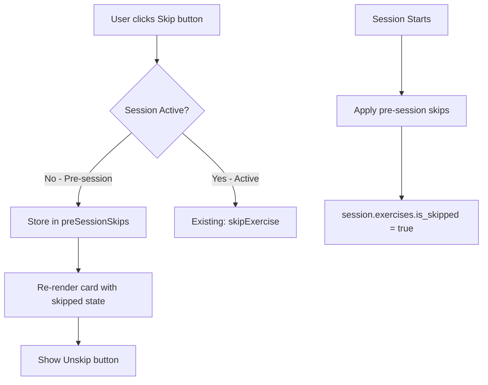
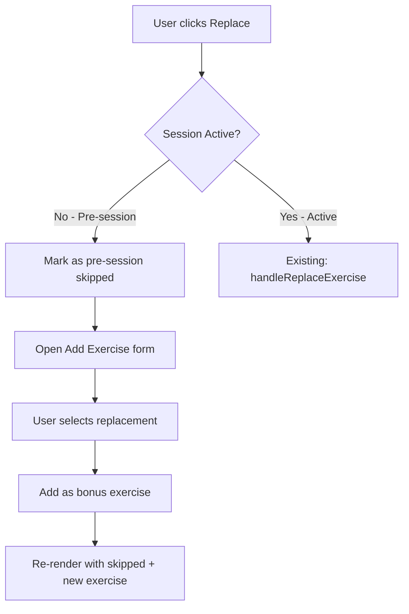

# Workout Mode Pre-Session Skip & Replace Implementation Plan

## Overview

Add **Skip** and **Replace** buttons to exercise cards in workout mode **before** starting the workout session. Currently, these buttons only appear during an active session. This enhancement allows users to customize their workout plan before beginning.

## Current State Analysis

### Exercise Card Buttons by State

| State | Current Buttons | Proposed Buttons |
|-------|----------------|------------------|
| Pre-session (not started) | Modify | Modify, Replace, Skip |
| Active session (normal) | Complete, Modify, Replace, Skip | No change |
| Active session (skipped) | Unskip, Modify | No change |
| Active session (completed) | Completed (toggle), Modify, Replace, Skip | No change |

### Existing Infrastructure

**Pre-session editing already exists:**
- [`updatePreSessionExercise()`](../frontend/assets/js/services/workout-session-service.js:452) - Modify sets/reps/rest/weight
- [`preSessionEdits`](../frontend/assets/js/services/workout-session-service.js:19) - Storage for pre-session edits
- [`_applyPreSessionEdits()`](../frontend/assets/js/services/workout-session-service.js:483) - Apply edits when session starts
- [`addBonusExercise()`](../frontend/assets/js/services/workout-session-service.js) - Add exercises before session

**What needs to be added:**
- Pre-session skip storage and methods
- Handler updates for pre-session skip/replace
- UI button rendering for pre-session state

## Implementation Design

### Data Flow for Pre-Session Skip



### Data Flow for Pre-Session Replace



## File Changes Required

### 1. workout-session-service.js

Add pre-session skip storage and methods:

```javascript
// Add to constructor after line 20
this.preSessionSkips = {}; // Store skipped exercises before session starts

// New method: skipPreSessionExercise
skipPreSessionExercise(exerciseName, reason = '') {
    console.log('⏭️ Marking exercise as pre-session skipped:', exerciseName);
    this.preSessionSkips[exerciseName] = {
        is_skipped: true,
        skip_reason: reason || 'Skipped before workout',
        skipped_at: new Date().toISOString()
    };
    this.notifyListeners('preSessionExerciseSkipped', { exerciseName, reason });
}

// New method: unskipPreSessionExercise
unskipPreSessionExercise(exerciseName) {
    console.log('↩️ Removing pre-session skip for:', exerciseName);
    delete this.preSessionSkips[exerciseName];
    this.notifyListeners('preSessionExerciseUnskipped', { exerciseName });
}

// New method: isPreSessionSkipped
isPreSessionSkipped(exerciseName) {
    return !!this.preSessionSkips[exerciseName]?.is_skipped;
}

// New method: getPreSessionSkips
getPreSessionSkips() {
    return { ...this.preSessionSkips };
}

// Update _applyPreSessionEdits to also apply skips
// After applying edits, apply skips:
_applyPreSessionSkips() {
    if (!this.currentSession?.exercises) {
        console.warn('⚠️ No exercises to apply pre-session skips to');
        return;
    }
    
    Object.keys(this.preSessionSkips).forEach(exerciseName => {
        const skipData = this.preSessionSkips[exerciseName];
        if (this.currentSession.exercises[exerciseName]) {
            this.currentSession.exercises[exerciseName].is_skipped = true;
            this.currentSession.exercises[exerciseName].skip_reason = skipData.skip_reason;
        }
    });
    
    // Clear pre-session skips after applying
    this.preSessionSkips = {};
    console.log('✅ Pre-session skips applied and cleared');
}

// Call _applyPreSessionSkips in startSession after _applyPreSessionEdits
```

### 2. exercise-card-renderer.js

Update `renderCard()` to check pre-session skip state:

```javascript
// In renderCard(), after line 70, add:
const preSessionSkipped = !isSessionActive && this.sessionService.isPreSessionSkipped(mainExercise);
const isSkipped = weightData?.is_skipped || preSessionSkipped;
```

Update `_renderCardActionButtons()` to show Skip/Replace in pre-session:

```javascript
_renderCardActionButtons(exerciseName, index, isSkipped, isCompleted, isSessionActive) {
    if (!isSessionActive) {
        // PRE-SESSION: Show Modify, Skip, Replace buttons
        // (or Unskip if already skipped)
        if (isSkipped) {
            return `
                <div class="card-action-buttons mt-3 pt-3 border-top">
                    <button class="btn btn-sm btn-warning w-100 mb-2"
                            onclick="window.workoutModeController.handleUnskipExercise('${this._escapeHtml(exerciseName)}', ${index}); event.stopPropagation();"
                            title="Resume this exercise">
                        <i class="bx bx-undo me-1"></i>Unskip
                    </button>
                    <button class="btn btn-sm btn-outline-primary w-100"
                            onclick="window.workoutModeController.handleEditExercise('${this._escapeHtml(exerciseName)}', ${index}); event.stopPropagation();"
                            title="Modify exercise details">
                        <i class="bx bx-edit me-1"></i>Modify
                    </button>
                </div>
            `;
        }
        
        // Normal pre-session: Modify, Replace, Skip
        return `
            <div class="card-action-buttons mt-3 pt-3 border-top">
                <div class="d-flex gap-2">
                    <button class="btn btn-sm btn-outline-primary flex-fill"
                            onclick="window.workoutModeController.handleEditExercise('${this._escapeHtml(exerciseName)}', ${index}); event.stopPropagation();"
                            title="Modify exercise details">
                        <i class="bx bx-edit me-1"></i>Modify
                    </button>
                    <button class="btn btn-sm btn-outline-info flex-fill"
                            onclick="window.workoutModeController.handleReplaceExercise('${this._escapeHtml(exerciseName)}', ${index}); event.stopPropagation();"
                            title="Replace with alternative exercise">
                        <i class="bx bx-refresh me-1"></i>Replace
                    </button>
                    <button class="btn btn-sm btn-outline-warning flex-fill"
                            onclick="window.workoutModeController.handleSkipExercise('${this._escapeHtml(exerciseName)}', ${index}); event.stopPropagation();"
                            title="Skip this exercise">
                        <i class="bx bx-skip-next me-1"></i>Skip
                    </button>
                </div>
            </div>
        `;
    }
    
    // ACTIVE SESSION: Existing behavior (unchanged)
    // ... existing code ...
}
```

### 3. workout-exercise-operations-manager.js

Update `handleSkipExercise()` to support pre-session:

```javascript
handleSkipExercise(exerciseName, index) {
    const isSessionActive = this.sessionService.isSessionActive();
    
    if (!isSessionActive) {
        // PRE-SESSION: Skip without reason prompt (simpler UX)
        this.sessionService.skipPreSessionExercise(exerciseName, 'Skipped before workout');
        this.onRenderWorkout();
        
        if (window.showAlert) {
            window.showAlert(`${exerciseName} will be skipped when you start the workout`, 'warning');
        }
        return;
    }
    
    // ACTIVE SESSION: Existing behavior with skip reason offcanvas
    window.UnifiedOffcanvasFactory.createSkipExercise(
        { exerciseName },
        async (reason) => {
            // ... existing code ...
        }
    );
}
```

Update `handleUnskipExercise()` to support pre-session:

```javascript
handleUnskipExercise(exerciseName, index) {
    const isSessionActive = this.sessionService.isSessionActive();
    
    if (!isSessionActive) {
        // PRE-SESSION: Unskip without confirmation
        this.sessionService.unskipPreSessionExercise(exerciseName);
        this.onRenderWorkout();
        
        if (window.showAlert) {
            window.showAlert(`${exerciseName} restored`, 'success');
        }
        return;
    }
    
    // ACTIVE SESSION: Existing behavior with confirmation
    // ... existing code ...
}
```

Update `handleReplaceExercise()` to support pre-session:

```javascript
async handleReplaceExercise(exerciseName, index) {
    const isSessionActive = this.sessionService.isSessionActive();
    
    if (!isSessionActive) {
        // PRE-SESSION: Skip the exercise + open Add Exercise form
        this.sessionService.skipPreSessionExercise(exerciseName, 'Replaced with alternative exercise');
        this.onRenderWorkout();
        
        if (window.showAlert) {
            window.showAlert(`${exerciseName} will be replaced`, 'info');
        }
        
        // Open Add Exercise form for replacement
        setTimeout(() => {
            this.showAddExerciseForm();
        }, 300);
        return;
    }
    
    // ACTIVE SESSION: Existing behavior
    // ... existing code ...
}
```

## UI Mockup

### Pre-Session Card (Normal State)

```
┌─────────────────────────────────────────────────────────────┐
│ Bench Press                                           [▼]   │
│ 3 sets × 8-12 reps • 60s                                    │
│ 135 lbs                                                     │
├─────────────────────────────────────────────────────────────┤
│ [Expanded body content...]                                  │
│                                                             │
│ ┌──────────────────────────────────────────────────────────┐│
│ │  [Modify]     [Replace]     [Skip]                       ││
│ └──────────────────────────────────────────────────────────┘│
└─────────────────────────────────────────────────────────────┘
```

### Pre-Session Card (Skipped State)

```
┌─────────────────────────────────────────────────────────────┐
│ ⊘ Bench Press (skipped)                               [▼]   │
│ ~~3 sets × 8-12 reps • 60s~~                                │
├─────────────────────────────────────────────────────────────┤
│ ⚠️ Exercise will be skipped when workout starts            │
│                                                             │
│ ┌──────────────────────────────────────────────────────────┐│
│ │         [🔄 Unskip]                                      ││
│ │         [Modify]                                         ││
│ └──────────────────────────────────────────────────────────┘│
└─────────────────────────────────────────────────────────────┘
```

## Testing Checklist

- [ ] Pre-session: Skip button appears on normal exercise cards
- [ ] Pre-session: Replace button appears on normal exercise cards  
- [ ] Pre-session: Clicking Skip marks exercise as skipped with visual state
- [ ] Pre-session: Skipped card shows Unskip and Modify buttons only
- [ ] Pre-session: Clicking Unskip restores exercise to normal state
- [ ] Pre-session: Clicking Replace marks as skipped + opens Add Exercise form
- [ ] Pre-session: Skipped exercises persist until session starts
- [ ] Session start: Pre-session skips are applied to active session
- [ ] Session start: Pre-session skip state transfers correctly
- [ ] Active session: Existing Skip/Unskip/Replace behavior unchanged
- [ ] Mobile: Buttons display correctly on small screens
- [ ] Dark theme: Skipped state styling correct

## Summary of Files to Modify

| File | Changes |
|------|---------|
| [`workout-session-service.js`](../frontend/assets/js/services/workout-session-service.js) | Add `preSessionSkips` storage, `skipPreSessionExercise()`, `unskipPreSessionExercise()`, `isPreSessionSkipped()`, `_applyPreSessionSkips()` |
| [`exercise-card-renderer.js`](../frontend/assets/js/components/exercise-card-renderer.js) | Update `renderCard()` to check pre-session skip, update `_renderCardActionButtons()` for pre-session buttons |
| [`workout-exercise-operations-manager.js`](../frontend/assets/js/services/workout-exercise-operations-manager.js) | Update `handleSkipExercise()`, `handleUnskipExercise()`, `handleReplaceExercise()` for pre-session support |

## Benefits

1. **Better workout planning**: Users can customize their workout before starting
2. **Consistent UX**: Same visual feedback for skipped exercises in both states
3. **No lost work**: Pre-session changes are preserved when workout starts
4. **Minimal new code**: Leverages existing infrastructure for pre-session edits
