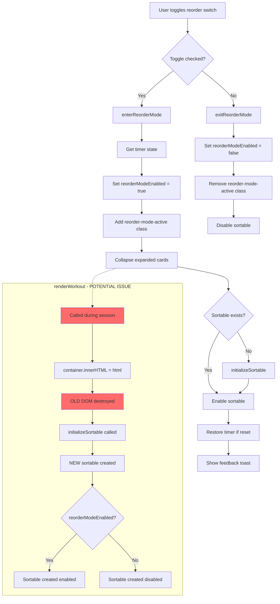

# Workout Mode Reorder Issues During Active Session

**Date:** 2026-01-06  
**Reporter:** User  
**Analyst:** Claude (Architect Mode)

---

## Executive Summary

The user reports two issues with the reorder functionality when a workout session is active:

1. **Timer Issues**: The reorder button causes issues with the timer during active sessions
2. **Reorder Not Activating**: Sometimes the toggle does nothing and doesn't activate movable cards

This document provides a comprehensive analysis of the root causes and proposed fixes.

---

## Issue 1: Timer Issues During Active Session

### Symptoms
- Timer displays unexpected behavior when reorder mode is toggled during an active workout
- Timer may reset, freeze, or show incorrect values

### Root Cause Analysis

#### Finding 1: Duplicate DOM Element IDs

**Critical Issue:** There are TWO elements with ID conflicts in the timer system:

**Static HTML in [`workout-mode.html`](frontend/workout-mode.html:168-174):**
```html
<div id="floatingTimerWidget" class="floating-timer-widget" style="display: none;">
    <div class="timer-label">...</div>
    <div class="timer-display" id="floatingTimerDisplay">00:00</div>
</div>
```

**Dynamically created in [`bottom-action-bar-service.js`](frontend/assets/js/services/bottom-action-bar-service.js:256-259):**
```html
<div class="floating-timer-display" id="floatingTimerDisplay">
    <i class="bx bx-time-five"></i>
    <span id="floatingTimer">00:00</span>
</div>
```

The ID `floatingTimerDisplay` is used in BOTH places, causing:
- `document.getElementById('floatingTimerDisplay')` returns unpredictable results
- Timer updates may go to the wrong element

#### Finding 2: Timer Manager Updates Multiple Elements

In [`workout-timer-manager.js`](frontend/assets/js/services/workout-timer-manager.js:41-52):
```javascript
// Update floating timer in combo
const floatingTimer = document.getElementById('floatingTimer');
if (floatingTimer) floatingTimer.textContent = timeStr;

// Keep old timers for backward compatibility
const sessionTimer = document.getElementById('sessionTimer');
const footerTimer = document.getElementById('footerSessionTimer');
const oldFloatingTimer = document.getElementById('floatingTimerDisplay');  // AMBIGUOUS!

if (sessionTimer) sessionTimer.textContent = timeStr;
if (footerTimer) footerTimer.textContent = timeStr;
if (oldFloatingTimer) oldFloatingTimer.textContent = timeStr;  // WRONG ELEMENT TYPE!
```

The `oldFloatingTimer` line sets `textContent` on `floatingTimerDisplay`, but:
- The OLD element is a `<div>` containing just "00:00"
- The NEW element is a `<div>` containing an `<i>` icon AND a `<span>`
- Setting `textContent` on the NEW element would wipe out the icon!

#### Finding 3: Timer Preservation in enterReorderMode Uses Wrong Element

In [`workout-mode-controller.js`](frontend/assets/js/controllers/workout-mode-controller.js:585-612):
```javascript
// PRESERVE TIMER STATE before any DOM changes
const timerDisplay = document.getElementById('floatingTimer');
const preservedTime = timerDisplay ? timerDisplay.textContent : null;

// ... DOM manipulation happens ...

// RESTORE TIMER STATE if it was inadvertently cleared
if (preservedTime && timerDisplay && timerDisplay.textContent === '00:00') {
    timerDisplay.textContent = preservedTime;
}
```

This logic is correct IF `#floatingTimer` exists, but:
- `#floatingTimer` is inside `#floatingTimerEndCombo` which is only visible during active session
- If the bottom action bar hasn't fully initialized, `floatingTimer` might not exist yet

---

## Issue 2: Reorder Toggle Does Nothing

### Symptoms
- Clicking the reorder toggle switch has no effect
- Cards don't become draggable
- No drag handles appear

### Root Cause Analysis

#### Finding 1: Sortable Instance Becomes Stale After renderWorkout

**Critical Issue:** When [`renderWorkout()`](frontend/assets/js/controllers/workout-mode-controller.js:379-478) is called, it:

1. Replaces container contents: `container.innerHTML = html;` (line 457)
2. Creates a NEW Sortable instance: `this.initializeSortable();` (line 477)

But [`initializeSortable()`](frontend/assets/js/controllers/workout-mode-controller.js:509-558) does NOT destroy the old sortable:

```javascript
initializeSortable() {
    const container = document.getElementById('exerciseCardsContainer');
    if (!container || typeof Sortable === 'undefined') {
        console.warn('⚠️ Sortable not initialized - container or library missing');
        return;  // ❌ Returns WITHOUT setting this.sortable = null!
    }
    
    // ❌ No cleanup of existing sortable!
    this.sortable = Sortable.create(container, {...});
}
```

When `enterReorderMode()` is called, it may reference a STALE sortable instance:
```javascript
// Enable sortable
if (this.sortable) {
    this.sortable.option('disabled', false);  // ❌ May be pointing to destroyed DOM
}
```

#### Finding 2: Multiple Sortable Instances Created

Every call to `renderWorkout()` creates a new Sortable without destroying the old one:
- Initial load: Creates sortable #1
- User adds bonus exercise → `renderWorkout()` → Creates sortable #2 (sortable #1 still exists but orphaned)
- User edits weight → could trigger render → Creates sortable #3

This causes:
- Memory leaks
- Conflicting drag handlers
- Unpredictable behavior

#### Finding 3: Sortable Created Disabled, May Stay Disabled

The sortable is created with `disabled: !this.reorderModeEnabled` (line 539).

If `renderWorkout()` is called WHILE reorder mode is already active:
1. `this.reorderModeEnabled` is `true`
2. New sortable is created with `disabled: false`
3. BUT the old sortable reference is lost
4. `enterReorderMode()` won't be called again since toggle is already checked
5. The NEW sortable may not properly initialize drag handles

---

## Proposed Fixes

### Fix 1: Remove Duplicate Timer Element IDs

**File:** [`workout-mode.html`](frontend/workout-mode.html:168-174)

Either:
- **Option A:** Remove the old `floatingTimerWidget` entirely (it's hidden anyway)
- **Option B:** Rename the old ID to `floatingTimerWidgetLegacy` or similar

**Recommended:** Option A - Remove the entire `floatingTimerWidget` div since the bottom action bar now handles this.

### Fix 2: Properly Destroy Sortable Before Creating New One

**File:** [`workout-mode-controller.js`](frontend/assets/js/controllers/workout-mode-controller.js:509-558)

```javascript
initializeSortable() {
    // ✅ FIX: Destroy existing sortable before creating new one
    if (this.sortable) {
        console.log('🧹 Destroying existing sortable before reinitializing');
        this.sortable.destroy();
        this.sortable = null;
    }
    
    const container = document.getElementById('exerciseCardsContainer');
    if (!container || typeof Sortable === 'undefined') {
        console.warn('⚠️ Sortable not initialized - container or library missing');
        return;
    }
    
    this.sortable = Sortable.create(container, {
        // ... existing config ...
        
        // ✅ FIX: Respect current reorder mode state
        disabled: !this.reorderModeEnabled,
        
        // ... rest of config ...
    });
    
    console.log('✅ SortableJS initialized, disabled:', !this.reorderModeEnabled);
}
```

### Fix 3: Preserve Reorder Mode State Across Re-renders

**File:** [`workout-mode-controller.js`](frontend/assets/js/controllers/workout-mode-controller.js:379-478)

At the end of `renderWorkout()`:

```javascript
renderWorkout() {
    // ... existing code ...
    
    container.innerHTML = html;
    
    // ... initialize card manager ...
    
    // Phase 2: Delegate to timer manager
    this.timerManager.initializeGlobalTimer();
    this.timerManager.initializeCardTimers();
    
    // PHASE 2: Initialize drag-and-drop reordering
    this.initializeSortable();
    
    // ✅ FIX: Restore reorder mode visual state if it was active
    if (this.reorderModeEnabled) {
        console.log('🔄 Re-applying reorder mode after re-render');
        container.classList.add('reorder-mode-active');
        // Sortable was already created with disabled: false due to reorderModeEnabled being true
    }
}
```

### Fix 4: Ensure Timer Element References Are Fresh

**File:** [`workout-mode-controller.js`](frontend/assets/js/controllers/workout-mode-controller.js:581-621)

```javascript
enterReorderMode() {
    const container = document.getElementById('exerciseCardsContainer');
    if (!container) return;
    
    // ✅ FIX: Get fresh reference to timer SPAN element (not the container div)
    const timerSpan = document.getElementById('floatingTimer');
    const preservedTime = timerSpan ? timerSpan.textContent : null;
    
    // ✅ FIX: Also check if timer interval is running (don't mess with it)
    const isSessionActive = this.sessionService.isSessionActive();
    
    this.reorderModeEnabled = true;
    container.classList.add('reorder-mode-active');
    
    // Collapse expanded cards
    document.querySelectorAll('.exercise-card.expanded').forEach(card => {
        this.collapseCard(card);
    });
    
    // Ensure sortable is initialized and enabled
    if (!this.sortable) {
        this.initializeSortable();
    }
    if (this.sortable) {
        this.sortable.option('disabled', false);
    }
    
    // ✅ FIX: Only restore timer if session is active and it was accidentally reset
    if (isSessionActive && preservedTime && preservedTime !== '00:00') {
        const currentTimerSpan = document.getElementById('floatingTimer');
        if (currentTimerSpan && currentTimerSpan.textContent === '00:00') {
            currentTimerSpan.textContent = preservedTime;
            console.warn('⚠️ Timer was reset during reorder mode - restored:', preservedTime);
        }
    }
    
    // Show feedback
    if (window.showAlert) {
        window.showAlert('Reorder mode active - Drag exercises to reorder', 'info');
    }
    
    console.log('✅ Reorder mode entered');
}
```

### Fix 5: Clean Up Timer Manager Element References

**File:** [`workout-timer-manager.js`](frontend/assets/js/services/workout-timer-manager.js:41-52)

```javascript
startSessionTimer() {
    const session = this.sessionService.getCurrentSession();
    if (!session) return;
    
    if (this.sessionTimerInterval) {
        clearInterval(this.sessionTimerInterval);
    }
    
    this.sessionTimerInterval = setInterval(() => {
        const elapsed = Math.floor((Date.now() - session.startedAt.getTime()) / 1000);
        const minutes = Math.floor(elapsed / 60);
        const seconds = elapsed % 60;
        const timeStr = `${minutes.toString().padStart(2, '0')}:${seconds.toString().padStart(2, '0')}`;
        
        // ✅ FIX: Only update the correct timer element (the span, not the container)
        const floatingTimer = document.getElementById('floatingTimer');
        if (floatingTimer) floatingTimer.textContent = timeStr;
        
        // ✅ FIX: Remove references to ambiguous/legacy timer elements
        // The old floatingTimerWidget is no longer used
        
    }, 1000);
}
```

---

## Files to Modify

| File | Changes |
|------|---------|
| [`workout-mode.html`](frontend/workout-mode.html) | Remove legacy `floatingTimerWidget` div (lines 168-174) |
| [`workout-mode-controller.js`](frontend/assets/js/controllers/workout-mode-controller.js) | Fix sortable lifecycle, preserve reorder state across renders |
| [`workout-timer-manager.js`](frontend/assets/js/services/workout-timer-manager.js) | Clean up element references, remove ambiguous selectors |

---

## Implementation Priority

1. **HIGH**: Fix sortable destruction and recreation (primary cause of reorder not working)
2. **HIGH**: Remove duplicate `floatingTimerDisplay` ID
3. **MEDIUM**: Preserve reorder mode state across re-renders
4. **LOW**: Clean up timer manager legacy code

---

## Testing Checklist

- [ ] Start workout session
- [ ] Toggle reorder mode ON - verify drag handles appear
- [ ] Verify timer continues running correctly
- [ ] Drag and drop exercises - verify order updates
- [ ] Toggle reorder mode OFF - verify drag handles hide
- [ ] Add bonus exercise - verify reorder mode still works after render
- [ ] Edit exercise details - verify reorder mode still works after render
- [ ] Complete workout - verify all data saved correctly
- [ ] Timer shows correct elapsed time throughout all operations

---

## Mermaid Diagram: Reorder Mode Flow



---

## Conclusion

The issues stem from:
1. **DOM ID conflicts** between static HTML and dynamically generated elements
2. **Stale Sortable references** when `renderWorkout()` replaces DOM without proper cleanup
3. **Missing state preservation** when UI is re-rendered during active reorder mode

All issues are fixable with targeted changes to the identified files.
