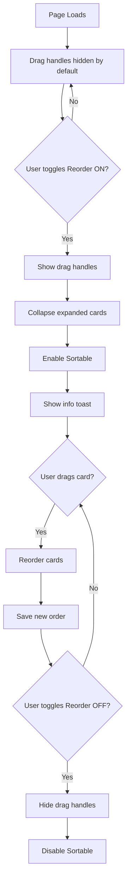

# Workout Mode Reorder Toggle Implementation Plan

## Overview

Add a reorder toggle to the workout-mode.html page similar to the one in workout-builder.html. This toggle will control when exercise cards can be reordered via drag-and-drop, preventing accidental movements since this feature is rarely used.

## Current State Analysis

### Workout Builder (Reference Implementation)
- Has a **Reorder toggle** at the top of the Exercise Groups section (lines 158-164)
- Toggle is a Bootstrap form-switch with ID `editModeToggle`
- When toggled ON:
  - Enters "edit mode"
  - Changes edit icons to move icons (`bx-menu`)
  - Collapses all accordions
  - Disables accordion toggle functionality
  - Makes entire items draggable
  - Shows toast notification
- When toggled OFF:
  - Exits edit mode
  - Changes move icons back to edit icons
  - Re-enables accordion toggles
  - Saves order if changed

### Workout Mode (Current State)
- ✅ Already has SortableJS loaded (line 197)
- ✅ Already has drag handles in exercise cards (`exercise-drag-handle` class)
- ✅ Already has `initializeSortable()` in controller (lines 474-520)
- ❌ Drag handles are always visible (low opacity by default)
- ❌ Sortable is currently disabled during active sessions
- ❌ NO toggle to enable/disable reorder mode

### CSS for Drag Handles (workout-mode.css lines 1779-1897)
- Drag handles shown with low opacity (0.4) by default
- Opacity increases to 1 on hover
- Sortable ghost, drag, and chosen states defined

## Implementation Plan

### Phase 1: HTML Changes (workout-mode.html)

Add a header section above the Exercise Cards Container with the toggle switch.

**Location:** After line 102 (below the workout info header), before the loading state

```html
<!-- Exercise Cards Header with Reorder Toggle -->
<div class="d-flex justify-content-between align-items-center mb-3" id="exerciseCardsHeader" style="display: none;">
  <h6 class="mb-0">
    <i class="bx bx-list-ul me-1"></i>
    Exercises
  </h6>
  <div class="form-check form-switch mb-0">
    <input class="form-check-input" type="checkbox" role="switch"
           id="reorderModeToggle" style="cursor: pointer;">
    <label class="form-check-label" for="reorderModeToggle" style="cursor: pointer;">
      <span class="reorder-mode-label">Reorder</span>
    </label>
  </div>
</div>
```

### Phase 2: CSS Changes (workout-mode.css)

Add new styles for reorder mode states:

```css
/* ============================================
   REORDER MODE TOGGLE STATES
   ============================================ */

/* Default: Hide drag handles when reorder mode is disabled */
#exerciseCardsContainer:not(.reorder-mode-active) .exercise-drag-handle {
    display: none;
}

/* Show drag handles when reorder mode is active */
#exerciseCardsContainer.reorder-mode-active .exercise-drag-handle {
    display: flex;
    opacity: 0.6;
}

#exerciseCardsContainer.reorder-mode-active .exercise-drag-handle:hover {
    opacity: 1;
}

/* Visual indicator that cards are draggable in reorder mode */
#exerciseCardsContainer.reorder-mode-active .exercise-card {
    cursor: move;
}

#exerciseCardsContainer.reorder-mode-active .exercise-card-header {
    cursor: grab;
}

/* Reorder mode active indicator */
#exerciseCardsContainer.reorder-mode-active {
    border: 2px dashed rgba(var(--bs-primary-rgb), 0.3);
    border-radius: 8px;
    padding: 0.5rem;
    margin: -0.5rem;
}

/* Toggle label styling */
.reorder-mode-label {
    font-size: 0.875rem;
    color: var(--bs-body-color);
}

/* Active toggle label */
#reorderModeToggle:checked + label .reorder-mode-label {
    color: var(--bs-primary);
    font-weight: 500;
}
```

### Phase 3: Controller Changes (workout-mode-controller.js)

Add reorder mode methods and toggle handler:

```javascript
/**
 * State property (add to constructor)
 */
this.reorderModeEnabled = false;

/**
 * Initialize reorder mode toggle
 * Call this from initialize() method
 */
initializeReorderMode() {
    const toggle = document.getElementById('reorderModeToggle');
    if (!toggle) return;
    
    toggle.addEventListener('change', () => {
        if (toggle.checked) {
            this.enterReorderMode();
        } else {
            this.exitReorderMode();
        }
    });
    
    console.log('✅ Reorder mode toggle initialized');
}

/**
 * Enter reorder mode
 */
enterReorderMode() {
    const container = document.getElementById('exerciseCardsContainer');
    if (!container) return;
    
    this.reorderModeEnabled = true;
    
    // Add active class to container
    container.classList.add('reorder-mode-active');
    
    // Collapse any expanded cards for cleaner drag experience
    document.querySelectorAll('.exercise-card.expanded').forEach(card => {
        this.collapseCard(card);
    });
    
    // Ensure sortable is initialized
    if (!this.sortable) {
        this.initializeSortable();
    }
    
    // Enable sortable
    if (this.sortable) {
        this.sortable.option('disabled', false);
    }
    
    // Show feedback
    if (window.showAlert) {
        window.showAlert('Reorder mode active - Drag exercises to reorder', 'info');
    }
    
    console.log('✅ Reorder mode entered');
}

/**
 * Exit reorder mode
 */
exitReorderMode() {
    const container = document.getElementById('exerciseCardsContainer');
    if (!container) return;
    
    this.reorderModeEnabled = false;
    
    // Remove active class from container
    container.classList.remove('reorder-mode-active');
    
    // Disable sortable to prevent accidental dragging
    if (this.sortable) {
        this.sortable.option('disabled', true);
    }
    
    console.log('✅ Reorder mode exited');
}
```

### Phase 4: Update initializeSortable Method

Modify the existing `initializeSortable()` to respect reorder mode:

```javascript
initializeSortable() {
    const container = document.getElementById('exerciseCardsContainer');
    if (!container || typeof Sortable === 'undefined') {
        console.warn('⚠️ Sortable not initialized - container or library missing');
        return;
    }
    
    this.sortable = Sortable.create(container, {
        animation: 150,
        handle: '.exercise-drag-handle',
        ghostClass: 'sortable-ghost',
        chosenClass: 'sortable-chosen',
        dragClass: 'sortable-drag',
        fallbackClass: 'sortable-fallback',
        forceFallback: false,
        scroll: true,
        scrollSensitivity: 60,
        scrollSpeed: 10,
        bubbleScroll: true,
        
        // CHANGED: Start disabled, enabled via toggle
        disabled: !this.reorderModeEnabled,
        
        onStart: (evt) => {
            console.log('🎯 Drag started:', evt.oldIndex);
            container.classList.add('sortable-container-dragging');
        },
        
        onEnd: (evt) => {
            console.log('🎯 Drag ended:', evt.oldIndex, '→', evt.newIndex);
            container.classList.remove('sortable-container-dragging');
            
            if (evt.oldIndex !== evt.newIndex) {
                this.handleExerciseReorder(evt.oldIndex, evt.newIndex);
            }
        }
    });
    
    console.log('✅ SortableJS initialized for exercise reordering');
}
```

### Phase 5: Show Header When Workout Loads

Update the `hideLoadingState()` method to also show the exercises header:

```javascript
hideLoadingState() {
    // ... existing code ...
    
    // Show exercise cards header
    const exerciseCardsHeader = document.getElementById('exerciseCardsHeader');
    if (exerciseCardsHeader) exerciseCardsHeader.style.display = 'flex';
}
```

## Files to Modify

| File | Changes |
|------|---------|
| `frontend/workout-mode.html` | Add reorder toggle UI section |
| `frontend/assets/css/workout-mode.css` | Add reorder mode CSS states |
| `frontend/assets/js/controllers/workout-mode-controller.js` | Add toggle logic and methods |

## Visual Flow



## UX Considerations

1. **Default State**: Reorder toggle OFF, drag handles hidden
2. **Toggle ON**: 
   - Collapse any expanded exercise cards for cleaner drag experience
   - Show drag handles with visual indicator
   - Add dashed border to container showing it's in reorder mode
   - Show toast: "Reorder mode active - Drag exercises to reorder"
3. **Toggle OFF**:
   - Hide drag handles
   - Disable sortable
   - Silent exit (no toast needed)
4. **During Active Session**: Reorder should still work (user might want to skip ahead)

## Testing Checklist

- [ ] Toggle appears correctly above exercise cards
- [ ] Drag handles hidden by default
- [ ] Toggle ON shows drag handles
- [ ] Toggle ON collapses expanded cards
- [ ] Dragging works only when toggle is ON
- [ ] Cards reorder correctly when dragged
- [ ] New order is saved
- [ ] Toggle OFF hides drag handles
- [ ] Toggle OFF prevents accidental dragging
- [ ] Works during active workout session
- [ ] Works in dark mode
- [ ] Works on mobile devices
- [ ] Keyboard accessibility for toggle

## Implementation Order

1. Add HTML toggle UI to workout-mode.html
2. Add CSS styles for reorder mode states
3. Add controller methods (initializeReorderMode, enterReorderMode, exitReorderMode)
4. Update initializeSortable to start disabled
5. Call initializeReorderMode from initialize()
6. Update hideLoadingState to show header
7. Test all scenarios
